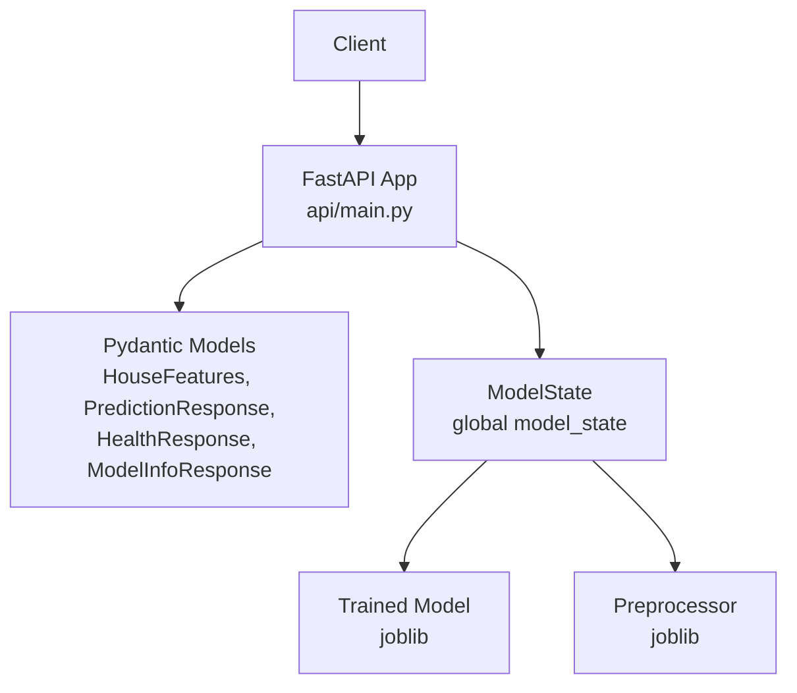
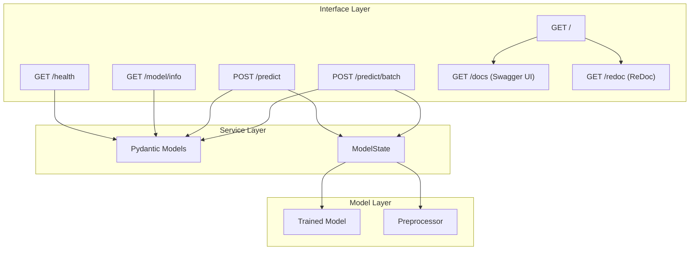
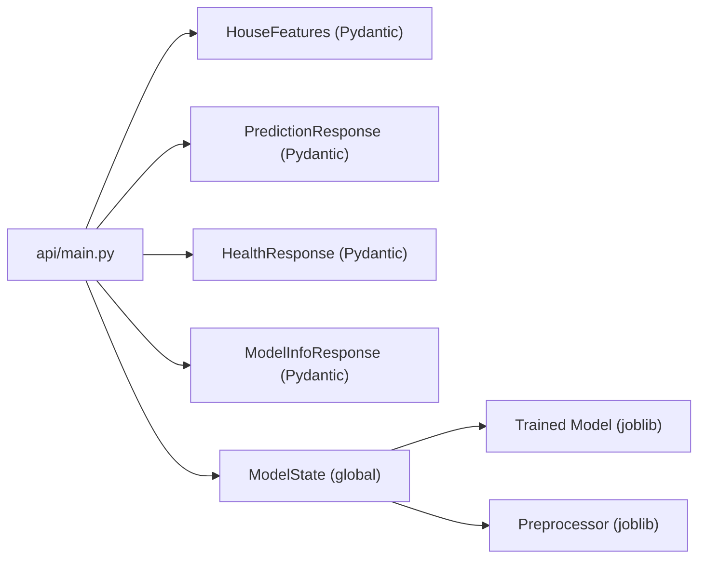

# API Reference

<cite>
**Referenced Files in This Document**
- [api/main.py](file://api/main.py)
- [README.md](file://README.md)
- [tests/test_api.py](file://tests/test_api.py)
- [api/test_api.py](file://api/test_api.py)
- [Dockerfile](file://Dockerfile)
- [docker-compose.yml](file://docker-compose.yml)
- [docs/architecture.md](file://docs/architecture.md)
</cite>

## Table of Contents
1. [Introduction](#introduction)
2. [Project Structure](#project-structure)
3. [Core Components](#core-components)
4. [Architecture Overview](#architecture-overview)
5. [Detailed Component Analysis](#detailed-component-analysis)
6. [Dependency Analysis](#dependency-analysis)
7. [Performance Considerations](#performance-considerations)
8. [Troubleshooting Guide](#troubleshooting-guide)
9. [Conclusion](#conclusion)
10. [Appendices](#appendices)

## Introduction
This document provides comprehensive API documentation for the FastAPI service that powers the California House Price Prediction system. It covers all endpoints, request/response schemas, validation rules, error handling, and operational guidance. It also documents the auto-generated API documentation endpoints, deployment options, and client integration patterns.

## Project Structure
The API is implemented as a FastAPI application with Pydantic models for validation and response formatting. The application exposes:
- Root information
- Health check
- Model metadata
- Single prediction
- Batch prediction
- Auto-generated docs (Swagger UI and ReDoc)

**Diagram sources**
- [api/main.py:31-183](file://api/main.py#L31-L183)

**Section sources**
- [api/main.py:201-230](file://api/main.py#L201-L230)
- [docs/architecture.md:20-28](file://docs/architecture.md#L20-L28)

## Core Components
- HouseFeatures: Pydantic model for validating and serializing input features.
- PredictionResponse: Pydantic model for standardized prediction responses.
- HealthResponse: Response model for health checks.
- ModelInfoResponse: Response model for model metadata.
- ModelState: Global state managing model and preprocessor loading and inference.

Key behaviors:
- Input validation enforces ranges and categorical enums.
- Business rules enforce derived constraints (e.g., bedrooms <= rooms, households <= population).
- Predictions are computed by transforming features and invoking the trained model.

**Section sources**
- [api/main.py:31-101](file://api/main.py#L31-L101)
- [api/main.py:126-183](file://api/main.py#L126-L183)

## Architecture Overview
The API is a production-ready FastAPI application with:
- Automatic OpenAPI/Swagger UI and ReDoc documentation endpoints
- CORS enabled for broad compatibility
- Health check and model info endpoints
- Single and batch prediction endpoints
- Global model lifecycle managed during app startup/shutdown

**Diagram sources**
- [api/main.py:237-287](file://api/main.py#L237-L287)
- [api/main.py:290-383](file://api/main.py#L290-L383)
- [api/main.py:201-230](file://api/main.py#L201-L230)

**Section sources**
- [api/main.py:201-230](file://api/main.py#L201-L230)
- [docs/architecture.md:83-87](file://docs/architecture.md#L83-L87)

## Detailed Component Analysis

### Endpoint Specifications

#### GET /
- Purpose: Returns service information and useful links.
- Response: JSON object containing message, version, docs path, and health endpoint path.
- Notes: Convenience endpoint for clients to discover API metadata and documentation locations.

**Section sources**
- [api/main.py:237-245](file://api/main.py#L237-L245)

#### GET /health
- Purpose: Health check endpoint returning API and model status.
- Response: HealthResponse with status, model_loaded flag, timestamp, and version.
- Error Handling: No explicit HTTP error; returns structured data indicating unhealthy state when model is not loaded.

**Section sources**
- [api/main.py:248-260](file://api/main.py#L248-L260)
- [api/main.py:104-110](file://api/main.py#L104-L110)

#### GET /model/info
- Purpose: Returns metadata about the deployed model.
- Response: ModelInfoResponse with model_type, version, features list, and description.
- Error Handling: Raises HTTP 503 if model is not loaded.

**Section sources**
- [api/main.py:263-287](file://api/main.py#L263-L287)
- [api/main.py:113-119](file://api/main.py#L113-L119)

#### POST /predict
- Purpose: Single prediction for a property described by HouseFeatures.
- Request Body: HouseFeatures (all fields required).
- Response: PredictionResponse with predicted_price, currency, timestamp, and model_version.
- Validation Rules:
  - longitude in [-125.0, -114.0]
  - latitude in [32.0, 43.0]
  - housing_median_age in [1, 52]
  - total_rooms in [1, 50000]
  - total_bedrooms in [1, 10000] and must be <= total_rooms
  - population in [1, 50000]
  - households in [1, 10000] and must be <= population
  - median_income in [0.5, 15.0]
  - ocean_proximity enum: "<1H OCEAN", "INLAND", "ISLAND", "NEAR BAY", "NEAR OCEAN"
- Error Handling:
  - HTTP 422 for validation errors (Pydantic)
  - HTTP 503 if model not loaded
  - HTTP 500 for internal prediction errors

**Section sources**
- [api/main.py:290-347](file://api/main.py#L290-L347)
- [api/main.py:31-83](file://api/main.py#L31-L83)
- [api/main.py:85-101](file://api/main.py#L85-L101)

#### POST /predict/batch
- Purpose: Batch predictions for multiple properties.
- Request Body: Array of HouseFeatures.
- Response: JSON object with predictions array (each item includes predicted_price, currency, and status/error), timestamp, and model_version.
- Behavior:
  - Processes each item individually.
  - Items that fail produce an error entry with status "error" and error message.
  - Successful items include predicted_price, currency, and status "success".
- Error Handling:
  - HTTP 503 if model not loaded.
  - Individual items may fail independently.

**Section sources**
- [api/main.py:350-383](file://api/main.py#L350-L383)
- [api/main.py:31-83](file://api/main.py#L31-L83)

### Pydantic Models

#### HouseFeatures
- Fields and constraints:
  - longitude: float, required, range [-125.0, -114.0]
  - latitude: float, required, range [32.0, 43.0]
  - housing_median_age: float, required, range [1, 52]
  - total_rooms: float, required, range [1, 50000]
  - total_bedrooms: float, required, range [1, 10000], must be <= total_rooms
  - population: float, required, range [1, 50000]
  - households: float, required, range [1, 10000], must be <= population
  - median_income: float, required, range [0.5, 15.0]
  - ocean_proximity: str, required, enum from ["<1H OCEAN", "INLAND", "ISLAND", "NEAR BAY", "NEAR OCEAN"]
- Validators:
  - total_bedrooms must be <= total_rooms
  - households must be <= population

**Section sources**
- [api/main.py:31-83](file://api/main.py#L31-L83)

#### PredictionResponse
- Fields:
  - predicted_price: float, required
  - currency: str, default "USD"
  - timestamp: str, required (ISO format)
  - model_version: str, required
- Example included in json_schema_extra.

**Section sources**
- [api/main.py:85-101](file://api/main.py#L85-L101)

#### HealthResponse
- Fields:
  - status: str
  - model_loaded: bool
  - timestamp: str
  - version: str

**Section sources**
- [api/main.py:104-110](file://api/main.py#L104-L110)

#### ModelInfoResponse
- Fields:
  - model_type: str
  - version: str
  - features: list of str
  - description: str

**Section sources**
- [api/main.py:113-119](file://api/main.py#L113-L119)

### Auto-generated Documentation Endpoints
- Swagger UI: GET /docs
- ReDoc: GET /redoc
These endpoints are configured in the FastAPI app initialization.

**Section sources**
- [api/main.py:217-221](file://api/main.py#L217-L221)

### Authentication and Authorization
- No authentication is implemented for any endpoint.
- CORS is enabled broadly to facilitate browser-based integrations.

**Section sources**
- [api/main.py:224-230](file://api/main.py#L224-L230)

### Rate Limiting
- No rate limiting is implemented in the API.

**Section sources**
- [api/main.py:201-230](file://api/main.py#L201-L230)

### API Versioning
- The application sets version "1.0.0" in FastAPI configuration.
- Responses include model_version "1.0.0".

**Section sources**
- [api/main.py:217](file://api/main.py#L217)
- [api/main.py:336-341](file://api/main.py#L336-L341)
- [api/main.py:379-383](file://api/main.py#L379-L383)

### Deprecation Policy
- No deprecation notices or sunset timelines are present in the codebase.

**Section sources**
- [api/main.py:201-230](file://api/main.py#L201-L230)

### Client Implementation Guidelines
- Use Content-Type: application/json for POST requests.
- Validate inputs against HouseFeatures constraints before sending.
- Handle HTTP 422 for invalid payloads and HTTP 503/500 for service errors.
- For batch requests, inspect each item’s status and handle partial failures.
- Use GET /health to probe service readiness.
- Use GET /model/info to fetch model metadata and feature list.

**Section sources**
- [README.md:239-247](file://README.md#L239-L247)
- [tests/test_api.py:27-199](file://tests/test_api.py#L27-L199)

### Integration Patterns
- Single prediction: POST /predict with a single HouseFeatures object.
- Batch prediction: POST /predict/batch with an array of HouseFeatures.
- Discovery: GET / for service info and links to docs.
- Monitoring: GET /health for status and readiness.
- Metadata: GET /model/info for model details and feature list.

**Section sources**
- [api/main.py:237-287](file://api/main.py#L237-L287)
- [api/main.py:290-383](file://api/main.py#L290-L383)

## Dependency Analysis
High-level dependencies among API components:

**Diagram sources**
- [api/main.py:31-183](file://api/main.py#L31-L183)

**Section sources**
- [api/main.py:31-183](file://api/main.py#L31-L183)

## Performance Considerations
- Model loading occurs once at startup; subsequent predictions reuse the loaded model and preprocessor.
- Batch predictions iterate items sequentially; consider client-side batching and parallelism for throughput.
- No explicit caching or connection pooling is configured in the API.

**Section sources**
- [api/main.py:186-195](file://api/main.py#L186-L195)
- [api/main.py:350-383](file://api/main.py#L350-L383)

## Troubleshooting Guide
Common issues and resolutions:
- Model not loaded:
  - Symptoms: HTTP 503 from /model/info and /predict; /health indicates model_loaded false.
  - Resolution: Ensure model files exist on disk and the app starts successfully.
- Validation errors:
  - Symptoms: HTTP 422 on /predict with field-specific messages.
  - Causes: Out-of-range values, invalid enum, or constraint violations (e.g., total_bedrooms > total_rooms).
- Prediction errors:
  - Symptoms: HTTP 500 on /predict with error details.
  - Causes: Unexpected runtime issues during prediction.
- Connection failures:
  - Symptoms: Client cannot reach the API.
  - Resolution: Confirm server is running and listening on the expected port.

Operational checks:
- Health: GET /health
- Model info: GET /model/info
- Single prediction: POST /predict with a minimal valid payload
- Batch prediction: POST /predict/batch with two valid payloads

**Section sources**
- [api/main.py:263-287](file://api/main.py#L263-L287)
- [api/main.py:290-347](file://api/main.py#L290-L347)
- [tests/test_api.py:13-95](file://api/test_api.py#L13-L95)
- [tests/test_api.py:27-199](file://tests/test_api.py#L27-L199)

## Conclusion
The FastAPI service provides a robust, validated, and well-documented interface for house price predictions. It includes health monitoring, model metadata discovery, single and batch prediction endpoints, and auto-generated API documentation. Clients should validate inputs against HouseFeatures constraints, handle HTTP 422/503/500 appropriately, and leverage GET /health and GET /model/info for operational insights.

## Appendices

### Endpoint Summary Table
- GET /
  - Description: Service info and links
  - Response: JSON object with keys message, version, docs, health
- GET /health
  - Description: Health and model status
  - Response: HealthResponse
- GET /model/info
  - Description: Model metadata
  - Response: ModelInfoResponse
  - Error: 503 if model not loaded
- POST /predict
  - Description: Single prediction
  - Request: HouseFeatures
  - Response: PredictionResponse
  - Errors: 422 (validation), 503 (model not loaded), 500 (internal error)
- POST /predict/batch
  - Description: Batch predictions
  - Request: Array of HouseFeatures
  - Response: JSON with predictions array and metadata
  - Errors: 503 (model not loaded)

**Section sources**
- [api/main.py:237-383](file://api/main.py#L237-L383)

### Request/Response Schemas and Examples
- HouseFeatures (request)
  - Required fields and constraints documented above.
  - Example payload shape is shown in the repository README.
- PredictionResponse (response)
  - Fields: predicted_price, currency, timestamp, model_version.
  - Example included in model schema extra.
- HealthResponse
  - Fields: status, model_loaded, timestamp, version.
- ModelInfoResponse
  - Fields: model_type, version, features, description.

**Section sources**
- [api/main.py:31-119](file://api/main.py#L31-L119)
- [README.md:325-350](file://README.md#L325-L350)

### Validation Rules Reference
- Numeric ranges enforced by Pydantic Field constraints.
- Derived constraints enforced by validators:
  - total_bedrooms <= total_rooms
  - households <= population
- Enum constraint for ocean_proximity.

**Section sources**
- [api/main.py:34-82](file://api/main.py#L34-L82)

### Error Codes and Handling
- 422: Validation errors (Pydantic)
- 503: Service unavailable (model not loaded)
- 500: Internal server error (unexpected runtime issues)
- General exception handler returns a generic error envelope with timestamp.

**Section sources**
- [api/main.py:295-299](file://api/main.py#L295-L299)
- [api/main.py:390-397](file://api/main.py#L390-L397)

### Operational Notes
- Documentation endpoints: /docs (Swagger UI), /redoc (ReDoc)
- CORS: Enabled for all origins/methods/headers
- Model lifecycle: Loaded at startup, used for all predictions, not reloaded during runtime
- Deployment: Docker images and compose files support local and containerized deployments

**Section sources**
- [api/main.py:217-230](file://api/main.py#L217-L230)
- [Dockerfile:80-86](file://Dockerfile#L80-L86)
- [docker-compose.yml:26-32](file://docker-compose.yml#L26-L32)