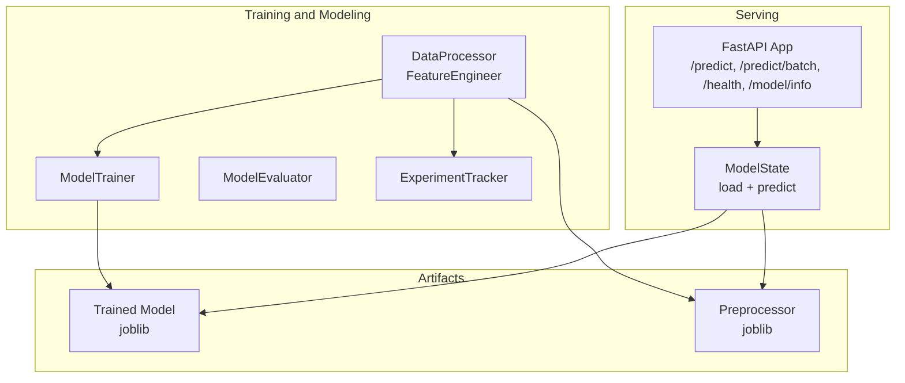
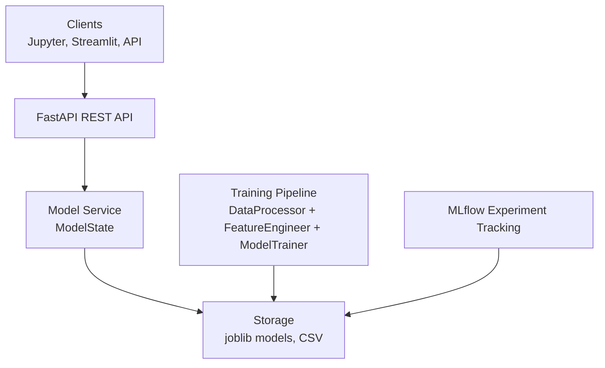
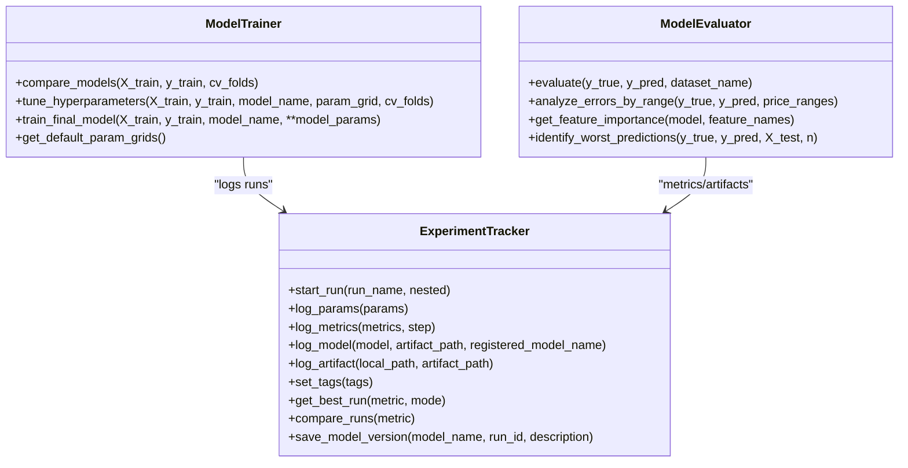
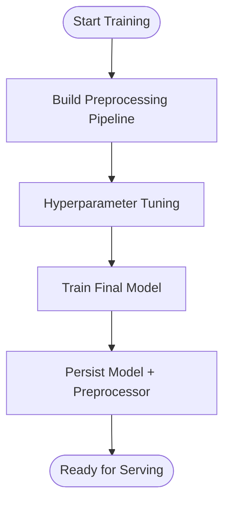
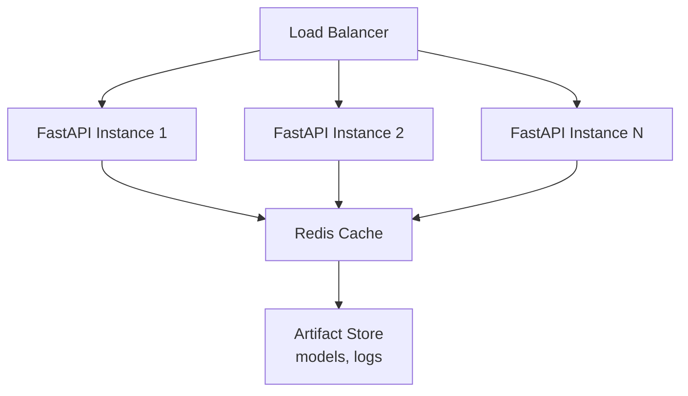
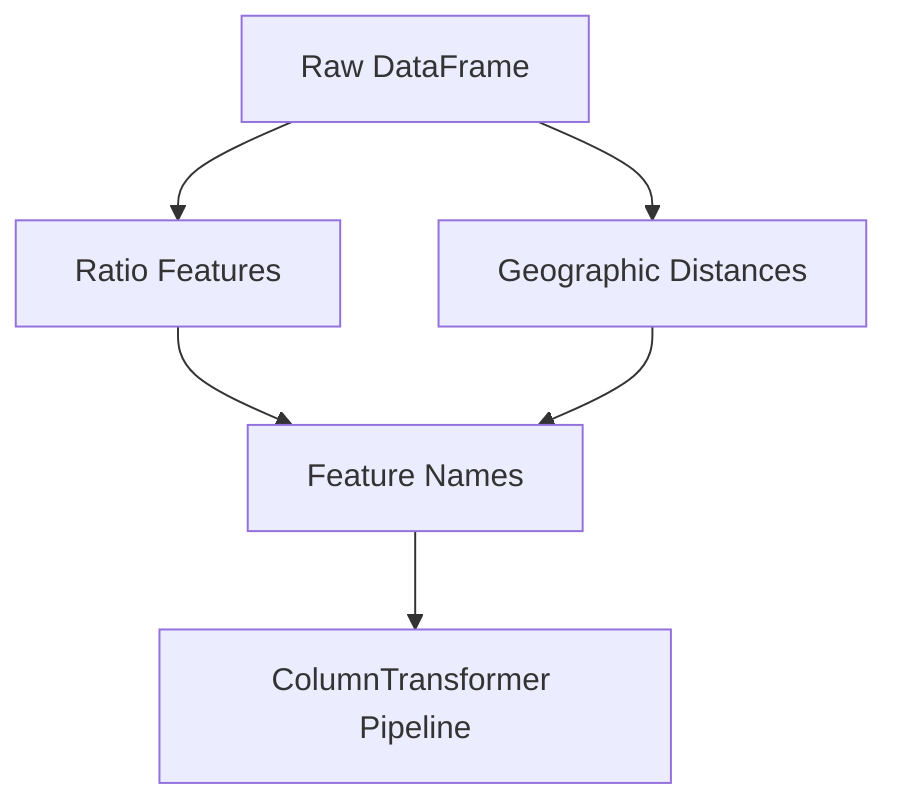
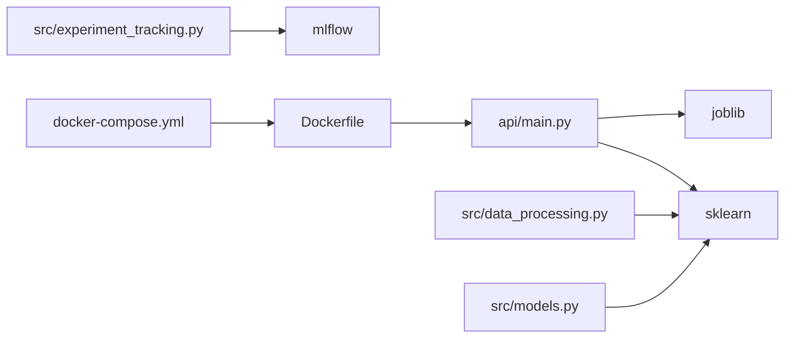

# Advanced Topics

<cite>
**Referenced Files in This Document**
- [src/models.py](file://src/models.py)
- [src/data_processing.py](file://src/data_processing.py)
- [src/experiment_tracking.py](file://src/experiment_tracking.py)
- [src/utils.py](file://src/utils.py)
- [src/visualization.py](file://src/visualization.py)
- [api/main.py](file://api/main.py)
- [train_model_for_web.py](file://train_model_for_web.py)
- [Dockerfile](file://Dockerfile)
- [docker-compose.yml](file://docker-compose.yml)
- [tests/test_models.py](file://tests/test_models.py)
- [tests/test_data_processing.py](file://tests/test_data_processing.py)
- [requirements.txt](file://requirements.txt)
- [docs/architecture.md](file://docs/architecture.md)
</cite>

## Table of Contents
1. [Introduction](#introduction)
2. [Project Structure](#project-structure)
3. [Core Components](#core-components)
4. [Architecture Overview](#architecture-overview)
5. [Detailed Component Analysis](#detailed-component-analysis)
6. [Dependency Analysis](#dependency-analysis)
7. [Performance Considerations](#performance-considerations)
8. [Troubleshooting Guide](#troubleshooting-guide)
9. [Conclusion](#conclusion)
10. [Appendices](#appendices)

## Introduction
This document focuses on advanced topics for extending and optimizing the machine learning system. It covers custom model development, evaluation metrics, preprocessing pipelines, performance optimization for large datasets, scaling for production, advanced feature engineering, ensemble methods, interpretability, hyperparameter optimization, automated ML, continuous learning, integration with external data sources, real-time prediction, and monitoring for drift and performance degradation.

## Project Structure
The repository is organized into modular components supporting training, serving, visualization, and experimentation:
- Training and modeling: src/models.py, src/data_processing.py, src/experiment_tracking.py
- Serving: api/main.py (FastAPI), Dockerfile, docker-compose.yml
- Utilities and persistence: src/utils.py
- Visualization: src/visualization.py
- Web export and training scripts: train_model_for_web.py
- Tests: tests/test_models.py, tests/test_data_processing.py
- Dependencies: requirements.txt, api/requirements.txt, app/requirements.txt
- Architecture overview: docs/architecture.md

**Diagram sources**
- [src/data_processing.py:22-341](file://src/data_processing.py#L22-L341)
- [src/models.py:30-366](file://src/models.py#L30-L366)
- [src/experiment_tracking.py:19-307](file://src/experiment_tracking.py#L19-L307)
- [api/main.py:126-180](file://api/main.py#L126-L180)

**Section sources**
- [docs/architecture.md:1-60](file://docs/architecture.md#L1-L60)
- [requirements.txt:1-36](file://requirements.txt#L1-L36)

## Core Components
- DataProcessor: Loads data, detects missing values, splits into train/test with stratification, and summarizes dataset characteristics.
- FeatureEngineer: Builds preprocessing pipelines (imputation, scaling, encoding) and creates engineered features (ratios, distances).
- ModelTrainer: Compares multiple models via cross-validation, tunes hyperparameters with grid search, and trains final models.
- ModelEvaluator: Computes comprehensive metrics, analyzes errors by value ranges, extracts feature importance, and identifies worst predictions.
- ExperimentTracker: Integrates with MLflow to log parameters, metrics, models, artifacts, tags, and manage model registry versions.
- API: FastAPI service exposing prediction endpoints with batch support, health checks, and model info; loads model and preprocessor on startup.
- Utilities: Logging, model persistence with metadata, currency formatting, experiment directories, and metrics saving.
- Visualization: EDA plots, residual analysis, feature importance, and CV comparisons.

**Section sources**
- [src/data_processing.py:22-341](file://src/data_processing.py#L22-L341)
- [src/models.py:30-366](file://src/models.py#L30-L366)
- [src/experiment_tracking.py:19-307](file://src/experiment_tracking.py#L19-L307)
- [api/main.py:126-180](file://api/main.py#L126-L180)
- [src/utils.py:16-137](file://src/utils.py#L16-L137)
- [src/visualization.py:23-261](file://src/visualization.py#L23-L261)

## Architecture Overview
The system follows a layered architecture:
- Client Layer: Jupyter, Streamlit, API clients
- Interface Layer: FastAPI REST API
- Service Layer: Data Processing, Feature Engineering, Model Training and Evaluation
- Model Layer: Trained HistGradientBoostingRegressor
- Storage Layer: CSV data, joblib models, MLflow experiments

**Diagram sources**
- [docs/architecture.md:1-60](file://docs/architecture.md#L1-L60)
- [api/main.py:126-180](file://api/main.py#L126-L180)
- [src/data_processing.py:22-341](file://src/data_processing.py#L22-L341)
- [src/models.py:30-366](file://src/models.py#L30-L366)
- [src/experiment_tracking.py:19-307](file://src/experiment_tracking.py#L19-L307)

## Detailed Component Analysis

### Custom Model Development and Evaluation Metrics
- Implementing new algorithms: Extend ModelTrainer.models with new estimators and add corresponding entries in default parameter grids. Use cross_validate scoring to compare models consistently.
- Custom evaluation metrics: Add new metrics to ModelEvaluator.evaluate and include them in logs and reports. For production, persist metrics via ExperimentTracker and save metrics to JSON for dashboards.
- Specialized preprocessing pipelines: FeatureEngineer demonstrates ColumnTransformer pipelines for numerical and categorical features. Extend with polynomial features, target encoding, or custom transformers.

**Diagram sources**
- [src/models.py:30-366](file://src/models.py#L30-L366)
- [src/experiment_tracking.py:19-307](file://src/experiment_tracking.py#L19-L307)

**Section sources**
- [src/models.py:30-366](file://src/models.py#L30-L366)
- [src/experiment_tracking.py:19-307](file://src/experiment_tracking.py#L19-L307)

### Performance Optimization Strategies
- Large datasets and memory management:
  - Use ColumnTransformer and Pipeline to encapsulate preprocessing and avoid repeated transformations.
  - Persist preprocessor and model with joblib; load once during service startup.
  - Optimize data types and leverage categorical dtypes to reduce memory footprint.
- Computational efficiency:
  - Use n_jobs=-1 in cross_validate and GridSearchCV for parallelism.
  - Prefer HistGradientBoostingRegressor for large tabular datasets; tune max_leaf_nodes and min_samples_leaf.
  - Cache intermediate results (e.g., transformed datasets) when re-running experiments.

**Diagram sources**
- [src/models.py:113-177](file://src/models.py#L113-L177)
- [src/data_processing.py:257-305](file://src/data_processing.py#L257-L305)

**Section sources**
- [src/models.py:113-177](file://src/models.py#L113-L177)
- [src/data_processing.py:257-305](file://src/data_processing.py#L257-L305)

### Scaling Considerations for Production
- Distributed computing: Integrate Dask or Ray with scikit-learn estimators for larger-than-memory datasets; wrap GridSearchCV with Dask-ML for distributed hyperparameter search.
- Caching strategies: Cache preprocessed datasets and model predictions; use Redis/Memcached for prediction caching in front of the API.
- Load balancing: Deploy multiple FastAPI instances behind a reverse proxy (Nginx) or platform load balancer; enable sticky sessions if needed.
- Containerization and orchestration: Multi-stage Docker builds minimize image size; docker-compose orchestrates API, Streamlit, and optional MLflow server.

**Diagram sources**
- [Dockerfile:1-86](file://Dockerfile#L1-L86)
- [docker-compose.yml:1-109](file://docker-compose.yml#L1-L109)

**Section sources**
- [Dockerfile:1-86](file://Dockerfile#L1-L86)
- [docker-compose.yml:1-109](file://docker-compose.yml#L1-L109)

### Advanced Feature Engineering Techniques
- Ratio features: rooms_per_household, bedrooms_per_room, population_per_household.
- Geographic features: distance_to_sf, distance_to_la.
- Interaction and polynomial features: extend FeatureEngineer to add polynomial features or target statistics by groups.
- Time series features: if temporal data is introduced, add lagged features and rolling statistics.

**Diagram sources**
- [src/data_processing.py:202-255](file://src/data_processing.py#L202-L255)
- [src/data_processing.py:257-305](file://src/data_processing.py#L257-L305)

**Section sources**
- [src/data_processing.py:202-255](file://src/data_processing.py#L202-L255)
- [src/data_processing.py:257-305](file://src/data_processing.py#L257-L305)

### Ensemble Methods and Model Interpretability
- Ensembles: Combine predictions from multiple models (e.g., stacking regressors) or average predictions from diverse algorithms.
- Interpretability:
  - SHAP/LIME: Integrate SHAP for tree-based models to explain individual predictions.
  - Permutation Importance: Use sklearn.inspection.permutation_importance for robust feature importance.
  - Partial Dependence Plots: Visualize feature effects using sklearn’s plotting utilities.

[No sources needed since this section provides general guidance]

### Hyperparameter Optimization and Automated ML
- Current implementation: GridSearchCV with KFold cross-validation in ModelTrainer.tune_hyperparameters.
- Advanced optimization:
  - Bayesian optimization with scikit-optimize or optuna for faster convergence.
  - Population-based training (PyGMO or Ax) for complex search spaces.
- Automated ML:
  - Auto-sklearn or H2O.ai for automated model selection and preprocessing.
  - MLOps pipelines with Prefect or Airflow to automate training and deployment.

**Section sources**
- [src/models.py:113-152](file://src/models.py#L113-L152)

### Continuous Learning Systems
- Data drift detection: Monitor feature distributions and statistical tests (Kolmogorov-Smirnov) on incoming data batches.
- Model drift detection: Track performance degradation via A/B testing of new vs. old models; alert on drop in R² or increase in RMSE.
- Retraining triggers: Schedule periodic retraining or trigger on data drift thresholds and performance plateaus.

[No sources needed since this section provides general guidance]

### Integration with External Data Sources and Real-Time Prediction
- External data: Extend DataProcessor to ingest from databases, Kafka, or cloud storage; add incremental feature updates.
- Real-time prediction: Use FastAPI streaming responses for batch endpoints; integrate message queues for asynchronous inference.
- Online learning: For streaming scenarios, consider SGDRegressor or online gradient boosting variants; maintain preprocessor state.

**Section sources**
- [api/main.py:290-383](file://api/main.py#L290-L383)
- [src/data_processing.py:52-157](file://src/data_processing.py#L52-L157)

### Monitoring and Observability
- Metrics and artifacts: Use ExperimentTracker to log metrics and artifacts; compare runs and select best versions.
- Drift detection: Implement feature drift alerts and performance degradation alerts; surface anomalies in logs and dashboards.
- Health checks: FastAPI /health endpoint indicates model readiness; extend with model version and latency metrics.

**Section sources**
- [src/experiment_tracking.py:193-220](file://src/experiment_tracking.py#L193-L220)
- [api/main.py:248-260](file://api/main.py#L248-L260)

## Dependency Analysis
Key internal dependencies:
- api/main.py depends on joblib-loaded model and preprocessor from models/ directory.
- src/models.py integrates with sklearn estimators and metrics.
- src/experiment_tracking.py depends on MLflow for experiment tracking.
- Dockerfile and docker-compose.yml define multi-service deployment.

**Diagram sources**
- [api/main.py:126-180](file://api/main.py#L126-L180)
- [src/data_processing.py:22-341](file://src/data_processing.py#L22-L341)
- [src/models.py:1-25](file://src/models.py#L1-L25)
- [src/experiment_tracking.py:12-16](file://src/experiment_tracking.py#L12-L16)
- [Dockerfile:1-86](file://Dockerfile#L1-L86)
- [docker-compose.yml:1-109](file://docker-compose.yml#L1-L109)

**Section sources**
- [requirements.txt:1-36](file://requirements.txt#L1-L36)
- [api/requirements.txt:1-9](file://api/requirements.txt#L1-L9)
- [app/requirements.txt:1-7](file://app/requirements.txt#L1-L7)

## Performance Considerations
- Use efficient data types and categorical encodings to reduce memory usage.
- Parallelize cross-validation and hyperparameter search with n_jobs=-1.
- Persist preprocessor and model to avoid repeated computation on startup.
- For large-scale serving, cache predictions and use load balancing across instances.

[No sources needed since this section provides general guidance]

## Troubleshooting Guide
- Model not loaded: Ensure models/house_price_model.pkl and models/preprocessor.pkl exist and are readable.
- Validation errors: API validates input ranges; confirm constraints for longitude, latitude, rooms, bedrooms, households, and ocean proximity.
- Experiment tracking: Verify MLflow tracking URI and server availability; check artifact paths and permissions.
- Data issues: Use DataProcessor methods to detect missing values and summarize data before training.

**Section sources**
- [api/main.py:135-154](file://api/main.py#L135-L154)
- [api/main.py:323-347](file://api/main.py#L323-L347)
- [src/experiment_tracking.py:30-51](file://src/experiment_tracking.py#L30-L51)
- [src/data_processing.py:96-120](file://src/data_processing.py#L96-L120)

## Conclusion
This system provides a solid foundation for advanced ML development and production deployment. Extending custom models, enhancing preprocessing, optimizing performance, and integrating robust monitoring will further strengthen reliability, scalability, and interpretability for real-world applications.

## Appendices
- Web export and simplified model: train_model_for_web.py exports model parameters and a lightweight representation for browser use.

**Section sources**
- [train_model_for_web.py:113-189](file://train_model_for_web.py#L113-L189)