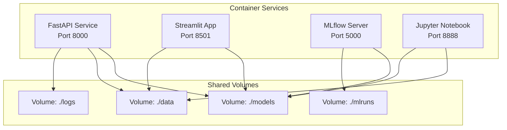
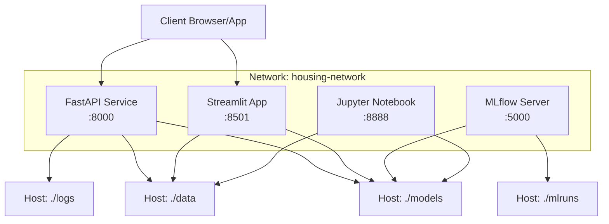
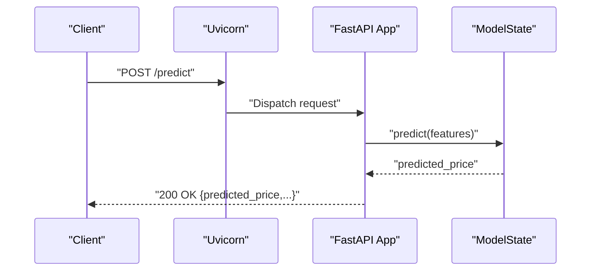
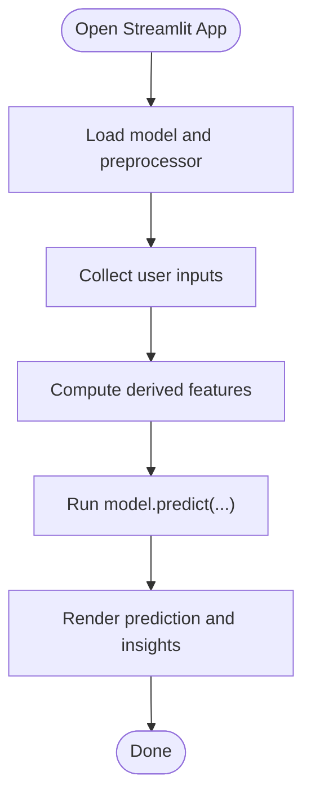
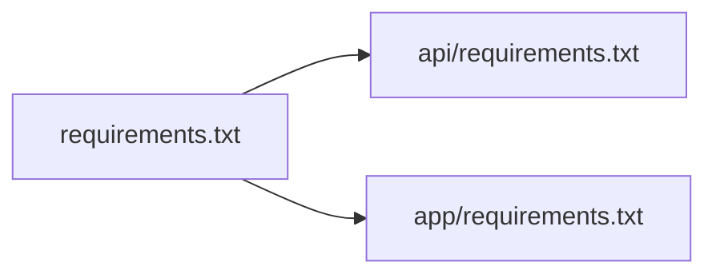

# Deployment and Operations

<cite>
**Referenced Files in This Document**
- [Dockerfile](file://Dockerfile)
- [docker-compose.yml](file://docker-compose.yml)
- [README.md](file://README.md)
- [requirements.txt](file://requirements.txt)
- [api/requirements.txt](file://api/requirements.txt)
- [app/requirements.txt](file://app/requirements.txt)
- [.github/workflows/pages.yml](file://.github/workflows/pages.yml)
- [api/main.py](file://api/main.py)
- [app/app.py](file://app/app.py)
- [src/experiment_tracking.py](file://src/experiment_tracking.py)
- [src/utils.py](file://src/utils.py)
- [tests/test_api.py](file://tests/test_api.py)
- [tests/conftest.py](file://tests/conftest.py)
- [setup.py](file://setup.py)
- [train_model_for_web.py](file://train_model_for_web.py)
</cite>

## Table of Contents
1. [Introduction](#introduction)
2. [Project Structure](#project-structure)
3. [Core Components](#core-components)
4. [Architecture Overview](#architecture-overview)
5. [Detailed Component Analysis](#detailed-component-analysis)
6. [Dependency Analysis](#dependency-analysis)
7. [Performance Considerations](#performance-considerations)
8. [Troubleshooting Guide](#troubleshooting-guide)
9. [Conclusion](#conclusion)
10. [Appendices](#appendices)

## Introduction
This document provides a comprehensive guide to deploying and operating the California House Price Prediction project in containerized environments. It covers Docker containerization strategy, multi-stage builds, image optimization, and security hardening. It explains docker-compose orchestration for multi-service deployment (FastAPI, Streamlit, optional MLflow and Jupyter), production deployment processes, environment configuration, scaling considerations, monitoring and logging, health checks, CI/CD integration, automated testing, and operational best practices including backups, disaster recovery, and maintenance.

## Project Structure
The project is organized into:
- api/: FastAPI application and API dependencies
- app/: Streamlit web application and app dependencies
- src/: Python package with data processing, modeling, evaluation, and utilities
- tests/: Unit tests for API and models
- docs/: Architectural and model data assets
- data/, models/, notebooks/: Data, persisted models, and exploratory notebooks
- Top-level configuration: Dockerfile, docker-compose.yml, requirements.txt, setup.py, and CI workflow

**Diagram sources**
- [docker-compose.yml:10-109](file://docker-compose.yml#L10-L109)

**Section sources**
- [README.md:88-139](file://README.md#L88-L139)
- [docker-compose.yml:1-109](file://docker-compose.yml#L1-L109)

## Core Components
- FastAPI service: Production REST API with health checks, CORS, and model inference.
- Streamlit app: Interactive web UI for predictions and insights.
- Optional services:
  - MLflow server: Experiment tracking backend.
  - Jupyter service: Development environment (profile-gated).
- Containerization: Multi-stage Docker build with slim base images, virtual environment reuse, non-root user, and health checks.

Key operational capabilities:
- Health endpoints for readiness and liveness checks.
- Persistent volumes for models, data, logs, and MLflow artifacts.
- Network isolation via a dedicated bridge network.
- Restart policies for resilience.

**Section sources**
- [Dockerfile:1-86](file://Dockerfile#L1-L86)
- [docker-compose.yml:10-109](file://docker-compose.yml#L10-L109)
- [api/main.py:248-260](file://api/main.py#L248-L260)
- [app/app.py:1-399](file://app/app.py#L1-L399)

## Architecture Overview
The system runs as a multi-container application orchestrated by docker-compose. The FastAPI service exposes the prediction API and health endpoint, while the Streamlit app provides an interactive UI. Optional services include MLflow for experiment tracking and Jupyter for development. All services share a private bridge network and persist critical data on host volumes.

**Diagram sources**
- [docker-compose.yml:10-109](file://docker-compose.yml#L10-L109)

**Section sources**
- [docker-compose.yml:10-109](file://docker-compose.yml#L10-L109)

## Detailed Component Analysis

### FastAPI Service
The FastAPI service implements:
- Startup/shutdown lifecycle to load the model and preprocessor.
- Health endpoint returning model load status.
- Prediction endpoints for single and batch predictions.
- CORS middleware enabled for broad compatibility.
- Pydantic models for input validation and structured responses.

Operational highlights:
- Health check configured via docker-compose and Dockerfile HEALTHCHECK.
- Non-root user and read-only model/data mounts for security.
- Logs written to mounted logs volume.

**Diagram sources**
- [api/main.py:290-347](file://api/main.py#L290-L347)

**Section sources**
- [api/main.py:186-195](file://api/main.py#L186-L195)
- [api/main.py:248-260](file://api/main.py#L248-L260)
- [api/main.py:290-347](file://api/main.py#L290-L347)
- [docker-compose.yml:26-31](file://docker-compose.yml#L26-L31)
- [Dockerfile:80-82](file://Dockerfile#L80-L82)

### Streamlit App
The Streamlit app:
- Loads the model and preprocessor from the models directory.
- Provides interactive sliders and inputs for property features.
- Computes derived features and renders visualizations.
- Includes tabs for prediction, insights, and project information.

Operational highlights:
- Mounted read-only model/data volumes.
- Depends_on API service to ensure model availability during development.

**Diagram sources**
- [app/app.py:72-82](file://app/app.py#L72-L82)
- [app/app.py:197-202](file://app/app.py#L197-L202)

**Section sources**
- [app/app.py:72-82](file://app/app.py#L72-L82)
- [app/app.py:197-202](file://app/app.py#L197-L202)
- [docker-compose.yml:53-54](file://docker-compose.yml#L53-L54)

### MLflow Service
The MLflow service:
- Runs the MLflow tracking server.
- Persists runs and artifacts to a local volume.
- Configured with a backend store and default artifact root.

Operational highlights:
- Optional service; useful for experiment tracking and model registry.

**Section sources**
- [docker-compose.yml:62-78](file://docker-compose.yml#L62-L78)

### Jupyter Service
The Jupyter service:
- Provides a development environment for notebooks.
- Mounts project and notebooks directories.
- Profiles-gated to avoid running by default.

Operational highlights:
- Useful for iterative development and experimentation.

**Section sources**
- [docker-compose.yml:83-100](file://docker-compose.yml#L83-L100)

### Docker Containerization Strategy
Multi-stage build:
- Stage 1 (Builder): Installs build essentials, creates a virtual environment, and installs all dependencies (main, API, and app).
- Stage 2 (Production): Uses a slim base image, copies the virtual environment, sets non-root user, exposes ports, defines health checks, and sets default command.

Image optimization:
- Virtual environment reused across stages to minimize size.
- Minimal base image and only necessary system packages installed.
- Non-root user and chown for secure file ownership.

Security considerations:
- Non-root user and read-only model/data mounts.
- HEALTHCHECK configured at both Dockerfile and docker-compose levels.
- Ports exposed only for intended services.

**Section sources**
- [Dockerfile:5-37](file://Dockerfile#L5-L37)
- [Dockerfile:39-86](file://Dockerfile#L39-L86)
- [docker-compose.yml:18-24](file://docker-compose.yml#L18-L24)
- [docker-compose.yml:47-51](file://docker-compose.yml#L47-L51)

### docker-compose Orchestration
Services:
- api: FastAPI with reload, health checks, volumes, and restart policy.
- streamlit: Streamlit app depending on API.
- mlflow: Optional MLflow server with persistent artifacts.
- jupyter: Optional development service (profiles-gated).

Networking:
- Dedicated bridge network isolates services.

Volumes:
- Persistent volumes for models, data, logs, and MLflow artifacts.

Environment configuration:
- Environment variables passed to containers (e.g., LOG_LEVEL).

Scaling:
- Each service runs as a single replica by default; scale horizontally by increasing replica counts per service.

**Section sources**
- [docker-compose.yml:10-109](file://docker-compose.yml#L10-L109)

### Monitoring and Logging
Logging:
- Centralized logging to stdout/stderr via Python logging.
- Optional file handler to mounted logs volume.

Health checks:
- Dockerfile HEALTHCHECK probes the API’s /health endpoint.
- docker-compose healthcheck repeats the same pattern with curl.

Alerting:
- Not implemented in the repository; can be integrated externally (e.g., Prometheus/Grafana or platform-native solutions).

**Section sources**
- [Dockerfile:80-82](file://Dockerfile#L80-L82)
- [docker-compose.yml:26-31](file://docker-compose.yml#L26-L31)
- [src/utils.py:16-55](file://src/utils.py#L16-L55)

### CI/CD Pipeline Integration
Current pipeline:
- GitHub Pages workflow deploys static content to GitHub Pages on pushes to main/master.

Automated testing:
- Tests are defined and runnable via pytest; CI can be extended to include API and model tests.

Recommendations:
- Extend the workflow to run pytest, coverage, and build images.
- Gate deployments with passing tests and linting.

**Section sources**
- [.github/workflows/pages.yml:1-39](file://.github/workflows/pages.yml#L1-L39)
- [tests/test_api.py:1-199](file://tests/test_api.py#L1-L199)
- [tests/conftest.py:1-76](file://tests/conftest.py#L1-L76)

### Security Best Practices
- Non-root user and chown for application directories.
- Read-only mounts for models and data.
- HEALTHCHECK to detect unhealthy states.
- CORS middleware enabled; restrict origins in production as needed.
- Keep base images updated and pin dependency versions.

**Section sources**
- [Dockerfile:50-75](file://Dockerfile#L50-L75)
- [Dockerfile:21-28](file://Dockerfile#L21-L28)
- [api/main.py:224-230](file://api/main.py#L224-L230)

### Data Persistence and Experiment Tracking
- Models and preprocessor are persisted in the models directory and mounted read-only to services.
- MLflow artifacts stored in mlruns volume.
- Experiment tracking module supports logging parameters, metrics, artifacts, and model registry entries.

**Section sources**
- [docker-compose.yml:21-24](file://docker-compose.yml#L21-L24)
- [docker-compose.yml:72-74](file://docker-compose.yml#L72-L74)
- [src/experiment_tracking.py:19-307](file://src/experiment_tracking.py#L19-L307)

### Operational Procedures
- Backup strategies:
  - Back up models/, data/, logs/, and mlruns/ directories regularly.
- Disaster recovery:
  - Recreate containers from images and restore volumes from backups.
- Maintenance:
  - Periodically rebuild images with updated dependencies.
  - Rotate logs and monitor disk usage on host volumes.

[No sources needed since this section provides general guidance]

## Dependency Analysis
External dependencies are declared in top-level and service-specific requirements files. The API and app services reuse the main requirements for shared libraries.

**Diagram sources**
- [requirements.txt:1-36](file://requirements.txt#L1-L36)
- [api/requirements.txt:1-9](file://api/requirements.txt#L1-L9)
- [app/requirements.txt:1-7](file://app/requirements.txt#L1-L7)

**Section sources**
- [requirements.txt:1-36](file://requirements.txt#L1-L36)
- [api/requirements.txt:1-9](file://api/requirements.txt#L1-L9)
- [app/requirements.txt:1-7](file://app/requirements.txt#L1-L7)

## Performance Considerations
- Multi-stage builds reduce final image size and speed up cold starts.
- Reusing the virtual environment avoids reinstalling dependencies in the production stage.
- Health checks enable quick detection of unresponsive services.
- Mounting logs to the host prevents container-local log loss and enables external log aggregation.

[No sources needed since this section provides general guidance]

## Troubleshooting Guide
Common deployment issues and resolutions:
- Model not loaded:
  - Ensure models/ directory contains the trained model and preprocessor files.
  - Verify mount paths in docker-compose and permissions.
- Health check failures:
  - Confirm the /health endpoint responds and the model loads during startup.
  - Check container logs for startup errors.
- Port conflicts:
  - Change published ports in docker-compose if 8000, 8501, 5000, or 8888 are in use.
- CORS issues:
  - Adjust allow_origins in the API middleware for production domains.
- Slow predictions:
  - Validate model files exist and are readable; confirm CPU/memory resources allocated to the container.

**Section sources**
- [api/main.py:126-154](file://api/main.py#L126-L154)
- [docker-compose.yml:26-31](file://docker-compose.yml#L26-L31)
- [docker-compose.yml:16-17](file://docker-compose.yml#L16-L17)
- [api/main.py:224-230](file://api/main.py#L224-L230)

## Conclusion
The project provides a production-ready foundation for deploying a FastAPI-powered prediction service alongside a Streamlit UI, with optional MLflow and Jupyter services. The multi-stage Docker build, non-root user, health checks, and persistent volumes establish a secure and maintainable baseline. Extending CI/CD to include automated testing and image builds, and integrating external monitoring/alerting, will further strengthen the production operations posture.

[No sources needed since this section summarizes without analyzing specific files]

## Appendices

### API Endpoints Reference
- GET /: API information
- GET /health: Health status
- GET /model/info: Model metadata
- POST /predict: Single prediction
- POST /predict/batch: Batch predictions
- GET /docs: Swagger UI
- GET /redoc: ReDoc

**Section sources**
- [README.md:239-247](file://README.md#L239-L247)
- [api/main.py:237-383](file://api/main.py#L237-L383)

### Training and Experiment Tracking
- Training script exports the model and supporting data for web use.
- Experiment tracking module supports logging parameters, metrics, artifacts, and model registry.

**Section sources**
- [train_model_for_web.py:108-192](file://train_model_for_web.py#L108-L192)
- [src/experiment_tracking.py:254-307](file://src/experiment_tracking.py#L254-L307)