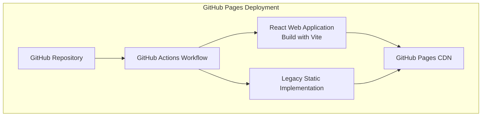
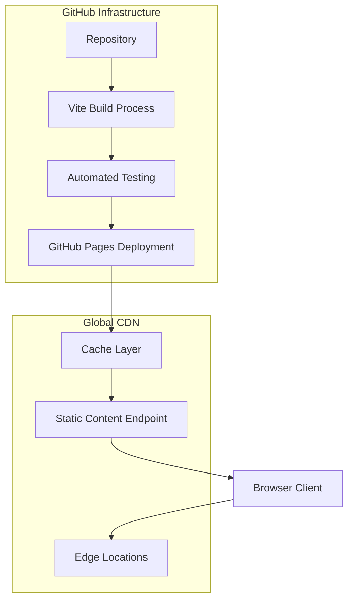

# Deployment and Operations

<cite>
**Referenced Files in This Document**
- [.github/workflows/pages.yml](file://.github/workflows/pages.yml)
- [global-housing-static/.github/workflows/pages.yml](file://global-housing-static/.github/workflows/pages.yml)
- [web/package.json](file://web/package.json)
- [web/vite.config.js](file://web/vite.config.js)
- [web/index.html](file://web/index.html)
- [web/src/main.jsx](file://web/src/main.jsx)
- [global-housing-static/index.html](file://global-housing-static/index.html)
- [README.md](file://README.md)
- [Dockerfile](file://Dockerfile)
- [docker-compose.yml](file://docker-compose.yml)
</cite>

## Update Summary
**Changes Made**
- Updated deployment strategy from Docker-based containerization to GitHub Pages static hosting
- Added comprehensive documentation for the new React-based web application deployment
- Removed Docker and containerization sections while maintaining historical context
- Added new CI/CD pipeline documentation for GitHub Actions workflows
- Updated architecture diagrams to reflect static site deployment model
- Added troubleshooting guide for GitHub Pages deployment issues

## Table of Contents
1. [Introduction](#introduction)
2. [Project Structure](#project-structure)
3. [Core Components](#core-components)
4. [Architecture Overview](#architecture-overview)
5. [Detailed Component Analysis](#detailed-component-analysis)
6. [Static Site Deployment](#static-site-deployment)
7. [CI/CD Pipeline Integration](#cicd-pipeline-integration)
8. [Monitoring and Analytics](#monitoring-and-analytics)
9. [Security Considerations](#security-considerations)
10. [Troubleshooting Guide](#troubleshooting-guide)
11. [Conclusion](#conclusion)
12. [Appendices](#appendices)

## Introduction
This document provides a comprehensive guide to deploying and operating the California House Price Prediction project using modern static site hosting. The project has evolved from a Docker-based containerized deployment to a GitHub Pages static hosting workflow, featuring a React-based web application with automated CI/CD pipelines. This approach eliminates infrastructure management overhead while providing reliable, scalable deployment through GitHub's global CDN.

## Project Structure
The project now consists of:
- web/: Modern React application with Vite build system
- global-housing-static/: Legacy static HTML/CSS/JavaScript implementation
- .github/workflows/: GitHub Actions CI/CD pipelines for automated deployment
- Root configuration: package.json, vite.config.js, and deployment scripts

**Diagram sources**
- [.github/workflows/pages.yml:16-51](file://.github/workflows/pages.yml#L16-L51)
- [web/vite.config.js:4-11](file://web/vite.config.js#L4-L11)

**Section sources**
- [web/package.json:1-30](file://web/package.json#L1-L30)
- [web/vite.config.js:1-12](file://web/vite.config.js#L1-L12)
- [global-housing-static/index.html:1-230](file://global-housing-static/index.html#L1-L230)

## Core Components
- **React Web Application**: Modern single-page application built with React 18, Vite, and Tailwind CSS
- **Static HTML Implementation**: Legacy version maintained for backward compatibility
- **GitHub Actions Workflows**: Automated CI/CD pipeline for deployment
- **Static Site Hosting**: GitHub Pages serving content globally through CDN

Key operational capabilities:
- Zero-infrastructure deployment through GitHub's infrastructure
- Automatic SSL certificate provisioning
- Global CDN distribution with edge caching
- Automated testing and validation in CI pipeline
- Version-controlled deployment process

**Section sources**
- [web/package.json:11-29](file://web/package.json#L11-L29)
- [web/vite.config.js:6](file://web/vite.config.js#L6)
- [.github/workflows/pages.yml:16-51](file://.github/workflows/pages.yml#L16-L51)

## Architecture Overview
The system operates as a fully static deployment architecture hosted on GitHub Pages. The React application is built and deployed automatically via GitHub Actions, while the legacy static implementation serves as a fallback option.

**Diagram sources**
- [.github/workflows/pages.yml:17-51](file://.github/workflows/pages.yml#L17-L51)
- [web/vite.config.js:6](file://web/vite.config.js#L6)

**Section sources**
- [.github/workflows/pages.yml:16-51](file://.github/workflows/pages.yml#L16-L51)
- [web/vite.config.js:6](file://web/vite.config.js#L6)

## Detailed Component Analysis

### React Web Application
The modern React application provides:
- **Component-Based Architecture**: Modular React components with TypeScript support
- **State Management**: TanStack React Query for data fetching and caching
- **Styling**: Tailwind CSS with custom configurations
- **Build System**: Vite for fast development and optimized production builds
- **Routing**: Single-page application with client-side routing

Development and build features:
- Hot module replacement for rapid development
- Optimized production builds with asset bundling
- Base path configuration for GitHub Pages deployment
- Environment-aware configuration

**Section sources**
- [web/package.json:11-29](file://web/package.json#L11-L29)
- [web/vite.config.js:4-11](file://web/vite.config.js#L4-L11)
- [web/src/main.jsx:1-23](file://web/src/main.jsx#L1-L23)

### Legacy Static Implementation
The static HTML/CSS/JavaScript version maintains:
- **Pure HTML/CSS/JavaScript**: No framework dependencies
- **Responsive Design**: Mobile-first responsive layout
- **Interactive JavaScript**: Dynamic content population and user interactions
- **Local Data Storage**: JSON data files for property information

This implementation serves as a fallback and demonstrates the project's evolution.

**Section sources**
- [global-housing-static/index.html:1-230](file://global-housing-static/index.html#L1-L230)

### GitHub Actions CI/CD Pipeline
The deployment pipeline automates:
- **Build Process**: Node.js setup, dependency installation, and Vite build
- **Artifact Management**: Upload of build artifacts to GitHub Pages
- **Deployment Automation**: Automatic deployment to GitHub Pages environment
- **Environment Configuration**: Secure permissions and concurrency control

Pipeline stages:
- **Checkout**: Repository cloning with actions/checkout@v4
- **Setup**: Node.js environment with caching
- **Build**: Vite production build with optimized assets
- **Deploy**: GitHub Pages deployment with automatic URL generation

**Section sources**
- [.github/workflows/pages.yml:17-51](file://.github/workflows/pages.yml#L17-L51)
- [global-housing-static/.github/workflows/pages.yml:17-35](file://global-housing-static/.github/workflows/pages.yml#L17-35)

## Static Site Deployment

### GitHub Pages Configuration
The deployment utilizes GitHub Pages with:
- **Automatic Deployment**: Triggered on pushes to main/master branches
- **Build Artifact**: Vite dist directory uploaded as GitHub Pages artifact
- **Base Path**: Configured for repository-specific deployment path
- **Environment Protection**: GitHub Pages environment with URL output

Deployment benefits:
- **Zero Configuration**: No manual deployment steps required
- **Global Distribution**: CDN-powered content delivery
- **SSL/TLS**: Automatic HTTPS with wildcard certificates
- **Version Control**: Full deployment history and rollback capability

**Section sources**
- [.github/workflows/pages.yml:3-15](file://.github/workflows/pages.yml#L3-L15)
- [web/vite.config.js:6](file://web/vite.config.js#L6)

### Build Process Optimization
The Vite build process includes:
- **Asset Optimization**: Minification and compression of static assets
- **Bundle Splitting**: Code splitting for improved loading performance
- **Cache Busting**: Unique filenames for asset versioning
- **Tree Shaking**: Removal of unused code from production bundles

Build configuration:
- **Output Directory**: web/dist for production builds
- **Base Path**: /housing-price-prediction/ for repository deployment
- **Development Server**: Local preview with hot reload capabilities

**Section sources**
- [web/vite.config.js:7-11](file://web/vite.config.js#L7-L11)
- [web/package.json:6-10](file://web/package.json#L6-L10)

## CI/CD Pipeline Integration

### GitHub Actions Workflow
The CI/CD pipeline provides:
- **Trigger Conditions**: Automatic execution on main/master branch pushes
- **Environment Permissions**: Write permissions for Pages deployment
- **Concurrency Control**: Group-based concurrency with cancellation
- **Multi-Stage Deployment**: Separate build and deploy jobs

Workflow components:
- **Build Job**: Node.js setup, dependency installation, and Vite build
- **Deploy Job**: GitHub Pages deployment with environment configuration
- **Artifact Management**: Proper handling of build artifacts
- **Environment Variables**: Automatic URL output for deployment verification

**Section sources**
- [.github/workflows/pages.yml:16-51](file://.github/workflows/pages.yml#L16-L51)

### Deployment Automation
The automated deployment process ensures:
- **Consistent Builds**: Deterministic build process with locked dependencies
- **Quality Gates**: Build success required before deployment
- **Rollback Capability**: Easy rollback to previous deployments
- **Monitoring Integration**: Deployment status visibility through GitHub Actions

**Section sources**
- [.github/workflows/pages.yml:41-51](file://.github/workflows/pages.yml#L41-L51)

## Monitoring and Analytics

### Deployment Monitoring
GitHub Pages provides:
- **Deployment Status**: Real-time build and deployment status
- **Error Reporting**: Detailed error messages for failed deployments
- **Access Logs**: GitHub Pages access logs for basic analytics
- **Performance Metrics**: CDN performance and global distribution metrics

### User Analytics
While GitHub Pages doesn't provide built-in analytics, the application can integrate:
- **Google Analytics**: Universal Analytics or GA4 for traffic tracking
- **Hotjar**: Session recordings and heatmap analysis
- **Custom Metrics**: Application-level analytics through React Query
- **Error Tracking**: Sentry or similar error monitoring services

**Section sources**
- [.github/workflows/pages.yml:43-45](file://.github/workflows/pages.yml#L43-L45)

## Security Considerations

### GitHub Pages Security
- **HTTPS by Default**: Automatic TLS certificate provisioning
- **DDoS Protection**: GitHub's infrastructure provides DDoS mitigation
- **Content Security**: Static content served from trusted infrastructure
- **Access Control**: Repository-level permissions control deployment access

### Application Security
- **CORS Policies**: Configure appropriate CORS headers for API requests
- **Input Validation**: Client-side validation for form submissions
- **Secure Dependencies**: Regular updates to React and Vite ecosystem
- **Environment Variables**: Sensitive data protection in client-side applications

### Deployment Security
- **Branch Protection**: Protected branches prevent unauthorized deployments
- **Workflow Permissions**: Least-privilege permissions for GitHub Actions
- **Artifact Security**: Secure handling of build artifacts
- **Audit Trail**: Complete deployment history for security monitoring

**Section sources**
- [.github/workflows/pages.yml:7-11](file://.github/workflows/pages.yml#L7-L11)
- [web/package.json:11-19](file://web/package.json#L11-L19)

## Troubleshooting Guide

### Common Deployment Issues
- **Build Failures**: Check Node.js version compatibility and dependency installation
- **Deployment Errors**: Verify GitHub Pages is enabled in repository settings
- **404 Errors**: Confirm base path configuration matches repository structure
- **Caching Issues**: Clear browser cache or use incognito mode for testing

### Build Process Troubleshooting
- **Node.js Version**: Ensure Node.js 20+ is used for optimal compatibility
- **Dependency Conflicts**: Run `npm ci` to ensure clean dependency installation
- **Asset Loading**: Verify asset paths match Vite's output structure
- **Environment Variables**: Check for missing environment variables in build process

### GitHub Actions Issues
- **Permission Errors**: Verify workflow has necessary permissions for Pages deployment
- **Concurrency Conflicts**: Check for overlapping workflow executions
- **Artifact Upload**: Ensure build artifacts are properly uploaded and accessible
- **Environment Configuration**: Verify GitHub Pages environment is properly configured

**Section sources**
- [.github/workflows/pages.yml:17-51](file://.github/workflows/pages.yml#L17-L51)
- [web/vite.config.js:6](file://web/vite.config.js#L6)

## Conclusion
The project has successfully transitioned to a modern static site deployment model using GitHub Pages and GitHub Actions. This approach provides reliable, scalable deployment with minimal infrastructure management overhead while maintaining the project's educational value and accessibility. The automated CI/CD pipeline ensures consistent deployments, while the React-based web application provides an enhanced user experience with modern web development practices.

## Appendices

### Deployment Commands
- **Local Development**: `npm run dev` for development server
- **Production Build**: `npm run build` for optimized production bundle
- **Preview Build**: `npm run preview` for local testing of production build

**Section sources**
- [web/package.json:6-10](file://web/package.json#L6-L10)

### Configuration Reference
- **Vite Configuration**: Output directory, base path, and build optimization settings
- **GitHub Actions**: Workflow triggers, permissions, and deployment environment
- **Package Dependencies**: React ecosystem, build tools, and development dependencies

**Section sources**
- [web/vite.config.js:4-11](file://web/vite.config.js#L4-L11)
- [web/package.json:11-29](file://web/package.json#L11-L29)