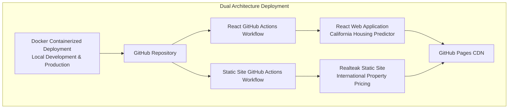
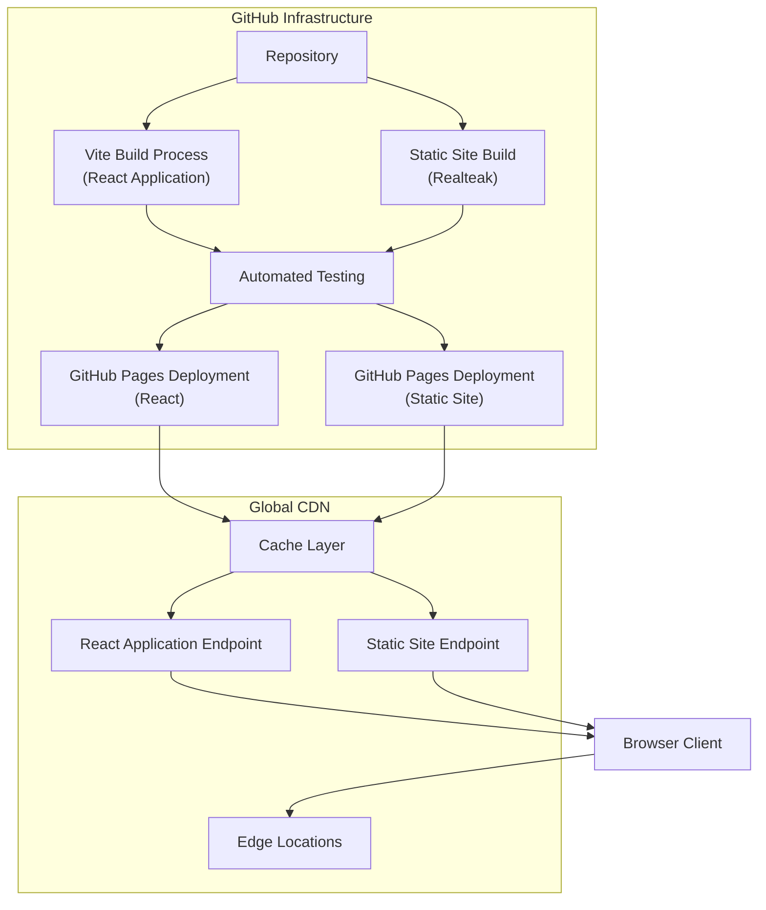

# Deployment and Operations

<cite>
**Referenced Files in This Document**
- [.github/workflows/pages.yml](file://.github/workflows/pages.yml)
- [global-housing-static/.github/workflows/pages.yml](file://global-housing-static/.github/workflows/pages.yml)
- [web/package.json](file://web/package.json)
- [web/vite.config.js](file://web/vite.config.js)
- [web/index.html](file://web/index.html)
- [web/src/main.jsx](file://web/src/main.jsx)
- [web/src/App.jsx](file://web/src/App.jsx)
- [global-housing-static/index.html](file://global-housing-static/index.html)
- [global-housing-static/README.md](file://global-housing-static/README.md)
- [README.md](file://README.md)
- [Dockerfile](file://Dockerfile)
- [docker-compose.yml](file://docker-compose.yml)
- [docs/architecture.md](file://docs/architecture.md)
</cite>

## Update Summary
**Changes Made**
- Enhanced documentation to cover both deployment architectures: React-based web application and Realteak static site
- Updated deployment strategy to reflect dual architecture approach with GitHub Pages static hosting
- Added comprehensive documentation for the new Realteak static site implementation with modernized GitHub Pages workflow
- Expanded CI/CD pipeline documentation covering both React and static site deployment processes
- Updated architecture diagrams to reflect the Realteak static site architecture alongside the existing containerized deployment
- Added troubleshooting guide for both React web application and static site deployment issues

## Table of Contents
1. [Introduction](#introduction)
2. [Project Structure](#project-structure)
3. [Core Components](#core-components)
4. [Architecture Overview](#architecture-overview)
5. [Detailed Component Analysis](#detailed-component-analysis)
6. [Static Site Deployment](#static-site-deployment)
7. [React Web Application Deployment](#react-web-application-deployment)
8. [CI/CD Pipeline Integration](#cicd-pipeline-integration)
9. [Monitoring and Analytics](#monitoring-and-analytics)
10. [Security Considerations](#security-considerations)
11. [Troubleshooting Guide](#troubleshooting-guide)
12. [Conclusion](#conclusion)
13. [Appendices](#appendices)

## Introduction
This document provides a comprehensive guide to deploying and operating the California House Price Prediction project using modern static site hosting and containerized deployment strategies. The project now features a dual architecture approach: a React-based web application for the California housing predictor and a Realteak static site implementation for international property pricing. Both implementations leverage GitHub Pages for automated deployment through GitHub Actions workflows, eliminating infrastructure management overhead while providing reliable, scalable deployment through GitHub's global CDN.

## Project Structure
The project now consists of two distinct deployment architectures:
- **React Web Application**: Modern single-page application built with React 18, Vite, and Tailwind CSS for the California housing predictor
- **Realteak Static Site**: Multi-page static website for international property pricing using vanilla HTML, CSS, and JavaScript
- **Containerized Deployment**: Docker-based deployment for local development and production environments
- **GitHub Actions Workflows**: Automated CI/CD pipelines for both deployment architectures

**Diagram sources**
- [.github/workflows/pages.yml:16-51](file://.github/workflows/pages.yml#L16-L51)
- [global-housing-static/.github/workflows/pages.yml:17-35](file://global-housing-static/.github/workflows/pages.yml#L17-L35)
- [Dockerfile:1-86](file://Dockerfile#L1-L86)

**Section sources**
- [web/package.json:1-30](file://web/package.json#L1-L30)
- [global-housing-static/README.md:1-83](file://global-housing-static/README.md#L1-L83)
- [Dockerfile:1-86](file://Dockerfile#L1-L86)

## Core Components
- **React Web Application**: Modern single-page application built with React 18, Vite, and Tailwind CSS for California housing price prediction
- **Realteak Static Site**: Multi-page static website for international property pricing with vanilla HTML, CSS, and JavaScript
- **Docker Containerized Deployment**: Multi-stage Docker build for local development and production environments
- **GitHub Actions Workflows**: Automated CI/CD pipelines for both deployment architectures
- **Static Site Hosting**: GitHub Pages serving content globally through CDN

Key operational capabilities:
- Zero-infrastructure deployment through GitHub's infrastructure for both architectures
- Automatic SSL certificate provisioning
- Global CDN distribution with edge caching
- Automated testing and validation in CI pipeline
- Version-controlled deployment process with rollback capability
- Containerized deployment for local development and production environments

**Section sources**
- [web/package.json:11-29](file://web/package.json#L11-L29)
- [global-housing-static/README.md:24-34](file://global-housing-static/README.md#L24-L34)
- [Dockerfile:7-86](file://Dockerfile#L7-L86)

## Architecture Overview
The system operates with a dual architecture approach: a React-based web application for the California housing predictor and a Realteak static site for international property pricing. Both architectures utilize GitHub Pages for deployment, while the containerized deployment option supports local development and production environments.

**Diagram sources**
- [.github/workflows/pages.yml:17-51](file://.github/workflows/pages.yml#L17-L51)
- [global-housing-static/.github/workflows/pages.yml:18-35](file://global-housing-static/.github/workflows/pages.yml#L18-L35)

**Section sources**
- [.github/workflows/pages.yml:16-51](file://.github/workflows/pages.yml#L16-L51)
- [global-housing-static/.github/workflows/pages.yml:1-35](file://global-housing-static/.github/workflows/pages.yml#L1-L35)

## Detailed Component Analysis

### React Web Application
The modern React application provides:
- **Component-Based Architecture**: Modular React components with TypeScript support
- **State Management**: TanStack React Query for data fetching and caching
- **Styling**: Tailwind CSS with custom configurations
- **Build System**: Vite for fast development and optimized production builds
- **Routing**: Single-page application with client-side routing

Development and build features:
- Hot module replacement for rapid development
- Optimized production builds with asset bundling
- Base path configuration for GitHub Pages deployment
- Environment-aware configuration

**Section sources**
- [web/package.json:11-29](file://web/package.json#L11-L29)
- [web/vite.config.js:4-11](file://web/vite.config.js#L4-L11)
- [web/src/main.jsx:1-23](file://web/src/main.jsx#L1-L23)
- [web/src/App.jsx:1-18](file://web/src/App.jsx#L1-L18)

### Realteak Static Site Implementation
The Realteak static site provides:
- **Multi-Page Architecture**: Separate HTML pages for different functionalities
- **Vanilla JavaScript**: Pure JavaScript implementation without framework dependencies
- **Responsive Design**: Mobile-first responsive layout with modern CSS
- **Interactive Features**: Dynamic content population and user interactions
- **Client-Side Calculations**: Price prediction logic implemented in JavaScript

Key features:
- **20+ Countries**: Coverage across North America, Europe, Asia, and more
- **95+ Cities**: Major metropolitan areas with local price multipliers
- **Price Prediction**: Client-side calculation based on property features
- **Search & Explore**: Find cities and compare markets
- **No Backend Required**: All data embedded in JavaScript

**Section sources**
- [global-housing-static/index.html:1-285](file://global-housing-static/index.html#L1-L285)
- [global-housing-static/README.md:1-83](file://global-housing-static/README.md#L1-L83)

### Docker Containerized Deployment
The containerized deployment supports:
- **Multi-Stage Build**: Optimized production images with reduced attack surface
- **Non-Root User**: Security-focused container execution
- **Health Checks**: Built-in health monitoring for containerized services
- **Volume Mounting**: Persistent data storage for models and logs
- **Service Orchestration**: Docker Compose for multi-service deployment

Container features:
- **FastAPI Service**: REST API for machine learning predictions
- **Streamlit App**: Interactive web interface for model exploration
- **MLflow Tracking**: Experiment tracking and model management
- **Jupyter Notebook**: Development environment for model experimentation

**Section sources**
- [Dockerfile:1-86](file://Dockerfile#L1-L86)
- [docker-compose.yml:1-109](file://docker-compose.yml#L1-L109)

## Static Site Deployment

### GitHub Pages Configuration
Both deployment architectures utilize GitHub Pages with:
- **Automatic Deployment**: Triggered on pushes to main/master branches
- **Build Artifact Management**: Proper handling of build outputs for each architecture
- **Base Path Configuration**: Configured for repository-specific deployment paths
- **Environment Protection**: GitHub Pages environment with URL output

Deployment benefits:
- **Zero Configuration**: No manual deployment steps required
- **Global Distribution**: CDN-powered content delivery
- **SSL/TLS**: Automatic HTTPS with wildcard certificates
- **Version Control**: Full deployment history and rollback capability

**Section sources**
- [.github/workflows/pages.yml:3-15](file://.github/workflows/pages.yml#L3-L15)
- [global-housing-static/.github/workflows/pages.yml:3-16](file://global-housing-static/.github/workflows/pages.yml#L3-L16)

### Build Process Optimization
The Vite build process for the React application includes:
- **Asset Optimization**: Minification and compression of static assets
- **Bundle Splitting**: Code splitting for improved loading performance
- **Cache Busting**: Unique filenames for asset versioning
- **Tree Shaking**: Removal of unused code from production bundles

Build configuration:
- **Output Directory**: web/dist for production builds
- **Base Path**: /housing-price-prediction/ for repository deployment
- **Development Server**: Local preview with hot reload capabilities

**Section sources**
- [web/vite.config.js:7-11](file://web/vite.config.js#L7-L11)
- [web/package.json:6-10](file://web/package.json#L6-L10)

### Realteak Static Site Build Process
The Realteak static site deployment process:
- **Direct File Upload**: Static HTML, CSS, and JavaScript files uploaded as artifacts
- **No Build Step Required**: Pure static files deployed directly
- **Root Deployment**: Files deployed from repository root for proper URL structure
- **Workflow Automation**: GitHub Actions workflow handles the entire deployment process

**Section sources**
- [global-housing-static/.github/workflows/pages.yml:18-35](file://global-housing-static/.github/workflows/pages.yml#L18-L35)
- [global-housing-static/README.md:24-34](file://global-housing-static/README.md#L24-L34)

## React Web Application Deployment

### React Application Architecture
The React application follows modern web development practices:
- **Component-Based Design**: Modular, reusable React components
- **State Management**: Centralized state management with React Query
- **API Integration**: RESTful API consumption for machine learning predictions
- **Geographic Features**: Location-based services with Google Maps integration
- **Responsive Design**: Mobile-first approach with Tailwind CSS

Application features:
- **Interactive Prediction Form**: Real-time property input with validation
- **Geographic Visualization**: Interactive maps showing property locations
- **Census Data Integration**: Real-time demographic data fetching
- **Prediction Results**: Detailed price estimates with confidence intervals

**Section sources**
- [web/src/App.jsx:1-18](file://web/src/App.jsx#L1-L18)
- [web/src/main.jsx:1-23](file://web/src/main.jsx#L1-L23)
- [web/index.html:1-17](file://web/index.html#L1-L17)

### API Integration and Data Flow
The React application integrates with the backend API:
- **Prediction API**: Real-time price prediction service
- **Geocoding Service**: Location coordinate conversion
- **Census Data**: Demographic information retrieval
- **Error Handling**: Comprehensive error management and user feedback

Data flow:
- **User Input**: Property details entered through interactive forms
- **API Requests**: Asynchronous requests to prediction and geographic services
- **Response Processing**: Data transformation and display formatting
- **Result Presentation**: Interactive visualization of prediction results

**Section sources**
- [web/src/services/predictionApi.js](file://web/src/services/predictionApi.js)
- [web/src/hooks/usePrediction.js](file://web/src/hooks/usePrediction.js)
- [web/src/hooks/useGeocoding.js](file://web/src/hooks/useGeocoding.js)

## CI/CD Pipeline Integration

### GitHub Actions Workflow
The CI/CD pipeline provides:
- **Trigger Conditions**: Automatic execution on main/master branch pushes
- **Environment Permissions**: Write permissions for Pages deployment
- **Concurrency Control**: Group-based concurrency with cancellation
- **Multi-Stage Deployment**: Separate build and deploy jobs for each architecture

Workflow components:
- **React Build Job**: Node.js setup, dependency installation, and Vite build
- **Static Site Deploy Job**: Direct file upload for Realteak implementation
- **Artifact Management**: Proper handling of build artifacts
- **Environment Variables**: Automatic URL output for deployment verification

**Section sources**
- [.github/workflows/pages.yml:16-51](file://.github/workflows/pages.yml#L16-L51)
- [global-housing-static/.github/workflows/pages.yml:17-35](file://global-housing-static/.github/workflows/pages.yml#L17-L35)

### Deployment Automation
The automated deployment process ensures:
- **Consistent Builds**: Deterministic build process with locked dependencies
- **Quality Gates**: Build success required before deployment
- **Rollback Capability**: Easy rollback to previous deployments
- **Monitoring Integration**: Deployment status visibility through GitHub Actions

**Section sources**
- [.github/workflows/pages.yml:41-51](file://.github/workflows/pages.yml#L41-L51)
- [global-housing-static/.github/workflows/pages.yml:33-35](file://global-housing-static/.github/workflows/pages.yml#L33-L35)

## Monitoring and Analytics

### Deployment Monitoring
GitHub Pages provides:
- **Deployment Status**: Real-time build and deployment status
- **Error Reporting**: Detailed error messages for failed deployments
- **Access Logs**: GitHub Pages access logs for basic analytics
- **Performance Metrics**: CDN performance and global distribution metrics

### User Analytics
While GitHub Pages doesn't provide built-in analytics, the applications can integrate:
- **Google Analytics**: Universal Analytics or GA4 for traffic tracking
- **Hotjar**: Session recordings and heatmap analysis
- **Custom Metrics**: Application-level analytics through React Query
- **Error Tracking**: Sentry or similar error monitoring services

**Section sources**
- [.github/workflows/pages.yml:43-45](file://.github/workflows/pages.yml#L43-L45)

## Security Considerations

### GitHub Pages Security
- **HTTPS by Default**: Automatic TLS certificate provisioning
- **DDoS Protection**: GitHub's infrastructure provides DDoS mitigation
- **Content Security**: Static content served from trusted infrastructure
- **Access Control**: Repository-level permissions control deployment access

### Application Security
- **CORS Policies**: Configure appropriate CORS headers for API requests
- **Input Validation**: Client-side validation for form submissions
- **Secure Dependencies**: Regular updates to React and Vite ecosystem
- **Environment Variables**: Sensitive data protection in client-side applications

### Container Security
- **Non-Root Execution**: Docker containers run as non-root users
- **Image Optimization**: Multi-stage builds reduce attack surface
- **Health Checks**: Built-in monitoring for container health
- **Volume Security**: Proper file permissions for mounted volumes

**Section sources**
- [.github/workflows/pages.yml:7-11](file://.github/workflows/pages.yml#L7-L11)
- [web/package.json:11-19](file://web/package.json#L11-L19)
- [Dockerfile:50-75](file://Dockerfile#L50-L75)

## Troubleshooting Guide

### Common Deployment Issues
- **Build Failures**: Check Node.js version compatibility and dependency installation
- **Deployment Errors**: Verify GitHub Pages is enabled in repository settings
- **404 Errors**: Confirm base path configuration matches repository structure
- **Caching Issues**: Clear browser cache or use incognito mode for testing

### React Application Troubleshooting
- **Node.js Version**: Ensure Node.js 20+ is used for optimal compatibility
- **Dependency Conflicts**: Run `npm ci` to ensure clean dependency installation
- **Asset Loading**: Verify asset paths match Vite's output structure
- **Environment Variables**: Check for missing environment variables in build process
- **API Connectivity**: Verify API endpoint URLs and CORS configuration

### Static Site Troubleshooting
- **File Upload Issues**: Verify all static files are properly included in workflow
- **URL Structure**: Check that file paths match expected GitHub Pages structure
- **Workflow Permissions**: Ensure proper permissions for Pages deployment
- **Base Path Configuration**: Verify correct base path for repository deployment

### Docker Deployment Troubleshooting
- **Build Failures**: Check Dockerfile syntax and dependency installation
- **Port Conflicts**: Verify port availability on host system
- **Volume Mounting**: Ensure proper file permissions for mounted directories
- **Container Health**: Monitor health check status and logs

**Section sources**
- [.github/workflows/pages.yml:17-51](file://.github/workflows/pages.yml#L17-L51)
- [web/vite.config.js:6](file://web/vite.config.js#L6)
- [Dockerfile:80-86](file://Dockerfile#L80-L86)

## Conclusion
The project has successfully implemented a dual architecture deployment model combining modern static site hosting with containerized deployment options. The React-based web application provides an enhanced user experience for the California housing predictor, while the Realteak static site offers a lightweight, high-performance solution for international property pricing. Both architectures leverage GitHub Pages for automated deployment through GitHub Actions workflows, providing reliable, scalable deployment with minimal infrastructure management overhead. The containerized deployment option supports local development and production environments, while the static site approach ensures fast loading times and global CDN distribution.

## Appendices

### Deployment Commands
- **React Application**: 
  - Local Development: `npm run dev` for development server
  - Production Build: `npm run build` for optimized production bundle
  - Preview Build: `npm run preview` for local testing of production build
- **Docker Deployment**:
  - Local Development: `docker-compose up --build`
  - Manual Build: `docker build -t housing-price-prediction .`
  - Container Run: `docker run -p 8000:8000 -p 8501:8501 housing-price-prediction`

**Section sources**
- [web/package.json:6-10](file://web/package.json#L6-L10)
- [Dockerfile:84-86](file://Dockerfile#L84-L86)
- [docker-compose.yml:180-187](file://README.md#L180-L187)

### Configuration Reference
- **Vite Configuration**: Output directory, base path, and build optimization settings
- **GitHub Actions**: Workflow triggers, permissions, and deployment environment
- **Package Dependencies**: React ecosystem, build tools, and development dependencies
- **Docker Configuration**: Multi-stage build process, security settings, and service orchestration

**Section sources**
- [web/vite.config.js:4-11](file://web/vite.config.js#L4-L11)
- [web/package.json:11-29](file://web/package.json#L11-L29)
- [Dockerfile:4-86](file://Dockerfile#L4-L86)
- [docker-compose.yml:1-109](file://docker-compose.yml#L1-L109)

### Architecture Documentation
- **System Architecture**: Detailed component breakdown and data flow
- **Deployment Options**: Local development, containerized, and production deployment strategies
- **Security Considerations**: Input validation, CORS configuration, and container security
- **Monitoring**: Health check endpoints, logging, and performance metrics

**Section sources**
- [docs/architecture.md:1-169](file://docs/architecture.md#L1-L169)
- [README.md:138-192](file://README.md#L138-L192)