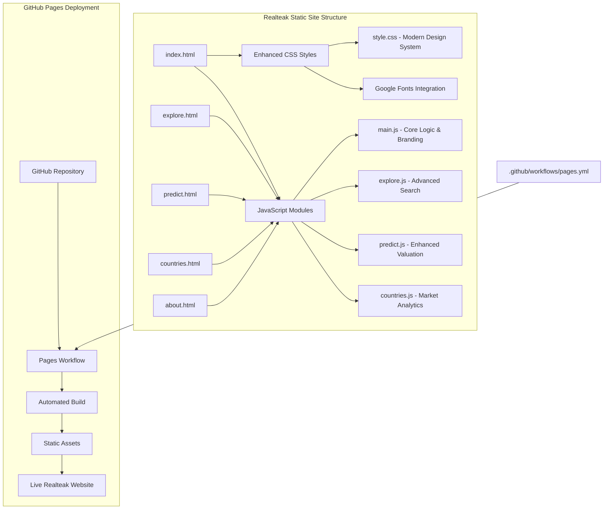
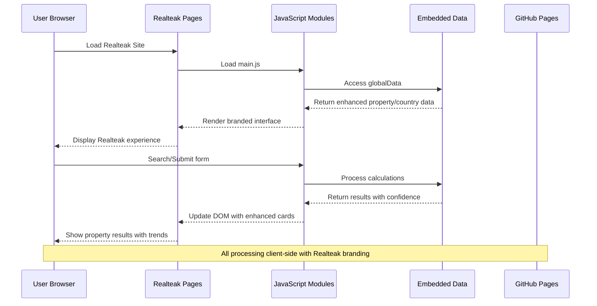
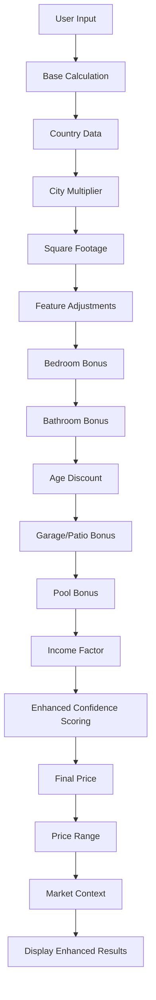
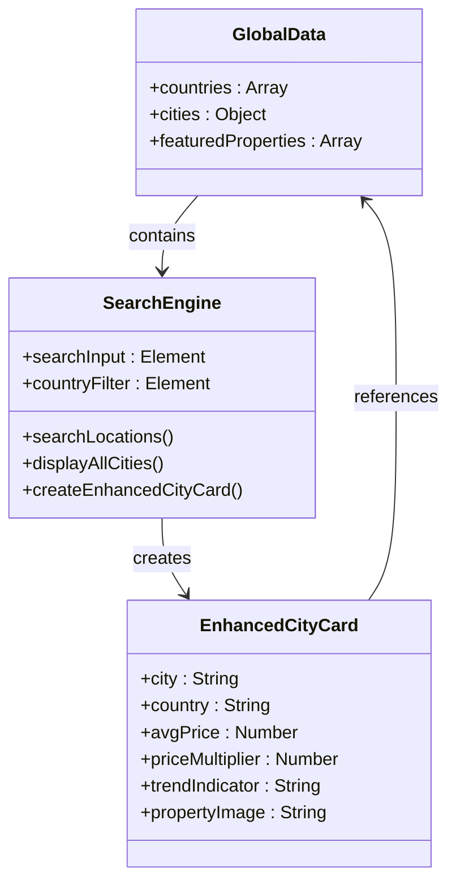
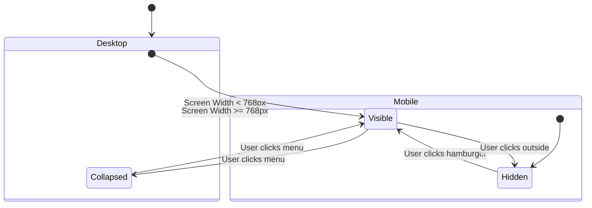
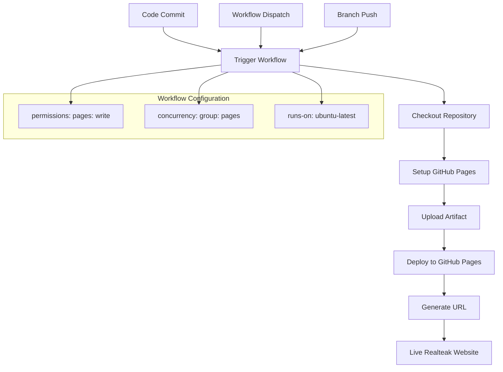

# Static Site Deployment

<cite>
**Referenced Files in This Document**
- [README.md](file://global-housing-static/README.md)
- [pages.yml](file://global-housing-static/.github/workflows/pages.yml)
- [index.html](file://global-housing-static/index.html)
- [explore.html](file://global-housing-static/explore.html)
- [predict.html](file://global-housing-static/predict.html)
- [countries.html](file://global-housing-static/countries.html)
- [about.html](file://global-housing-static/about.html)
- [main.js](file://global-housing-static/js/main.js)
- [explore.js](file://global-housing-static/js/explore.js)
- [predict.js](file://global-housing-static/js/predict.js)
- [countries.js](file://global-housing-static/js/countries.js)
- [style.css](file://global-housing-static/css/style.css)
</cite>

## Update Summary
**Changes Made**
- Updated project branding from "Global Housing Predictor" to "Realteak" throughout all documentation
- Added comprehensive documentation for new navigation structure (Buy, Sell, Rent, About Us, Contact)
- Documented enhanced hero section with integrated search functionality
- Added new color scheme documentation (#1a1a2e, #e8b923) and Google Fonts integration
- Updated property card design documentation with images and trend indicators
- Enhanced CSS framework documentation with new typography system
- Updated all file references and code examples to reflect Realteak branding

## Table of Contents
1. [Introduction](#introduction)
2. [Project Structure](#project-structure)
3. [Core Components](#core-components)
4. [Architecture Overview](#architecture-overview)
5. [Detailed Component Analysis](#detailed-component-analysis)
6. [Deployment Pipeline](#deployment-pipeline)
7. [Performance Considerations](#performance-considerations)
8. [Troubleshooting Guide](#troubleshooting-guide)
9. [Conclusion](#conclusion)

## Introduction

Realteak is a comprehensive, fully static, client-side real estate platform designed for seamless deployment on GitHub Pages. This project represents a complete rebranding from the previous Global Housing Predictor, featuring a sophisticated real estate marketplace with integrated property search, valuation tools, and market exploration capabilities.

The application provides advanced property price estimation across 20+ countries with enhanced market data, responsive design, automated deployment through GitHub Actions, and a modern rebranded user experience. Realteak serves as an excellent example of how to build and deploy sophisticated static web applications with enterprise-grade functionality.

**Updated** Complete rebranding from Global Housing Predictor to Realteak with enhanced navigation structure and modern design system

## Project Structure

The static site follows a modern, organized structure optimized for GitHub Pages deployment with Realteak's enhanced architecture:

**Diagram sources**
- [index.html:1-285](file://global-housing-static/index.html#L1-L285)
- [pages.yml:1-35](file://global-housing-static/.github/workflows/pages.yml#L1-L35)

**Section sources**
- [README.md:1-83](file://global-housing-static/README.md#L1-L83)
- [index.html:1-285](file://global-housing-static/index.html#L1-L285)

## Core Components

### Enhanced Navigation System
Realteak features a sophisticated four-tier navigation structure designed for real estate workflows:

- **Buy**: Primary navigation for property search and market exploration
- **Sell**: Property valuation and listing tools
- **Rent**: Rental market analysis and tenant resources
- **About Us**: Company information and methodology
- **Contact**: Support and inquiry management

### Modern Hero Section
The enhanced hero section includes integrated property search functionality with three-tier filtering:

- **Location Search**: Comprehensive city and country search
- **Property Type**: House, Apartment, Villa, Townhouse selection
- **Price Range**: $0-$100k, $100k-$500k, $500k+ options
- **Integrated Call-to-Action**: Streamlined property discovery

### Advanced Property Cards
Realteak introduces sophisticated property cards with:

- **High-quality property imagery**: Landscape and lifestyle photos
- **Trend indicators**: Upward/downward arrows with percentage changes
- **Property badges**: Featured listings and special offers
- **Enhanced metadata**: Detailed property specifications and pricing

### JavaScript Architecture
All functionality is contained within four specialized JavaScript modules:

- **main.js**: Enhanced shared functions, global data storage, currency formatting, DOM manipulation utilities, and Realteak branding
- **explore.js**: Advanced location search, filtering, and city listing functionality
- **predict.js**: Enhanced price calculation algorithm with confidence scoring and market comparison
- **countries.js**: Market analytics and country listing management

### Modern CSS Framework
The stylesheet provides comprehensive styling with Realteak's enhanced design system:

- **Color Scheme**: Deep blue (#1a1a2e) and gold (#e8b923) accent colors
- **Typography System**: Inter, Great Vibes, and Poppins font integration
- **Responsive Design**: Mobile-first approach with advanced breakpoint management
- **Custom CSS Variables**: Consistent theming across all components

**Section sources**
- [index.html:10-74](file://global-housing-static/index.html#L10-L74)
- [explore.html:10-29](file://global-housing-static/explore.html#L10-L29)
- [predict.html:10-29](file://global-housing-static/predict.html#L10-L29)
- [countries.html:10-25](file://global-housing-static/countries.html#L10-L25)
- [about.html:10-25](file://global-housing-static/about.html#L10-L25)

## Architecture Overview

The static site employs a modern client-side architecture pattern optimized for Realteak's sophisticated real estate platform:

**Diagram sources**
- [main.js:168-210](file://global-housing-static/js/main.js#L168-L210)
- [predict.js:46-122](file://global-housing-static/js/predict.js#L46-L122)
- [explore.js:1-107](file://global-housing-static/js/explore.js#L1-L107)

The architecture leverages several key principles:

### Enhanced Data Embedding Strategy
All market data is embedded directly in JavaScript files with Realteak's enhanced property dataset, eliminating external API calls while supporting sophisticated property analytics and trend calculations.

### Modular JavaScript Design
Each page loads only necessary JavaScript for its functionality, with enhanced modularity supporting Realteak's complex navigation and property presentation systems.

### Advanced Responsive Design Implementation
CSS media queries and flexible layouts ensure optimal viewing experience across all device sizes with Realteak's modern design system.

**Section sources**
- [main.js:19-133](file://global-housing-static/js/main.js#L19-L133)
- [style.css:1-734](file://global-housing-static/css/style.css#L1-L734)

## Detailed Component Analysis

### Enhanced Price Prediction Engine

The prediction algorithm combines multiple factors with Realteak's sophisticated confidence scoring:

**Diagram sources**
- [predict.js:46-113](file://global-housing-static/js/predict.js#L46-L113)

The calculation process incorporates:
- **Base Price**: Square footage × country average price × city multiplier
- **Feature Bonuses**: Bedrooms (+$10k each), Bathrooms (+$8k each), Garage (+$15k), Pool (+$25k)
- **Age Adjustment**: Progressive discount for older properties
- **Income Factor**: Local purchasing power adjustment
- **Enhanced Confidence Scoring**: Based on data availability and market maturity
- **Market Comparison**: Contextual analysis against local averages

### Advanced Search and Filtering System

The explore functionality provides comprehensive location-based search with Realteak's enhanced filtering:

**Diagram sources**
- [explore.js:20-59](file://global-housing-static/js/explore.js#L20-L59)
- [main.js:19-133](file://global-housing-static/js/main.js#L19-L133)

**Section sources**
- [predict.js:46-113](file://global-housing-static/js/predict.js#L46-L113)
- [explore.js:61-94](file://global-housing-static/js/explore.js#L61-L94)

### Modern Navigation System

The navigation component adapts seamlessly across device sizes with Realteak's enhanced branding:

**Diagram sources**
- [style.css:721-792](file://global-housing-static/css/style.css#L721-L792)
- [main.js:4-7](file://global-housing-static/js/main.js#L4-L7)

**Section sources**
- [style.css:59-128](file://global-housing-static/css/style.css#L59-L128)
- [main.js:4-17](file://global-housing-static/js/main.js#L4-L17)

## Deployment Pipeline

The GitHub Actions workflow automates the entire deployment process for Realteak:

**Diagram sources**
- [pages.yml:1-35](file://global-housing-static/.github/workflows/pages.yml#L1-L35)

### Deployment Configuration

The workflow includes several key security and performance features:

- **Permission Management**: Minimal required permissions (read for content, write for pages)
- **Concurrency Control**: Prevents conflicting deployments
- **Artifact Management**: Uploads entire repository as static assets
- **Environment Variables**: Automatic URL generation and environment configuration

**Section sources**
- [pages.yml:1-35](file://global-housing-static/.github/workflows/pages.yml#L1-L35)

## Performance Considerations

### Optimization Strategies

The static architecture inherently provides excellent performance characteristics with Realteak's enhanced optimizations:

- **Zero Server Costs**: No backend infrastructure required for Realteak's client-side operations
- **CDN Distribution**: GitHub Pages automatically serves content globally with enhanced caching
- **Minimal Dependencies**: Single HTML/CSS/JS files per page with optimized asset loading
- **Fast Load Times**: Embedded data eliminates network requests while supporting sophisticated property analytics

### Enhanced Bundle Size Management

Each page loads only necessary JavaScript with Realteak's optimized architecture:
- **Homepage**: Loads main.js for navigation, branding, and enhanced property cards
- **Explore Page**: Loads main.js + explore.js for advanced search and filtering
- **Predict Page**: Loads main.js + predict.js for enhanced valuation engine
- **Countries Page**: Loads main.js + countries.js for market analytics
- **About Page**: Loads main.js for shared functionality with Realteak branding

### Advanced Caching Strategy

Browser caching is optimized through:
- **Static Asset Delivery**: GitHub Pages handles efficient caching with Realteak's asset optimization
- **CSS Variable Usage**: Reduces repeated style calculations with enhanced theming
- **Minimal DOM Manipulation**: Efficient rendering with event delegation and enhanced property card management

## Troubleshooting Guide

### Common Deployment Issues

**Workflow Failures**
- Verify branch name matches workflow configuration (main/master)
- Check repository visibility settings
- Ensure proper permissions are granted

**Build Errors**
- Confirm all HTML files reference correct asset paths
- Validate JavaScript syntax in all modules
- Check CSS compilation if using preprocessors

**Content Not Updating**
- Clear browser cache or use incognito mode
- Verify GitHub Pages settings in repository configuration
- Check for workflow concurrency conflicts

### Development Debugging

**JavaScript Issues**
- Use browser developer tools to inspect console errors
- Verify globalData structure in main.js with Realteak's enhanced property dataset
- Test individual function calls in browser console

**Styling Problems**
- Check CSS specificity conflicts with Realteak's enhanced design system
- Verify responsive breakpoints with new typography and color scheme
- Test cross-browser compatibility with Google Fonts integration

**Section sources**
- [pages.yml:8-16](file://global-housing-static/.github/workflows/pages.yml#L8-L16)
- [README.md:24-34](file://global-housing-static/README.md#L24-L34)

## Conclusion

Realteak demonstrates a sophisticated approach to static site deployment that balances enterprise functionality with simplicity. By embedding all data and logic within client-side JavaScript with enhanced Realteak branding, the application achieves:

- **Zero Infrastructure Complexity**: No servers, databases, or backend services required for real estate platform
- **Excellent Performance**: Fast loading times through embedded data and CDN distribution with enhanced optimization
- **Automatic Updates**: Seamless deployment through GitHub Actions automation
- **Modern Branding**: Sophisticated rebranding with comprehensive navigation and design system
- **Cross-Platform Compatibility**: Responsive design works across all devices with Realteak's enhanced user experience
- **Cost-Effective Hosting**: Leverages GitHub Pages free tier with enterprise-grade functionality

This project serves as an excellent template for sophisticated static real estate applications, showcasing best practices in client-side architecture, modern design systems, comprehensive GitHub Actions pipelines, and enterprise-level rebranding strategies. The modular JavaScript structure and enhanced deployment workflow provide a solid foundation for future Realteak platform enhancements while maintaining the simplicity that makes static hosting so effective.