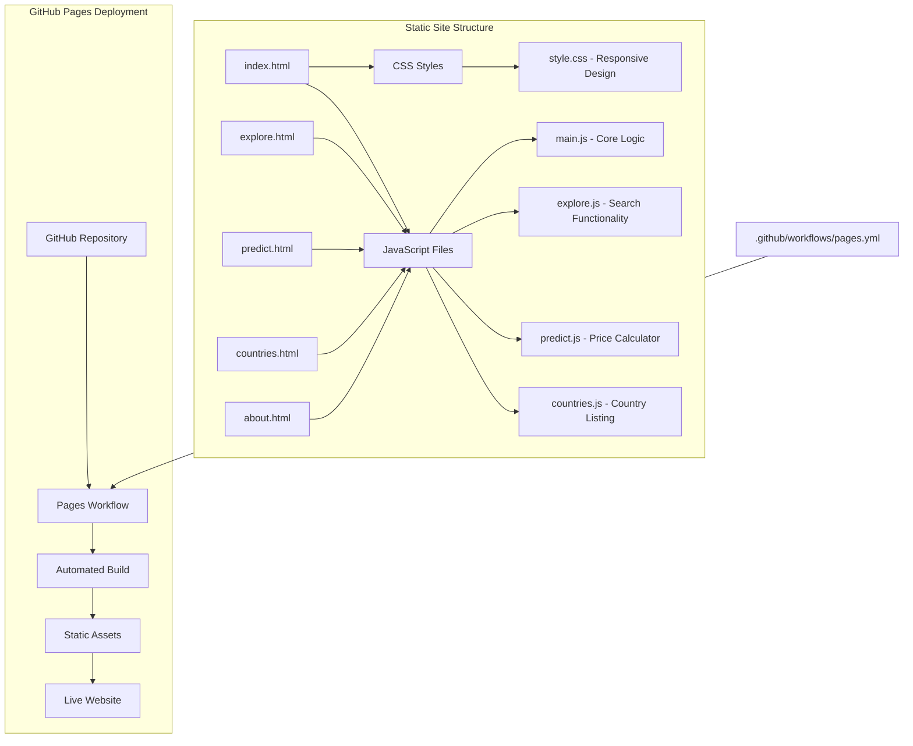
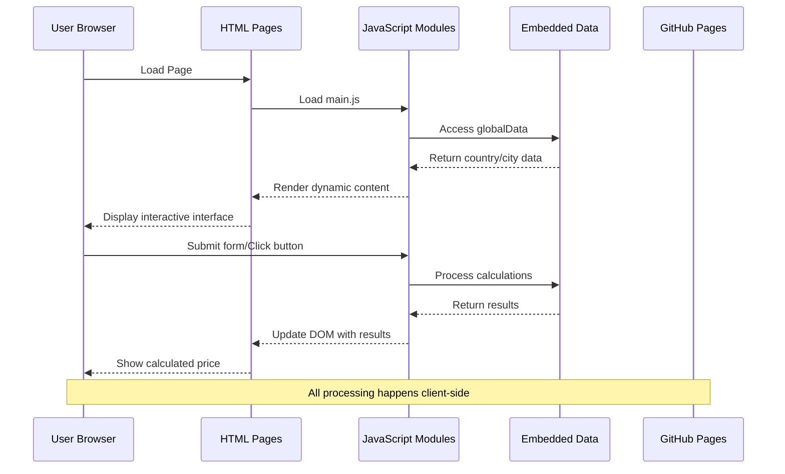
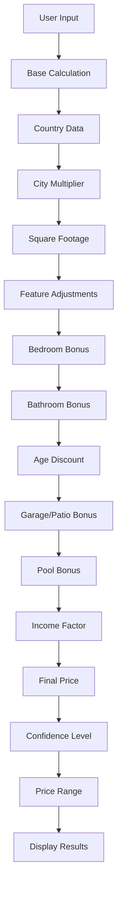
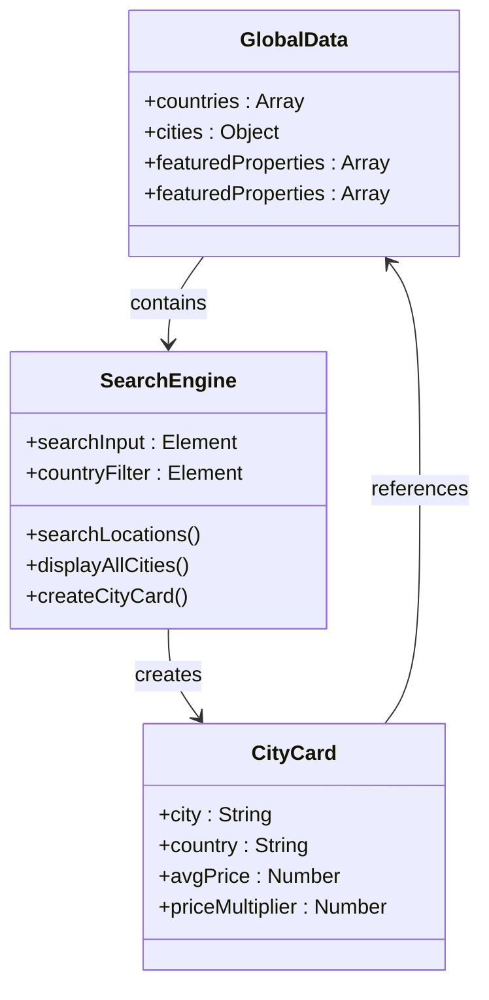
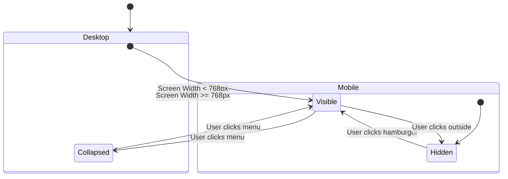
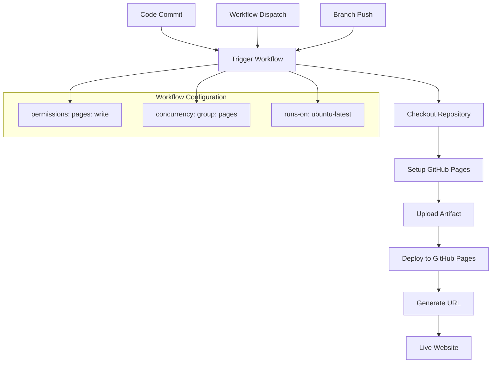

# Static Site Deployment

<cite>
**Referenced Files in This Document**
- [README.md](file://global-housing-static/README.md)
- [pages.yml](file://global-housing-static/.github/workflows/pages.yml)
- [index.html](file://global-housing-static/index.html)
- [explore.html](file://global-housing-static/explore.html)
- [predict.html](file://global-housing-static/predict.html)
- [countries.html](file://global-housing-static/countries.html)
- [about.html](file://global-housing-static/about.html)
- [main.js](file://global-housing-static/js/main.js)
- [explore.js](file://global-housing-static/js/explore.js)
- [predict.js](file://global-housing-static/js/predict.js)
- [countries.js](file://global-housing-static/js/countries.js)
- [style.css](file://global-housing-static/css/style.css)
</cite>

## Table of Contents
1. [Introduction](#introduction)
2. [Project Structure](#project-structure)
3. [Core Components](#core-components)
4. [Architecture Overview](#architecture-overview)
5. [Detailed Component Analysis](#detailed-component-analysis)
6. [Deployment Pipeline](#deployment-pipeline)
7. [Performance Considerations](#performance-considerations)
8. [Troubleshooting Guide](#troubleshooting-guide)
9. [Conclusion](#conclusion)

## Introduction

The Global Housing Predictor is a fully static, client-side real estate price prediction application designed for seamless deployment on GitHub Pages. This project demonstrates modern static site deployment practices using vanilla HTML, CSS, and JavaScript without requiring any backend infrastructure.

The application provides property price estimation capabilities across 20+ countries with embedded market data, responsive design, and automated deployment through GitHub Actions. It serves as an excellent example of how to build and deploy static web applications efficiently.

## Project Structure

The static site follows a clean, organized structure optimized for GitHub Pages deployment:

**Diagram sources**
- [index.html:1-230](file://global-housing-static/index.html#L1-L230)
- [pages.yml:1-35](file://global-housing-static/.github/workflows/pages.yml#L1-L35)

**Section sources**
- [README.md:35-53](file://global-housing-static/README.md#L35-L53)
- [index.html:1-230](file://global-housing-static/index.html#L1-L230)

## Core Components

### Static HTML Pages
The application consists of five primary HTML pages, each serving specific functionality:

- **index.html**: Homepage featuring hero section, statistics, featured properties, and call-to-action
- **explore.html**: City and country search interface with filtering capabilities
- **predict.html**: Interactive property price prediction calculator
- **countries.html**: Country listing with market statistics
- **about.html**: Methodology and data source information

### JavaScript Architecture
All functionality is contained within three specialized JavaScript modules:

- **main.js**: Contains shared functions, global data storage, currency formatting, and DOM manipulation utilities
- **explore.js**: Handles location search, filtering, and city listing functionality
- **predict.js**: Implements the price calculation algorithm and form handling
- **countries.js**: Manages country listing and navigation

### CSS Framework
The stylesheet provides comprehensive styling with responsive design principles, custom CSS variables for consistent theming, and mobile-first approach.

**Section sources**
- [index.html:1-230](file://global-housing-static/index.html#L1-L230)
- [explore.html:1-84](file://global-housing-static/explore.html#L1-L84)
- [predict.html:1-126](file://global-housing-static/predict.html#L1-L126)
- [countries.html:1-54](file://global-housing-static/countries.html#L1-L54)
- [about.html:1-128](file://global-housing-static/about.html#L1-L128)

## Architecture Overview

The static site employs a client-side architecture pattern that maximizes performance and minimizes server requirements:

**Diagram sources**
- [main.js:1-210](file://global-housing-static/js/main.js#L1-L210)
- [predict.js:1-122](file://global-housing-static/js/predict.js#L1-L122)
- [explore.js:1-107](file://global-housing-static/js/explore.js#L1-L107)

The architecture leverages several key principles:

### Data Embedding Strategy
All market data is embedded directly in JavaScript files, eliminating the need for external API calls or server-side processing. This approach ensures fast loading times and reliable operation.

### Modular JavaScript Design
Each page loads only the JavaScript necessary for its functionality, reducing bundle size and improving performance.

### Responsive Design Implementation
CSS media queries and flexible layouts ensure optimal viewing experience across all device sizes.

**Section sources**
- [main.js:20-133](file://global-housing-static/js/main.js#L20-L133)
- [style.css:1-806](file://global-housing-static/css/style.css#L1-L806)

## Detailed Component Analysis

### Price Prediction Engine

The prediction algorithm combines multiple factors to calculate property values:

**Diagram sources**
- [predict.js:46-113](file://global-housing-static/js/predict.js#L46-L113)

The calculation process incorporates:
- **Base Price**: Square footage × country average price × city multiplier
- **Feature Bonuses**: Bedrooms (+$10k each), Bathrooms (+$8k each), Garage (+$15k), Pool (+$25k)
- **Age Adjustment**: Progressive discount for older properties
- **Income Factor**: Local purchasing power adjustment
- **Confidence Scoring**: Based on data availability and market maturity

### Search and Filtering System

The explore functionality provides comprehensive location-based search:

**Diagram sources**
- [explore.js:20-59](file://global-housing-static/js/explore.js#L20-L59)
- [main.js:20-133](file://global-housing-static/js/main.js#L20-L133)

**Section sources**
- [predict.js:46-113](file://global-housing-static/js/predict.js#L46-L113)
- [explore.js:61-94](file://global-housing-static/js/explore.js#L61-L94)

### Responsive Navigation System

The navigation component adapts seamlessly across device sizes:

**Diagram sources**
- [style.css:721-792](file://global-housing-static/css/style.css#L721-L792)
- [main.js:4-7](file://global-housing-static/js/main.js#L4-L7)

**Section sources**
- [style.css:59-128](file://global-housing-static/css/style.css#L59-L128)
- [main.js:4-17](file://global-housing-static/js/main.js#L4-L17)

## Deployment Pipeline

The GitHub Actions workflow automates the entire deployment process:

**Diagram sources**
- [pages.yml:1-35](file://global-housing-static/.github/workflows/pages.yml#L1-L35)

### Deployment Configuration

The workflow includes several key security and performance features:

- **Permission Management**: Minimal required permissions (read for content, write for pages)
- **Concurrency Control**: Prevents conflicting deployments
- **Artifact Management**: Uploads entire repository as static assets
- **Environment Variables**: Automatic URL generation and environment configuration

**Section sources**
- [pages.yml:1-35](file://global-housing-static/.github/workflows/pages.yml#L1-L35)

## Performance Considerations

### Optimization Strategies

The static architecture inherently provides excellent performance characteristics:

- **Zero Server Costs**: No backend infrastructure required
- **CDN Distribution**: GitHub Pages automatically serves content globally
- **Minimal Dependencies**: Single HTML/CSS/JS files per page
- **Fast Load Times**: Embedded data eliminates network requests

### Bundle Size Management

Each page loads only necessary JavaScript:
- **Homepage**: Loads main.js for navigation and featured properties
- **Explore Page**: Loads main.js + explore.js for search functionality
- **Predict Page**: Loads main.js + predict.js for calculation engine
- **Countries Page**: Loads main.js + countries.js for listing
- **About Page**: Loads main.js for shared functionality

### Caching Strategy

Browser caching is optimized through:
- **Static Asset Delivery**: GitHub Pages handles efficient caching
- **CSS Variable Usage**: Reduces repeated style calculations
- **Minimal DOM Manipulation**: Efficient rendering with event delegation

## Troubleshooting Guide

### Common Deployment Issues

**Workflow Failures**
- Verify branch name matches workflow configuration (main/master)
- Check repository visibility settings
- Ensure proper permissions are granted

**Build Errors**
- Confirm all HTML files reference correct asset paths
- Validate JavaScript syntax in all modules
- Check CSS compilation if using preprocessors

**Content Not Updating**
- Clear browser cache or use incognito mode
- Verify GitHub Pages settings in repository configuration
- Check for workflow concurrency conflicts

### Development Debugging

**JavaScript Issues**
- Use browser developer tools to inspect console errors
- Verify globalData structure in main.js
- Test individual function calls in browser console

**Styling Problems**
- Check CSS specificity conflicts
- Verify responsive breakpoints
- Test cross-browser compatibility

**Section sources**
- [pages.yml:8-16](file://global-housing-static/.github/workflows/pages.yml#L8-L16)
- [README.md:24-34](file://global-housing-static/README.md#L24-L34)

## Conclusion

The Global Housing Predictor demonstrates a mature approach to static site deployment that balances functionality with simplicity. By embedding all data and logic within client-side JavaScript, the application achieves:

- **Zero Infrastructure Complexity**: No servers, databases, or backend services required
- **Excellent Performance**: Fast loading times through embedded data and CDN distribution
- **Automatic Updates**: Seamless deployment through GitHub Actions automation
- **Cross-Platform Compatibility**: Responsive design works across all devices
- **Cost-Effective Hosting**: Leverages GitHub Pages free tier

This project serves as an excellent template for similar static applications, showcasing best practices in client-side architecture, responsive design, and automated deployment workflows. The modular JavaScript structure and comprehensive GitHub Actions pipeline provide a solid foundation for future enhancements while maintaining the simplicity that makes static hosting so effective.