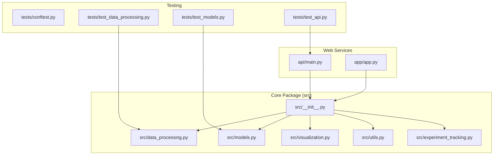
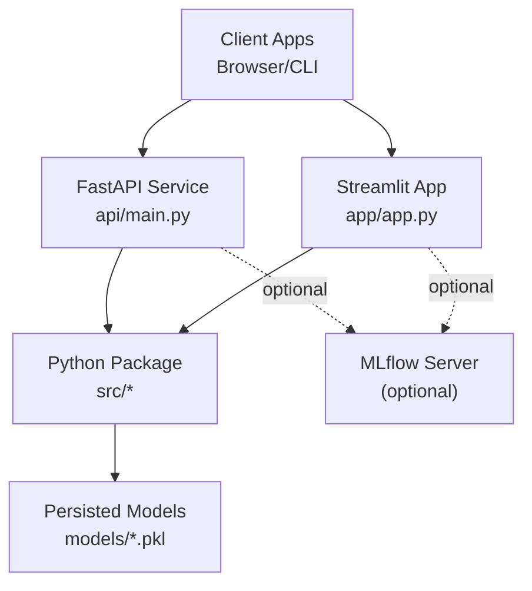
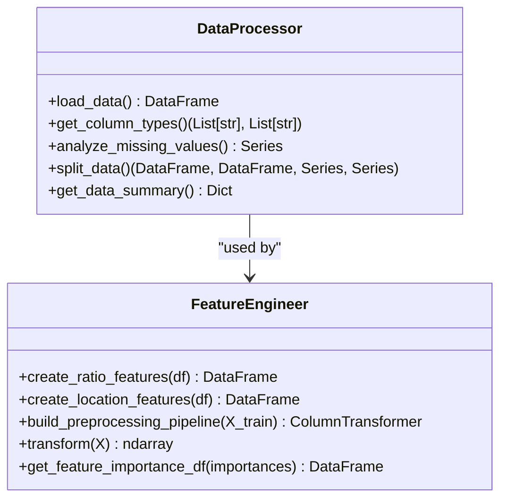
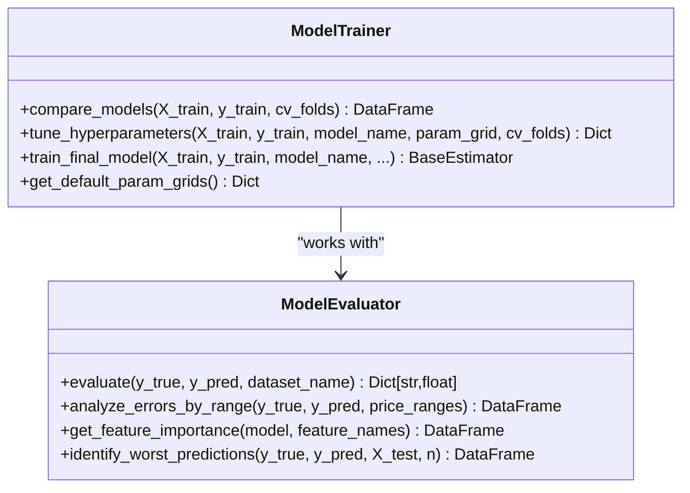
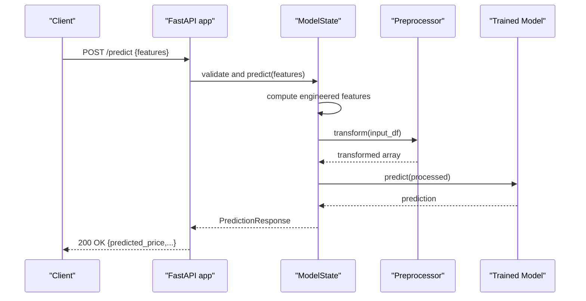
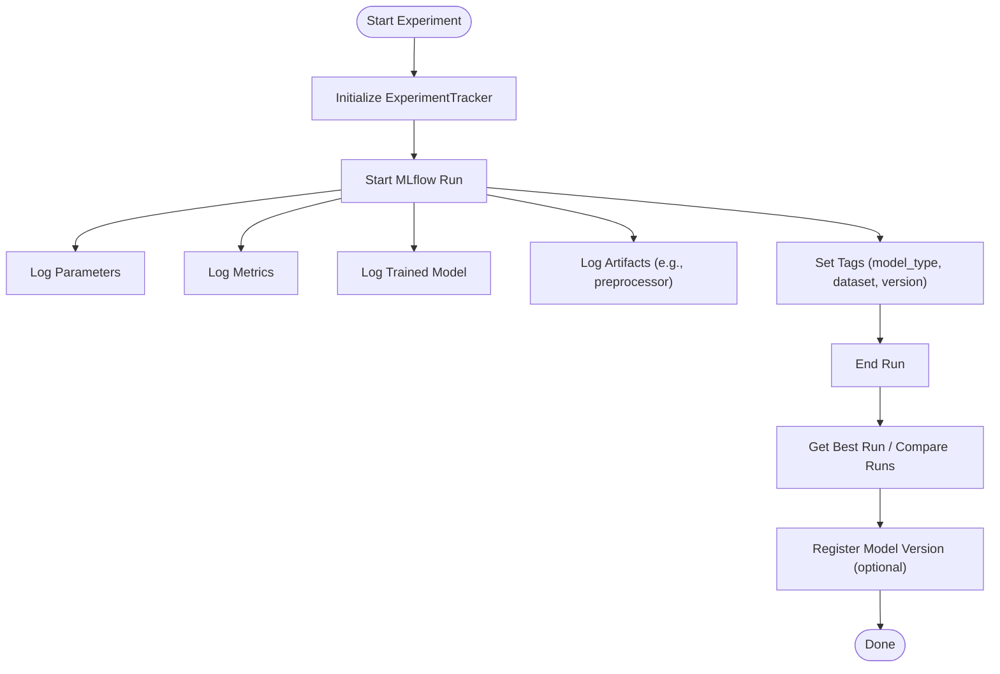
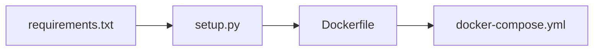

# Development Guidelines

<cite>
**Referenced Files in This Document**
- [CONTRIBUTING.md](file://CONTRIBUTING.md)
- [README.md](file://README.md)
- [requirements.txt](file://requirements.txt)
- [setup.py](file://setup.py)
- [Dockerfile](file://Dockerfile)
- [docker-compose.yml](file://docker-compose.yml)
- [src/__init__.py](file://src/__init__.py)
- [src/data_processing.py](file://src/data_processing.py)
- [src/models.py](file://src/models.py)
- [src/utils.py](file://src/utils.py)
- [src/experiment_tracking.py](file://src/experiment_tracking.py)
- [src/visualization.py](file://src/visualization.py)
- [api/main.py](file://api/main.py)
- [app/app.py](file://app/app.py)
- [tests/conftest.py](file://tests/conftest.py)
- [tests/test_data_processing.py](file://tests/test_data_processing.py)
- [tests/test_models.py](file://tests/test_models.py)
- [tests/test_api.py](file://tests/test_api.py)
</cite>

## Table of Contents
1. [Introduction](#introduction)
2. [Project Structure](#project-structure)
3. [Core Components](#core-components)
4. [Architecture Overview](#architecture-overview)
5. [Detailed Component Analysis](#detailed-component-analysis)
6. [Dependency Analysis](#dependency-analysis)
7. [Performance Considerations](#performance-considerations)
8. [Troubleshooting Guide](#troubleshooting-guide)
9. [Release and Versioning](#release-and-versioning)
10. [Conclusion](#conclusion)

## Introduction
This document consolidates the development guidelines for the project, covering coding standards, contribution processes, development best practices, code organization, architectural patterns, testing, documentation, debugging, performance, and release practices. It synthesizes the repository’s existing standards and recommended workflows to guide contributors and maintainers.

## Project Structure
The repository is organized into clear functional areas:
- api/: FastAPI application with endpoints and request/response models
- app/: Streamlit web application for interactive predictions
- src/: Core Python package with modules for data processing, modeling, visualization, utilities, and experiment tracking
- tests/: pytest test suites for data processing, models, and API
- data/, models/, notebooks/, reports/: supporting assets and artifacts
- docs/: documentation assets
- Top-level configuration: requirements.txt, setup.py, Dockerfile, docker-compose.yml, and contribution/README documentation

**Diagram sources**
- [src/__init__.py:14-26](file://src/__init__.py#L14-L26)
- [src/data_processing.py:22-341](file://src/data_processing.py#L22-L341)
- [src/models.py:30-366](file://src/models.py#L30-L366)
- [src/visualization.py:23-261](file://src/visualization.py#L23-L261)
- [src/utils.py:16-137](file://src/utils.py#L16-L137)
- [src/experiment_tracking.py:19-307](file://src/experiment_tracking.py#L19-L307)
- [api/main.py:126-184](file://api/main.py#L126-L184)
- [app/app.py:72-82](file://app/app.py#L72-L82)
- [tests/conftest.py:13-76](file://tests/conftest.py#L13-L76)
- [tests/test_data_processing.py:22-202](file://tests/test_data_processing.py#L22-L202)
- [tests/test_models.py:24-229](file://tests/test_models.py#L24-L229)
- [tests/test_api.py:27-199](file://tests/test_api.py#L27-L199)

**Section sources**
- [README.md:88-139](file://README.md#L88-L139)
- [src/__init__.py:14-26](file://src/__init__.py#L14-L26)

## Core Components
- Data Processing: DataProcessor and FeatureEngineer encapsulate data loading, validation, splitting, and preprocessing pipelines.
- Modeling: ModelTrainer compares models with cross-validation, tunes hyperparameters, and trains the final model; ModelEvaluator computes metrics and analyzes residuals.
- Visualization: EDAVisualizer and ModelVisualizer produce plots for exploratory analysis and evaluation.
- Utilities: Logging setup, model persistence, currency formatting, experiment directories, and metrics persistence.
- Experiment Tracking: ExperimentTracker integrates with MLflow for parameter, metric, and artifact logging, plus model registry integration.
- API: FastAPI application with Pydantic models, health checks, model info, single and batch prediction endpoints, and global model state management.
- Streamlit App: Interactive UI for predictions with map visualization and insights.

**Section sources**
- [src/data_processing.py:22-341](file://src/data_processing.py#L22-L341)
- [src/models.py:30-366](file://src/models.py#L30-L366)
- [src/visualization.py:23-261](file://src/visualization.py#L23-L261)
- [src/utils.py:16-137](file://src/utils.py#L16-L137)
- [src/experiment_tracking.py:19-307](file://src/experiment_tracking.py#L19-L307)
- [api/main.py:31-384](file://api/main.py#L31-L384)
- [app/app.py:72-399](file://app/app.py#L72-L399)

## Architecture Overview
The system comprises:
- A Python package (src) providing reusable components for data, modeling, visualization, utilities, and experiment tracking.
- A FastAPI service exposing REST endpoints for predictions and model metadata.
- A Streamlit application for interactive exploration and predictions.
- Docker images and compose orchestration for containerized deployment.

**Diagram sources**
- [api/main.py:201-231](file://api/main.py#L201-L231)
- [app/app.py:72-82](file://app/app.py#L72-L82)
- [docker-compose.yml:10-78](file://docker-compose.yml#L10-L78)
- [Dockerfile:53-66](file://Dockerfile#L53-L66)

## Detailed Component Analysis

### Data Processing and Feature Engineering
- DataProcessor: Loads CSV, validates presence, identifies column types, analyzes missing values, splits data with stratification, and summarizes statistics.
- FeatureEngineer: Creates ratio features, location-based features, builds preprocessing pipelines with scikit-learn ColumnTransformer and Pipelines, transforms data, and maps feature importances.

**Diagram sources**
- [src/data_processing.py:22-341](file://src/data_processing.py#L22-L341)

**Section sources**
- [src/data_processing.py:52-186](file://src/data_processing.py#L52-L186)
- [src/data_processing.py:202-341](file://src/data_processing.py#L202-L341)

### Model Training, Evaluation, and Persistence
- ModelTrainer: Compares multiple models with cross-validation, tunes hyperparameters with GridSearchCV, and trains the best model.
- ModelEvaluator: Computes RMSE, MAE, MAPE, R², analyzes residuals, extracts feature importance, and identifies worst predictions.
- Persistence: save_model/load_model utilities for joblib serialization.

**Diagram sources**
- [src/models.py:30-366](file://src/models.py#L30-L366)

**Section sources**
- [src/models.py:54-206](file://src/models.py#L54-L206)
- [src/models.py:224-351](file://src/models.py#L224-L351)

### API Endpoints and Validation
- Pydantic models define strict input validation for prediction requests and enforce constraints (e.g., rooms ≥ bedrooms, households ≤ population).
- Endpoints include root, health, model info, single prediction, and batch prediction.
- Global model state loads persisted model and preprocessor at startup.

**Diagram sources**
- [api/main.py:31-180](file://api/main.py#L31-L180)
- [api/main.py:290-348](file://api/main.py#L290-L348)

**Section sources**
- [api/main.py:31-121](file://api/main.py#L31-L121)
- [api/main.py:290-384](file://api/main.py#L290-L384)

### Experiment Tracking with MLflow
- ExperimentTracker wraps MLflow lifecycle: start/end run, log params/metrics/artifacts, compare runs, and register model versions.
- Convenience function tracks a complete experiment and logs model and preprocessor artifacts.

**Diagram sources**
- [src/experiment_tracking.py:19-307](file://src/experiment_tracking.py#L19-L307)

**Section sources**
- [src/experiment_tracking.py:53-164](file://src/experiment_tracking.py#L53-L164)
- [src/experiment_tracking.py:254-307](file://src/experiment_tracking.py#L254-L307)

## Dependency Analysis
- Core runtime dependencies are declared in requirements.txt.
- Package metadata and extras are defined in setup.py, including dev and docs extras.
- Dockerfile defines a multi-stage build with builder and production stages, copying dependencies and application code, and setting non-root user and health checks.
- docker-compose orchestrates API, Streamlit, optional MLflow, and optional Jupyter services.

**Diagram sources**
- [requirements.txt:1-36](file://requirements.txt#L1-L36)
- [setup.py:12-72](file://setup.py#L12-L72)
- [Dockerfile:26-68](file://Dockerfile#L26-L68)
- [docker-compose.yml:10-108](file://docker-compose.yml#L10-L108)

**Section sources**
- [requirements.txt:1-36](file://requirements.txt#L1-L36)
- [setup.py:48-72](file://setup.py#L48-L72)
- [Dockerfile:5-86](file://Dockerfile#L5-L86)
- [docker-compose.yml:1-109](file://docker-compose.yml#L1-L109)

## Performance Considerations
- Use cross-validation and appropriate metrics to avoid overfitting and ensure robust evaluation.
- Prefer pipelines with imputation and scaling to handle missing data and heterogeneous scales.
- Monitor memory usage during transformations and leverage joblib for efficient serialization.
- Containerize services with health checks and non-root users for production stability.
- Keep Docker layers minimal and separate dev/test dependencies from production runtime.

[No sources needed since this section provides general guidance]

## Troubleshooting Guide
Common issues and remedies:
- Model not loaded in API: Ensure models directory contains required artifacts and the service starts with model_state.load().
- Validation errors on API: Confirm input ranges and enums match Pydantic constraints.
- Test failures: Use pytest fixtures to generate valid synthetic data and mock model behavior where appropriate.
- Docker health checks: Verify ports, environment variables, and mounted volumes for models/data/logs.

**Section sources**
- [api/main.py:135-180](file://api/main.py#L135-L180)
- [tests/test_api.py:89-148](file://tests/test_api.py#L89-L148)
- [docker-compose.yml:26-31](file://docker-compose.yml#L26-L31)

## Release and Versioning
- Versioning: The package declares version 1.0.0 in setup.py and README.
- Changelog: Maintain a changelog file (not present in the repository) to record breaking changes, features, fixes, and migration notes per release.
- Packaging: Use setup.py to publish the package; ensure extras (dev/docs) are documented for contributors and documentation builders.
- Docker tagging: Tag images with semantic versions and keep a latest tag only for stable releases.

**Section sources**
- [setup.py:24-24](file://setup.py#L24-L24)
- [README.md:389-392](file://README.md#L389-L392)

## Coding Standards and Best Practices

### Code Organization Principles
- Modular package structure: src contains cohesive modules (data_processing, models, visualization, utils, experiment_tracking).
- Public API surface: src/__init__.py exports key classes/functions to simplify imports.
- Feature-based separation: api/ and app/ isolate web service concerns from core logic.

**Section sources**
- [src/__init__.py:14-26](file://src/__init__.py#L14-L26)
- [README.md:88-139](file://README.md#L88-L139)

### Naming Conventions
- Classes: PascalCase (e.g., DataProcessor, ModelTrainer).
- Functions: snake_case (e.g., save_model, load_model).
- Constants: UPPER_SNAKE_CASE (e.g., VERSION strings).
- Variables: camelCase or snake_case as appropriate (prefer snake_case for clarity).

**Section sources**
- [src/data_processing.py:22-341](file://src/data_processing.py#L22-L341)
- [src/models.py:30-366](file://src/models.py#L30-L366)
- [src/utils.py:58-98](file://src/utils.py#L58-L98)

### Architectural Patterns
- Pipeline pattern: FeatureEngineer composes preprocessing steps.
- Strategy pattern: ModelTrainer supports multiple model types and hyperparameter grids.
- Facade pattern: ExperimentTracker simplifies MLflow interactions.
- Singleton-like global state: ModelState holds loaded model and preprocessor in API.

**Section sources**
- [src/data_processing.py:257-306](file://src/data_processing.py#L257-L306)
- [src/models.py:179-206](file://src/models.py#L179-L206)
- [src/experiment_tracking.py:19-52](file://src/experiment_tracking.py#L19-L52)
- [api/main.py:126-184](file://api/main.py#L126-L184)

### Development Workflow
- Branching: Use feature branches prefixed with feature/.
- Commit messages: Follow conventional commits (feat:, fix:, docs:, style:, refactor:, test:, chore:).
- Code style: Enforce PEP 8; use black and flake8 for formatting and linting.
- Testing: Write unit tests; aim for high coverage; use pytest fixtures for reusable data.
- Pull requests: Include tests, documentation updates, and rationale.

**Section sources**
- [CONTRIBUTING.md:24-87](file://CONTRIBUTING.md#L24-L87)
- [CONTRIBUTING.md:61-79](file://CONTRIBUTING.md#L61-L79)

### Adding New Features and Extending Functionality
- Extend src modules with new classes/functions while preserving existing APIs.
- Add tests in tests/ for new behavior; reuse fixtures from tests/conftest.py.
- Update src/__init__.py exports if exposing new public APIs.
- For API changes, update Pydantic models and endpoints in api/main.py; add tests in tests/test_api.py.

**Section sources**
- [src/__init__.py:14-26](file://src/__init__.py#L14-L26)
- [tests/conftest.py:13-76](file://tests/conftest.py#L13-L76)
- [tests/test_data_processing.py:22-202](file://tests/test_data_processing.py#L22-L202)
- [tests/test_models.py:24-229](file://tests/test_models.py#L24-L229)
- [tests/test_api.py:27-199](file://tests/test_api.py#L27-L199)
- [api/main.py:31-121](file://api/main.py#L31-L121)

### Backward Compatibility
- Avoid changing method signatures or removing exported names from src/__init__.py without a major version bump.
- Maintain stable API endpoints; deprecate old endpoints gracefully and document migration steps.
- Preserve model persistence formats and metadata keys to ensure saved models remain loadable.

**Section sources**
- [src/__init__.py:18-26](file://src/__init__.py#L18-L26)
- [src/utils.py:58-98](file://src/utils.py#L58-L98)

### Documentation Requirements
- Docstrings: Include docstrings for new functions and classes.
- API docs: Update README and endpoint docs when changing API behavior.
- Examples: Provide usage examples in tests or notebooks where helpful.

**Section sources**
- [CONTRIBUTING.md:88-94](file://CONTRIBUTING.md#L88-L94)

### Code Review Procedures
- Include tests and documentation updates in every PR.
- Ensure code style passes black/flake8.
- Verify CI passes and coverage remains acceptable.

**Section sources**
- [CONTRIBUTING.md:31-46](file://CONTRIBUTING.md#L31-L46)
- [README.md:360-372](file://README.md#L360-L372)

### Debugging and Profiling
- Logging: Use structured logging with timestamps and levels; configure via setup_logging.
- API error handling: Centralized exception handler returns standardized error responses.
- Profiling: Use Python profiling tools to identify bottlenecks in data processing and model training.

**Section sources**
- [src/utils.py:16-56](file://src/utils.py#L16-L56)
- [api/main.py:390-398](file://api/main.py#L390-L398)

### Dependency Management
- Runtime dependencies: Pin compatible versions in requirements.txt.
- Development dependencies: Use setup.py extras (dev/docs) for contributors.
- Containerization: Install dependencies in Dockerfile builder stage and copy artifacts to production stage.

**Section sources**
- [requirements.txt:1-36](file://requirements.txt#L1-L36)
- [setup.py:48-60](file://setup.py#L48-L60)
- [Dockerfile:26-37](file://Dockerfile#L26-L37)

## Conclusion
These guidelines consolidate the repository’s established practices for development, testing, packaging, deployment, and collaboration. By adhering to these standards—modular organization, strong validation, comprehensive testing, clear documentation, and disciplined workflows—contributors can reliably extend the system while maintaining quality and compatibility.