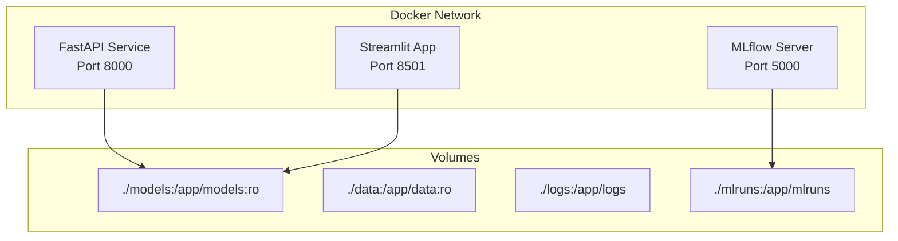
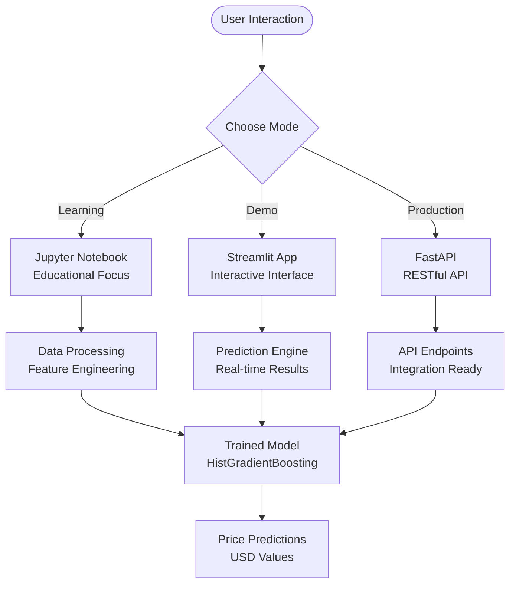

# Getting Started

<cite>
**Referenced Files in This Document**
- [README.md](file://README.md)
- [requirements.txt](file://requirements.txt)
- [Dockerfile](file://Dockerfile)
- [docker-compose.yml](file://docker-compose.yml)
- [setup.py](file://setup.py)
- [api/main.py](file://api/main.py)
- [app/app.py](file://app/app.py)
- [train_model_for_web.py](file://train_model_for_web.py)
- [api/requirements.txt](file://api/requirements.txt)
- [app/requirements.txt](file://app/requirements.txt)
- [src/__init__.py](file://src/__init__.py)
- [data/README.md](file://data/README.md)
</cite>

## Table of Contents
1. [Introduction](#introduction)
2. [Prerequisites](#prerequisites)
3. [Installation Methods](#installation-methods)
4. [Manual Setup](#manual-setup)
5. [Docker Deployment](#docker-deployment)
6. [Model Training](#model-training)
7. [Learning Path](#learning-path)
8. [Usage Modes](#usage-modes)
9. [Quick Verification](#quick-verification)
10. [Troubleshooting Guide](#troubleshooting-guide)
11. [Conclusion](#conclusion)

## Introduction

The California House Price Prediction system is a comprehensive machine learning solution designed to predict median house values in California using advanced regression techniques. This project demonstrates industry best practices including end-to-end machine learning workflows, production-ready deployment, and interactive web applications.

The system provides three primary usage modes:
- **Jupyter Notebook**: Interactive learning environment with detailed explanations
- **Streamlit Web App**: Interactive web interface for real-time predictions
- **FastAPI**: Production-ready REST API for integration

## Prerequisites

Before installing the housing price prediction system, ensure you have the following prerequisites:

### Python Environment
- **Python 3.8 or higher** - The project requires Python 3.8+ for compatibility with modern libraries
- **pip or conda** - Package manager for dependency installation
- **Git** - Version control system for cloning the repository

### Operating System Compatibility
The system supports:
- **Windows**: Tested with Windows 10/11
- **macOS**: Tested with macOS 10.15+
- **Linux**: Tested with Ubuntu 18.04+

### Hardware Requirements
- **Minimum RAM**: 4GB (recommended 8GB+)
- **Disk Space**: 2GB available space
- **Internet Connection**: Required for downloading dependencies

**Section sources**
- [README.md:145-149](file://README.md#L145-L149)

## Installation Methods

The system can be installed using two primary methods:

### Method 1: Manual Installation
Direct installation using pip with virtual environments

### Method 2: Docker Deployment
Containerized deployment using Docker Compose for production environments

Both methods provide identical functionality and will result in the same working system.

## Manual Setup

Follow these step-by-step instructions to set up the system manually:

### Step 1: Clone the Repository
```bash
git clone https://github.com/tashkirrr/housing-price-prediction.git
cd housing-price-prediction
```

### Step 2: Create Virtual Environment
```bash
# Using venv (recommended)
python -m venv venv

# Activate on Windows
venv\Scripts\activate

# Activate on macOS/Linux
source venv/bin/activate
```

### Step 3: Install Dependencies
```bash
pip install -r requirements.txt
```

### Step 4: Verify Installation
```bash
python -c "import sklearn, pandas, numpy, streamlit, fastapi"
```

**Section sources**
- [README.md:151-180](file://README.md#L151-L180)
- [requirements.txt:1-36](file://requirements.txt#L1-L36)

## Docker Deployment

The Docker deployment provides a production-ready containerized environment:

### Option A: Docker Compose (Recommended)
```bash
# Build and start all services
docker-compose up --build

# Access services:
# FastAPI: http://localhost:8000
# Streamlit: http://localhost:8501
# MLflow: http://localhost:5000 (optional)
```

### Option B: Manual Docker Commands
```bash
# Build the image
docker build -t housing-price-prediction .

# Run with port mapping
docker run -p 8000:8000 -p 8501:8501 housing-price-prediction
```

### Docker Architecture


**Diagram sources**
- [docker-compose.yml:6-109](file://docker-compose.yml#L6-L109)
- [Dockerfile:1-86](file://Dockerfile#L1-L86)

**Section sources**
- [README.md:182-191](file://README.md#L182-L191)
- [docker-compose.yml:1-109](file://docker-compose.yml#L1-L109)
- [Dockerfile:1-86](file://Dockerfile#L1-L86)

## Model Training

The system includes pre-trained models, but you can also train new models:

### Training Process
```bash
# Train the model using the training script
python train_model_for_web.py

# Or use the Jupyter notebook for interactive learning
jupyter notebook notebooks/01_end_to_end_house_price_prediction.ipynb
```

### Training Output
The training process creates:
- **Trained Model**: `models/house_price_model.pkl`
- **Preprocessor**: `models/preprocessor.pkl`
- **Web Model Data**: `docs/model_data.json`
- **Simplified Model**: `docs/web_model.json`

### Training Dependencies
The training script requires:
- **scikit-learn>=1.3.0** for machine learning algorithms
- **pandas>=2.0.0** for data manipulation
- **numpy>=1.24.0** for numerical computations

**Section sources**
- [train_model_for_web.py:1-196](file://train_model_for_web.py#L1-L196)
- [README.md:176-180](file://README.md#L176-L180)

## Learning Path

The recommended learning progression starts with the Jupyter notebook tutorial:

### Phase 1: Jupyter Notebook Tutorial
**Primary Learning Resource**: `notebooks/01_end_to_end_house_price_prediction.ipynb`

**What You'll Learn**:
- Complete ML workflow from data loading to model deployment
- Feature engineering techniques and best practices
- Model comparison methodologies
- Hyperparameter tuning strategies
- Cross-validation and evaluation techniques
- Production deployment considerations

### Phase 2: Streamlit Web App
**Interactive Learning**: `streamlit run app/app.py`

**Features**:
- Real-time property value predictions
- Interactive visualizations
- Geographic mapping capabilities
- Model insights and explanations

### Phase 3: FastAPI Integration
**Production Ready**: `uvicorn api.main:app --reload`

**API Capabilities**:
- RESTful endpoints for predictions
- Batch processing capabilities
- Health checks and monitoring
- Comprehensive error handling

**Section sources**
- [README.md:197-287](file://README.md#L197-L287)

## Usage Modes

The system operates in three distinct modes, each serving different use cases:

### Mode 1: Jupyter Notebook (Learning)
Perfect for educational purposes and experimentation:
- **Command**: `jupyter notebook notebooks/01_end_to_end_house_price_prediction.ipynb`
- **Best For**: Learning ML concepts, experimenting with features
- **Features**: Step-by-step explanations, interactive code execution

### Mode 2: Streamlit Web App (Interactive)
Ideal for demonstrations and user interaction:
- **Command**: `streamlit run app/app.py`
- **Access**: Open `http://localhost:8501`
- **Features**: Real-time predictions, geographic visualization, user-friendly interface

### Mode 3: FastAPI (Production)
Designed for integration and automation:
- **Command**: `uvicorn api.main:app --reload`
- **Access**: API available at `http://localhost:8000`
- **Features**: RESTful endpoints, batch processing, production monitoring



**Section sources**
- [README.md:195-287](file://README.md#L195-L287)

## Quick Verification

After installation, verify your setup with these quick checks:

### Basic Verification
```bash
# Check Python version
python --version

# Verify dependencies
pip list | grep -E "(scikit-learn|pandas|numpy|streamlit|fastapi)"

# Test model loading
python -c "import joblib; model = joblib.load('models/house_price_model.pkl')"
```

### Service Verification
```bash
# Test FastAPI
curl http://localhost:8000/health

# Test Streamlit (if running)
curl http://localhost:8501/health
```

### Expected Outputs
- **Python**: Should display version 3.8 or higher
- **Dependencies**: All required packages should be installed
- **Model**: Should load without errors
- **API**: Should return health status

**Section sources**
- [README.md:145-191](file://README.md#L145-L191)

## Troubleshooting Guide

Common installation and setup issues with solutions:

### Issue 1: Python Version Problems
**Problem**: Python version incompatible with requirements
**Solution**: 
- Upgrade to Python 3.8+
- Use `python3.8` or `python3.11` explicitly
- Verify with `python --version`

### Issue 2: Virtual Environment Activation Failures
**Windows**:
```cmd
# Use full path
C:\path\to\your\project\venv\Scripts\activate
```

**macOS/Linux**:
```bash
# Check permissions
chmod +x venv/bin/activate
source venv/bin/activate
```

### Issue 3: Permission Denied Errors
**Solution**:
```bash
# Grant permissions
chmod +x venv/bin/*
chmod +x venv/Scripts/*

# On Linux/macOS, use sudo if necessary
sudo chmod +x venv/bin/*
```

### Issue 4: Port Conflicts
**Problem**: Ports 8000 or 8501 already in use
**Solution**:
```bash
# Change ports in docker-compose.yml
# Or kill existing processes
lsof -i :8000
kill -9 $(lsof -t -i :8000)
```

### Issue 5: Model Loading Issues
**Problem**: Missing model files
**Solution**:
```bash
# Train the model first
python train_model_for_web.py

# Verify files exist
ls models/
ls -la models/
```

### Issue 6: Docker Build Failures
**Problem**: Docker build errors
**Solution**:
```bash
# Clear Docker cache
docker system prune -a

# Rebuild with no cache
docker-compose build --no-cache

# Check Docker version
docker --version
```

### Issue 7: Memory Issues
**Problem**: Insufficient memory during training
**Solution**:
```bash
# Reduce training data size
# Increase swap space
# Close other applications
```

### Platform-Specific Solutions

**Windows Users**:
- Use PowerShell instead of Command Prompt
- Enable Developer Mode for better file handling
- Consider using WSL2 for Linux-like environment

**macOS Users**:
- Install Xcode Command Line Tools
- Use Homebrew for package management
- Check Gatekeeper settings if executables blocked

**Linux Users**:
- Install build essentials: `sudo apt-get install build-essential`
- Ensure sufficient swap space
- Check firewall settings for port access

**Section sources**
- [README.md:145-191](file://README.md#L145-L191)
- [Dockerfile:1-86](file://Dockerfile#L1-L86)
- [docker-compose.yml:1-109](file://docker-compose.yml#L1-L109)

## Conclusion

The California House Price Prediction system provides a comprehensive foundation for machine learning practitioners and beginners alike. With its three usage modes, the system accommodates different learning styles and deployment requirements.

**Key Benefits**:
- **Complete Learning Experience**: From basic concepts to production deployment
- **Flexible Deployment**: Choose between learning, demonstration, or production use
- **Production Ready**: Built-in monitoring, error handling, and scalability
- **Well Documented**: Comprehensive tutorials and API documentation

**Next Steps**:
1. Start with the Jupyter notebook for hands-on learning
2. Explore the Streamlit app for interactive demonstrations
3. Integrate the FastAPI for production applications
4. Customize and extend the system for your specific needs

The system's modular architecture ensures easy maintenance and future enhancements while maintaining backward compatibility.