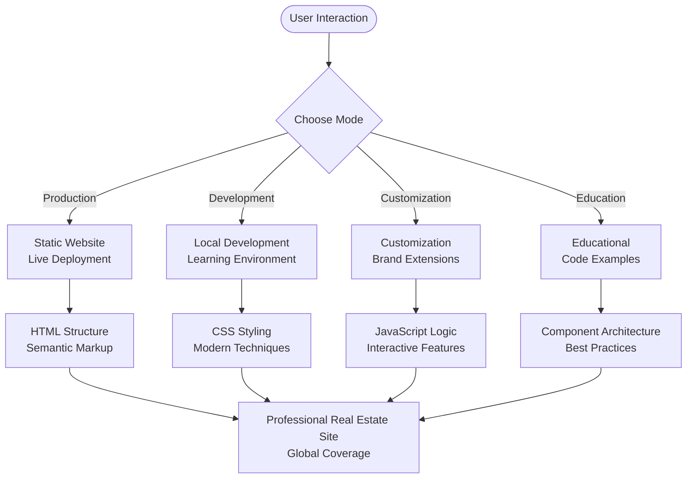

# Getting Started

<cite>
**Referenced Files in This Document**
- [README.md](file://README.md)
- [global-housing-static/README.md](file://global-housing-static/README.md)
- [global-housing-static/.github/workflows/pages.yml](file://global-housing-static/.github/workflows/pages.yml)
- [global-housing-static/deploy.ps1](file://global-housing-static/deploy.ps1)
- [global-housing-static/index.html](file://global-housing-static/index.html)
- [global-housing-static/explore.html](file://global-housing-static/explore.html)
- [global-housing-static/predict.html](file://global-housing-static/predict.html)
- [global-housing-static/about.html](file://global-housing-static/about.html)
- [global-housing-static/countries.html](file://global-housing-static/countries.html)
- [global-housing-static/css/style.css](file://global-housing-static/css/style.css)
- [global-housing-static/js/main.js](file://global-housing-static/js/main.js)
- [global-housing-static/js/explore.js](file://global-housing-static/js/explore.js)
- [global-housing-static/js/predict.js](file://global-housing-static/js/predict.js)
- [global-housing-static/js/countries.js](file://global-housing-static/js/countries.js)
</cite>

## Update Summary
**Changes Made**
- Completely restructured from Python-based machine learning system to static website architecture
- Removed all Python-specific installation steps and dependencies
- Added comprehensive GitHub Pages deployment instructions
- Updated learning path to focus on HTML/CSS/JavaScript development
- Replaced machine learning components with static web application components
- Updated all technical requirements to reflect pure frontend technology stack

## Table of Contents
1. [Introduction](#introduction)
2. [Prerequisites](#prerequisites)
3. [Installation Methods](#installation-methods)
4. [Manual Setup](#manual-setup)
5. [GitHub Pages Deployment](#github-pages-deployment)
6. [Static Website Architecture](#static-website-architecture)
7. [Learning Path](#learning-path)
8. [Usage Modes](#usage-modes)
9. [Quick Verification](#quick-verification)
10. [Troubleshooting Guide](#troubleshooting-guide)
11. [Conclusion](#conclusion)

## Introduction

The Realteak Global Real Estate Price Predictor is a modern, professional real estate website built with pure HTML, CSS, and JavaScript for easy deployment on GitHub Pages. This static website provides property price prediction capabilities across 50+ countries worldwide with a responsive design optimized for desktop, tablet, and mobile devices.

The website offers four primary usage modes:
- **Static Website**: Pure HTML/CSS/JavaScript implementation with client-side calculations
- **GitHub Pages**: Automated deployment through GitHub Actions
- **Customization**: Easy modification of design, content, and functionality
- **Global Coverage**: Real-time property price estimation across international markets

**Section sources**
- [README.md:1-170](file://README.md#L1-L170)
- [global-housing-static/README.md:1-170](file://global-housing-static/README.md#L1-L170)

## Prerequisites

Before installing the Realteak static website, ensure you have the following prerequisites:

### Development Environment
- **Git**: Version control system for cloning and deploying the repository
- **Text Editor**: VS Code, Sublime Text, or any HTML/CSS/JavaScript editor
- **Web Browser**: Modern browser for testing and development
- **Node.js**: Optional, for local development server (npm install -g http-server)

### Operating System Compatibility
The system supports:
- **Windows**: Tested with Windows 10/11
- **macOS**: Tested with macOS 10.15+
- **Linux**: Tested with Ubuntu 18.04+

### Technical Requirements
- **HTML5**: Semantic markup and modern web standards
- **CSS3**: Modern styling with CSS variables and Flexbox/Grid
- **JavaScript**: Vanilla JS ES6+ features, no external frameworks
- **GitHub Account**: For hosting on GitHub Pages
- **Basic Understanding**: HTML/CSS/JavaScript fundamentals

**Section sources**
- [README.md:147-153](file://README.md#L147-L153)
- [global-housing-static/README.md:147-153](file://global-housing-static/README.md#L147-L153)

## Installation Methods

The Realteak website can be deployed using three primary methods:

### Method 1: Manual Upload (Simplest)
Direct file upload to GitHub repository

### Method 2: Git Commands (Recommended)
Command-line deployment with version control

### Method 3: PowerShell Script (Automated)
Automated deployment using provided PowerShell script

All methods provide identical functionality and will result in a fully functional static website.

## Manual Setup

Follow these step-by-step instructions to deploy the Realteak website manually:

### Step 1: Clone the Repository
```bash
git clone https://github.com/tashkirrr/housing-price-prediction.git
cd housing-price-prediction
```

### Step 2: Replace with Static Files
```bash
# Copy all files from global-housing-static to root
cp -r global-housing-static/* .
```

### Step 3: Verify File Structure
Ensure your repository contains:
```
├── index.html
├── explore.html
├── predict.html
├── countries.html
├── about.html
├── css/
│   └── style.css
├── js/
│   ├── main.js
│   ├── explore.js
│   ├── predict.js
│   └── countries.js
└── README.md
```

### Step 4: Test Locally
```bash
# Install http-server globally (optional)
npm install -g http-server

# Start local server
http-server

# Open browser to http://localhost:8080
```

**Section sources**
- [README.md:77-91](file://README.md#L77-L91)
- [global-housing-static/README.md:77-91](file://global-housing-static/README.md#L77-L91)

## GitHub Pages Deployment

The Realteak website provides three automated deployment methods to GitHub Pages:

### Method 1: Manual Upload
1. Go to your GitHub repository
2. Click **"Add file"** → **"Upload files"**
3. Upload all files from the global-housing-static folder
4. Commit changes
5. Go to **Settings** → **Pages**
6. Select **Deploy from a branch** → **main** → **/(root)**
7. Click **Save**

### Method 2: Git Commands
```bash
# Clone your repo
git clone https://github.com/YOUR_USERNAME/housing-price-prediction.git
cd housing-price-prediction

# Copy new files (replace old ones)
cp -r /path/to/global-housing-static/* .

# Push to GitHub
git add .
git commit -m "Update to Realteak design"
git push origin main
```

### Method 3: PowerShell Script
```powershell
# Run the deploy script
./deploy.ps1 -RepoUrl "https://github.com/YOUR_USERNAME/housing-price-prediction.git"
```

### GitHub Actions Automation
The repository includes automatic deployment via GitHub Actions:

```yaml
name: Deploy to GitHub Pages
on:
  push:
    branches: [ main ]
permissions:
  contents: read
  pages: write
  id-token: write
jobs:
  deploy:
    runs-on: ubuntu-latest
    steps:
      - uses: actions/checkout@v4
      - uses: actions/configure-pages@v4
      - uses: actions/upload-pages-artifact@v3
        with:
          path: '.'
      - uses: actions/deploy-pages@v4
```

**Section sources**
- [README.md:65-98](file://README.md#L65-L98)
- [global-housing-static/.github/workflows/pages.yml:1-35](file://global-housing-static/.github/workflows/pages.yml#L1-L35)
- [global-housing-static/deploy.ps1:1-46](file://global-housing-static/deploy.ps1#L1-L46)

## Static Website Architecture

The Realteak website follows a clean, modern static architecture:

### Core Components
- **HTML5**: Semantic markup with modern web standards
- **CSS3**: Modular styling with CSS variables and Flexbox/Grid
- **JavaScript**: Vanilla JS for interactivity and calculations
- **Responsive Design**: Mobile-first approach with media queries
- **Performance Optimized**: Minimal dependencies, fast loading

### File Structure
```
├── index.html          # Homepage with hero, search, properties
├── explore.html        # Market exploration with filters
├── predict.html        # Price prediction calculator
├── countries.html      # Country listings
├── about.html          # Company information
├── css/
│   └── style.css       # Main stylesheet with theming
└── js/
    ├── main.js         # Shared functions & global data
    ├── explore.js      # Explore page logic
    ├── predict.js      # Prediction calculator
    └── countries.js    # Country page logic
```

### Design System
- **Color Palette**: Professional blue (#1a1a2e) with gold accents (#e8b923)
- **Typography**: Great Vibes for headings, Inter for body text
- **Layout**: Responsive grid system with Flexbox
- **Animations**: Smooth transitions and hover effects
- **Accessibility**: Semantic HTML and ARIA support

**Section sources**
- [README.md:36-55](file://README.md#L36-L55)
- [global-housing-static/README.md:36-55](file://global-housing-static/README.md#L36-L55)
- [global-housing-static/css/style.css:1-30](file://global-housing-static/css/style.css#L1-L30)

## Learning Path

The recommended learning progression focuses on modern web development skills:

### Phase 1: HTML/CSS Fundamentals
**Primary Learning Resource**: `index.html`, `css/style.css`

**What You'll Learn**:
- Semantic HTML5 structure and accessibility
- CSS3 selectors, Flexbox, and Grid layouts
- CSS variables for theming and customization
- Responsive design principles and media queries
- Modern typography and font integration

### Phase 2: JavaScript Implementation
**Primary Learning Resource**: `js/main.js`, `js/explore.js`

**What You'll Learn**:
- DOM manipulation and event handling
- Object-oriented programming with JavaScript
- Data structures for global datasets
- Client-side calculations and currency formatting
- Module pattern and namespace organization

### Phase 3: Interactive Features
**Primary Learning Resource**: `predict.html`, `js/predict.js`

**What You'll Learn**:
- Form validation and user input handling
- Dynamic content generation and DOM updates
- Mathematical calculations for price estimation
- User experience optimization and feedback
- State management and form reset functionality

### Phase 4: Advanced Topics
**Primary Learning Resource**: `explore.html`, `countries.html`

**What You'll Learn**:
- Search and filter algorithms
- Data filtering and sorting techniques
- Performance optimization for large datasets
- Error handling and edge case management
- SEO optimization and meta tag management

**Section sources**
- [README.md:100-139](file://README.md#L100-L139)
- [global-housing-static/README.md:100-139](file://global-housing-static/README.md#L100-L139)

## Usage Modes

The Realteak website operates in four distinct modes, each serving different use cases:

### Mode 1: Static Website (Production)
Perfect for immediate deployment and production use:
- **Deployment**: Direct upload to GitHub Pages
- **Best For**: Live websites, marketing pages, portfolio projects
- **Features**: Zero configuration, automatic updates, CDN delivery

### Mode 2: Local Development (Learning)
Ideal for understanding and modifying the codebase:
- **Setup**: npm install -g http-server
- **Access**: Open `http://localhost:8080`
- **Features**: Live reload, debugging tools, development server

### Mode 3: Customization (Modification)
Designed for branding and feature extensions:
- **Commands**: Edit CSS variables, modify JavaScript logic
- **Access**: All files editable in any text editor
- **Features**: Theme customization, content updates, feature additions

### Mode 4: Educational (Learning)
Built specifically for teaching modern web development:
- **Files**: Each component serves as a learning example
- **Access**: Complete source code available
- **Features**: Well-commented code, progressive complexity



**Section sources**
- [README.md:65-98](file://README.md#L65-L98)
- [global-housing-static/README.md:65-98](file://global-housing-static/README.md#L65-L98)

## Quick Verification

After deployment, verify your Realteak website with these quick checks:

### Basic Verification
```bash
# Check file structure
ls -la | grep "\.(html|css|js)$"

# Verify CSS variables
grep -n "--primary\|--accent" css/style.css

# Test JavaScript functionality
curl -s index.html | grep -c "Realteak\|navbar\|hero"
```

### Local Testing
```bash
# Start local server
http-server

# Test all pages
curl http://localhost:8080/index.html
curl http://localhost:8080/predict.html
curl http://localhost:8080/explore.html
```

### GitHub Pages Verification
```bash
# Check GitHub Actions status
curl -s https://api.github.com/repos/YOUR_USERNAME/housing-price-prediction/actions/runs

# Verify deployment
curl -s https://YOUR_USERNAME.github.io/housing-price-prediction/ | grep -c "Realteak\|EstatePredict"
```

### Expected Outputs
- **File Structure**: All HTML, CSS, and JavaScript files present
- **CSS Variables**: Color scheme variables properly defined
- **JavaScript**: Global data objects and functions available
- **Pages**: All website pages load without errors
- **Deployment**: GitHub Pages shows successful build

**Section sources**
- [README.md:167-170](file://README.md#L167-L170)
- [global-housing-static/README.md:167-170](file://global-housing-static/README.md#L167-L170)

## Troubleshooting Guide

Common deployment and setup issues with solutions:

### Issue 1: GitHub Pages Not Building
**Problem**: GitHub Actions failing to deploy
**Solution**:
- Check `.github/workflows/pages.yml` syntax
- Verify branch name matches (main vs master)
- Ensure repository is public for free tier
- Check GitHub Actions permissions

### Issue 2: File Upload Issues
**Problem**: Missing files after manual upload
**Solution**:
- Verify all files from global-housing-static folder
- Check for hidden files (.gitignore, .github)
- Ensure proper file permissions
- Clear browser cache after deployment

### Issue 3: Local Development Problems
**Problem**: http-server not found
**Solution**:
```bash
# Install globally
npm install -g http-server

# Alternative: Python HTTP server
python -m http.server 8080

# Or PHP built-in server
php -S localhost:8080
```

### Issue 4: CSS Theming Issues
**Problem**: Colors not applying correctly
**Solution**:
```css
/* Edit css/style.css */
:root {
    --primary: #your-color;
    --accent: #your-color;
    /* Update all color variables */
}
```

### Issue 5: JavaScript Functionality Broken
**Problem**: Price calculation not working
**Solution**:
```javascript
// Check console for errors
// Verify globalData object exists
// Ensure all required scripts are loaded
console.log('Global data:', typeof globalData);
console.log('Functions:', typeof calculatePrice);
```

### Issue 6: Responsive Design Issues
**Problem**: Mobile layout problems
**Solution**:
- Check media query breakpoints
- Verify viewport meta tag
- Test on actual mobile devices
- Adjust CSS variables for different screens

### Issue 7: Search Functionality Problems
**Problem**: Explore page search not working
**Solution**:
```javascript
// Debug search function
console.log('Search term:', searchTerm);
console.log('Available countries:', globalData.countries.length);
console.log('Filtered results:', filteredResults);
```

### Platform-Specific Solutions

**Windows Users**:
- Use PowerShell instead of Command Prompt
- Ensure Git is added to PATH
- Use Git Bash for Unix-style commands
- Check Windows Defender antivirus blocking

**macOS Users**:
- Install Xcode Command Line Tools
- Use Homebrew for package management
- Check Gatekeeper security settings
- Verify file permissions with chmod

**Linux Users**:
- Install build essentials: `sudo apt-get install build-essential`
- Ensure sufficient disk space for node_modules
- Check firewall settings for local server
- Use sudo for global npm installations if needed

**Section sources**
- [README.md:147-153](file://README.md#L147-L153)
- [global-housing-static/deploy.ps1:11-18](file://global-housing-static/deploy.ps1#L11-L18)

## Conclusion

The Realteak Global Real Estate Price Predictor represents a paradigm shift from machine learning-focused applications to modern, static web development. This pure HTML/CSS/JavaScript implementation provides a robust foundation for learning contemporary web technologies while delivering professional functionality.

**Key Benefits**:
- **Modern Architecture**: Clean, maintainable static website design
- **Easy Deployment**: Multiple deployment options including GitHub Pages
- **Educational Value**: Excellent learning resource for web development
- **Professional Quality**: Production-ready design and functionality
- **Global Scope**: Real-world application with international coverage

**Next Steps**:
1. Start with the static website files to understand the architecture
2. Experiment with CSS customizations and theme modifications
3. Extend functionality by adding new features to JavaScript files
4. Deploy to GitHub Pages for live demonstration
5. Customize the design system for your brand identity

The Realteak website's modular architecture ensures easy maintenance and future enhancements while providing an excellent foundation for modern web development education and professional deployment.