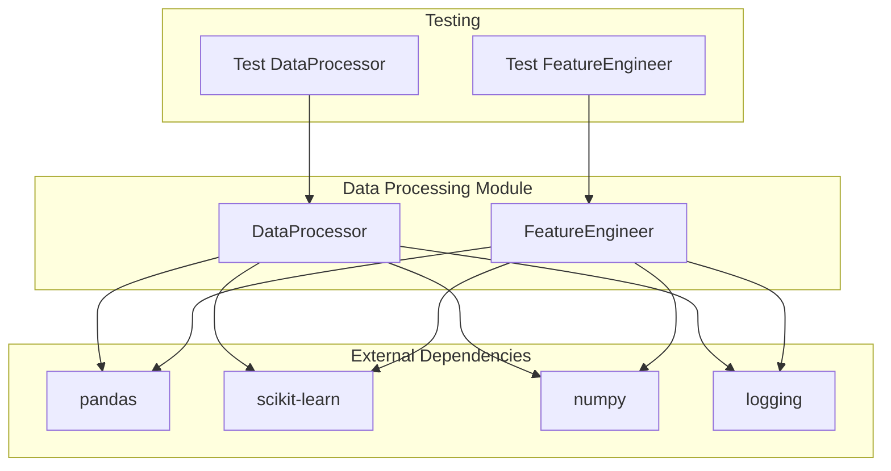
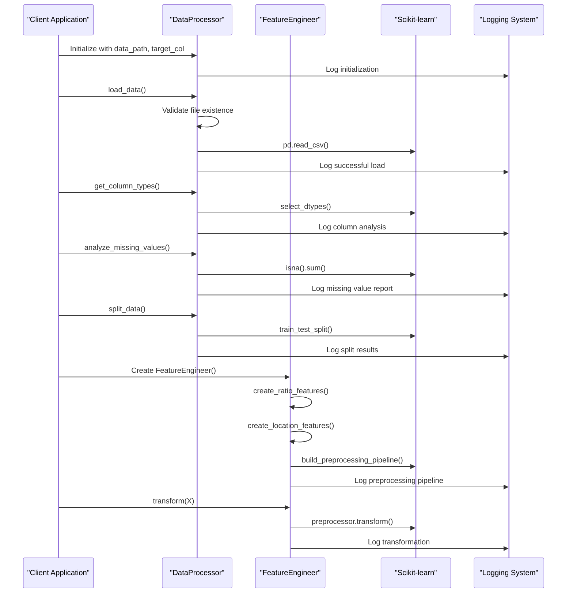
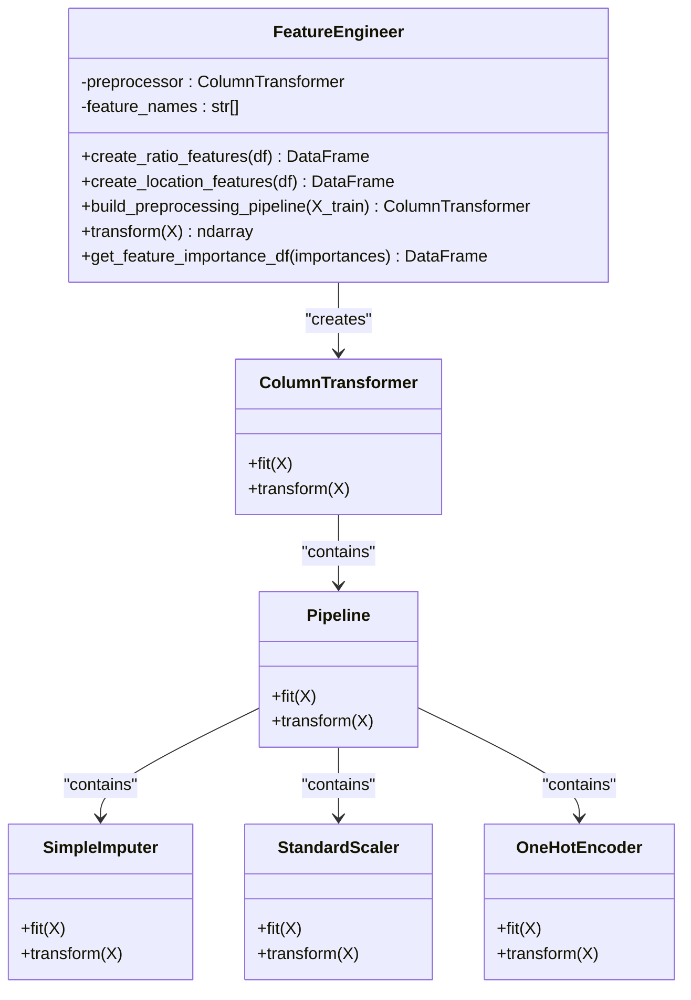
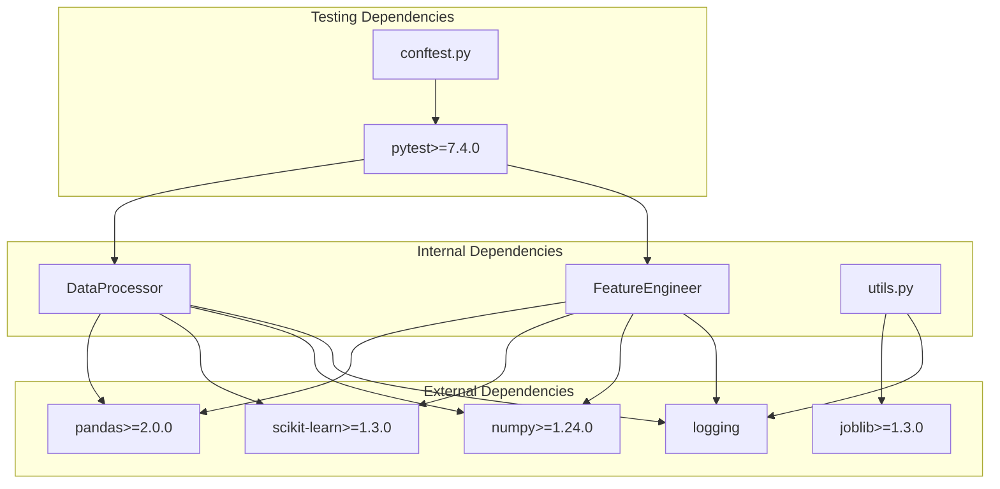

# Data Processing

<cite>
**Referenced Files in This Document**
- [data_processing.py](file://src/data_processing.py)
- [test_data_processing.py](file://tests/test_data_processing.py)
- [utils.py](file://src/utils.py)
- [README.md](file://README.md)
- [data/README.md](file://data/README.md)
- [requirements.txt](file://requirements.txt)
- [conftest.py](file://tests/conftest.py)
</cite>

## Table of Contents
1. [Introduction](#introduction)
2. [Project Structure](#project-structure)
3. [Core Components](#core-components)
4. [Architecture Overview](#architecture-overview)
5. [Detailed Component Analysis](#detailed-component-analysis)
6. [Dependency Analysis](#dependency-analysis)
7. [Performance Considerations](#performance-considerations)
8. [Troubleshooting Guide](#troubleshooting-guide)
9. [Conclusion](#conclusion)

## Introduction
This document provides comprehensive technical documentation for the data processing component used in the California Housing Price Prediction project. The data processing pipeline focuses on robust data loading from CSV files, intelligent column type identification, missing value analysis, stratified train-test splitting based on income categories, and memory optimization. It also covers feature engineering capabilities and preprocessing pipelines that prepare clean datasets for machine learning modeling.

The implementation emphasizes production-ready practices including comprehensive error handling, logging, and validation to ensure reliable data processing workflows.

## Project Structure
The data processing functionality is organized within the `src` package with dedicated modules for data processing, utilities, and testing. The primary data processing module contains two main classes: `DataProcessor` for core data operations and `FeatureEngineer` for advanced feature engineering and preprocessing.



**Diagram sources**
- [data_processing.py:22-341](file://src/data_processing.py#L22-L341)
- [test_data_processing.py:19-202](file://tests/test_data_processing.py#L19-L202)

**Section sources**
- [data_processing.py:1-341](file://src/data_processing.py#L1-L341)
- [README.md:88-139](file://README.md#L88-L139)

## Core Components
The data processing system consists of two primary classes that work together to provide a complete data preparation pipeline:

### DataProcessor Class
The `DataProcessor` class serves as the foundation for all data operations, handling CSV file loading, data validation, column type identification, missing value analysis, and stratified train-test splitting. It maintains state for processed datasets and provides comprehensive logging throughout the data processing workflow.

### FeatureEngineer Class
The `FeatureEngineer` class extends the data processing capabilities by implementing advanced feature engineering techniques and preprocessing pipelines. It creates meaningful derived features, builds sophisticated preprocessing pipelines, and manages feature importance analysis.

**Section sources**
- [data_processing.py:22-341](file://src/data_processing.py#L22-L341)

## Architecture Overview
The data processing architecture follows a layered approach with clear separation of concerns between data loading, validation, feature engineering, and preprocessing. The system integrates seamlessly with scikit-learn's preprocessing ecosystem while maintaining flexibility for custom transformations.



**Diagram sources**
- [data_processing.py:52-157](file://src/data_processing.py#L52-L157)
- [data_processing.py:202-320](file://src/data_processing.py#L202-L320)

## Detailed Component Analysis

### DataProcessor Class Implementation

The `DataProcessor` class provides comprehensive data loading and validation capabilities with robust error handling and logging mechanisms.

#### Initialization and Configuration
The constructor accepts essential parameters for data processing including file path, target column name, test split ratio, and random state for reproducibility. All parameters are validated and stored for subsequent operations.

#### Data Loading with Error Handling
The `load_data()` method implements comprehensive error handling for file operations, including validation of file existence and handling of empty datasets. The method uses structured logging to track loading progress and outcomes.

```mermaid
flowchart TD
Start([load_data() Called]) --> CheckFile["Check File Existence"]
CheckFile --> Exists{"File Exists?"}
Exists --> |No| RaiseError["Raise FileNotFoundError"]
Exists --> |Yes| ReadCSV["pd.read_csv()"]
ReadCSV --> ReadSuccess{"Read Success?"}
ReadSuccess --> |No| HandleEmpty["Handle EmptyDataError"]
ReadSuccess --> |Yes| LogSuccess["Log Success Message"]
LogSuccess --> ReturnDF["Return DataFrame"]
RaiseError --> End([End])
HandleEmpty --> End
ReturnDF --> End
```

**Diagram sources**
- [data_processing.py:52-75](file://src/data_processing.py#L52-L75)

#### Column Type Identification
The `get_column_types()` method automatically identifies numerical and categorical columns while excluding the target column from numerical classification. This ensures appropriate preprocessing strategies for different data types.

#### Missing Value Analysis
The `analyze_missing_values()` method provides comprehensive missing data analysis including counts, percentages, and logging of findings. It helps identify potential data quality issues early in the processing pipeline.

#### Stratified Train-Test Splitting
The `split_data()` method implements stratified sampling based on income categories to ensure representative test sets. This prevents data leakage and maintains statistical validity across training and testing datasets.

```mermaid
flowchart TD
Start([split_data() Called]) --> CreateCategories["Create Income Categories"]
CreateCategories --> DefineFeatures["Define Features (Drop Target)"]
DefineFeatures --> SplitData["train_test_split()"]
SplitData --> DropTemp["Drop Temporary Category Column"]
DropTemp --> LogResults["Log Split Results"]
LogResults --> ReturnData["Return (X_train, X_test, y_train, y_test)"]
ReturnData --> End([End])
```

**Diagram sources**
- [data_processing.py:122-157](file://src/data_processing.py#L122-L157)

#### Data Summary Generation
The `get_data_summary()` method provides comprehensive dataset statistics including memory usage, duplicate detection, and target variable statistics for quick data quality assessment.

**Section sources**
- [data_processing.py:22-186](file://src/data_processing.py#L22-L186)

### FeatureEngineer Class Implementation

The `FeatureEngineer` class extends data processing capabilities through advanced feature engineering and preprocessing pipeline construction.

#### Ratio Feature Creation
The `create_ratio_features()` method generates meaningful derived features that capture relationships between raw measurements, including rooms per household, bedrooms per room, and population per household ratios.

#### Location-Based Features
The `create_location_features()` method incorporates geographic intelligence by calculating distances to major California cities (San Francisco and Los Angeles) based on latitude and longitude coordinates.

#### Preprocessing Pipeline Construction
The `build_preprocessing_pipeline()` method creates sophisticated preprocessing pipelines using scikit-learn's ColumnTransformer and Pipeline components. The pipeline handles:
- Numerical feature imputation with median strategy
- Numerical feature scaling with StandardScaler
- Categorical feature imputation with most frequent strategy
- Categorical feature one-hot encoding with unknown category handling



**Diagram sources**
- [data_processing.py:189-341](file://src/data_processing.py#L189-L341)

**Section sources**
- [data_processing.py:189-341](file://src/data_processing.py#L189-L341)

## Dependency Analysis
The data processing module has well-defined dependencies that support its comprehensive functionality while maintaining modularity and testability.



**Diagram sources**
- [requirements.txt:1-36](file://requirements.txt#L1-L36)
- [data_processing.py:8-17](file://src/data_processing.py#L8-L17)

The dependency analysis reveals a clean separation of concerns:
- **pandas**: Core data manipulation and analysis
- **scikit-learn**: Machine learning preprocessing and model evaluation
- **numpy**: Numerical computing foundation
- **joblib**: Model persistence and caching
- **pytest**: Testing framework with comprehensive fixtures

**Section sources**
- [requirements.txt:1-36](file://requirements.txt#L1-L36)
- [data_processing.py:8-17](file://src/data_processing.py#L8-L17)

## Performance Considerations

### Memory Usage Optimization
The data processing pipeline implements several strategies for memory optimization:

- **Efficient Data Types**: Automatic selection of appropriate numeric types to minimize memory footprint
- **Memory Usage Monitoring**: Built-in tracking of memory consumption during processing
- **Lazy Evaluation**: Feature engineering operations use copy semantics to avoid unnecessary data duplication
- **Column Selection**: Strategic dropping of unused columns to reduce memory overhead

### Data Validation Processes
The system implements comprehensive validation at multiple stages:

- **File Validation**: Ensures data files exist and are accessible
- **Schema Validation**: Verifies column presence and types before processing
- **Data Quality Checks**: Identifies missing values, duplicates, and outliers
- **Statistical Validation**: Confirms data distributions meet expectations

### Duplicate Row Detection
The `get_data_summary()` method includes automatic duplicate detection to identify and report duplicate records that could bias model training.

**Section sources**
- [data_processing.py:159-186](file://src/data_processing.py#L159-L186)

## Troubleshooting Guide

### Common Data Issues and Solutions

#### Missing Values
**Problem**: High percentage of missing values affecting model performance
**Solution**: Use the `analyze_missing_values()` method to identify patterns, then apply appropriate imputation strategies based on data characteristics

#### Data Type Mismatches
**Problem**: Incorrect column types causing processing errors
**Solution**: Utilize `get_column_types()` to identify problematic columns and apply targeted type conversion

#### Memory Issues
**Problem**: Out of memory errors with large datasets
**Solution**: Monitor memory usage with `get_data_summary()` and consider data sampling or chunked processing

#### Stratification Problems
**Problem**: Uneven distribution of income categories in test sets
**Solution**: Verify income category creation and ensure adequate representation across all categories

### Error Handling Patterns
The data processing system implements comprehensive error handling with clear messaging and logging:

- **File Not Found**: Specific FileNotFoundError with descriptive messages
- **Data Validation**: ValueError exceptions with clear diagnostic information
- **Processing Errors**: Structured logging with contextual information
- **Pipeline Failures**: Detailed error reporting with operation-specific messages

**Section sources**
- [data_processing.py:52-75](file://src/data_processing.py#L52-L75)
- [data_processing.py:83-84](file://src/data_processing.py#L83-L84)

## Practical Usage Examples

### Basic Data Loading and Analysis
```python
# Initialize data processor
processor = DataProcessor("data/housing.csv")

# Load and validate data
df = processor.load_data()

# Analyze data quality
summary = processor.get_data_summary()
print(f"Dataset shape: {summary['total_rows']} x {summary['total_columns']}")

# Check for missing values
missing = processor.analyze_missing_values()
print(f"Missing values: {summary['missing_values_total']}")
```

### Feature Engineering Workflow
```python
# Create feature engineer
engineer = FeatureEngineer()

# Generate ratio features
X_train_enhanced = engineer.create_ratio_features(X_train)

# Build preprocessing pipeline
preprocessor = engineer.build_preprocessing_pipeline(X_train_enhanced)

# Transform features
X_train_processed = engineer.transform(X_train_enhanced)
```

### Complete Data Processing Pipeline
```python
# Load data
processor = DataProcessor("data/housing.csv")
df = processor.load_data()

# Split data with stratification
X_train, X_test, y_train, y_test = processor.split_data()

# Engineer features
engineer = FeatureEngineer()
X_train_features = engineer.create_ratio_features(X_train)
X_test_features = engineer.create_ratio_features(X_test)

# Build and apply preprocessing
preprocessor = engineer.build_preprocessing_pipeline(X_train_features)
X_train_processed = engineer.transform(X_train_features)
X_test_processed = engineer.transform(X_test_features)
```

**Section sources**
- [README.md:269-286](file://README.md#L269-L286)
- [data_processing.py:52-157](file://src/data_processing.py#L52-L157)

## Conclusion
The data processing component provides a robust, production-ready foundation for machine learning workflows in the California Housing Price Prediction project. Its comprehensive error handling, memory optimization, and validation capabilities ensure reliable data processing across diverse scenarios. The modular design with clear separation between data loading, validation, feature engineering, and preprocessing enables flexible customization while maintaining consistency and reliability.

The implementation demonstrates industry best practices in data science workflows, including proper logging, testing, and validation that are essential for production deployments. The system's ability to handle real-world data challenges while maintaining performance and reliability makes it suitable for both educational purposes and production environments.