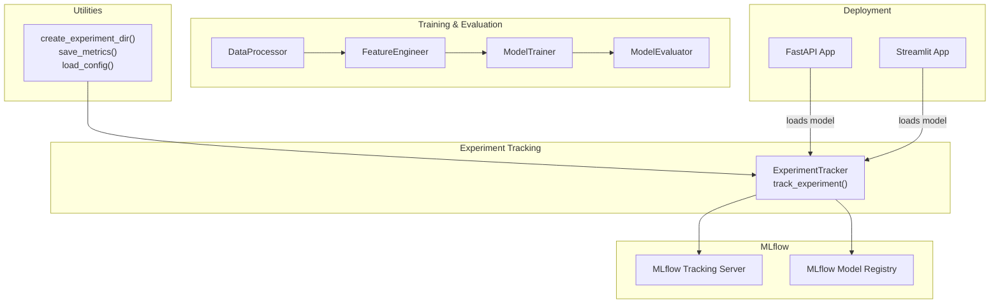
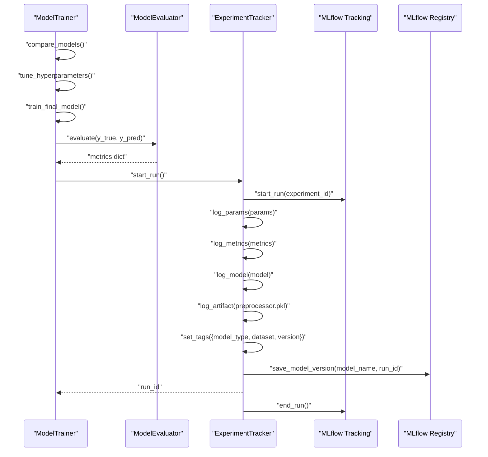
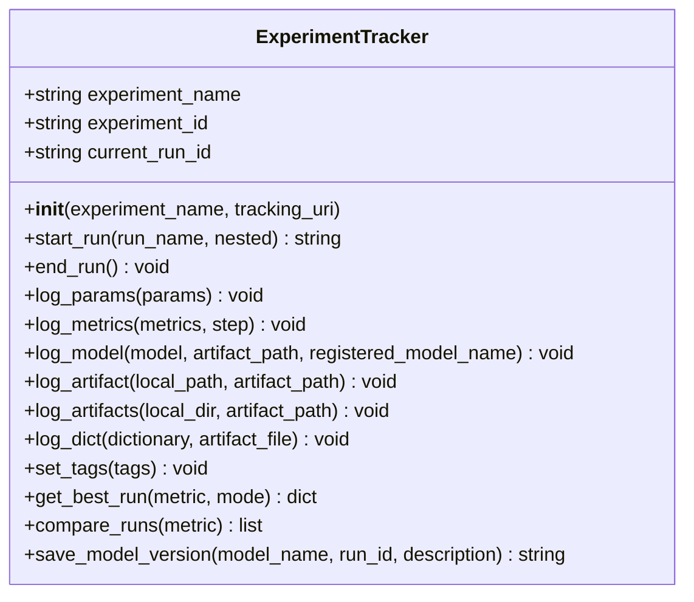
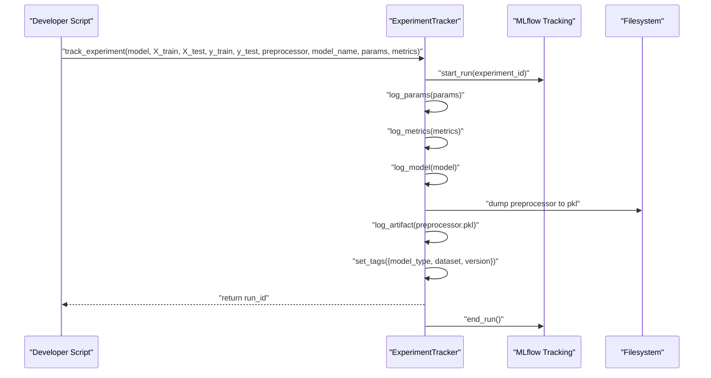
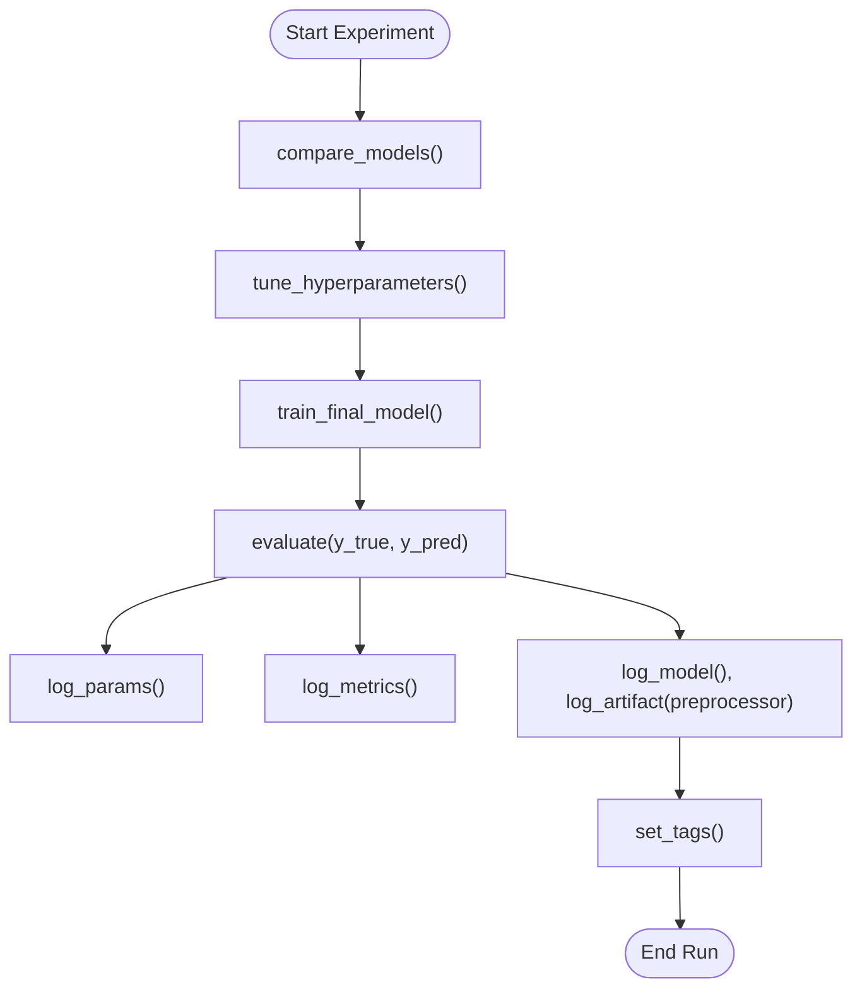
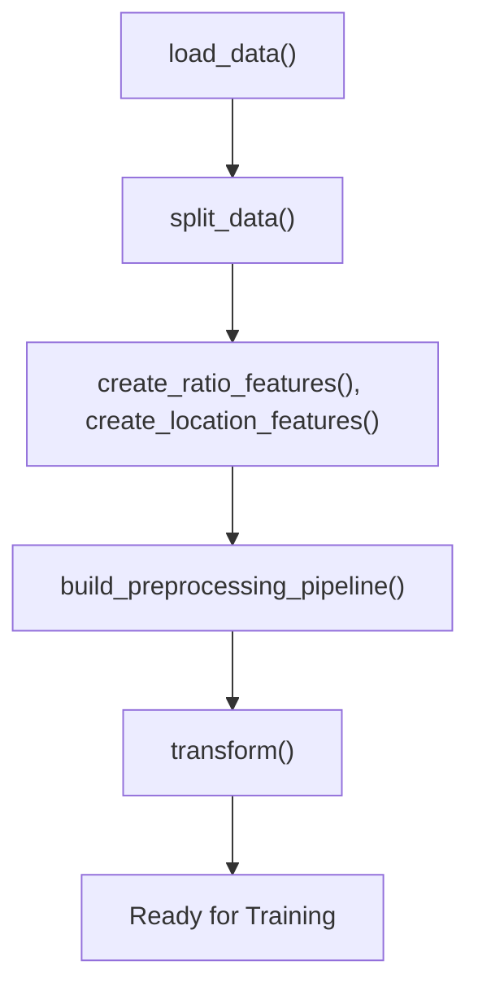
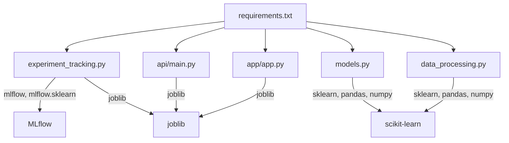

# Experiment Tracking

<cite>
**Referenced Files in This Document**
- [experiment_tracking.py](file://src/experiment_tracking.py)
- [models.py](file://src/models.py)
- [data_processing.py](file://src/data_processing.py)
- [utils.py](file://src/utils.py)
- [requirements.txt](file://requirements.txt)
- [README.md](file://README.md)
- [train_model_for_web.py](file://train_model_for_web.py)
- [api/main.py](file://api/main.py)
- [app/app.py](file://app/app.py)
</cite>

## Table of Contents
1. [Introduction](#introduction)
2. [Project Structure](#project-structure)
3. [Core Components](#core-components)
4. [Architecture Overview](#architecture-overview)
5. [Detailed Component Analysis](#detailed-component-analysis)
6. [Dependency Analysis](#dependency-analysis)
7. [Performance Considerations](#performance-considerations)
8. [Troubleshooting Guide](#troubleshooting-guide)
9. [Conclusion](#conclusion)
10. [Appendices](#appendices)

## Introduction
This document explains the experiment tracking component of the project, focusing on MLflow integration for experiment management, run comparison, and model versioning. It documents how experiments are logged with parameters, metrics, and artifacts, including automatic tracking of model performance, hyperparameters, and preprocessing configurations. It also covers experiment comparison workflows, model registry integration, reproducibility features, and best practices for organizing experiments, documenting parameters, and interpreting results.

## Project Structure
The experiment tracking capability centers around a dedicated module that integrates with MLflow to record runs, parameters, metrics, and artifacts. Supporting modules provide model training, evaluation, and data preprocessing, while utilities offer convenience functions for saving/loading artifacts and creating experiment directories. The API and Streamlit app consume trained models without directly invoking MLflow, but the experiment metadata remains available for analysis.

**Diagram sources**
- [experiment_tracking.py:19-307](file://src/experiment_tracking.py#L19-L307)
- [models.py:30-366](file://src/models.py#L30-L366)
- [data_processing.py:22-341](file://src/data_processing.py#L22-L341)
- [utils.py:106-137](file://src/utils.py#L106-L137)
- [api/main.py:126-180](file://api/main.py#L126-L180)
- [app/app.py:72-82](file://app/app.py#L72-L82)

**Section sources**
- [experiment_tracking.py:1-307](file://src/experiment_tracking.py#L1-L307)
- [README.md:80-85](file://README.md#L80-L85)

## Core Components
- ExperimentTracker: Central class for managing MLflow experiments, runs, logging parameters/metrics/artifacts, tagging, retrieving best runs, comparing runs, and saving model versions to the registry.
- track_experiment(): Convenience function to log a complete experiment run, including parameters, metrics, model, and preprocessor artifacts.
- ModelTrainer and ModelEvaluator: Provide training, cross-validation, hyperparameter tuning, and evaluation metrics used during experiments.
- DataProcessor and FeatureEngineer: Provide data loading, splitting, preprocessing pipelines, and feature engineering used to produce inputs for experiments.
- Utilities: Offer helpers for creating experiment directories, saving metrics, and loading configurations.

Key capabilities:
- Start/end runs, log parameters and metrics, attach artifacts (model, preprocessor, dicts), set tags, compare runs, and create model registry versions.

**Section sources**
- [experiment_tracking.py:19-307](file://src/experiment_tracking.py#L19-L307)
- [models.py:30-366](file://src/models.py#L30-L366)
- [data_processing.py:22-341](file://src/data_processing.py#L22-L341)
- [utils.py:106-137](file://src/utils.py#L106-L137)

## Architecture Overview
The experiment tracking architecture integrates MLflow into the training and evaluation workflow. Experiments are grouped under a named experiment, runs encapsulate individual trials, and artifacts include the trained model and preprocessor. Metrics and parameters are recorded per run, enabling comparisons and registry versioning.

**Diagram sources**
- [experiment_tracking.py:53-80](file://src/experiment_tracking.py#L53-L80)
- [experiment_tracking.py:81-120](file://src/experiment_tracking.py#L81-L120)
- [experiment_tracking.py:104-120](file://src/experiment_tracking.py#L104-L120)
- [experiment_tracking.py:121-153](file://src/experiment_tracking.py#L121-L153)
- [experiment_tracking.py:154-164](file://src/experiment_tracking.py#L154-L164)
- [experiment_tracking.py:221-251](file://src/experiment_tracking.py#L221-L251)
- [experiment_tracking.py:275-306](file://src/experiment_tracking.py#L275-L306)
- [models.py:54-178](file://src/models.py#L54-L178)
- [models.py:208-259](file://src/models.py#L208-L259)

## Detailed Component Analysis

### ExperimentTracker Class
The ExperimentTracker class encapsulates MLflow operations for experiment lifecycle management and artifact logging. It supports:
- Starting and ending runs, optionally nested
- Logging parameters and metrics
- Attaching model and arbitrary artifacts
- Tagging runs
- Retrieving best runs by metric ordering
- Comparing runs across an experiment
- Saving model versions to the registry

**Diagram sources**
- [experiment_tracking.py:19-307](file://src/experiment_tracking.py#L19-L307)

**Section sources**
- [experiment_tracking.py:19-307](file://src/experiment_tracking.py#L19-L307)

### track_experiment Function
The convenience function wraps a typical experiment run:
- Starts an MLflow run within the configured experiment
- Logs parameters and metrics
- Logs the trained model and the fitted preprocessor as artifacts
- Tags the run with metadata
- Returns the run identifier

**Diagram sources**
- [experiment_tracking.py:254-306](file://src/experiment_tracking.py#L254-L306)

**Section sources**
- [experiment_tracking.py:254-306](file://src/experiment_tracking.py#L254-L306)

### Model Training and Evaluation Integration
ModelTrainer performs:
- Cross-validation comparisons across multiple models
- Hyperparameter tuning via grid search
- Final model training with tuned parameters

ModelEvaluator computes:
- Comprehensive metrics (RMSE, MAE, MAPE, R², residual stats)
- Error analysis by value ranges
- Feature importance extraction

These outputs are ideal candidates for logging as metrics and artifacts in experiments.

**Diagram sources**
- [models.py:54-178](file://src/models.py#L54-L178)
- [models.py:208-351](file://src/models.py#L208-L351)
- [experiment_tracking.py:81-164](file://src/experiment_tracking.py#L81-L164)

**Section sources**
- [models.py:30-366](file://src/models.py#L30-L366)
- [experiment_tracking.py:81-164](file://src/experiment_tracking.py#L81-L164)

### Data Processing and Feature Engineering
DataProcessor and FeatureEngineer handle:
- Data loading, missing value analysis, and stratified train/test splits
- Feature engineering (ratio features, distance features)
- Building preprocessing pipelines with imputation, scaling, and encoding
- Transforming datasets consistently

These steps ensure reproducible inputs for experiments and enable logging of preprocessing configurations as artifacts.

**Diagram sources**
- [data_processing.py:52-158](file://src/data_processing.py#L52-L158)
- [data_processing.py:202-321](file://src/data_processing.py#L202-L321)

**Section sources**
- [data_processing.py:22-341](file://src/data_processing.py#L22-L341)

### Utilities for Experiment Organization
Utilities support:
- Creating timestamped experiment directories
- Saving metrics to JSON
- Loading configuration files

These utilities complement MLflow by providing filesystem-based organization and artifact persistence outside MLflow.

**Section sources**
- [utils.py:106-137](file://src/utils.py#L106-L137)

## Dependency Analysis
- MLflow is a core dependency for experiment tracking and model registry.
- The experiment tracking module depends on scikit-learn for model logging and joblib for serializing preprocessors.
- Training and evaluation modules depend on pandas, numpy, and scikit-learn.
- Deployment apps depend on joblib for model loading and do not directly invoke MLflow.

**Diagram sources**
- [requirements.txt:25-26](file://requirements.txt#L25-L26)
- [experiment_tracking.py:12-14](file://src/experiment_tracking.py#L12-L14)
- [models.py:14-25](file://src/models.py#L14-L25)
- [data_processing.py:13-17](file://src/data_processing.py#L13-L17)
- [api/main.py:17-18](file://api/main.py#L17-L18)
- [app/app.py:13-14](file://app/app.py#L13-L14)

**Section sources**
- [requirements.txt:25-26](file://requirements.txt#L25-L26)
- [experiment_tracking.py:12-14](file://src/experiment_tracking.py#L12-L14)
- [models.py:14-25](file://src/models.py#L14-L25)
- [data_processing.py:13-17](file://src/data_processing.py#L13-L17)
- [api/main.py:17-18](file://api/main.py#L17-L18)
- [app/app.py:13-14](file://app/app.py#L13-L14)

## Performance Considerations
- Use nested runs for sub-experiments (e.g., hyperparameter sweeps) to keep top-level runs clean and comparable.
- Log metrics incrementally during long-running jobs to monitor progress.
- Prefer batch logging for parameters and metrics to reduce overhead.
- Keep artifacts minimal; log only essential artifacts (model, preprocessor, key configs) to reduce storage costs.
- Use tags to group runs by model type, dataset version, or feature set for efficient filtering.

## Troubleshooting Guide
Common issues and resolutions:
- MLflow server not reachable: Verify the tracking URI and server availability. The tracker accepts an optional tracking URI in the constructor.
- No runs found: Ensure the experiment name matches and runs were started within the experiment context.
- Missing artifacts: Confirm that artifact paths exist and are accessible; ensure cleanup does not remove artifacts before logging.
- Registry creation failures: The save method attempts to create registered models if they do not exist; ensure permissions allow model registration.

Operational checks:
- Validate experiment initialization and run lifecycle (start/end).
- Confirm parameter and metric keys are unique and meaningful.
- Use compare_runs to inspect available runs and sort by desired metrics.

**Section sources**
- [experiment_tracking.py:30-51](file://src/experiment_tracking.py#L30-L51)
- [experiment_tracking.py:53-80](file://src/experiment_tracking.py#L53-L80)
- [experiment_tracking.py:221-251](file://src/experiment_tracking.py#L221-L251)

## Conclusion
The experiment tracking component provides a robust foundation for managing ML experiments with MLflow. It enables comprehensive logging of parameters, metrics, and artifacts, supports run comparison, and integrates with the model registry for versioning. Combined with the training, evaluation, and preprocessing modules, it offers a complete workflow for reproducible experimentation and model lifecycle management.

## Appendices

### Practical Examples

- Setting up MLflow tracking
  - Initialize the tracker with an experiment name and optional tracking URI.
  - Start a run, log parameters and metrics, attach model and preprocessor artifacts, set tags, and end the run.
  - Example path: [experiment_tracking.py:30-80](file://src/experiment_tracking.py#L30-L80), [experiment_tracking.py:81-164](file://src/experiment_tracking.py#L81-L164), [experiment_tracking.py:275-306](file://src/experiment_tracking.py#L275-L306)

- Logging experiment runs
  - Use the convenience function to log a full experiment with parameters, metrics, model, and preprocessor.
  - Example path: [experiment_tracking.py:254-306](file://src/experiment_tracking.py#L254-L306)

- Comparing different model configurations
  - Use ModelTrainer to compare models and tune hyperparameters, then log results with ExperimentTracker.
  - Example path: [models.py:54-178](file://src/models.py#L54-L178), [experiment_tracking.py:193-219](file://src/experiment_tracking.py#L193-L219)

- Managing experiment versions
  - Save model versions to the registry after successful runs.
  - Example path: [experiment_tracking.py:221-251](file://src/experiment_tracking.py#L221-L251)

- Best practices for experiment organization
  - Use tags to annotate runs (model type, dataset, version).
  - Log preprocessing configurations and feature engineering steps as artifacts.
  - Keep parameter and metric naming consistent across runs for reliable comparison.
  - Example path: [experiment_tracking.py:154-164](file://src/experiment_tracking.py#L154-L164), [experiment_tracking.py:298-303](file://src/experiment_tracking.py#L298-L303)

- Reproducibility features
  - Save and log the fitted preprocessor alongside the model.
  - Use consistent random seeds and data splits across experiments.
  - Example path: [experiment_tracking.py:291-296](file://src/experiment_tracking.py#L291-L296), [data_processing.py:122-157](file://src/data_processing.py#L122-L157)

- Result interpretation
  - Use ModelEvaluator to compute and log comprehensive metrics and analyze residuals.
  - Example path: [models.py:208-351](file://src/models.py#L208-L351)

- Deployment integration
  - The API and Streamlit apps load models from disk; experiment metadata remains available for auditability.
  - Example path: [api/main.py:135-180](file://api/main.py#L135-L180), [app/app.py:72-82](file://app/app.py#L72-L82)