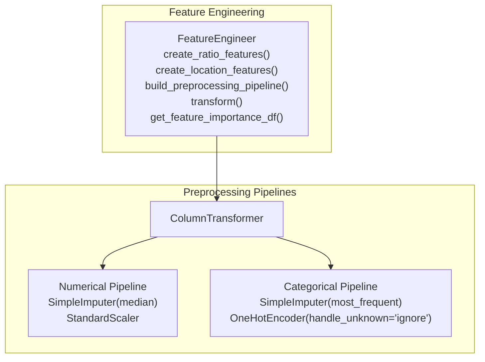
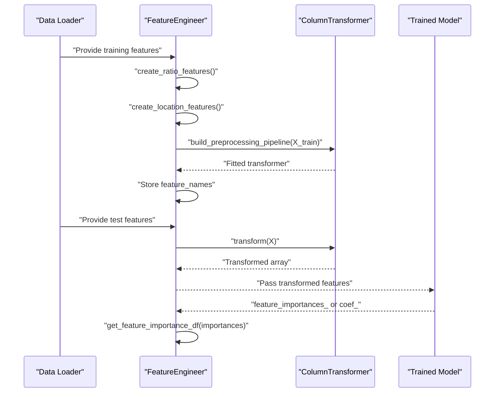
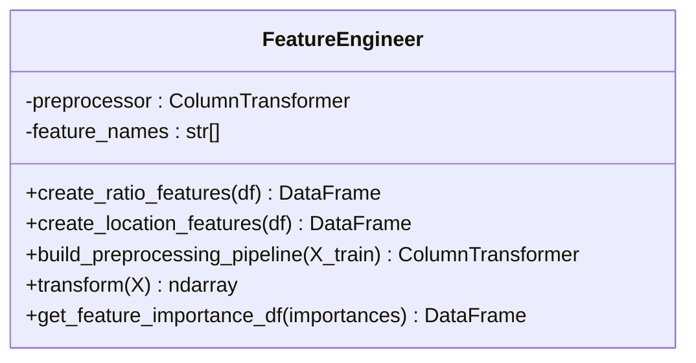
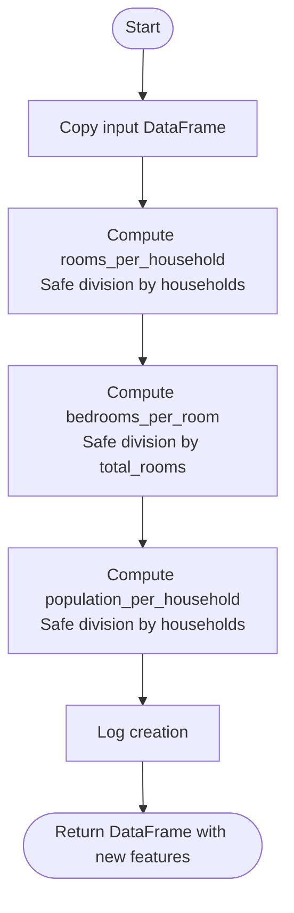
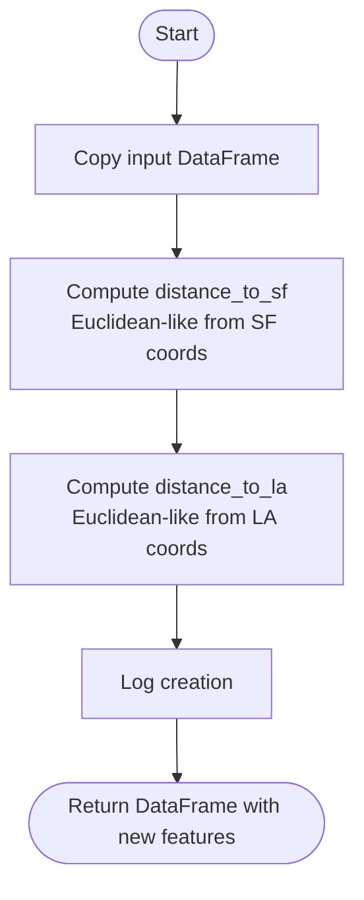
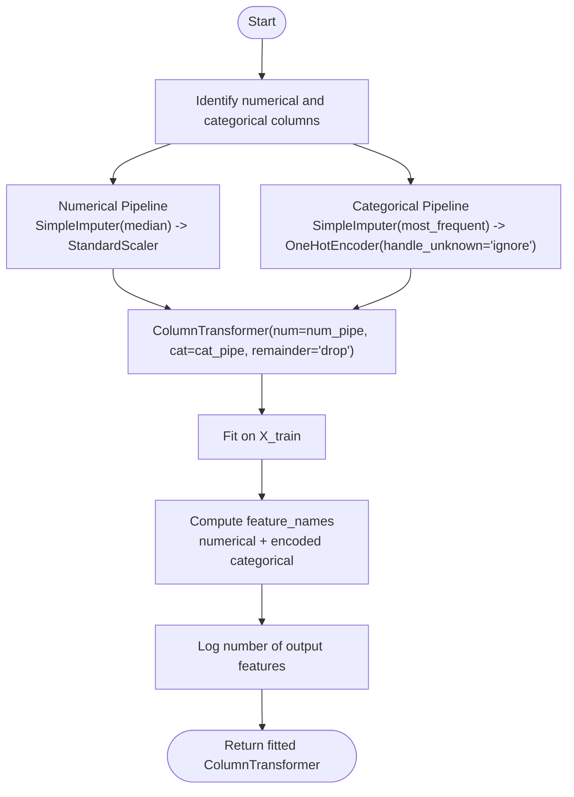
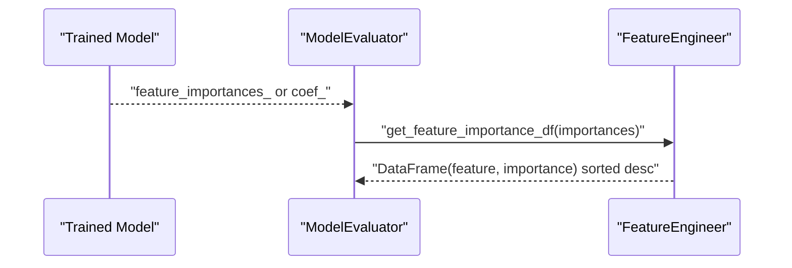
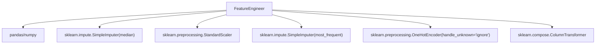

# Feature Engineering

<cite>
**Referenced Files in This Document**
- [data_processing.py](file://src/data_processing.py)
- [models.py](file://src/models.py)
- [test_data_processing.py](file://tests/test_data_processing.py)
- [train_model_for_web.py](file://train_model_for_web.py)
- [README.md](file://README.md)
</cite>

## Table of Contents
1. [Introduction](#introduction)
2. [Project Structure](#project-structure)
3. [Core Components](#core-components)
4. [Architecture Overview](#architecture-overview)
5. [Detailed Component Analysis](#detailed-component-analysis)
6. [Dependency Analysis](#dependency-analysis)
7. [Performance Considerations](#performance-considerations)
8. [Troubleshooting Guide](#troubleshooting-guide)
9. [Conclusion](#conclusion)
10. [Appendices](#appendices)

## Introduction
This document focuses on the feature engineering component of the project, centered around the FeatureEngineer class. It explains how ratio features (rooms_per_household, bedrooms_per_room, population_per_household), location-based features (distance to major California cities), and preprocessing pipelines are constructed and integrated into the machine learning workflow. It also covers the ColumnTransformer setup with separate pipelines for numerical and categorical features, imputation strategies, scaling, one-hot encoding, and feature importance extraction and transformation processes. Practical examples demonstrate creating meaningful features, building preprocessing pipelines, and transforming datasets for model training.

## Project Structure
The feature engineering logic resides primarily in the data processing module alongside related preprocessing utilities. The FeatureEngineer class encapsulates feature creation and preprocessing pipeline construction, while model evaluation utilities provide feature importance extraction pathways.

**Diagram sources**
- [data_processing.py:189-341](file://src/data_processing.py#L189-L341)

**Section sources**
- [data_processing.py:189-341](file://src/data_processing.py#L189-L341)

## Core Components
- FeatureEngineer: Central class for feature engineering and preprocessing pipeline construction.
- Ratio features: Derived indicators capturing relationships among raw counts.
- Location features: Geodesic-like distances to major California cities.
- Preprocessing pipeline: ColumnTransformer with separate pipelines for numerical and categorical features.
- Feature importance mapping: Utilities to convert raw importances into interpretable feature importance DataFrames.

Key responsibilities:
- Create ratio features to capture density and spaciousness characteristics.
- Compute location-based features to reflect geographic influence.
- Construct a ColumnTransformer with numerical and categorical pipelines.
- Store feature names post-encoding for downstream interpretation.
- Transform new data consistently with the fitted preprocessor.
- Map feature importances to feature names for interpretability.

**Section sources**
- [data_processing.py:189-341](file://src/data_processing.py#L189-L341)

## Architecture Overview
The feature engineering pipeline integrates with the broader ML workflow as follows:
- Data loading and splitting occur elsewhere in the stack.
- FeatureEngineer creates derived features and builds a preprocessing pipeline.
- The resulting ColumnTransformer transforms features into a unified representation.
- Trained models consume transformed features; feature importance is extracted and mapped to feature names.

**Diagram sources**
- [data_processing.py:202-341](file://src/data_processing.py#L202-L341)
- [models.py:295-321](file://src/models.py#L295-L321)

## Detailed Component Analysis

### FeatureEngineer Class
The FeatureEngineer class encapsulates feature engineering and preprocessing pipeline construction. It exposes methods to create ratio and location-based features, build a ColumnTransformer-based preprocessing pipeline, transform new data, and map feature importances to feature names.

**Diagram sources**
- [data_processing.py:189-341](file://src/data_processing.py#L189-L341)

Implementation highlights:
- Ratio features: rooms_per_household, bedrooms_per_room, population_per_household computed from total_rooms, total_bedrooms, population, and households with safe division handling.
- Location features: distance_to_sf and distance_to_la computed using Euclidean-like distance from approximate city coordinates.
- Preprocessing pipeline: ColumnTransformer with two pipelines:
  - Numerical pipeline: SimpleImputer(strategy="median"), StandardScaler
  - Categorical pipeline: SimpleImputer(strategy="most_frequent"), OneHotEncoder(handle_unknown="ignore", sparse_output=False)
- Feature names: Stored after fitting to enable importance mapping.

**Section sources**
- [data_processing.py:202-305](file://src/data_processing.py#L202-L305)

### Ratio Feature Creation
Purpose:
- Convert raw counts into meaningful ratios that capture density and spaciousness.

Processing logic:
- Safe division by replacing zeros with NaN to avoid infinities.
- Computation of three ratio features from total_rooms, total_bedrooms, population, and households.

**Diagram sources**
- [data_processing.py:202-226](file://src/data_processing.py#L202-L226)

**Section sources**
- [data_processing.py:202-226](file://src/data_processing.py#L202-L226)

### Location-Based Features
Purpose:
- Capture geographic influence by measuring distance to major California cities.

Processing logic:
- Approximate coordinates for San Francisco and Los Angeles are used.
- Euclidean-like distance is computed for each property.

**Diagram sources**
- [data_processing.py:228-255](file://src/data_processing.py#L228-L255)

**Section sources**
- [data_processing.py:228-255](file://src/data_processing.py#L228-L255)

### Preprocessing Pipeline Construction with ColumnTransformer
Purpose:
- Build a unified preprocessing pipeline that handles numerical and categorical features separately.

Pipeline composition:
- Numerical pipeline:
  - Imputation with median to handle outliers robustly.
  - Scaling with StandardScaler for normalized features.
- Categorical pipeline:
  - Imputation with most_frequent to handle missing categories.
  - One-hot encoding with handle_unknown="ignore" to gracefully handle unseen categories during inference.
- ColumnTransformer:
  - Applies numerical pipeline to numerical columns.
  - Applies categorical pipeline to categorical columns.
  - Drops remaining columns via remainder="drop".

Feature names:
- Stores original numerical feature names plus encoded categorical feature names for downstream interpretation.

**Diagram sources**
- [data_processing.py:257-305](file://src/data_processing.py#L257-L305)

**Section sources**
- [data_processing.py:257-305](file://src/data_processing.py#L257-L305)

### Transforming New Data
Purpose:
- Apply the fitted preprocessing pipeline to new data consistently.

Behavior:
- Validates that the preprocessor has been fitted.
- Transforms the input DataFrame into a numpy array compatible with downstream models.

**Section sources**
- [data_processing.py:307-321](file://src/data_processing.py#L307-L321)

### Feature Importance Extraction and Transformation
Purpose:
- Map raw model feature importances to interpretable feature names.

Process:
- Uses stored feature_names to construct a DataFrame with feature names and importance scores.
- Sorts features by importance descending.

Integration:
- Tree-based models expose feature_importances_.
- Linear models expose coef_ (absolute values).
- If neither is available, a warning is logged and None is returned.

**Diagram sources**
- [models.py:295-321](file://src/models.py#L295-L321)
- [data_processing.py:322-341](file://src/data_processing.py#L322-L341)

**Section sources**
- [models.py:295-321](file://src/models.py#L295-L321)
- [data_processing.py:322-341](file://src/data_processing.py#L322-L341)

### Practical Examples

#### Example 1: Creating Meaningful Features
Steps:
- Instantiate FeatureEngineer.
- Apply create_ratio_features to derive density and spaciousness indicators.
- Apply create_location_features to compute distances to major cities.

Outcome:
- Enhanced dataset with ratio and location-based features ready for modeling.

**Section sources**
- [data_processing.py:202-255](file://src/data_processing.py#L202-L255)

#### Example 2: Building Preprocessing Pipelines
Steps:
- Identify numerical and categorical columns from training features.
- Build numerical pipeline with median imputation and scaling.
- Build categorical pipeline with most_frequent imputation and one-hot encoding.
- Wrap pipelines in ColumnTransformer and fit on training features.
- Store feature_names for later use.

Outcome:
- Fitted ColumnTransformer ready to transform new data.

**Section sources**
- [data_processing.py:257-305](file://src/data_processing.py#L257-L305)

#### Example 3: Transforming Datasets for Model Training
Steps:
- Fit the preprocessor on training features.
- Transform training and test features.
- Pass transformed arrays to model training and evaluation.

Outcome:
- Consistent preprocessing across datasets.

**Section sources**
- [data_processing.py:307-321](file://src/data_processing.py#L307-L321)

#### Example 4: Extracting and Interpreting Feature Importances
Steps:
- Train a model and obtain feature importances.
- Use FeatureEngineer.get_feature_importance_df to map importances to feature names.
- Inspect top features to understand model behavior.

Outcome:
- Interpretability of model decisions.

**Section sources**
- [data_processing.py:322-341](file://src/data_processing.py#L322-L341)
- [models.py:295-321](file://src/models.py#L295-L321)

## Dependency Analysis
FeatureEngineer depends on scikit-learn components for preprocessing and relies on pandas/numpy for data manipulation. It integrates with model evaluation utilities for importance extraction.

**Diagram sources**
- [data_processing.py:14-17](file://src/data_processing.py#L14-L17)
- [data_processing.py:257-305](file://src/data_processing.py#L257-L305)

**Section sources**
- [data_processing.py:14-17](file://src/data_processing.py#L14-L17)
- [data_processing.py:257-305](file://src/data_processing.py#L257-L305)

## Performance Considerations
- Imputation strategies:
  - Median imputation for numerical features reduces sensitivity to outliers.
  - Most_frequent imputation for categorical features preserves mode-based expectations.
- Scaling:
  - StandardScaler ensures numerical features are on comparable scales, improving convergence and regularization behavior.
- One-hot encoding:
  - handle_unknown="ignore" prevents runtime errors when encountering unseen categories during inference.
- ColumnTransformer:
  - Separates concerns for numerical and categorical pipelines, enabling targeted preprocessing and reducing computational overhead.
- Memory and speed:
  - Sparse matrices are avoided by setting sparse_output=False in OneHotEncoder, simplifying downstream operations at the cost of increased memory usage.

[No sources needed since this section provides general guidance]

## Troubleshooting Guide
Common issues and resolutions:
- Transform before pipeline built:
  - Symptom: ValueError indicating preprocessor not fitted.
  - Resolution: Call build_preprocessing_pipeline before transform.
- Missing feature names:
  - Symptom: ValueError stating feature names not available.
  - Resolution: Build preprocessing pipeline first to populate feature_names.
- Unknown categories during transform:
  - Behavior: handle_unknown="ignore" prevents errors; new categories are ignored.
- Zero division in ratio features:
  - Behavior: Division by zero replaced with NaN; ensure data integrity before feature creation.

**Section sources**
- [data_processing.py:317-321](file://src/data_processing.py#L317-L321)
- [data_processing.py:332-341](file://src/data_processing.py#L332-L341)
- [data_processing.py:220-226](file://src/data_processing.py#L220-L226)

## Conclusion
The FeatureEngineer class provides a cohesive framework for deriving meaningful features and constructing robust preprocessing pipelines. By combining ratio and location-based features with a well-structured ColumnTransformer, it enables consistent data preparation for model training and evaluation. The ability to map feature importances to interpretable names further enhances model transparency and facilitates actionable insights.

[No sources needed since this section summarizes without analyzing specific files]

## Appendices

### Appendix A: Feature Importance Visualization Context
The README documents top features and their relative importance, highlighting the value of engineered features such as median income, ocean proximity, and distance-based features.

**Section sources**
- [README.md:308-320](file://README.md#L308-L320)

### Appendix B: End-to-End Training Script References
The training script demonstrates feature engineering and preprocessing pipeline construction in a standalone workflow, including feature engineering and pipeline assembly.

**Section sources**
- [train_model_for_web.py:38-96](file://train_model_for_web.py#L38-L96)