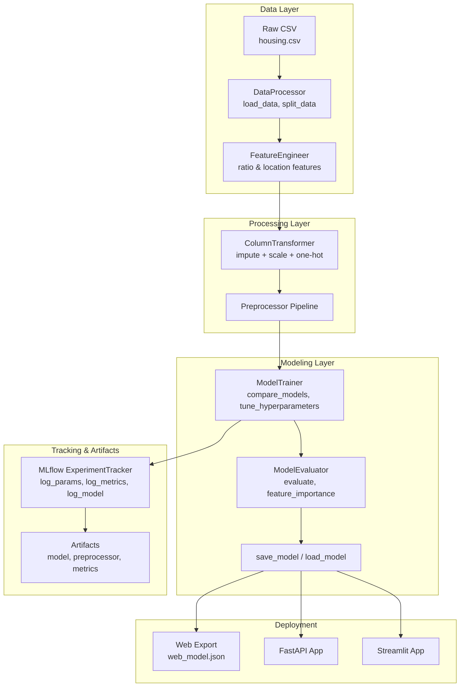
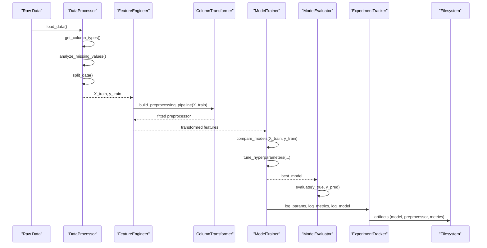
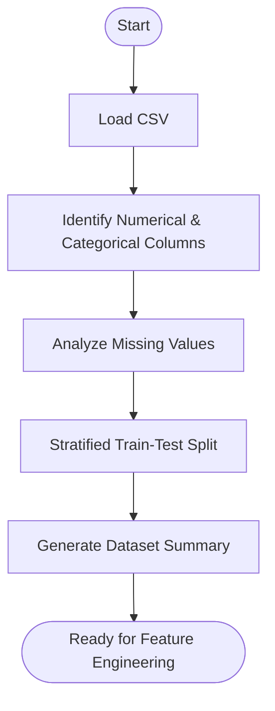
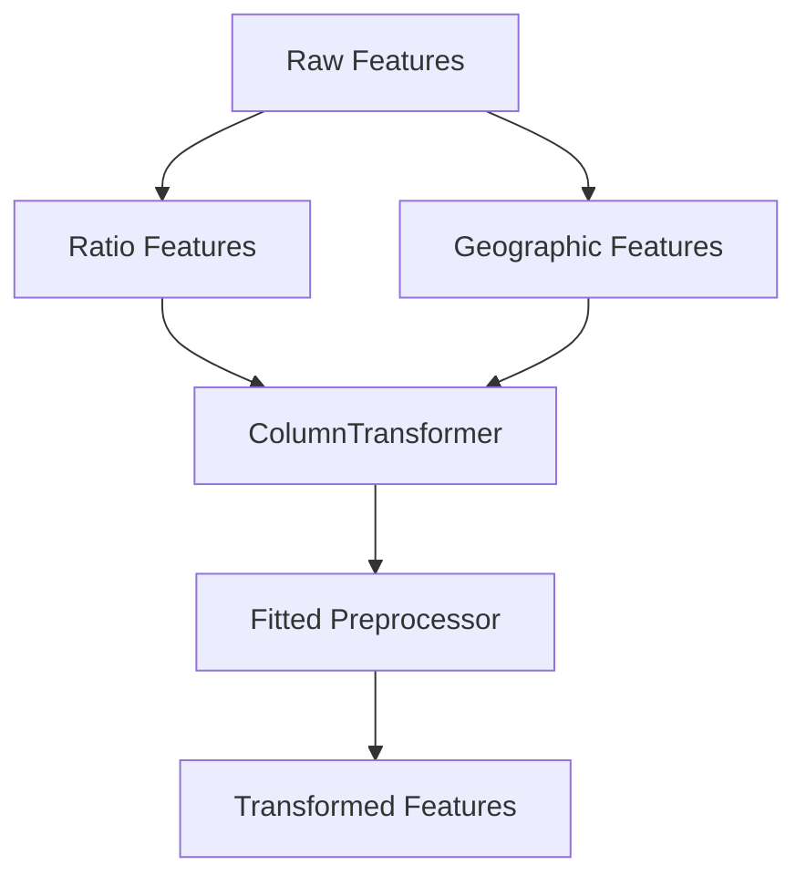
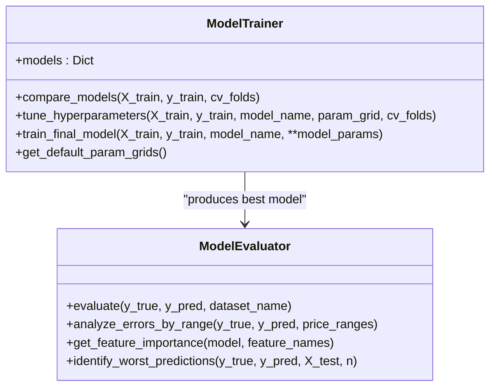
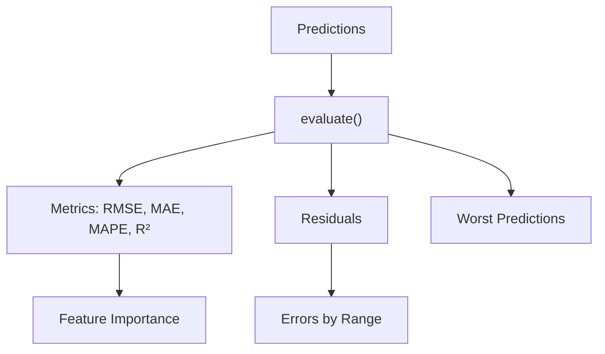
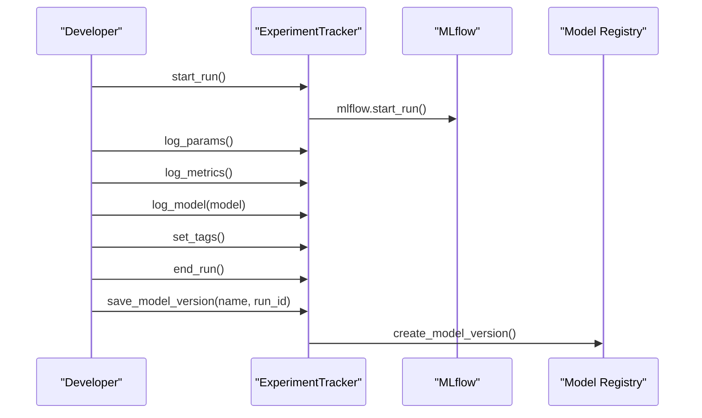
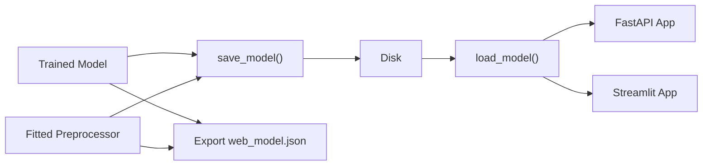
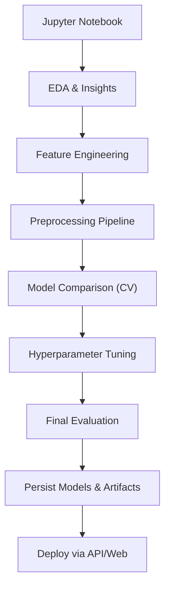
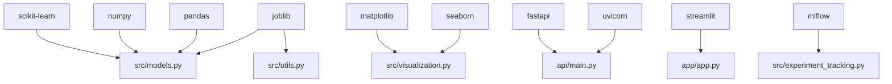

# Machine Learning Pipeline

<cite>
**Referenced Files in This Document**
- [README.md](file://README.md)
- [requirements.txt](file://requirements.txt)
- [setup.py](file://setup.py)
- [src/data_processing.py](file://src/data_processing.py)
- [src/models.py](file://src/models.py)
- [src/experiment_tracking.py](file://src/experiment_tracking.py)
- [src/utils.py](file://src/utils.py)
- [src/visualization.py](file://src/visualization.py)
- [train_model_for_web.py](file://train_model_for_web.py)
- [tests/test_models.py](file://tests/test_models.py)
- [tests/test_data_processing.py](file://tests/test_data_processing.py)
- [15_4_house_price_prediction.ipynb](file://15_4_house_price_prediction.ipynb)
</cite>

## Table of Contents
1. [Introduction](#introduction)
2. [Project Structure](#project-structure)
3. [Core Components](#core-components)
4. [Architecture Overview](#architecture-overview)
5. [Detailed Component Analysis](#detailed-component-analysis)
6. [Dependency Analysis](#dependency-analysis)
7. [Performance Considerations](#performance-considerations)
8. [Troubleshooting Guide](#troubleshooting-guide)
9. [Conclusion](#conclusion)
10. [Appendices](#appendices)

## Introduction
This document describes the end-to-end machine learning pipeline implemented for the California Housing Price Prediction project. It covers the complete workflow from raw data ingestion to model training, evaluation, experiment tracking, and production deployment. The pipeline emphasizes robust data processing, principled feature engineering, rigorous model comparison and tuning, and comprehensive evaluation using RMSE, MAE, and R². It also documents model persistence, version management, and deployment considerations for both API and web applications.

## Project Structure
The repository organizes the ML workflow across modules and scripts:
- Data processing and feature engineering live in a dedicated module.
- Model training, evaluation, and persistence are implemented in a separate module.
- Experiment tracking integrates with MLflow for run comparison and model versioning.
- Utilities provide logging, model serialization, and convenience functions.
- Visualization utilities support EDA and model evaluation.
- A training script demonstrates the full pipeline and exports artifacts for web use.
- Tests validate core functionality of data processing and modeling components.
- The Jupyter notebook provides a guided walkthrough of the entire workflow.

**Diagram sources**
- [src/data_processing.py:22-186](file://src/data_processing.py#L22-L186)
- [src/data_processing.py:189-341](file://src/data_processing.py#L189-L341)
- [src/models.py:30-205](file://src/models.py#L30-L205)
- [src/models.py:208-366](file://src/models.py#L208-L366)
- [src/experiment_tracking.py:19-307](file://src/experiment_tracking.py#L19-L307)
- [train_model_for_web.py:23-196](file://train_model_for_web.py#L23-L196)

**Section sources**
- [README.md:88-140](file://README.md#L88-L140)
- [requirements.txt:1-36](file://requirements.txt#L1-L36)
- [setup.py:22-73](file://setup.py#L22-L73)

## Core Components
- DataProcessor: Loads data, identifies column types, analyzes missing values, splits data with stratification, and summarizes dataset characteristics.
- FeatureEngineer: Creates ratio features (rooms per household, bedrooms per room, population per household), location features (distance to major cities), and builds a preprocessing pipeline with imputation, scaling, and one-hot encoding.
- ModelTrainer: Compares multiple models using cross-validation, tunes hyperparameters with grid search, and trains the final model with optimal parameters.
- ModelEvaluator: Computes RMSE, MAE, MAPE, R², analyzes errors by price range, extracts feature importance, and identifies worst predictions.
- ExperimentTracker: Starts MLflow runs, logs parameters and metrics, logs models and artifacts, compares runs, and manages model versions.
- Utilities: Provides logging setup, model persistence with metadata, metrics saving, and experiment directory creation.
- Visualization: Supports EDA plots, geographic distributions, correlation matrices, and evaluation visualizations.
- Training Script: Demonstrates the full pipeline, exports artifacts for web use, and saves a simplified model representation.

**Section sources**
- [src/data_processing.py:22-186](file://src/data_processing.py#L22-L186)
- [src/data_processing.py:189-341](file://src/data_processing.py#L189-L341)
- [src/models.py:30-205](file://src/models.py#L30-L205)
- [src/models.py:208-366](file://src/models.py#L208-L366)
- [src/experiment_tracking.py:19-307](file://src/experiment_tracking.py#L19-L307)
- [src/utils.py:16-137](file://src/utils.py#L16-L137)
- [src/visualization.py:23-261](file://src/visualization.py#L23-L261)
- [train_model_for_web.py:23-196](file://train_model_for_web.py#L23-L196)

## Architecture Overview
The pipeline follows a modular, testable architecture:
- Data ingestion and cleaning are encapsulated in DataProcessor.
- Feature engineering is handled by FeatureEngineer, which also constructs the preprocessing pipeline.
- ModelTrainer orchestrates model selection, cross-validation, and hyperparameter tuning.
- ModelEvaluator provides comprehensive performance analysis.
- ExperimentTracker integrates MLflow for experiment lifecycle management.
- Utilities and visualization support persistence, logging, and reporting.
- The training script ties everything together and exports artifacts for web deployment.

**Diagram sources**
- [src/data_processing.py:52-157](file://src/data_processing.py#L52-L157)
- [src/data_processing.py:202-305](file://src/data_processing.py#L202-L305)
- [src/models.py:54-177](file://src/models.py#L54-L177)
- [src/models.py:224-258](file://src/models.py#L224-L258)
- [src/experiment_tracking.py:81-120](file://src/experiment_tracking.py#L81-L120)

## Detailed Component Analysis

### Data Processing Pipeline
- Data loading: Robust CSV loading with error handling for missing or empty files.
- Column type detection: Separates numerical and categorical features while excluding the target.
- Missing value analysis: Reports counts and percentages; logs warnings when missing values are found.
- Train-test split: Stratifies by income categories to preserve distribution in the test set.
- Data summary: Provides counts, memory usage, missing totals, duplicates, and target statistics.

**Diagram sources**
- [src/data_processing.py:52-186](file://src/data_processing.py#L52-L186)

**Section sources**
- [src/data_processing.py:52-186](file://src/data_processing.py#L52-L186)

### Feature Engineering
- Ratio features: rooms_per_household, bedrooms_per_room, population_per_household computed safely to avoid division by zero.
- Geographic features: distance_to_sf and distance_to_la derived from latitude and longitude using Euclidean distance.
- Preprocessing pipeline: ColumnTransformer with:
  - Numerical pipeline: median imputation followed by standard scaling.
  - Categorical pipeline: most-frequent imputation followed by one-hot encoding with unknown handling.
- Feature importance mapping: Stores feature names post-encoding for interpretability.

**Diagram sources**
- [src/data_processing.py:202-305](file://src/data_processing.py#L202-L305)

**Section sources**
- [src/data_processing.py:202-305](file://src/data_processing.py#L202-L305)

### Model Training and Selection
- Model pool: LinearRegression, Ridge, Lasso, RandomForest, HistGradientBoosting.
- Cross-validation: 5-fold CV with RMSE, MAE, and R² scoring; results sorted by RMSE.
- Hyperparameter tuning: GridSearchCV with RMSE scoring; default grids for Ridge, Lasso, RandomForest, HistGradientBoosting.
- Final training: Retrains best model with tuned parameters.

**Diagram sources**
- [src/models.py:30-205](file://src/models.py#L30-L205)
- [src/models.py:208-366](file://src/models.py#L208-L366)

**Section sources**
- [src/models.py:30-205](file://src/models.py#L30-L205)
- [src/models.py:208-366](file://src/models.py#L208-L366)

### Evaluation Metrics and Analysis
- Metrics: RMSE, MAE, MAPE, R², mean and std of residuals.
- Error analysis: Grouped by price ranges to assess performance across value segments.
- Feature importance: Extracts from tree-based models or absolute coefficients for linear models.
- Worst predictions: Identifies top N highest absolute errors for inspection.

**Diagram sources**
- [src/models.py:224-350](file://src/models.py#L224-L350)

**Section sources**
- [src/models.py:224-350](file://src/models.py#L224-L350)

### Experiment Tracking with MLflow
- Experiment initialization: Sets experiment name and optional tracking URI.
- Run lifecycle: Start/run/end with optional nested runs.
- Logging: Parameters, metrics, model artifacts, and tags.
- Best run comparison: Retrieves runs ordered by a chosen metric.
- Model versioning: Registers model versions linked to runs.

**Diagram sources**
- [src/experiment_tracking.py:53-120](file://src/experiment_tracking.py#L53-L120)
- [src/experiment_tracking.py:221-251](file://src/experiment_tracking.py#L221-L251)

**Section sources**
- [src/experiment_tracking.py:19-307](file://src/experiment_tracking.py#L19-L307)

### Model Persistence and Deployment
- Persistence: Saves models and preprocessors using joblib; utilities support metadata and timestamps.
- Web export: Training script exports a simplified model representation and statistics for browser-based prediction.
- API and web apps: The project includes FastAPI and Streamlit applications for serving predictions.

**Diagram sources**
- [src/models.py:353-366](file://src/models.py#L353-L366)
- [src/utils.py:58-98](file://src/utils.py#L58-L98)
- [train_model_for_web.py:108-196](file://train_model_for_web.py#L108-L196)

**Section sources**
- [src/models.py:353-366](file://src/models.py#L353-L366)
- [src/utils.py:58-98](file://src/utils.py#L58-L98)
- [train_model_for_web.py:108-196](file://train_model_for_web.py#L108-L196)

### Practical Example: End-to-End Workflow
The Jupyter notebook demonstrates the complete workflow:
- Setup and imports
- Data loading and initial inspection
- Exploratory data analysis (EDA)
- Feature engineering (ratio and geographic features)
- Preprocessing pipeline construction
- Model comparison with cross-validation
- Hyperparameter tuning
- Final evaluation and interpretation
- Persistence and artifact export

**Diagram sources**
- [15_4_house_price_prediction.ipynb:1-800](file://15_4_house_price_prediction.ipynb#L1-L800)

**Section sources**
- [15_4_house_price_prediction.ipynb:1-800](file://15_4_house_price_prediction.ipynb#L1-L800)

## Dependency Analysis
The project relies on a clear set of dependencies:
- Core ML: scikit-learn, numpy, pandas
- Visualization: matplotlib, seaborn, plotly
- API: fastapi, uvicorn, pydantic
- Web app: streamlit
- Experiment tracking: mlflow
- Testing: pytest, httpx
- Utilities: joblib, python-dotenv, pyyaml

**Diagram sources**
- [requirements.txt:1-36](file://requirements.txt#L1-L36)
- [setup.py:12-47](file://setup.py#L12-L47)

**Section sources**
- [requirements.txt:1-36](file://requirements.txt#L1-L36)
- [setup.py:12-47](file://setup.py#L12-L47)

## Performance Considerations
- Cross-validation: 5-fold CV ensures robust estimates of generalization performance.
- Scoring: RMSE, MAE, and R² provide complementary perspectives on prediction accuracy.
- Stratification: Ensures representative test sets across income categories.
- Preprocessing: Consistent imputation and scaling prevent data leakage and improve stability.
- Hyperparameter tuning: Grid search with RMSE scoring targets optimal predictive performance.
- Interpretability: Feature importance extraction aids model understanding and potential drift monitoring.

[No sources needed since this section provides general guidance]

## Troubleshooting Guide
Common issues and resolutions:
- Data loading failures: Ensure the CSV path exists and is readable; handle empty files gracefully.
- Missing values: The preprocessing pipeline uses median imputation for numerical features and most-frequent for categorical; confirm imputation strategies align with data characteristics.
- Preprocessor not fitted: Always fit the preprocessor on training data before transforming test data.
- Model persistence: Use provided save/load functions to maintain metadata and timestamps; verify file paths and permissions.
- MLflow connectivity: Configure tracking URI if using a remote MLflow server; verify experiment names and run IDs.

**Section sources**
- [src/data_processing.py:52-157](file://src/data_processing.py#L52-L157)
- [src/data_processing.py:257-320](file://src/data_processing.py#L257-L320)
- [src/models.py:353-366](file://src/models.py#L353-L366)
- [src/experiment_tracking.py:30-51](file://src/experiment_tracking.py#L30-L51)

## Conclusion
The machine learning pipeline delivers a production-ready, end-to-end workflow for California housing price prediction. It combines robust data processing, thoughtful feature engineering, principled model selection and tuning, comprehensive evaluation, and strong experiment tracking. The modular design, extensive tests, and clear persistence and deployment pathways enable reliable operation across development, experimentation, and production environments.

[No sources needed since this section summarizes without analyzing specific files]

## Appendices

### Appendix A: Complete Workflow References
- Data processing and feature engineering: [src/data_processing.py:22-341](file://src/data_processing.py#L22-L341)
- Model training and evaluation: [src/models.py:30-366](file://src/models.py#L30-L366)
- Experiment tracking: [src/experiment_tracking.py:19-307](file://src/experiment_tracking.py#L19-L307)
- Utilities and persistence: [src/utils.py:16-137](file://src/utils.py#L16-L137)
- Visualization: [src/visualization.py:23-261](file://src/visualization.py#L23-L261)
- Training script for web export: [train_model_for_web.py:23-196](file://train_model_for_web.py#L23-L196)
- Tests: [tests/test_models.py:1-229](file://tests/test_models.py#L1-L229), [tests/test_data_processing.py:1-202](file://tests/test_data_processing.py#L1-L202)
- Jupyter notebook walkthrough: [15_4_house_price_prediction.ipynb:1-800](file://15_4_house_price_prediction.ipynb#L1-L800)

[No sources needed since this appendix lists references already cited above]