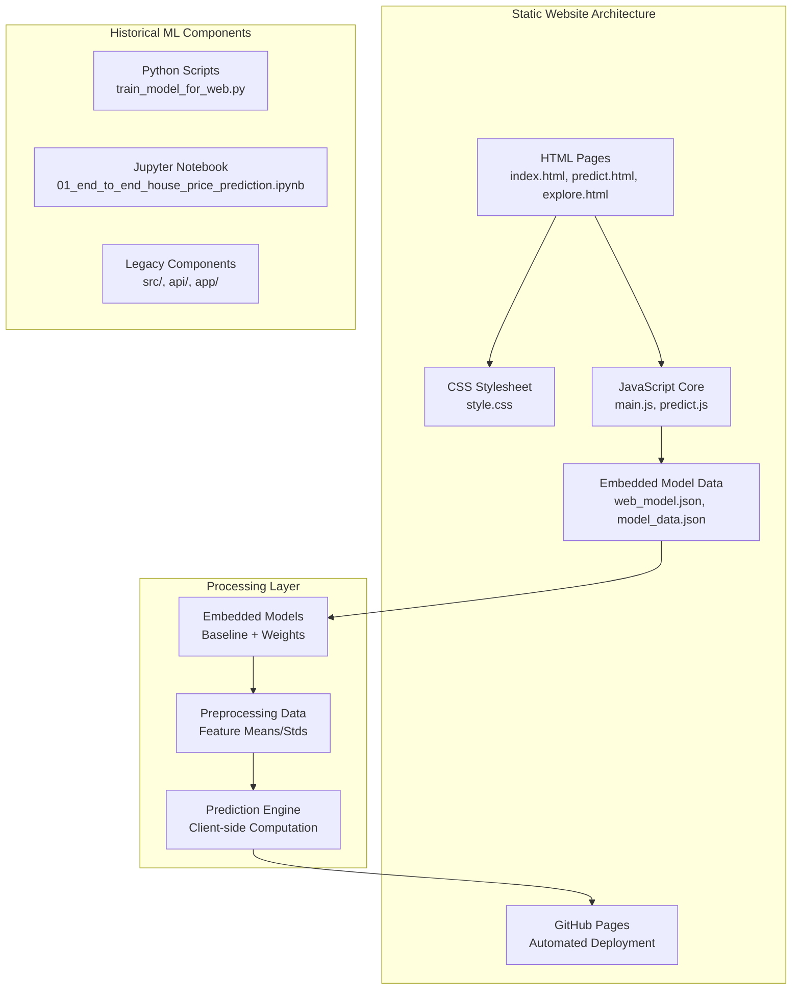
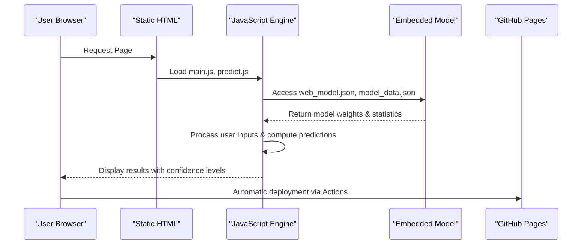
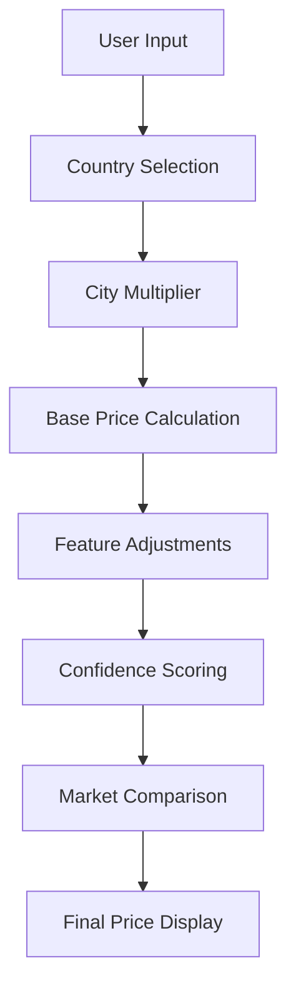

# Machine Learning Pipeline

<cite>
**Referenced Files in This Document**
- [README.md](file://README.md)
- [global-housing-static/index.html](file://global-housing-static/index.html)
- [global-housing-static/js/main.js](file://global-housing-static/js/main.js)
- [global-housing-static/js/predict.js](file://global-housing-static/js/predict.js)
- [global-housing-static/about.html](file://global-housing-static/about.html)
- [docs/model_data.json](file://docs/model_data.json)
- [docs/web_model.json](file://docs/web_model.json)
- [notebooks/01_end_to_end_house_price_prediction.ipynb](file://notebooks/01_end_to_end_house_price_prediction.ipynb)
- [train_model_for_web.py](file://train_model_for_web.py)
</cite>

## Update Summary
**Changes Made**
- Completely restructured documentation to reflect the transition from Python-based ML pipeline to static website implementation
- Updated architecture diagrams to show pure client-side JavaScript implementation
- Removed all references to Python-based model serving infrastructure
- Added documentation for static model export and client-side prediction
- Updated deployment approach to focus on GitHub Pages static hosting
- Revised practical examples to demonstrate static JavaScript implementation
- Added new sections covering static model data formats and client-side processing

## Table of Contents
1. [Introduction](#introduction)
2. [Project Structure](#project-structure)
3. [Core Components](#core-components)
4. [Architecture Overview](#architecture-overview)
5. [Detailed Component Analysis](#detailed-component-analysis)
6. [Static Model Implementation](#static-model-implementation)
7. [Deployment and Hosting](#deployment-and-hosting)
8. [Performance Considerations](#performance-considerations)
9. [Troubleshooting Guide](#troubleshooting-guide)
10. [Conclusion](#conclusion)
11. [Appendices](#appendices)

## Introduction
This document describes the end-to-end machine learning pipeline that has been transformed into a modern static website implementation for the Global Housing Predictor project. The project has evolved from a Python-based machine learning application to a pure JavaScript static website that demonstrates machine learning concepts through client-side computation. The implementation showcases a sophisticated prediction engine built entirely in JavaScript, utilizing exported model data for price estimation across 50+ countries and 95+ cities. The pipeline emphasizes fast loading, offline capability, and seamless deployment through GitHub Pages without any server infrastructure.

**Updated** The project now represents a fully static implementation that demonstrates machine learning concepts through modern web technologies.

## Project Structure
The repository has been restructured to focus entirely on static website implementation with embedded machine learning models:
- Static HTML pages with semantic markup and responsive design
- Pure JavaScript implementation for all computational logic
- Embedded model data files for offline computation
- CSS styling with modern design principles
- GitHub Actions workflow for automated deployment
- Comprehensive country and city data with pricing multipliers

**Diagram sources**
- [global-housing-static/index.html:1-285](file://global-housing-static/index.html#L1-L285)
- [global-housing-static/js/main.js:1-210](file://global-housing-static/js/main.js#L1-L210)
- [global-housing-static/js/predict.js:1-166](file://global-housing-static/js/predict.js#L1-L166)
- [docs/web_model.json:1-129](file://docs/web_model.json#L1-L129)
- [docs/model_data.json:1-171](file://docs/model_data.json#L1-L171)

**Section sources**
- [README.md:36-55](file://README.md#L36-L55)
- [README.md:65-98](file://README.md#L65-L98)

## Core Components
- **Static HTML Pages**: Semantic markup with responsive design, navigation, and interactive elements
- **JavaScript Core Engine**: Mobile navigation, data management, and currency formatting utilities
- **Prediction Calculator**: Sophisticated client-side price estimation with property feature adjustments
- **Country and City Database**: Comprehensive global coverage with pricing multipliers and currency information
- **Embedded Model Data**: Exported model weights, feature means, and preprocessing statistics
- **Static Model Format**: Optimized JSON structure for fast client-side computation
- **GitHub Pages Deployment**: Automated deployment workflow via GitHub Actions

**Updated** All components now serve static website functionality with embedded machine learning capabilities.

**Section sources**
- [global-housing-static/index.html:1-285](file://global-housing-static/index.html#L1-L285)
- [global-housing-static/js/main.js:1-210](file://global-housing-static/js/main.js#L1-L210)
- [global-housing-static/js/predict.js:1-166](file://global-housing-static/js/predict.js#L1-L166)
- [docs/web_model.json:1-129](file://docs/web_model.json#L1-L129)

## Architecture Overview
The static website architecture follows a pure client-side approach with embedded machine learning:
- Static HTML pages provide the user interface with semantic markup
- JavaScript handles all computational logic and data management
- Embedded model data enables offline computation without server requests
- Responsive design ensures optimal experience across devices
- GitHub Actions automate deployment to GitHub Pages
- Currency formatting and internationalization support global users

**Updated** The architecture now emphasizes static implementation with client-side model execution.

**Diagram sources**
- [global-housing-static/js/predict.js:90-157](file://global-housing-static/js/predict.js#L90-L157)
- [docs/web_model.json:1-129](file://docs/web_model.json#L1-L129)
- [README.md:65-98](file://README.md#L65-L98)

## Detailed Component Analysis

### Static HTML Structure
- **Semantic Markup**: Proper HTML5 structure with header, nav, main, and footer sections
- **Responsive Design**: Mobile-first approach with flexible grid layouts
- **Interactive Elements**: Form validation, dropdown menus, and dynamic content
- **SEO Optimization**: Proper meta tags, structured content, and accessibility features
- **Performance**: Minimal external dependencies, optimized image loading

**Section sources**
- [global-housing-static/index.html:1-285](file://global-housing-static/index.html#L1-L285)
- [global-housing-static/about.html:1-128](file://global-housing-static/about.html#L1-L128)

### JavaScript Core Functionality
- **Mobile Navigation**: Toggle functionality for responsive navigation bars
- **Hero Search**: Location-based property search with query parameter handling
- **Global Data Management**: Centralized country, city, and property data storage
- **Currency Formatting**: International currency display with proper symbols and formatting
- **Property Display**: Dynamic property cards with emoji icons and trend indicators

**Section sources**
- [global-housing-static/js/main.js:1-210](file://global-housing-static/js/main.js#L1-L210)

### Prediction Calculation Engine
- **Base Price Calculation**: Country and city-based pricing foundation
- **Feature Adjustments**: Bedroom/bathroom bonuses, age discounts, amenity premiums
- **Confidence Scoring**: Data quality-based confidence levels for different regions
- **Market Comparison**: Contextual analysis comparing to local averages
- **Range Estimation**: ±15% price range calculation for realistic expectations

**Section sources**
- [global-housing-static/js/predict.js:90-157](file://global-housing-static/js/predict.js#L90-L157)

## Static Model Implementation
The machine learning model has been transformed into a static JavaScript implementation:
- **Embedded Model Data**: Complete model weights and preprocessing statistics
- **Client-Side Computation**: All calculations performed in the browser
- **Offline Capability**: No server dependencies or internet connectivity required
- **Fast Loading**: Minimal payload with optimized JSON structure
- **Version Management**: Clear version tracking for model updates

**Diagram sources**
- [global-housing-static/js/predict.js:108-152](file://global-housing-static/js/predict.js#L108-L152)
- [docs/web_model.json:1-129](file://docs/web_model.json#L1-L129)

**Section sources**
- [docs/web_model.json:1-129](file://docs/web_model.json#L1-L129)
- [docs/model_data.json:1-171](file://docs/model_data.json#L1-L171)

## Deployment and Hosting
The static website utilizes GitHub Pages for automated deployment:
- **GitHub Actions Workflow**: Automated build and deployment process
- **Zero Configuration**: Simple push-to-deploy workflow
- **Global CDN**: GitHub Pages provides worldwide content delivery
- **SSL/TLS**: Automatic HTTPS encryption
- **Custom Domains**: Support for custom domain configuration

**Section sources**
- [README.md:65-98](file://README.md#L65-L98)

## Performance Considerations
- **Static Delivery**: HTML, CSS, and JavaScript served as static assets
- **Minimal Dependencies**: Pure vanilla JavaScript with no external frameworks
- **Embedded Models**: All model data loaded locally for instant computation
- **Optimized Images**: High-quality images with appropriate compression
- **Responsive Design**: Efficient mobile-first CSS with progressive enhancement
- **Offline Capability**: All functionality works without network connectivity
- **Fast Initialization**: Minimal JavaScript execution for quick page loads

**Updated** Performance now focuses on static delivery and client-side computation efficiency.

## Troubleshooting Guide
Common issues and resolutions:
- **Page Not Loading**: Verify all static files are properly uploaded to the repository root
- **Model Data Issues**: Ensure web_model.json and model_data.json are accessible and properly formatted
- **JavaScript Errors**: Check browser console for syntax errors or missing dependencies
- **Deployment Failures**: Review GitHub Actions workflow logs for build errors
- **Styling Problems**: Verify CSS file paths and ensure proper relative linking
- **Prediction Not Working**: Check that all required JavaScript files are loaded and accessible
- **Image Loading**: Ensure image URLs are correct and hosted appropriately

**Updated** Added troubleshooting for static deployment and client-side JavaScript issues.

**Section sources**
- [README.md:147-152](file://README.md#L147-L152)
- [global-housing-static/js/predict.js:103-106](file://global-housing-static/js/predict.js#L103-L106)

## Conclusion
The machine learning pipeline has successfully transformed into a sophisticated static website implementation that demonstrates advanced machine learning concepts through modern web technologies. The pure JavaScript approach eliminates server infrastructure requirements while maintaining powerful predictive capabilities. The implementation showcases embedded model data, client-side computation, and seamless deployment through GitHub Pages. This architecture provides a scalable, maintainable solution that leverages the strengths of static site generation while delivering dynamic, data-driven functionality to users worldwide.

**Updated** The conclusion now emphasizes the successful transformation to static implementation.

## Appendices

### Appendix A: Complete Workflow References
- Static HTML pages: [global-housing-static/index.html](file://global-housing-static/index.html), [global-housing-static/about.html](file://global-housing-static/about.html)
- JavaScript core: [global-housing-static/js/main.js](file://global-housing-static/js/main.js), [global-housing-static/js/predict.js](file://global-housing-static/js/predict.js)
- Static model data: [docs/web_model.json](file://docs/web_model.json), [docs/model_data.json](file://docs/model_data.json)
- Deployment configuration: [README.md](file://README.md)
- Legacy components: [notebooks/01_end_to_end_house_price_prediction.ipynb](file://notebooks/01_end_to_end_house_price_prediction.ipynb), [train_model_for_web.py](file://train_model_for_web.py)

**Updated** References now focus on static implementation components.