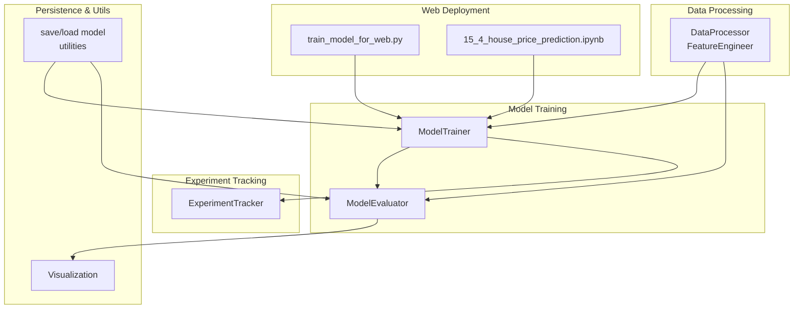
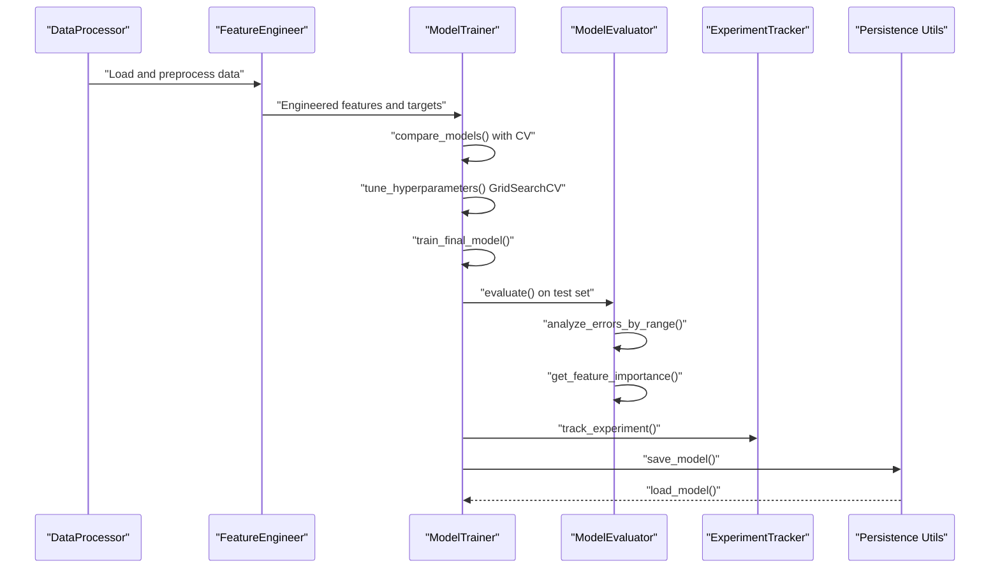
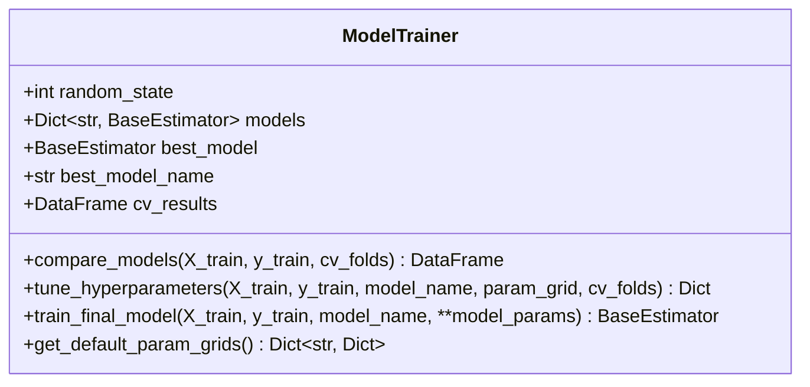
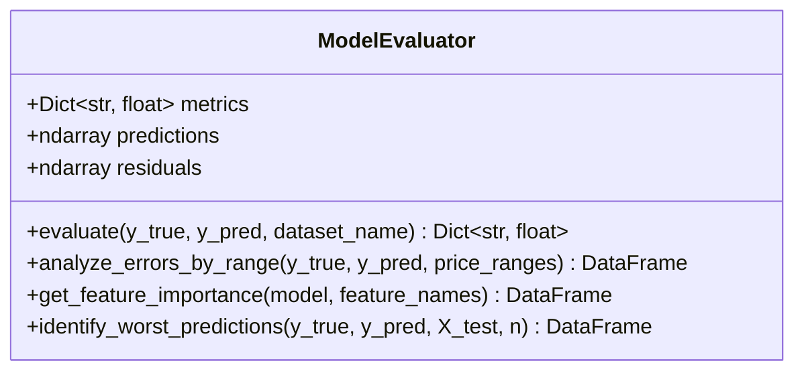
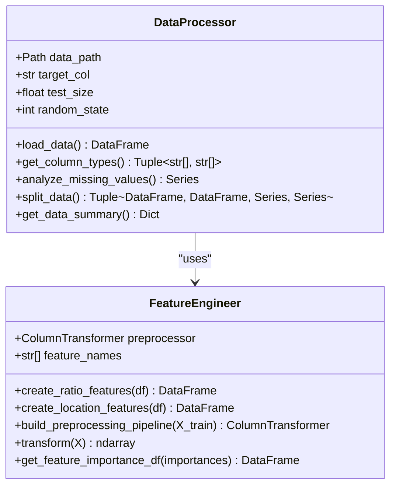
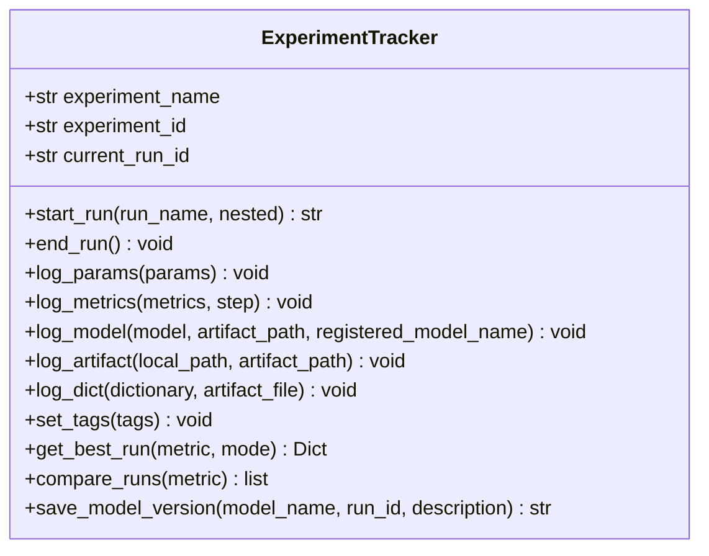
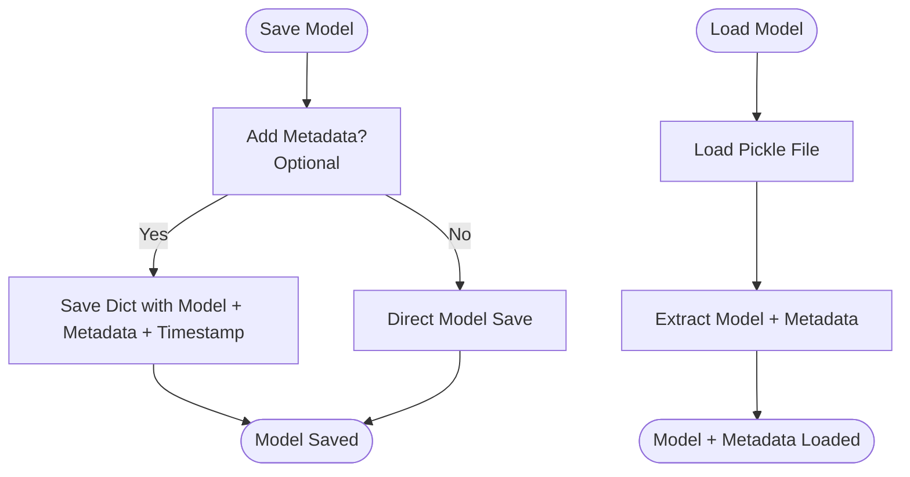
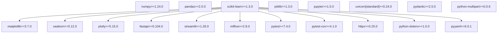

# Model Training and Evaluation

<cite>
**Referenced Files in This Document**
- [src/models.py](file://src/models.py)
- [src/data_processing.py](file://src/data_processing.py)
- [src/experiment_tracking.py](file://src/experiment_tracking.py)
- [src/utils.py](file://src/utils.py)
- [src/visualization.py](file://src/visualization.py)
- [train_model_for_web.py](file://train_model_for_web.py)
- [15_4_house_price_prediction.ipynb](file://15_4_house_price_prediction.ipynb)
- [requirements.txt](file://requirements.txt)
- [setup.py](file://setup.py)
</cite>

## Table of Contents
1. [Introduction](#introduction)
2. [Project Structure](#project-structure)
3. [Core Components](#core-components)
4. [Architecture Overview](#architecture-overview)
5. [Detailed Component Analysis](#detailed-component-analysis)
6. [Dependency Analysis](#dependency-analysis)
7. [Performance Considerations](#performance-considerations)
8. [Troubleshooting Guide](#troubleshooting-guide)
9. [Conclusion](#conclusion)

## Introduction
This document provides comprehensive coverage of the model training and evaluation component for the California Housing Price Prediction project. It documents the end-to-end training workflow, multi-algorithm comparison (Linear Regression, Random Forest, Gradient Boosting), cross-validation strategies, hyperparameter tuning with GridSearchCV, and comprehensive evaluation metrics (RMSE, MAE, R²). It also explains model persistence and loading mechanisms, feature importance extraction, and performance analysis across different price ranges. Practical examples are drawn from the Jupyter notebook demonstrating training, evaluation, and comparison of different algorithms.

## Project Structure
The model training and evaluation functionality is organized across several modules:
- Data processing and feature engineering
- Model training, comparison, and evaluation
- Experiment tracking with MLflow
- Persistence utilities and visualization
- End-to-end training script for web deployment

**Diagram sources**
- [src/data_processing.py:22-341](file://src/data_processing.py#L22-L341)
- [src/models.py:30-366](file://src/models.py#L30-L366)
- [src/experiment_tracking.py:19-307](file://src/experiment_tracking.py#L19-L307)
- [src/utils.py:58-98](file://src/utils.py#L58-L98)
- [src/visualization.py:23-261](file://src/visualization.py#L23-L261)
- [train_model_for_web.py:1-196](file://train_model_for_web.py#L1-L196)
- [15_4_house_price_prediction.ipynb:1-1192](file://15_4_house_price_prediction.ipynb#L1-L1192)

**Section sources**
- [src/data_processing.py:22-341](file://src/data_processing.py#L22-L341)
- [src/models.py:30-366](file://src/models.py#L30-L366)
- [src/experiment_tracking.py:19-307](file://src/experiment_tracking.py#L19-L307)
- [src/utils.py:58-98](file://src/utils.py#L58-L98)
- [src/visualization.py:23-261](file://src/visualization.py#L23-L261)
- [train_model_for_web.py:1-196](file://train_model_for_web.py#L1-L196)
- [15_4_house_price_prediction.ipynb:1-1192](file://15_4_house_price_prediction.ipynb#L1-L1192)

## Core Components
This section outlines the primary components responsible for training, evaluation, and persistence of the model.

- **ModelTrainer**: Implements systematic model comparison via cross-validation, hyperparameter tuning with GridSearchCV, and final model training with optimal parameters.
- **ModelEvaluator**: Provides comprehensive evaluation metrics, error analysis by price ranges, feature importance extraction, and identification of worst predictions.
- **DataProcessor and FeatureEngineer**: Handle data loading, cleaning, train/test splitting, and feature engineering including ratio features and location-based features.
- **ExperimentTracker**: Manages MLflow experiment tracking, logging parameters, metrics, and artifacts.
- **Persistence Utilities**: Joblib-based saving/loading of models with metadata support.
- **Visualization**: EDA visualizations and evaluation plots for model diagnostics.

**Section sources**
- [src/models.py:30-366](file://src/models.py#L30-L366)
- [src/data_processing.py:22-341](file://src/data_processing.py#L22-L341)
- [src/experiment_tracking.py:19-307](file://src/experiment_tracking.py#L19-L307)
- [src/utils.py:58-98](file://src/utils.py#L58-L98)
- [src/visualization.py:23-261](file://src/visualization.py#L23-L261)

## Architecture Overview
The training and evaluation architecture integrates data processing, model training, evaluation, and persistence into a cohesive workflow.

**Diagram sources**
- [src/data_processing.py:122-157](file://src/data_processing.py#L122-L157)
- [src/models.py:54-178](file://src/models.py#L54-L178)
- [src/experiment_tracking.py:254-307](file://src/experiment_tracking.py#L254-L307)
- [src/utils.py:58-98](file://src/utils.py#L58-L98)

**Section sources**
- [src/models.py:30-366](file://src/models.py#L30-L366)
- [src/data_processing.py:22-341](file://src/data_processing.py#L22-L341)
- [src/experiment_tracking.py:19-307](file://src/experiment_tracking.py#L19-L307)
- [src/utils.py:58-98](file://src/utils.py#L58-L98)

## Detailed Component Analysis

### ModelTrainer: Multi-Algorithm Comparison and Hyperparameter Tuning
The ModelTrainer class orchestrates the training workflow:
- **Model Comparison**: Uses K-Fold cross-validation with multiple scoring metrics (RMSE, MAE, R²) to compare baseline and advanced models.
- **Hyperparameter Tuning**: Applies GridSearchCV with negative RMSE scoring to optimize model parameters.
- **Final Training**: Retrains the best-performing model with tuned parameters.

Key capabilities:
- Compares multiple algorithms: Linear Regression, Ridge, Lasso, Random Forest, HistGradientBoosting.
- Default parameter grids tailored to each algorithm.
- Cross-validation results stored for downstream analysis.

**Diagram sources**
- [src/models.py:30-206](file://src/models.py#L30-L206)

**Section sources**
- [src/models.py:30-206](file://src/models.py#L30-L206)

### ModelEvaluator: Comprehensive Metrics and Analysis
The ModelEvaluator provides in-depth assessment:
- **Evaluation Metrics**: RMSE, MAE, MAPE, R², mean residual, standard deviation of residuals.
- **Error Analysis by Range**: Analyzes prediction errors across different price ranges to understand model behavior on various property types.
- **Feature Importance Extraction**: Supports both tree-based and linear models (tree importances or absolute coefficients).
- **Worst Predictions**: Identifies samples with the largest prediction errors for deeper inspection.

**Diagram sources**
- [src/models.py:208-351](file://src/models.py#L208-L351)

**Section sources**
- [src/models.py:208-351](file://src/models.py#L208-L351)

### DataProcessor and FeatureEngineer: Robust Data Preparation
These components handle:
- **Data Loading and Cleaning**: Missing value analysis, data type detection, and error handling.
- **Train/Test Splitting**: Stratified sampling based on income categories to maintain representativeness.
- **Feature Engineering**: Creation of ratio features (rooms per household, bedrooms per room, population per household) and location-based features (distances to major cities).
- **Preprocessing Pipeline**: ColumnTransformer with separate pipelines for numerical and categorical features, including imputation and scaling.

**Diagram sources**
- [src/data_processing.py:22-341](file://src/data_processing.py#L22-L341)

**Section sources**
- [src/data_processing.py:22-341](file://src/data_processing.py#L22-L341)

### ExperimentTracker: MLflow Integration
The ExperimentTracker manages experiment lifecycle:
- **Run Management**: Start/end runs, set tags, and log parameters and metrics.
- **Artifact Logging**: Logs models, preprocessors, and dictionaries as artifacts.
- **Best Run Selection**: Retrieves best runs based on specified metrics.
- **Model Registry**: Saves model versions to MLflow model registry.

**Diagram sources**
- [src/experiment_tracking.py:19-307](file://src/experiment_tracking.py#L19-L307)

**Section sources**
- [src/experiment_tracking.py:19-307](file://src/experiment_tracking.py#L19-L307)

### Persistence and Loading Mechanisms
The project supports two persistence approaches:
- **Standard Persistence**: Using joblib to save/load models with optional metadata.
- **Enhanced Persistence**: Saving models with metadata and timestamp for reproducibility.

**Diagram sources**
- [src/utils.py:58-98](file://src/utils.py#L58-L98)

**Section sources**
- [src/utils.py:58-98](file://src/utils.py#L58-L98)

### Practical Examples from Jupyter Notebook
The notebook demonstrates:
- **End-to-End Workflow**: From data loading to model evaluation and comparison.
- **Algorithm Comparison**: Shows how different algorithms perform using cross-validation.
- **Hyperparameter Tuning**: Demonstrates GridSearchCV usage for optimization.
- **Evaluation Metrics**: Computes RMSE, MAE, and R² on train/test sets.
- **Feature Engineering**: Adds engineered features and evaluates their impact.

Example highlights:
- Data loading and basic statistics
- EDA visualizations (target distribution, feature distributions)
- Train/test split with stratification
- Feature engineering (ratio and location features)
- Model comparison and tuning
- Evaluation and error analysis

**Section sources**
- [15_4_house_price_prediction.ipynb:1-1192](file://15_4_house_price_prediction.ipynb#L1-L1192)

## Dependency Analysis
The project relies on a well-defined set of dependencies supporting data processing, modeling, visualization, API development, and experiment tracking.

**Diagram sources**
- [requirements.txt:1-36](file://requirements.txt#L1-L36)

**Section sources**
- [requirements.txt:1-36](file://requirements.txt#L1-L36)
- [setup.py:1-73](file://setup.py#L1-L73)

## Performance Considerations
- **Cross-Validation Strategy**: K-Fold CV ensures robust estimates of model performance across different data partitions.
- **Hyperparameter Tuning**: GridSearchCV with appropriate scoring (negative RMSE) prevents overfitting and improves generalization.
- **Feature Engineering**: Ratio and location-based features enhance predictive power by capturing meaningful relationships.
- **Pipeline Efficiency**: ColumnTransformer and Pipeline streamline preprocessing and modeling steps, reducing redundancy.
- **Memory Management**: Joblib-based persistence minimizes overhead during model serialization/deserialization.

## Troubleshooting Guide
Common issues and resolutions:
- **Missing Values**: Use FeatureEngineer's imputation pipelines to handle missing data consistently.
- **Overfitting**: Employ cross-validation and hyperparameter tuning to select robust models.
- **Poor Performance**: Analyze error distributions and worst predictions to identify problematic regions or features.
- **Persistence Issues**: Ensure joblib compatibility and include metadata for reproducible model loading.

**Section sources**
- [src/data_processing.py:22-341](file://src/data_processing.py#L22-L341)
- [src/models.py:208-351](file://src/models.py#L208-L351)
- [src/utils.py:58-98](file://src/utils.py#L58-L98)

## Conclusion
The model training and evaluation component provides a robust, reproducible workflow for California housing price prediction. It integrates comprehensive data processing, multi-algorithm comparison, rigorous cross-validation, hyperparameter tuning, and detailed evaluation metrics. The modular design supports experimentation, persistence, and deployment readiness, while the notebook offers practical examples demonstrating end-to-end training and evaluation.