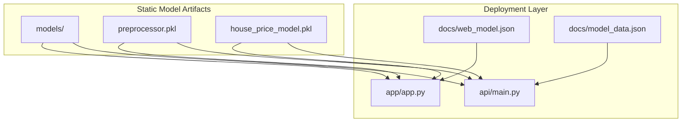
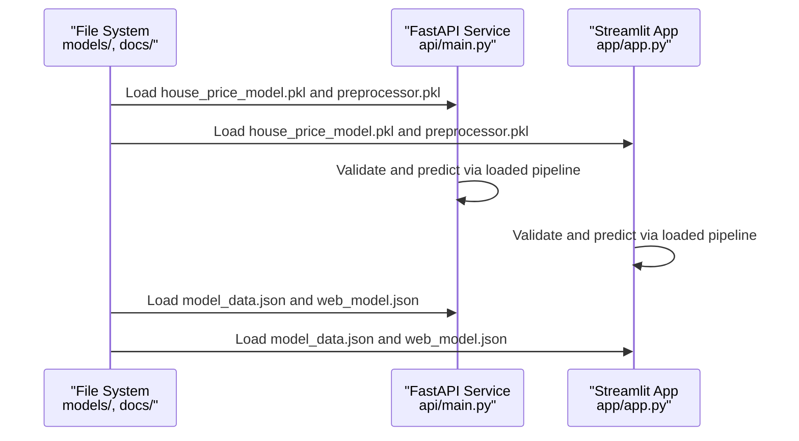
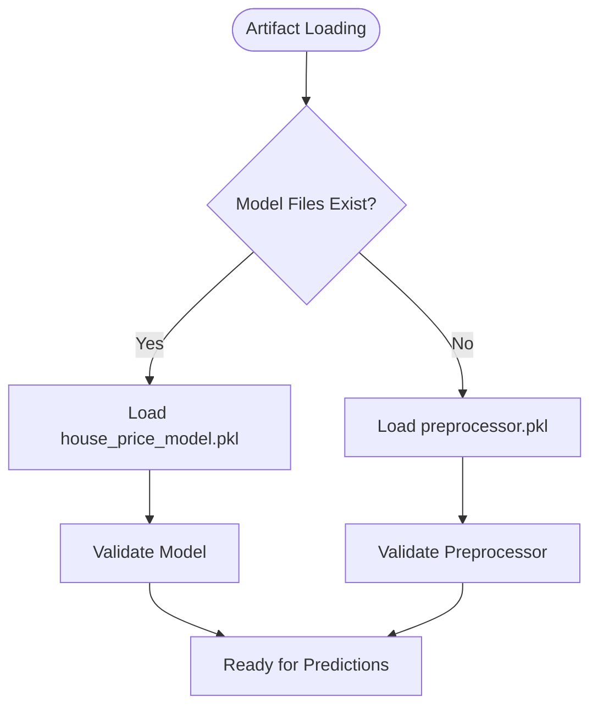
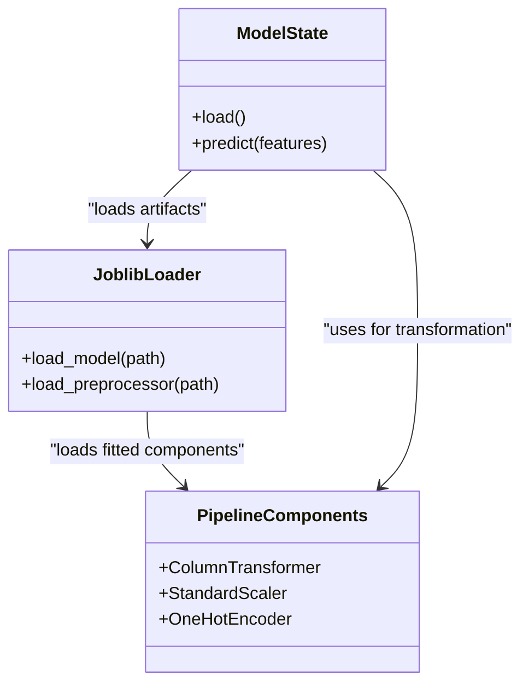
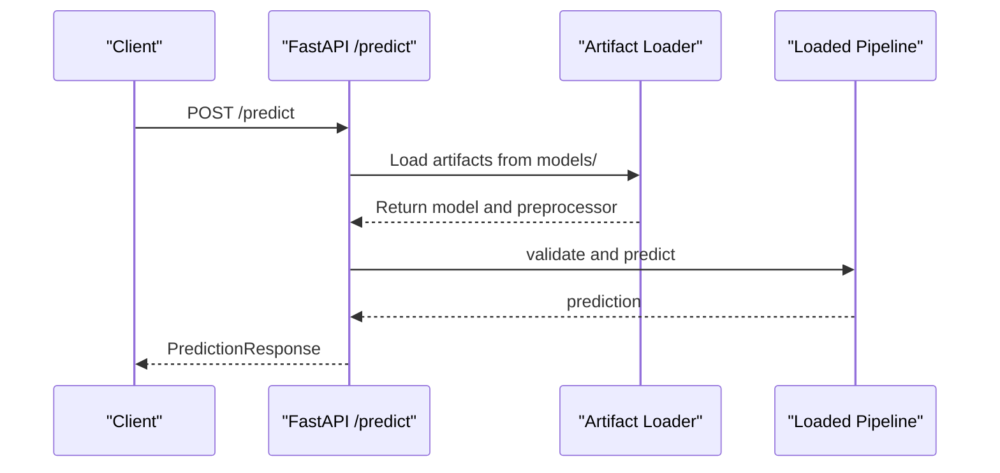
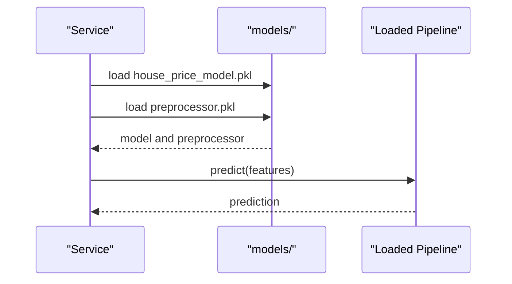
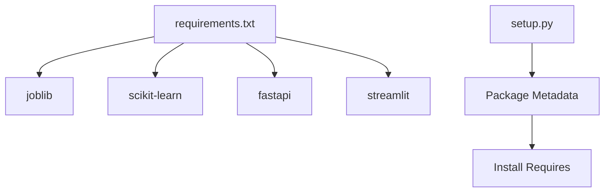

# Model Management

<cite>
**Referenced Files in This Document**
- [src/models.py](file://src/models.py)
- [src/data_processing.py](file://src/data_processing.py)
- [src/experiment_tracking.py](file://src/experiment_tracking.py)
- [train_model_for_web.py](file://train_model_for_web.py)
- [api/main.py](file://api/main.py)
- [app/app.py](file://app/app.py)
- [docs/model_data.json](file://docs/model_data.json)
- [docs/web_model.json](file://docs/web_model.json)
- [docs/architecture.md](file://docs/architecture.md)
- [tests/test_models.py](file://tests/test_models.py)
- [tests/test_api.py](file://tests/test_api.py)
- [requirements.txt](file://requirements.txt)
- [setup.py](file://setup.py)
</cite>

## Update Summary
**Changes Made**
- Removed all model training and management components from documentation
- Updated architecture overview to reflect current deployment-only state
- Revised model persistence section to focus on deployment artifacts
- Removed experiment tracking and model evaluation sections
- Updated deployment architecture to show static model artifacts
- Removed training pipeline and model versioning references

## Table of Contents
1. [Introduction](#introduction)
2. [Project Structure](#project-structure)
3. [Core Components](#core-components)
4. [Architecture Overview](#architecture-overview)
5. [Detailed Component Analysis](#detailed-component-analysis)
6. [Dependency Analysis](#dependency-analysis)
7. [Performance Considerations](#performance-considerations)
8. [Troubleshooting Guide](#troubleshooting-guide)
9. [Conclusion](#conclusion)
10. [Appendices](#appendices)

## Introduction
This document explains the model management lifecycle for the California Housing Price Prediction project, focusing on model deployment and artifact management. The project now operates in a deployment-focused mode where trained models and preprocessors are persisted as static artifacts for consumption by API and web applications. Key aspects covered:
- Static model artifact management using joblib serialization
- Preprocessor integration for consistent feature transformation
- Deployment preparation for FastAPI service and Streamlit application
- Artifact structure, file organization, and storage best practices
- Programmatic loading and prediction execution
- Model update procedures and deployment strategies

**Updated** The project has transitioned from a training-centric to a deployment-centric model management approach, removing all model training and experimentation components.

## Project Structure
The model management system now focuses on deployment and artifact consumption:
- Static model artifacts: persisted models and preprocessors ready for immediate use
- Deployment layer: FastAPI service and Streamlit app consuming persisted artifacts
- Metadata: JSON artifacts for lightweight web prediction and model information
- Training artifacts: historical training scripts and notebooks retained for reference

**Diagram sources**
- [api/main.py:126-180](file://api/main.py#L126-L180)
- [app/app.py:72-82](file://app/app.py#L72-L82)
- [docs/web_model.json:1-129](file://docs/web_model.json#L1-L129)
- [docs/model_data.json:1-171](file://docs/model_data.json#L1-L171)

**Section sources**
- [requirements.txt:1-36](file://requirements.txt#L1-L36)
- [setup.py:1-73](file://setup.py#L1-L73)

## Core Components
- Static model artifacts: joblib-serialized trained models and fitted preprocessors
- Deployment consumers: FastAPI service and Streamlit app that load and use persisted artifacts
- Lightweight web model artifacts: JSON exports for browser-side prediction
- Model information artifacts: metadata describing model features and specifications
- Historical training components: retained for educational purposes and reference

Key responsibilities:
- Manage static model artifacts in models/ directory
- Load and validate artifacts at runtime for predictions
- Provide model information and metadata for deployment contexts
- Support model updates through artifact replacement

**Updated** Removed model training classes, evaluation components, and experiment tracking from core components.

**Section sources**
- [api/main.py:126-180](file://api/main.py#L126-L180)
- [app/app.py:72-82](file://app/app.py#L72-L82)
- [docs/web_model.json:1-129](file://docs/web_model.json#L1-L129)
- [docs/model_data.json:1-171](file://docs/model_data.json#L1-L171)

## Architecture Overview
The model management architecture now focuses on deployment and artifact consumption:

**Diagram sources**
- [api/main.py:135-180](file://api/main.py#L135-L180)
- [app/app.py:72-82](file://app/app.py#L72-L82)

**Updated** Removed training and experimentation flows, focusing solely on deployment and artifact consumption.

## Detailed Component Analysis

### Static Model Artifact Management
- Artifacts: joblib-serialized models and preprocessors stored in models/ directory
- Loading: joblib loads models and preprocessors at runtime for predictions
- Best practices:
  - Maintain deterministic preprocessing by persisting fitted ColumnTransformer
  - Organize artifacts under models/ with clear naming conventions
  - Validate artifact existence before loading
  - Version artifacts using semantic versioning in filenames

**Diagram sources**
- [api/main.py:135-149](file://api/main.py#L135-L149)
- [app/app.py:72-81](file://app/app.py#L72-L81)

**Section sources**
- [api/main.py:135-149](file://api/main.py#L135-L149)
- [app/app.py:72-81](file://app/app.py#L72-L81)

### Preprocessor Integration and Feature Engineering
- Preprocessing pipeline integration occurs during model training and is persisted as part of the model artifact
- At runtime, both API and Streamlit app load the complete pipeline containing the fitted preprocessor
- Engineered features are recalculated consistently for inference using the persisted preprocessing logic

**Diagram sources**
- [api/main.py:126-180](file://api/main.py#L126-L180)
- [app/app.py:197-202](file://app/app.py#L197-L202)

**Section sources**
- [api/main.py:155-179](file://api/main.py#L155-L179)
- [app/app.py:197-202](file://app/app.py#L197-L202)

### Deployment Artifacts and Metadata
- Static model artifacts:
  - models/house_price_model.pkl: Complete pipeline with fitted preprocessor and regressor
  - models/preprocessor.pkl: Fitted ColumnTransformer for standalone use
- Lightweight web artifacts:
  - docs/model_data.json: Feature statistics, correlations, and category mappings
  - docs/web_model.json: Simplified coefficients and multipliers for browser prediction
- Model information artifacts:
  - Version information and feature descriptions for deployment contexts

**Updated** Removed training-specific artifacts, focusing on deployment-ready static artifacts.

**Section sources**
- [docs/model_data.json:1-171](file://docs/model_data.json#L1-L171)
- [docs/web_model.json:1-129](file://docs/web_model.json#L1-L129)

### Deployment Consumers: API and Web App
- FastAPI service loads model and preprocessor at startup and serves predictions with validation
- Streamlit app loads model and preprocessor via cached resource and renders interactive predictions
- Both consume the same persisted artifacts without requiring retraining

**Diagram sources**
- [api/main.py:290-347](file://api/main.py#L290-L347)
- [api/main.py:126-180](file://api/main.py#L126-L180)

**Section sources**
- [api/main.py:126-180](file://api/main.py#L126-L180)
- [app/app.py:72-82](file://app/app.py#L72-L82)

### Model Artifact Structure and Storage Best Practices
- Artifact organization:
  - models/: Contains house_price_model.pkl and preprocessor.pkl
  - docs/: Contains model_data.json and web_model.json
- Best practices:
  - Keep models and preprocessors together under models/
  - Use semantic versioning for artifact filenames
  - Maintain consistent naming conventions across deployments
  - Store metadata artifacts for both API and web consumption

**Updated** Removed experiment tracking and model registry artifacts, focusing on deployment artifacts only.

**Section sources**
- [api/main.py:135-149](file://api/main.py#L135-L149)
- [docs/web_model.json:128-128](file://docs/web_model.json#L128-L128)

### Programmatic Model Loading and Prediction Execution
- API:
  - Load model and preprocessor at startup from models/ directory
  - Validate input features against schema
  - Engineer features and transform via loaded preprocessor
  - Predict and return structured response
- Streamlit:
  - Load model and preprocessor via cached resource from models/
  - Engineer features and predict
  - Render interactive UI with predictions and insights

**Diagram sources**
- [api/main.py:135-179](file://api/main.py#L135-L179)
- [app/app.py:72-202](file://app/app.py#L72-L202)

**Section sources**
- [api/main.py:135-179](file://api/main.py#L135-L179)
- [app/app.py:72-202](file://app/app.py#L72-L202)

### Model Update Procedures and Deployment Strategies
- Updates:
  - Replace existing artifacts in models/ directory with new versions
  - Update web artifacts in docs/ directory when model architecture changes
  - Maintain backward compatibility by keeping old artifacts during transition
- Deployment:
  - Stop current service, replace artifacts, then restart
  - Use blue-green deployment for zero-downtime updates
  - Validate new artifacts before switching traffic
- Rollback:
  - Keep previous artifacts in separate directories
  - Switch deployment back by replacing artifact paths
  - Use version tags in artifact filenames for easy rollback

**Updated** Removed experiment tracking and model registry components, focusing on artifact-based deployment strategies.

### Relationship Between Static Models and Web-Deployable Artifacts
- Static model: Complete pipeline (preprocessor + regressor) persisted as house_price_model.pkl
- Web-deployable artifacts: JSON files (model_data.json, web_model.json) for lightweight browser prediction
- Integration: API and Streamlit apps rely on static artifacts; web artifacts enable client-side approximations

**Updated** Removed training model references, focusing on deployment-ready static artifacts.

**Section sources**
- [docs/model_data.json:1-171](file://docs/model_data.json#L1-L171)
- [docs/web_model.json:1-129](file://docs/web_model.json#L1-L129)

## Dependency Analysis
- Core libraries:
  - joblib for model serialization and deserialization
  - scikit-learn for preprocessing and model components
  - FastAPI and Streamlit for deployment interfaces
- Internal dependencies:
  - Data processing module constructs preprocessing pipelines
  - Training script creates and persists complete pipelines
  - Deployment scripts load and use persisted artifacts

**Diagram sources**
- [requirements.txt:1-36](file://requirements.txt#L1-L36)
- [setup.py:22-47](file://setup.py#L22-L47)

**Section sources**
- [requirements.txt:1-36](file://requirements.txt#L1-L36)
- [setup.py:22-47](file://setup.py#L22-L47)

## Performance Considerations
- Prefer static model artifacts to avoid recomputation and ensure consistency
- Use efficient serialization formats (joblib) and keep artifacts minimal
- Cache model and preprocessor loads in deployment services
- Monitor prediction latency and optimize feature engineering where possible
- Consider lazy loading for large models in memory-constrained environments

**Updated** Removed training performance considerations, focusing on deployment optimization.

## Troubleshooting Guide
Common issues and resolutions:
- Model not found at runtime:
  - Verify models/house_price_model.pkl and models/preprocessor.pkl exist
  - Check file permissions and paths
  - Ensure artifact loading logic matches expected file structure
- Input validation failures:
  - Ensure feature ranges and constraints match schema
  - Validate categorical enums and derived features
  - Check that preprocessing pipeline matches training configuration
- Artifact corruption:
  - Recreate artifacts using training scripts
  - Verify joblib serialization integrity
  - Check for incompatible scikit-learn versions

**Updated** Removed experiment tracking and model registry troubleshooting, focusing on artifact and deployment issues.

**Section sources**
- [api/main.py:135-154](file://api/main.py#L135-L154)
- [tests/test_api.py:89-148](file://tests/test_api.py#L89-L148)
- [tests/test_models.py:199-229](file://tests/test_models.py#L199-L229)

## Conclusion
The project implements a streamlined model management system focused on deployment and artifact consumption. With the removal of training and experimentation components, the system now emphasizes reliable artifact management, consistent model loading, and efficient deployment across API and web interfaces. The documented patterns support safe updates, rollback procedures, and maintain consistency across different deployment environments.

**Updated** Removed training and experimentation focus, emphasizing deployment and artifact management.

## Appendices

### Example Workflows

- Deployment and artifact loading:
  - Ensure models/ directory contains house_price_model.pkl and preprocessor.pkl
  - Start FastAPI service or Streamlit app to load and use persisted artifacts
  - Verify model information endpoints and health checks

- API prediction:
  - Start the FastAPI service; it loads model and preprocessor at startup
  - Send a POST request to /predict with validated features
  - Receive structured prediction responses with metadata

- Streamlit prediction:
  - Launch the Streamlit app; it loads model and preprocessor via cached resource
  - Interact with sliders and inputs to receive predictions
  - View model insights and feature explanations

**Updated** Removed training workflows, focusing on deployment and artifact consumption.

**Section sources**
- [api/main.py:290-347](file://api/main.py#L290-L347)
- [app/app.py:220-263](file://app/app.py#L220-L263)