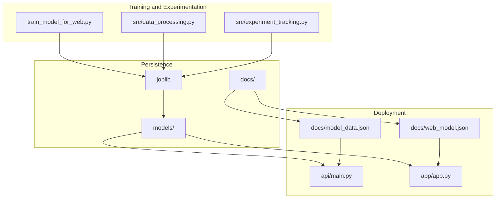
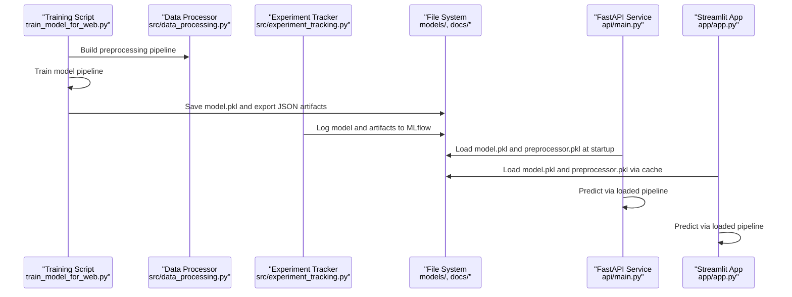
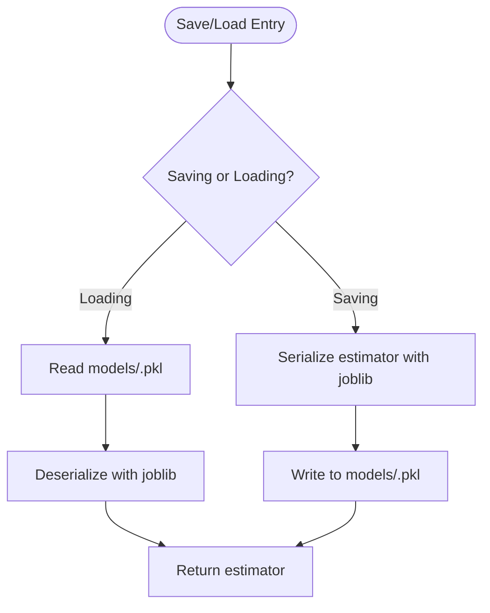
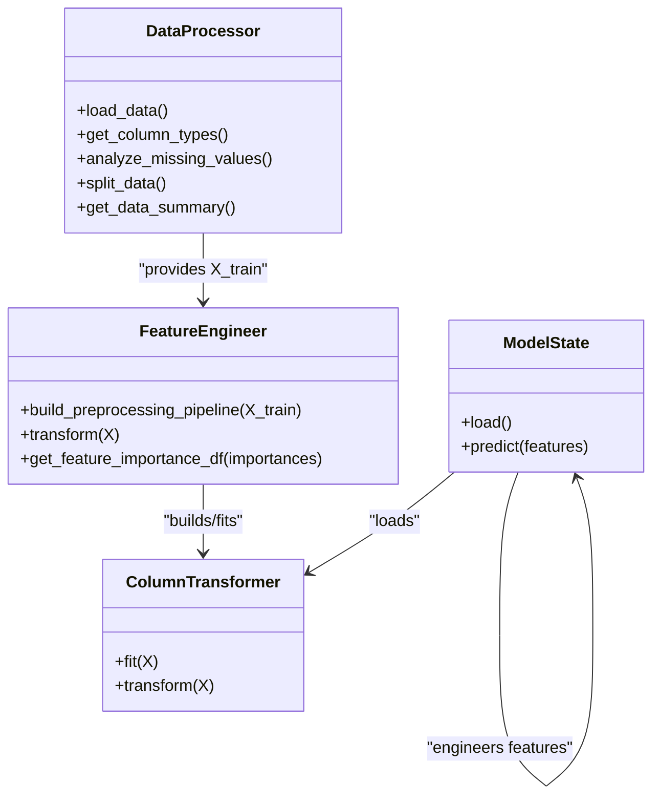
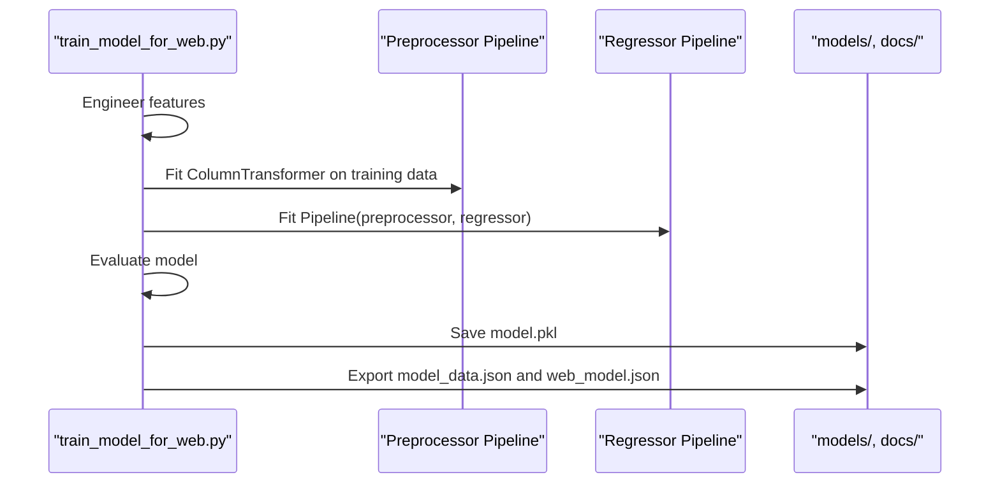
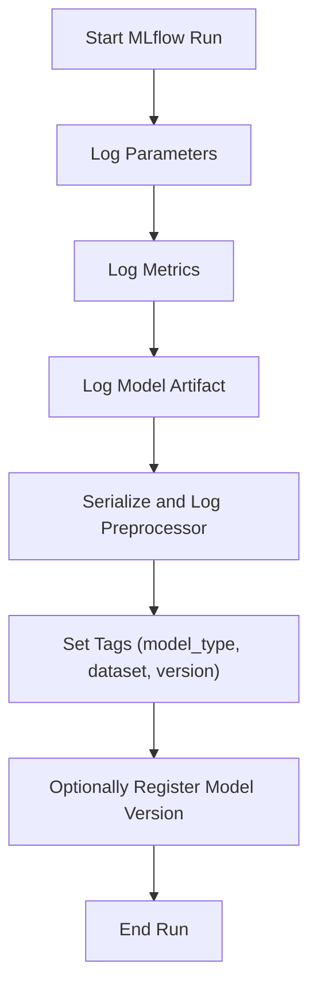
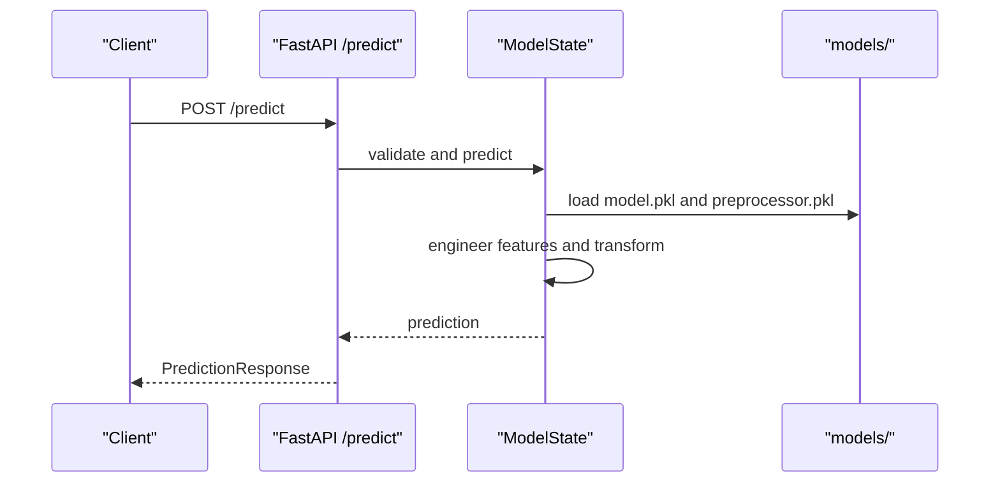
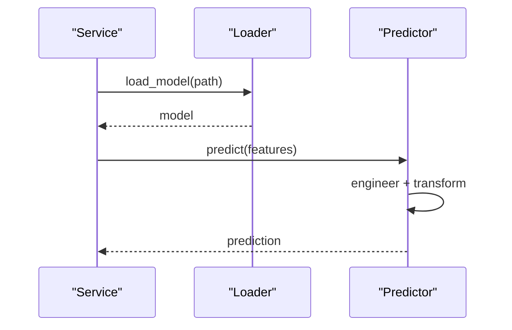
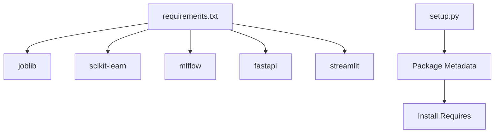

# Model Management

<cite>
**Referenced Files in This Document**
- [src/models.py](file://src/models.py)
- [src/data_processing.py](file://src/data_processing.py)
- [src/experiment_tracking.py](file://src/experiment_tracking.py)
- [train_model_for_web.py](file://train_model_for_web.py)
- [api/main.py](file://api/main.py)
- [app/app.py](file://app/app.py)
- [docs/model_data.json](file://docs/model_data.json)
- [docs/web_model.json](file://docs/web_model.json)
- [tests/test_models.py](file://tests/test_models.py)
- [tests/test_api.py](file://tests/test_api.py)
- [requirements.txt](file://requirements.txt)
- [setup.py](file://setup.py)
</cite>

## Table of Contents
1. [Introduction](#introduction)
2. [Project Structure](#project-structure)
3. [Core Components](#core-components)
4. [Architecture Overview](#architecture-overview)
5. [Detailed Component Analysis](#detailed-component-analysis)
6. [Dependency Analysis](#dependency-analysis)
7. [Performance Considerations](#performance-considerations)
8. [Troubleshooting Guide](#troubleshooting-guide)
9. [Conclusion](#conclusion)
10. [Appendices](#appendices)

## Introduction
This document explains the model management lifecycle for the California Housing Price Prediction project, focusing on model persistence, loading, and deployment strategies. It covers:
- Saving and loading models using joblib
- Preprocessor serialization and integration
- Model versioning and metadata tracking via MLflow
- Deployment preparation for both API and web applications
- Training-to-production integration, validation, and QA
- Artifact structure, file organization, and storage best practices
- Programmatic loading and prediction execution
- Update procedures, rollback strategies, and A/B testing considerations
- Relationship between training models and web-deployable models

## Project Structure
The model management system spans training, experimentation, persistence, and deployment layers:
- Training and preprocessing: centralized in dedicated scripts and modules
- Persistence: joblib-based serialization for models and preprocessors
- Experimentation: MLflow-backed tracking of parameters, metrics, and artifacts
- Deployment: FastAPI service and Streamlit app consuming persisted artifacts
- Metadata: JSON artifacts exported for lightweight web prediction

**Diagram sources**
- [train_model_for_web.py:1-196](file://train_model_for_web.py#L1-L196)
- [src/data_processing.py:1-341](file://src/data_processing.py#L1-L341)
- [src/experiment_tracking.py:1-307](file://src/experiment_tracking.py#L1-L307)
- [api/main.py:1-403](file://api/main.py#L1-L403)
- [app/app.py:1-399](file://app/app.py#L1-L399)
- [docs/web_model.json:1-129](file://docs/web_model.json#L1-L129)
- [docs/model_data.json:1-171](file://docs/model_data.json#L1-L171)

**Section sources**
- [requirements.txt:1-36](file://requirements.txt#L1-L36)
- [setup.py:1-73](file://setup.py#L1-L73)

## Core Components
- Model persistence utilities: save and load functions for scikit-learn estimators
- Data processing and preprocessing pipeline: feature engineering, imputation, scaling, encoding
- Experiment tracking: MLflow integration for parameters, metrics, artifacts, and model registry
- Training pipeline for web deployment: end-to-end training, evaluation, and artifact export
- Deployment consumers: FastAPI service and Streamlit app
- Lightweight web model artifacts: JSON exports for browser-side prediction

Key responsibilities:
- Persist trained models and fitted preprocessors to disk
- Track experiments with MLflow and register model versions
- Export metadata for web apps and APIs
- Load and validate artifacts at runtime for predictions

**Section sources**
- [src/models.py:353-366](file://src/models.py#L353-L366)
- [src/data_processing.py:22-341](file://src/data_processing.py#L22-L341)
- [src/experiment_tracking.py:19-307](file://src/experiment_tracking.py#L19-L307)
- [train_model_for_web.py:108-192](file://train_model_for_web.py#L108-L192)
- [api/main.py:126-180](file://api/main.py#L126-L180)
- [app/app.py:72-82](file://app/app.py#L72-L82)
- [docs/web_model.json:1-129](file://docs/web_model.json#L1-L129)
- [docs/model_data.json:1-171](file://docs/model_data.json#L1-L171)

## Architecture Overview
The model management architecture connects training, persistence, and deployment:

**Diagram sources**
- [train_model_for_web.py:23-192](file://train_model_for_web.py#L23-L192)
- [src/data_processing.py:257-305](file://src/data_processing.py#L257-L305)
- [src/experiment_tracking.py:104-142](file://src/experiment_tracking.py#L104-L142)
- [api/main.py:135-180](file://api/main.py#L135-L180)
- [app/app.py:72-82](file://app/app.py#L72-L82)

## Detailed Component Analysis

### Model Persistence and Loading
- Persistence: joblib is used to serialize trained models and fitted preprocessors to disk
- Loading: joblib loads models and preprocessors at runtime for predictions
- Best practices:
  - Ensure deterministic preprocessing by persisting the fitted ColumnTransformer
  - Save artifacts under a stable directory (models/)
  - Validate artifact existence before loading

**Diagram sources**
- [src/models.py:353-366](file://src/models.py#L353-L366)
- [api/main.py:135-149](file://api/main.py#L135-L149)
- [app/app.py:72-81](file://app/app.py#L72-L81)

**Section sources**
- [src/models.py:353-366](file://src/models.py#L353-L366)
- [api/main.py:135-149](file://api/main.py#L135-L149)
- [app/app.py:72-81](file://app/app.py#L72-L81)

### Preprocessor Serialization and Integration
- Preprocessing pipeline construction and fitting occur during training
- The fitted ColumnTransformer is persisted alongside the model
- At runtime, the API and Streamlit app load both model and preprocessor
- Engineered features are recalculated consistently for inference

**Diagram sources**
- [src/data_processing.py:22-341](file://src/data_processing.py#L22-L341)
- [api/main.py:126-180](file://api/main.py#L126-L180)

**Section sources**
- [src/data_processing.py:257-305](file://src/data_processing.py#L257-L305)
- [api/main.py:155-179](file://api/main.py#L155-L179)
- [app/app.py:197-202](file://app/app.py#L197-L202)

### Model Training and Web Deployment Preparation
- The training script builds features, fits a preprocessing pipeline, trains a regressor, evaluates performance, persists the pipeline, and exports JSON metadata for web usage
- Exports include feature statistics, correlations, and category mappings for lightweight prediction

**Diagram sources**
- [train_model_for_web.py:38-192](file://train_model_for_web.py#L38-L192)
- [docs/model_data.json:1-171](file://docs/model_data.json#L1-L171)
- [docs/web_model.json:1-129](file://docs/web_model.json#L1-L129)

**Section sources**
- [train_model_for_web.py:38-192](file://train_model_for_web.py#L38-L192)
- [docs/model_data.json:1-171](file://docs/model_data.json#L1-L171)
- [docs/web_model.json:1-129](file://docs/web_model.json#L1-L129)

### Experimentation, Versioning, and Metadata Tracking
- MLflow integration logs parameters, metrics, and artifacts per run
- Preprocessor is serialized and logged as an artifact
- Model versions can be registered and retrieved for comparison

**Diagram sources**
- [src/experiment_tracking.py:53-164](file://src/experiment_tracking.py#L53-L164)
- [src/experiment_tracking.py:221-251](file://src/experiment_tracking.py#L221-L251)

**Section sources**
- [src/experiment_tracking.py:19-307](file://src/experiment_tracking.py#L19-L307)

### Deployment Consumers: API and Web App
- FastAPI service loads model and preprocessor at startup and serves predictions with validation
- Streamlit app loads model and preprocessor via cached resource and renders interactive predictions
- Both consume the same persisted artifacts

**Diagram sources**
- [api/main.py:290-347](file://api/main.py#L290-L347)
- [api/main.py:126-180](file://api/main.py#L126-L180)

**Section sources**
- [api/main.py:126-180](file://api/main.py#L126-L180)
- [app/app.py:72-82](file://app/app.py#L72-L82)

### Model Artifact Structure and Storage Best Practices
- Artifacts:
  - models/house_price_model.pkl: Full pipeline (preprocessor + regressor)
  - models/preprocessor.pkl: Fitted ColumnTransformer
  - docs/model_data.json: Feature stats, correlations, category mappings
  - docs/web_model.json: Simplified coefficients and multipliers for browser prediction
- Best practices:
  - Keep models and preprocessors together under models/
  - Version JSON artifacts with a version field
  - Use deterministic paths and consistent naming
  - Persist preprocessor to ensure identical transformations at inference time

**Section sources**
- [train_model_for_web.py:108-192](file://train_model_for_web.py#L108-L192)
- [api/main.py:135-149](file://api/main.py#L135-L149)
- [docs/web_model.json:128-128](file://docs/web_model.json#L128-L128)

### Programmatic Model Loading and Prediction Execution
- API:
  - Load model and preprocessor at startup
  - Validate input features
  - Engineer features and transform via preprocessor
  - Predict and return structured response
- Streamlit:
  - Load model and preprocessor via cached resource
  - Engineer features and predict
  - Render interactive UI with predictions and insights

**Diagram sources**
- [api/main.py:135-179](file://api/main.py#L135-L179)
- [app/app.py:72-202](file://app/app.py#L72-L202)

**Section sources**
- [api/main.py:135-179](file://api/main.py#L135-L179)
- [app/app.py:72-202](file://app/app.py#L72-L202)

### Model Update Procedures, Rollback Strategies, and A/B Testing
- Updates:
  - Retrain with improved data or features
  - Persist new artifacts under a new versioned path
  - Export updated JSON artifacts
- Rollback:
  - Keep previous models and preprocessors in models/
  - Switch deployment to previous version by updating load paths
- A/B Testing:
  - Deploy parallel endpoints or routes for new vs. old models
  - Route traffic proportionally and measure performance metrics
  - Use MLflow to compare runs and select the best version

[No sources needed since this section provides general guidance]

### Relationship Between Training Models and Web-Deployable Models
- Training model: Pipeline with fitted preprocessor and regressor
- Web-deployable model: JSON artifacts (model_data.json, web_model.json) for lightweight browser prediction
- Integration: API and Streamlit apps rely on persisted pipelines; web artifacts enable client-side approximations

**Section sources**
- [train_model_for_web.py:113-192](file://train_model_for_web.py#L113-L192)
- [docs/model_data.json:1-171](file://docs/model_data.json#L1-L171)
- [docs/web_model.json:1-129](file://docs/web_model.json#L1-L129)

## Dependency Analysis
- Core libraries:
  - joblib for serialization
  - scikit-learn for modeling and preprocessing
  - MLflow for experiment tracking
  - FastAPI and Streamlit for deployment
- Internal dependencies:
  - Data processing module constructs and persists the preprocessor
  - Experiment tracking module logs artifacts and supports model registry
  - Training script orchestrates persistence and artifact export

**Diagram sources**
- [requirements.txt:1-36](file://requirements.txt#L1-L36)
- [setup.py:22-47](file://setup.py#L22-L47)

**Section sources**
- [requirements.txt:1-36](file://requirements.txt#L1-L36)
- [setup.py:22-47](file://setup.py#L22-L47)

## Performance Considerations
- Prefer persisted preprocessors to avoid recomputation and ensure consistency
- Use efficient serialization formats (joblib) and keep artifacts minimal
- Cache model and preprocessor loads in deployment services
- Monitor prediction latency and optimize feature engineering where possible

[No sources needed since this section provides general guidance]

## Troubleshooting Guide
Common issues and resolutions:
- Model not found at runtime:
  - Verify models/house_price_model.pkl and models/preprocessor.pkl exist
  - Check file permissions and paths
- Input validation failures:
  - Ensure feature ranges and constraints match schema
  - Validate categorical enums and derived features
- Experiment tracking errors:
  - Confirm MLflow tracking URI and experiment name
  - Re-run with proper credentials and server availability

**Section sources**
- [api/main.py:135-154](file://api/main.py#L135-L154)
- [tests/test_api.py:89-148](file://tests/test_api.py#L89-L148)
- [tests/test_models.py:199-229](file://tests/test_models.py#L199-L229)

## Conclusion
The project implements a robust model management system centered on joblib-based persistence, integrated preprocessing, and MLflow-backed experimentation. Artifacts are organized for both API and web deployment, with clear separation between training models and lightweight web artifacts. The documented patterns support safe updates, rollback, and A/B testing while maintaining consistency across environments.

## Appendices

### Example Workflows

- Training and persistence:
  - Run the training script to build features, fit the pipeline, evaluate, and persist artifacts
  - Export JSON metadata for web consumption

- API prediction:
  - Start the FastAPI service; it loads model and preprocessor at startup
  - Send a POST request to /predict with validated features

- Streamlit prediction:
  - Launch the Streamlit app; it loads model and preprocessor via cached resource
  - Interact with sliders and inputs to receive predictions

**Section sources**
- [train_model_for_web.py:23-192](file://train_model_for_web.py#L23-L192)
- [api/main.py:290-347](file://api/main.py#L290-L347)
- [app/app.py:220-263](file://app/app.py#L220-L263)