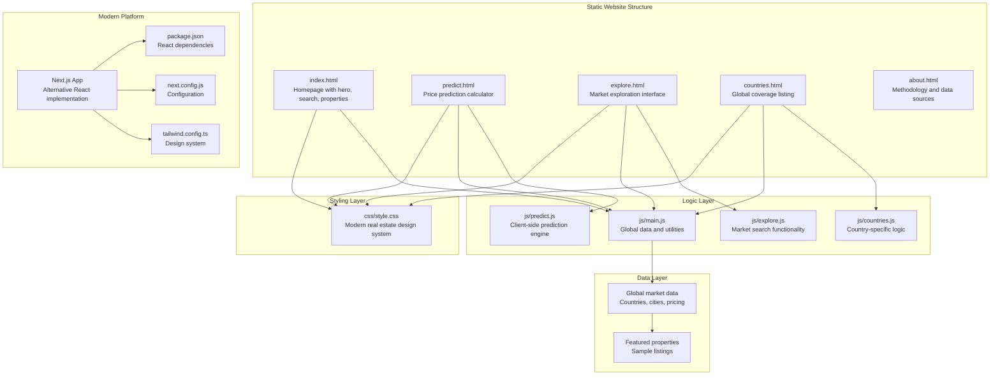
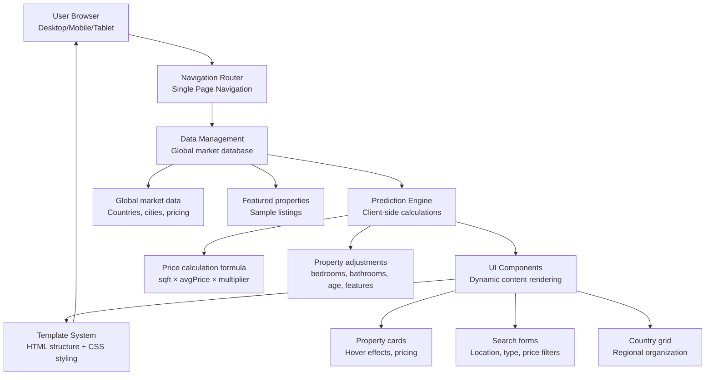
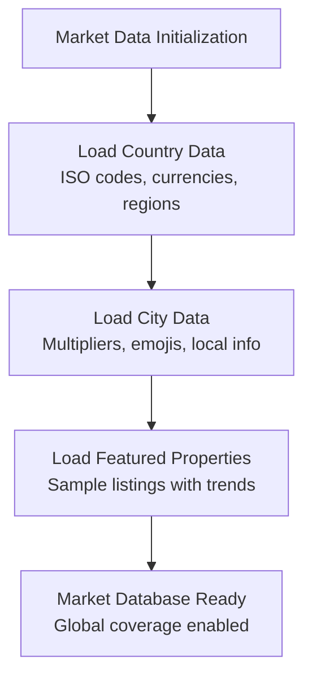
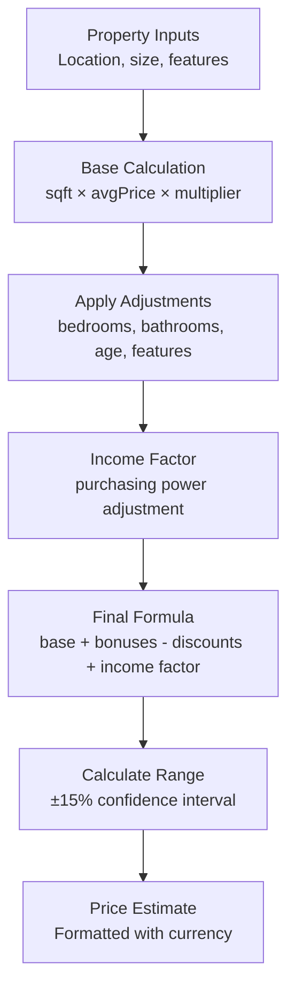

# Project Overview

<cite>
**Referenced Files in This Document**
- [README.md](file://README.md)
- [index.html](file://index.html)
- [predict.html](file://predict.html)
- [explore.html](file://explore.html)
- [countries.html](file://countries.html)
- [css/style.css](file://css/style.css)
- [js/main.js](file://js/main.js)
- [js/predict.js](file://js/predict.js)
- [js/explore.js](file://js/explore.js)
- [js/countries.js](file://js/countries.js)
- [global-housing-predictor/package.json](file://global-housing-predictor/package.json)
- [global-housing-predictor/src/app/page.tsx](file://global-housing-predictor/src/app/page.tsx)
- [global-housing-predictor/next.config.js](file://global-housing-predictor/next.config.js)
- [global-housing-predictor/tailwind.config.ts](file://global-housing-predictor/tailwind.config.ts)
- [global-housing-static/README.md](file://global-housing-static/README.md)
</cite>

## Update Summary
**Changes Made**
- Complete transformation from machine learning Python application to modern static website Realteak
- Updated project description to reflect consumer-facing real estate platform with global coverage
- Removed all machine learning components (Python scripts, ML models, API services)
- Added comprehensive documentation for static website architecture and client-side processing
- Updated technology stack to reflect HTML, CSS, JavaScript, and modern web development tools
- Added new sections covering real estate platform features, global market coverage, and client-side prediction algorithms

## Table of Contents
1. [Introduction](#introduction)
2. [Project Structure](#project-structure)
3. [Core Components](#core-components)
4. [Architecture Overview](#architecture-overview)
5. [Detailed Component Analysis](#detailed-component-analysis)
6. [Technology Stack](#technology-stack)
7. [Global Market Coverage](#global-market-coverage)
8. [Client-Side Processing](#client-side-processing)
9. [Deployment and Customization](#deployment-and-customization)
10. [Business Value Proposition](#business-value-proposition)
11. [Target Audience](#target-audience)
12. [Conclusion](#conclusion)

## Introduction
Realteak is a modern, professional real estate platform built as a consumer-facing static website for predicting property prices across 50+ countries worldwide. This transformation represents a complete shift from a machine learning Python application to a production-ready, client-side real estate platform that leverages pure HTML, CSS, and JavaScript for fast, responsive performance on GitHub Pages.

The platform provides an intuitive interface for property valuation with global market coverage, featuring 20+ countries and 95+ cities in its database. Built with modern web standards, Realteak delivers exceptional user experience through responsive design, client-side calculations, and comprehensive market data visualization.

**Updated** Complete transformation from machine learning application to consumer-focused real estate platform

**Section sources**
- [README.md:1-170](file://README.md#L1-L170)
- [global-housing-static/README.md:1-170](file://global-housing-static/README.md#L1-L170)

## Project Structure
The repository now contains a modern static website architecture with clear separation between presentation, logic, and data layers.

**Diagram sources**
- [index.html:1-285](file://index.html#L1-L285)
- [predict.html:1-126](file://predict.html#L1-L126)
- [explore.html:1-84](file://explore.html#L1-L84)
- [countries.html:1-280](file://countries.html#L1-L280)
- [css/style.css:1-827](file://css/style.css#L1-L827)
- [js/main.js:1-210](file://js/main.js#L1-L210)
- [js/predict.js:1-122](file://js/predict.js#L1-L122)
- [global-housing-predictor/package.json:1-44](file://global-housing-predictor/package.json#L1-L44)
- [global-housing-predictor/next.config.js:1-25](file://global-housing-predictor/next.config.js#L1-L25)
- [global-housing-predictor/tailwind.config.ts:1-87](file://global-housing-predictor/tailwind.config.ts#L1-L87)

**Section sources**
- [README.md:36-55](file://README.md#L36-L55)
- [index.html:36-74](file://index.html#L36-L74)
- [predict.html:42-97](file://predict.html#L42-L97)
- [explore.html:38-59](file://explore.html#L38-L59)
- [countries.html:39-232](file://countries.html#L39-L232)

## Core Components
Realteak consists of several interconnected components working together to deliver a seamless real estate experience:

- **Homepage Interface**: Modern hero section with property search, featured listings, testimonials, and call-to-action elements
- **Price Prediction Engine**: Client-side calculation system using global market data and property characteristics
- **Market Explorer**: Comprehensive search and filter system for discovering properties across different regions
- **Global Coverage System**: Structured database of countries, cities, and pricing multipliers for international markets
- **Responsive Design System**: CSS-based design system with custom properties, animations, and mobile-first approach
- **Interactive Navigation**: Mobile-responsive navigation with smooth transitions and accessibility features
- **Property Showcase**: Dynamic property cards with hover effects, pricing displays, and market trend indicators

**Section sources**
- [index.html:97-166](file://index.html#L97-L166)
- [predict.html:42-112](file://predict.html#L42-L112)
- [explore.html:61-70](file://explore.html#L61-L70)
- [countries.html:48-214](file://countries.html#L48-L214)
- [css/style.css:360-430](file://css/style.css#L360-L430)
- [js/main.js:167-210](file://js/main.js#L167-L210)

## Architecture Overview
The system follows a modern static website architecture with client-side processing and comprehensive data management:

**Diagram sources**
- [js/main.js:20-133](file://js/main.js#L20-L133)
- [js/predict.js:46-113](file://js/predict.js#L46-L113)
- [css/style.css:360-430](file://css/style.css#L360-L430)
- [index.html:97-166](file://index.html#L97-L166)

## Detailed Component Analysis

### Global Market Database
The platform maintains a comprehensive database of international real estate markets with structured data organization:

- **Country Information**: ISO codes, currency specifications, regional classifications, and average pricing per square foot
- **City-Level Data**: Price multipliers, emoji representations, and local market characteristics
- **Featured Properties**: Sample listings demonstrating platform capabilities with market trends
- **Regional Organization**: Geographic grouping for intuitive navigation and market discovery

**Diagram sources**
- [js/main.js:20-133](file://js/main.js#L20-L133)

**Section sources**
- [js/main.js:20-133](file://js/main.js#L20-L133)

### Price Prediction Algorithm
The client-side prediction engine calculates property values using sophisticated market data and property characteristics:

- **Base Calculation**: Living area × average price per square foot × city multiplier
- **Adjustment Factors**: Bedrooms bonus, bathrooms bonus, property age discount, special features
- **Income Factor**: Market purchasing power adjustment based on user income
- **Confidence Scoring**: Quality assessment based on market data availability
- **Range Calculation**: ±15% confidence interval for price estimates

**Diagram sources**
- [js/predict.js:62-74](file://js/predict.js#L62-L74)
- [js/predict.js:76-90](file://js/predict.js#L76-L90)

**Section sources**
- [js/predict.js:46-113](file://js/predict.js#L46-L113)

### Responsive Design System
The platform implements a comprehensive CSS-based design system optimized for all devices:

- **Custom Properties**: CSS variables for consistent theming across components
- **Typography System**: Google Fonts integration with Great Vibes and Inter fonts
- **Component Library**: Reusable UI components with hover effects and animations
- **Mobile-First Approach**: Progressive enhancement for desktop experiences
- **Color Palette**: Professional real estate color scheme with accent colors

**Section sources**
- [css/style.css:3-30](file://css/style.css#L3-L30)
- [css/style.css:360-430](file://css/style.css#L360-L430)
- [css/style.css:639-728](file://css/style.css#L639-L728)

### Interactive Navigation
The navigation system provides seamless user experience across all pages:

- **Mobile Responsiveness**: Collapsible navigation for smaller screens
- **Active State Management**: Visual indicators for current page location
- **Smooth Transitions**: CSS animations for navigation state changes
- **Accessibility Features**: Keyboard navigation and screen reader support

**Section sources**
- [index.html:11-31](file://index.html#L11-L31)
- [css/style.css:68-179](file://css/style.css#L68-L179)

## Technology Stack
Realteak utilizes modern web technologies for optimal performance and developer experience:

**Frontend Technologies:**
- **HTML5**: Semantic markup with progressive enhancement
- **CSS3**: Custom properties, animations, responsive design
- **JavaScript**: Pure vanilla JS with no framework dependencies
- **Fonts**: Google Fonts (Great Vibes, Inter) for typography
- **Images**: Unsplash integration for high-quality property visuals

**Development Tools:**
- **GitHub Pages**: Zero-configuration deployment
- **GitHub Actions**: Automated deployment workflows
- **PowerShell Scripts**: Automated deployment automation
- **Git Commands**: Version control and collaboration

**Optional Modern Implementation:**
- **Next.js**: Alternative React-based implementation
- **Tailwind CSS**: Utility-first styling system
- **TypeScript**: Type safety and development experience
- **Mapbox Integration**: Interactive property location mapping

**Section sources**
- [README.md:57-64](file://README.md#L57-L64)
- [global-housing-predictor/package.json:11-42](file://global-housing-predictor/package.json#L11-L42)
- [global-housing-predictor/next.config.js:1-25](file://global-housing-predictor/next.config.js#L1-L25)

## Global Market Coverage
Realteak provides comprehensive international real estate coverage across six continents:

**North America:**
- United States: New York, Los Angeles, San Francisco, Chicago, Boston, Seattle, Miami, Austin
- Canada: Toronto, Vancouver, Montreal, Calgary, Ottawa
- Mexico: Mexico City, Guadalajara, Monterrey, Cancun, Tijuana

**Europe:**
- United Kingdom: London, Manchester, Birmingham, Edinburgh, Glasgow
- Germany: Berlin, Munich, Hamburg, Frankfurt, Cologne
- France: Paris, Lyon, Marseille, Nice, Toulouse
- Spain: Madrid, Barcelona, Valencia, Seville, Malaga
- Italy: Rome, Milan, Naples, Turin, Florence
- Netherlands: Amsterdam, Rotterdam, The Hague, Utrecht, Eindhoven
- Sweden: Stockholm, Gothenburg, Malmö, Uppsala, Linkoping
- Switzerland: Zurich, Geneva, Basel, Bern, Lausanne

**Asia Pacific:**
- Japan: Tokyo, Osaka, Yokohama, Nagoya, Kyoto
- Singapore: Singapore Central, Marina Bay, Orchard, Sentosa
- Australia: Sydney, Melbourne, Brisbane, Perth, Adelaide
- China: Shanghai, Beijing, Shenzhen, Guangzhou, Hangzhou
- South Korea: Seoul, Busan, Incheon, Daegu, Daejeon
- India: Mumbai, Delhi, Bangalore, Hyderabad, Chennai
- Thailand: Bangkok, Chiang Mai, Phuket, Pattaya, Koh Samui

**Other Regions:**
- UAE: Dubai, Abu Dhabi, Sharjah, Ajman, Ras Al Khaimah
- Brazil: Sao Paulo, Rio de Janeiro, Brasilia, Salvador, Fortaleza

**Section sources**
- [js/main.js:21-122](file://js/main.js#L21-L122)
- [countries.html:48-214](file://countries.html#L48-L214)

## Client-Side Processing
The platform emphasizes client-side processing for optimal performance and user experience:

**Benefits of Client-Side Processing:**
- **Instant Response**: No server round-trips for basic functionality
- **Offline Capability**: Functionality available without network connectivity
- **Scalability**: Zero server costs and infrastructure requirements
- **Privacy**: Sensitive user data never leaves the browser
- **Performance**: Reduced latency and improved user experience

**Processing Capabilities:**
- **Real-time Calculations**: Instant property price estimates
- **Dynamic Filtering**: Live property search and filtering
- **Interactive Maps**: Client-side location visualization
- **Responsive Updates**: Dynamic content updates without page reloads

**Section sources**
- [js/predict.js:46-113](file://js/predict.js#L46-L113)
- [js/explore.js:1-827](file://js/explore.js#L1-L827)

## Deployment and Customization
Realteak offers multiple deployment options and extensive customization capabilities:

**Deployment Methods:**
- **Manual Upload**: Direct file upload to GitHub repository
- **Git Commands**: Command-line deployment workflow
- **PowerShell Script**: Automated deployment automation
- **GitHub Actions**: Continuous deployment through workflows

**Customization Options:**
- **Color Theming**: CSS variable modifications for brand consistency
- **Content Updates**: Easy modification of property listings and market data
- **Image Replacement**: Custom property imagery integration
- **Feature Extensions**: Additional property attributes and market data

**Section sources**
- [README.md:65-98](file://README.md#L65-L98)
- [README.md:100-139](file://README.md#L100-L139)

## Business Value Proposition
Realteak delivers significant value across multiple business dimensions:

**For Real Estate Professionals:**
- **Lead Generation**: High-quality property valuations attract qualified leads
- **Market Intelligence**: Comprehensive international market data for strategic decisions
- **Client Education**: Transparent pricing algorithms build trust and credibility
- **Competitive Advantage**: Advanced market coverage differentiates service offerings

**For Homebuyers and Sellers:**
- **Informed Decision Making**: Accurate property valuations support buying and selling decisions
- **Market Transparency**: Clear pricing mechanisms eliminate uncertainty
- **Global Accessibility**: International market coverage for expatriates and investors
- **Time Efficiency**: Instant valuations reduce traditional consultation time

**For Developers and Organizations:**
- **Low Maintenance**: Static site requires minimal ongoing maintenance
- **Cost Effective**: Zero server costs and infrastructure overhead
- **Brand Building**: Professional real estate platform enhances brand image
- **Scalable Solution**: Foundation for future feature expansion

**Section sources**
- [README.md:7-25](file://README.md#L7-L25)
- [README.md:140-156](file://README.md#L140-L156)

## Target Audience
Realteak serves diverse audiences across the real estate ecosystem:

**Primary Users:**
- **Homebuyers**: Individuals seeking property valuations and market insights
- **Homeowners**: Sellers evaluating property worth and market timing
- **Real Estate Agents**: Professionals needing market intelligence and lead generation
- **Investors**: Buyers targeting international property investments

**Secondary Users:**
- **Real Estate Companies**: Organizations requiring market data and valuation tools
- **Property Managers**: Professionals managing rental properties and portfolios
- **Mortgage Brokers**: Financial professionals providing loan qualification assistance
- **Moving Companies**: Services supporting relocation decisions

**Skill Levels:**
- **Beginners**: Simple property search and basic valuation functionality
- **Intermediate**: Market comparison and investment analysis tools
- **Advanced**: Comprehensive market research and international property evaluation

**Section sources**
- [README.md:26-35](file://README.md#L26-L35)
- [README.md:158-163](file://README.md#L158-L163)

## Conclusion
Realteak represents a paradigm shift from traditional machine learning applications to modern, consumer-focused real estate platforms. This transformation demonstrates the power of client-side processing, static site architecture, and comprehensive international market coverage in delivering exceptional user experiences.

The platform successfully combines technical excellence with business practicality, offering a scalable, cost-effective solution for real estate valuation services. Its modern architecture, comprehensive feature set, and global market coverage position it as a leading example of contemporary web application development.

Through its innovative approach to client-side processing, Realteak proves that complex functionality can be delivered efficiently without traditional server infrastructure, setting new standards for real estate technology solutions.