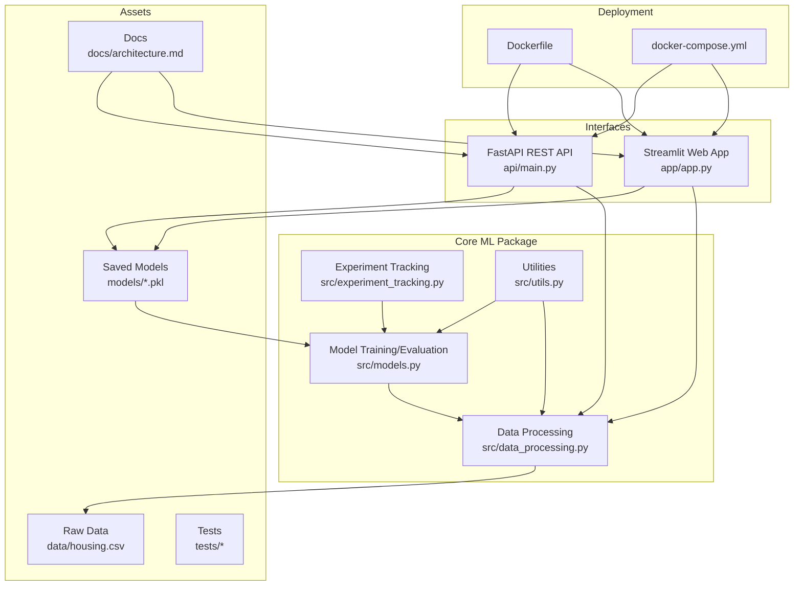
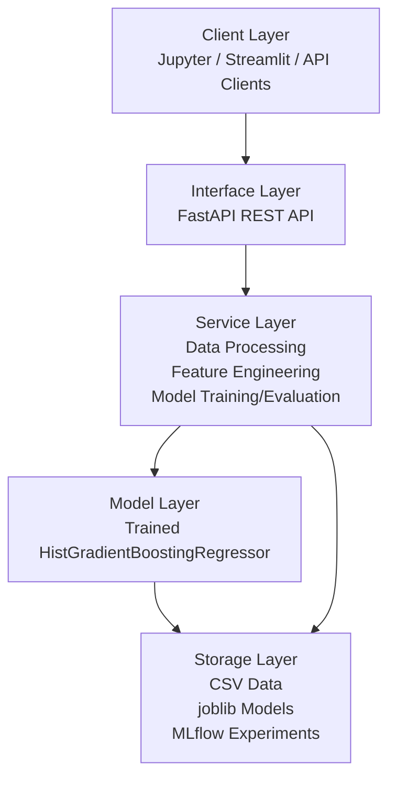
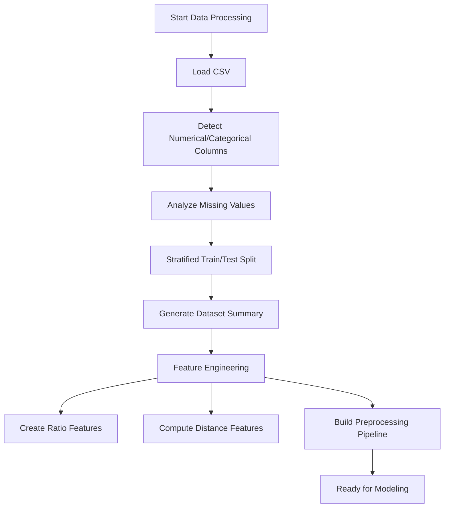
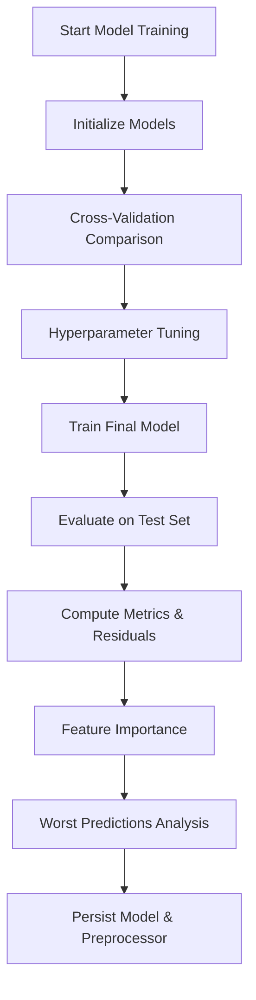
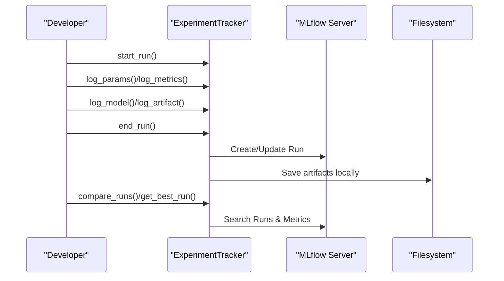
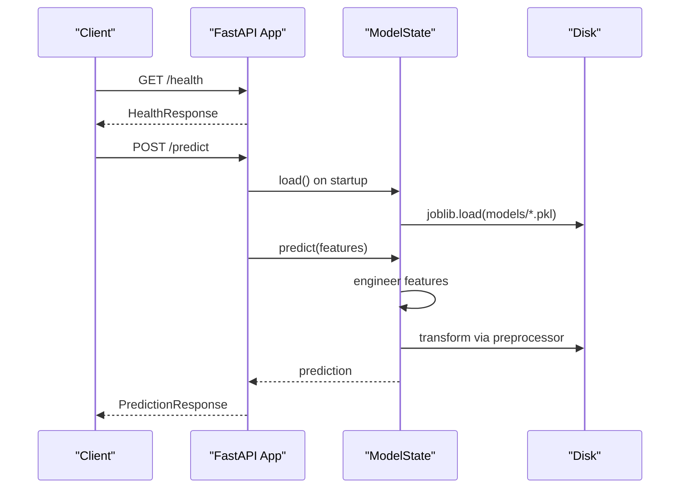
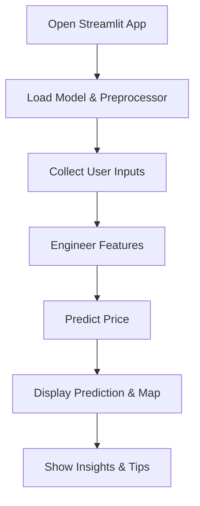

# Project Overview

<cite>
**Referenced Files in This Document**
- [README.md](file://README.md)
- [requirements.txt](file://requirements.txt)
- [src/__init__.py](file://src/__init__.py)
- [src/models.py](file://src/models.py)
- [src/data_processing.py](file://src/data_processing.py)
- [src/experiment_tracking.py](file://src/experiment_tracking.py)
- [src/utils.py](file://src/utils.py)
- [api/main.py](file://api/main.py)
- [app/app.py](file://app/app.py)
- [Dockerfile](file://Dockerfile)
- [docker-compose.yml](file://docker-compose.yml)
- [data/README.md](file://data/README.md)
- [docs/architecture.md](file://docs/architecture.md)
- [tests/conftest.py](file://tests/conftest.py)
- [tests/test_models.py](file://tests/test_models.py)
</cite>

## Table of Contents
1. [Introduction](#introduction)
2. [Project Structure](#project-structure)
3. [Core Components](#core-components)
4. [Architecture Overview](#architecture-overview)
5. [Detailed Component Analysis](#detailed-component-analysis)
6. [Dependency Analysis](#dependency-analysis)
7. [Performance Considerations](#performance-considerations)
8. [Troubleshooting Guide](#troubleshooting-guide)
9. [Conclusion](#conclusion)
10. [Appendices](#appendices)

## Introduction
This project is a production-ready machine learning application designed to predict median house values in California using advanced regression techniques. It serves as both an educational resource for learners exploring end-to-end ML workflows and a practical reference implementation for practitioners building scalable ML systems.

Key goals:
- Demonstrate a complete ML lifecycle: data preparation, feature engineering, model selection, tuning, evaluation, and deployment.
- Provide multiple user-facing interfaces: an interactive Streamlit web app and a FastAPI REST service for programmatic access.
- Offer production-grade capabilities: experiment tracking, logging, testing, and containerized deployment.
- Deliver strong real-world performance on the California Housing dataset from the 1990 census.

Business value:
- Enables stakeholders to quickly prototype and deploy pricing models for real estate analytics.
- Supports batch inference for property portfolios and integration into larger systems.
- Provides interpretability through feature importance and residual analysis.

Real-world applicability:
- The dataset captures geographic, demographic, and economic signals that correlate with housing values.
- Predictions are contextualized for 1990 values; users can adjust expectations for current markets.

Target audience:
- Beginners: step-by-step notebooks and interactive apps guide you through the ML pipeline.
- Practitioners: clean APIs, experiment tracking, and containerization offer a reference architecture for production systems.

**Section sources**
- [README.md:36-56](file://README.md#L36-L56)
- [README.md:290-320](file://README.md#L290-L320)
- [data/README.md:11-28](file://data/README.md#L11-L28)

## Project Structure
The repository follows a modular, feature-based organization with clear separation between data, modeling, serving, and deployment assets.

**Diagram sources**
- [docs/architecture.md:7-60](file://docs/architecture.md#L7-L60)
- [api/main.py:186-231](file://api/main.py#L186-L231)
- [app/app.py:72-82](file://app/app.py#L72-L82)
- [src/data_processing.py:22-51](file://src/data_processing.py#L22-L51)
- [src/models.py:30-53](file://src/models.py#L30-L53)
- [src/experiment_tracking.py:19-51](file://src/experiment_tracking.py#L19-L51)
- [src/utils.py:16-55](file://src/utils.py#L16-L55)
- [Dockerfile:58-86](file://Dockerfile#L58-L86)
- [docker-compose.yml:10-57](file://docker-compose.yml#L10-L57)

**Section sources**
- [README.md:88-139](file://README.md#L88-L139)
- [docs/architecture.md:62-169](file://docs/architecture.md#L62-L169)

## Core Components
- Data Processing: Loads, validates, splits, and summarizes data; builds preprocessing pipelines with imputation, scaling, and encoding.
- Feature Engineering: Creates ratio features, distance metrics, and derived variables to improve model understanding.
- Model Training/Evaluation: Implements multiple regressors, cross-validation, hyperparameter tuning, and comprehensive evaluation.
- Experiment Tracking: Integrates MLflow to log runs, parameters, metrics, and artifacts.
- Serving: FastAPI REST API for single and batch predictions; Streamlit app for interactive exploration.
- Utilities: Logging, persistence helpers, and convenience functions.
- Packaging: Public API exports for programmatic use.

Practical examples:
- Train and compare models, tune hyperparameters, and persist the best model.
- Serve predictions via API or Streamlit with automatic feature engineering.
- Track experiments and compare runs using MLflow.

**Section sources**
- [src/data_processing.py:22-157](file://src/data_processing.py#L22-L157)
- [src/data_processing.py:189-341](file://src/data_processing.py#L189-L341)
- [src/models.py:30-206](file://src/models.py#L30-L206)
- [src/models.py:208-351](file://src/models.py#L208-L351)
- [src/experiment_tracking.py:19-307](file://src/experiment_tracking.py#L19-L307)
- [src/utils.py:58-99](file://src/utils.py#L58-L99)
- [src/__init__.py:14-26](file://src/__init__.py#L14-L26)

## Architecture Overview
The system is layered: clients (notebook, Streamlit, API) interact with the interface layer (FastAPI), which delegates to services (data processing, feature engineering, model training/evaluation), and persists models and experiment metadata.

**Diagram sources**
- [docs/architecture.md:130-169](file://docs/architecture.md#L130-L169)
- [api/main.py:237-384](file://api/main.py#L237-L384)
- [src/data_processing.py:22-341](file://src/data_processing.py#L22-L341)
- [src/models.py:30-351](file://src/models.py#L30-L351)

## Detailed Component Analysis

### Data Processing and Feature Engineering
- DataProcessor: Loads CSV, detects types, analyzes missing values, performs stratified train/test split, and summarizes dataset characteristics.
- FeatureEngineer: Creates ratio features (rooms per household, bedrooms per room, population per household), distance features to major California cities, and constructs a preprocessing pipeline with imputation and scaling/encoding.

**Diagram sources**
- [src/data_processing.py:52-186](file://src/data_processing.py#L52-L186)
- [src/data_processing.py:202-305](file://src/data_processing.py#L202-L305)

**Section sources**
- [src/data_processing.py:22-157](file://src/data_processing.py#L22-L157)
- [src/data_processing.py:189-341](file://src/data_processing.py#L189-L341)

### Model Training and Evaluation
- ModelTrainer: Defines baseline and candidate models, compares via cross-validation, tunes hyperparameters, and trains the final model.
- ModelEvaluator: Computes robust metrics, analyzes errors by value ranges, extracts feature importance, and identifies worst predictions.

**Diagram sources**
- [src/models.py:54-178](file://src/models.py#L54-L178)
- [src/models.py:224-351](file://src/models.py#L224-L351)

**Section sources**
- [src/models.py:30-206](file://src/models.py#L30-L206)
- [src/models.py:208-351](file://src/models.py#L208-L351)

### Experiment Tracking with MLflow
- ExperimentTracker: Manages runs, logs parameters/metrics/artifacts, compares runs, and registers model versions.
- Convenience function tracks a full experiment end-to-end.

**Diagram sources**
- [src/experiment_tracking.py:53-220](file://src/experiment_tracking.py#L53-L220)
- [src/experiment_tracking.py:254-307](file://src/experiment_tracking.py#L254-L307)

**Section sources**
- [src/experiment_tracking.py:19-307](file://src/experiment_tracking.py#L19-L307)

### API Service (FastAPI)
- Endpoints: root info, health check, model info, single prediction, batch prediction.
- Validation: Pydantic models enforce input constraints; custom validators ensure logical consistency.
- Lifecycle: loads model and preprocessor on startup; supports graceful shutdown.

**Diagram sources**
- [api/main.py:248-384](file://api/main.py#L248-L384)
- [api/main.py:126-180](file://api/main.py#L126-L180)

**Section sources**
- [api/main.py:31-121](file://api/main.py#L31-L121)
- [api/main.py:237-384](file://api/main.py#L237-L384)

### Web Application (Streamlit)
- Interactive sliders and inputs for property features.
- Real-time prediction with formatted currency display.
- Map visualization and contextual insights.
- Loads model and preprocessor from disk.

**Diagram sources**
- [app/app.py:72-82](file://app/app.py#L72-L82)
- [app/app.py:197-203](file://app/app.py#L197-L203)
- [app/app.py:220-399](file://app/app.py#L220-L399)

**Section sources**
- [app/app.py:84-194](file://app/app.py#L84-L194)
- [app/app.py:220-399](file://app/app.py#L220-L399)

### Utilities and Packaging
- setup_logging: Centralized logging configuration.
- save_model/load_model: Persistent storage with metadata.
- Public API exports in package init.

**Section sources**
- [src/utils.py:16-55](file://src/utils.py#L16-L55)
- [src/utils.py:58-99](file://src/utils.py#L58-L99)
- [src/__init__.py:14-26](file://src/__init__.py#L14-L26)

## Dependency Analysis
Technology stack overview:
- Core: Python, NumPy, Pandas, scikit-learn, joblib
- Visualization: Matplotlib, Seaborn, Plotly
- API: FastAPI, Uvicorn, Pydantic
- Web App: Streamlit
- Experiment Tracking: MLflow
- Testing: pytest, httpx
- Utilities: python-dotenv, PyYAML

```mermaid
graph TB
P["Python 3.8+"] --> SK["scikit-learn >=1.3"]
P --> NP["numpy >=1.24"]
P --> PD["pandas >=2.0"]
P --> JOB["joblib >=1.3"]
P --> MATP["matplotlib >=3.7"]
P --> SEA["seaborn >=0.12"]
P --> PLOT["plotly >=5.15"]
P --> FA["fastapi >=0.104"]
P --> UV["uvicorn >=0.24"]
P --> PYD["pydantic >=2.5"]
P --> STR["streamlit >=1.28"]
P --> MLF["mlflow >=2.8"]
P --> PTS["pytest >=7.4"]
P --> COV["pytest-cov >=4.1"]
P --> HTTPX["httpx >=0.25"]
P --> DOT["python-dotenv >=1.0"]
P --> YAM["pyyaml >=6.0.1"]
```

**Diagram sources**
- [requirements.txt:2-36](file://requirements.txt#L2-L36)

**Section sources**
- [requirements.txt:2-36](file://requirements.txt#L2-L36)

## Performance Considerations
- Model performance on test set: R² around 0.81; RMSE ~$45,000; MAE ~$32,000; MAPE ~16.2%.
- Feature importance highlights median income, ocean proximity, and spatial features as strong predictors.
- Cross-validation and hyperparameter tuning contribute to robust generalization.
- For production, consider monitoring latency, throughput, and model drift; leverage caching and batching for batch endpoints.

[No sources needed since this section provides general guidance]

## Troubleshooting Guide
Common issues and resolutions:
- Model files not found: Ensure the trained model and preprocessor are saved to the models directory before launching the API or Streamlit app.
- Input validation errors: Verify constraints (e.g., total bedrooms ≤ total rooms; households ≤ population; ocean proximity enum).
- Health check failures: Confirm the model loads successfully during application startup.
- Docker deployment: Use docker-compose to orchestrate API, Streamlit, and optionally MLflow; ensure volume mounts for models and data are read-only as configured.

**Section sources**
- [api/main.py:135-154](file://api/main.py#L135-L154)
- [api/main.py:323-347](file://api/main.py#L323-L347)
- [docker-compose.yml:21-34](file://docker-compose.yml#L21-L34)
- [docker-compose.yml:49-57](file://docker-compose.yml#L49-L57)

## Conclusion
This project delivers a production-ready, end-to-end solution for California housing price prediction. It combines rigorous ML practices with accessible interfaces, enabling both learning and practical deployment. The modular design, comprehensive testing, and containerized setup make it a robust foundation for similar regression tasks.

[No sources needed since this section summarizes without analyzing specific files]

## Appendices

### Technology Stack and Goals
- Technology stack: Python, scikit-learn, pandas, numpy, joblib, FastAPI, Streamlit, MLflow, pytest, Docker.
- Goals: Educate on ML workflows, provide production APIs and apps, enable experiment tracking, and support scalable deployment.

**Section sources**
- [requirements.txt:2-36](file://requirements.txt#L2-L36)
- [README.md:47-56](file://README.md#L47-L56)

### Dataset Context and Business Value
- Dataset: California Housing (1990 census); 20,640 records, 9 predictive features plus median house value.
- Business value: Predictive pricing models inform real estate analytics, portfolio valuation, and policy studies.

**Section sources**
- [data/README.md:11-28](file://data/README.md#L11-L28)
- [README.md:397-399](file://README.md#L397-L399)

### Deployment Options
- Local: Run Jupyter notebook, Streamlit app, or FastAPI server directly.
- Docker: Multi-stage build with separate API and Streamlit services; optional MLflow server and Jupyter dev service.

**Section sources**
- [Dockerfile:7-86](file://Dockerfile#L7-L86)
- [docker-compose.yml:10-101](file://docker-compose.yml#L10-L101)

### Testing Framework
- Pytest fixtures provide sample data and features; tests cover model training, evaluation, and persistence.

**Section sources**
- [tests/conftest.py:13-76](file://tests/conftest.py#L13-L76)
- [tests/test_models.py:24-197](file://tests/test_models.py#L24-L197)