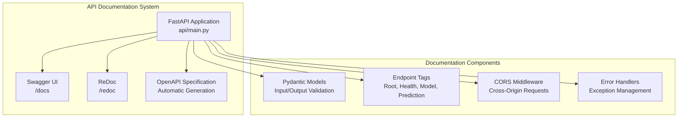
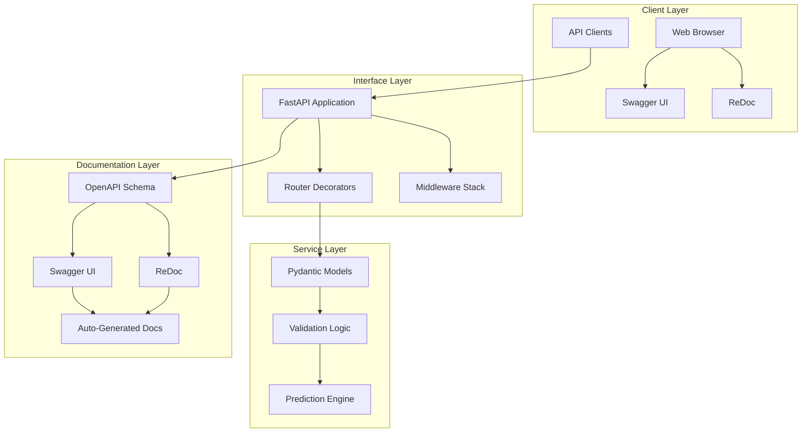
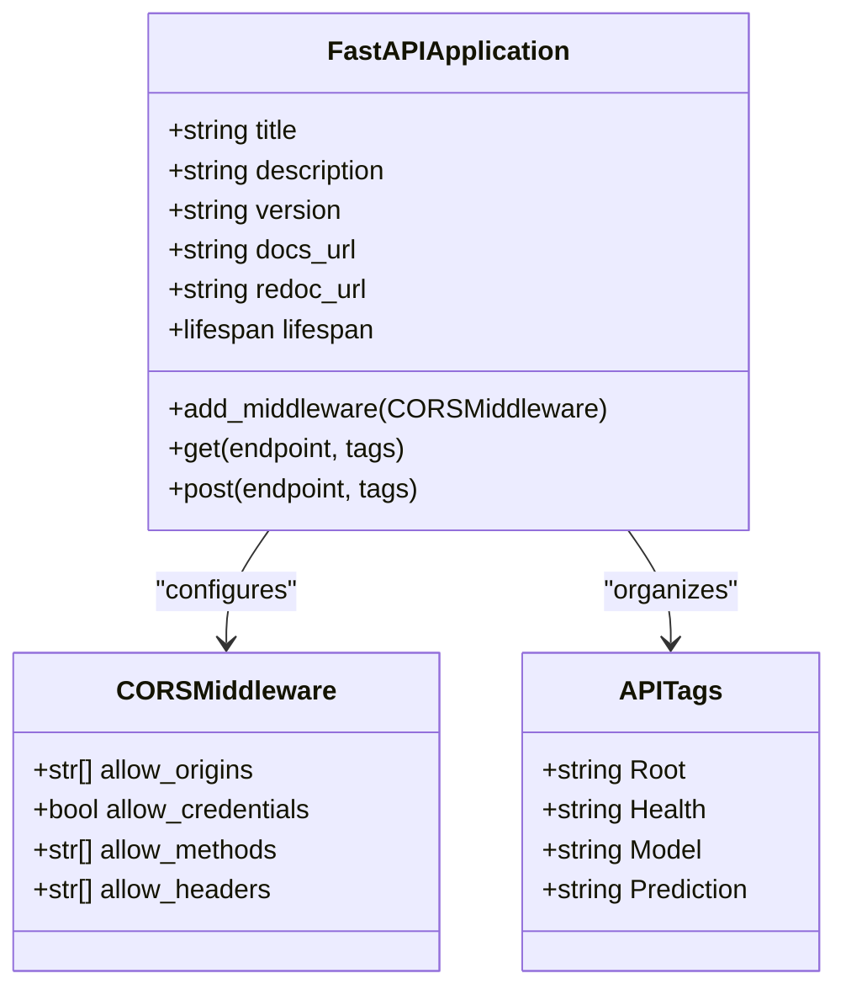
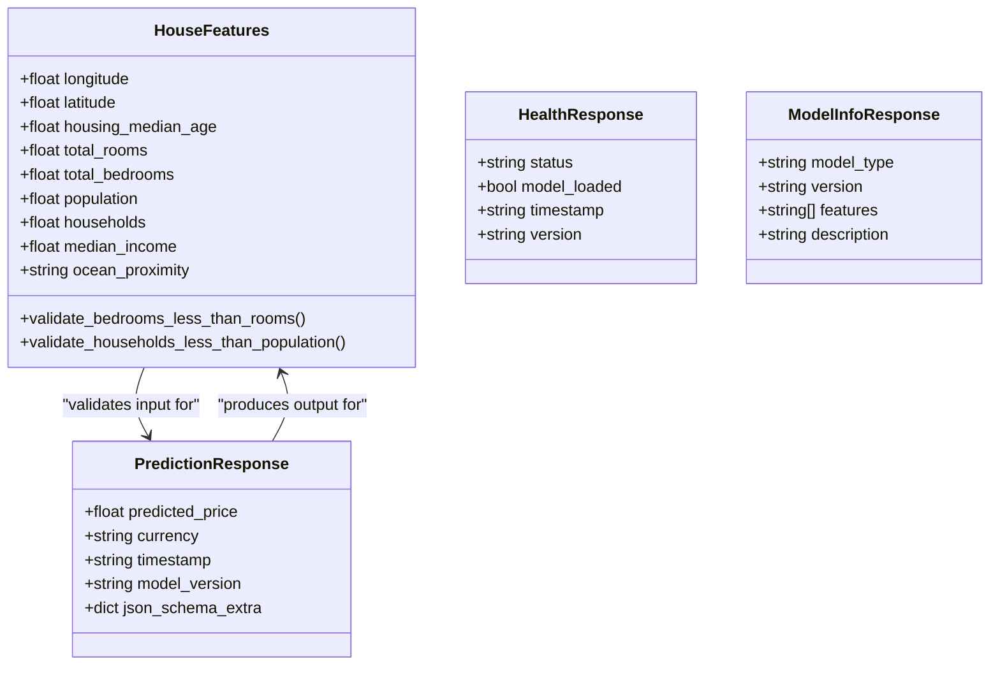
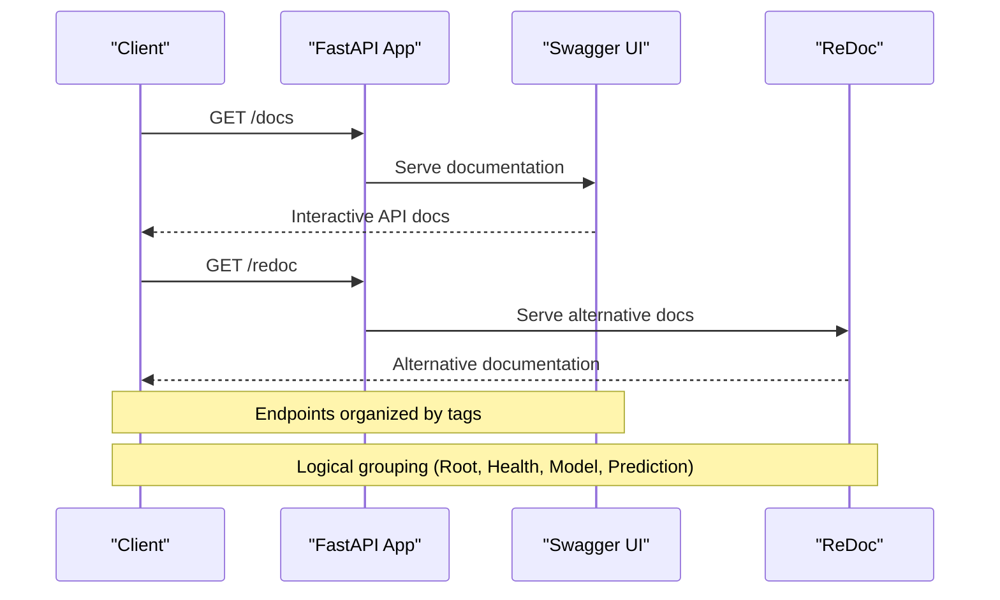
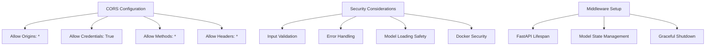
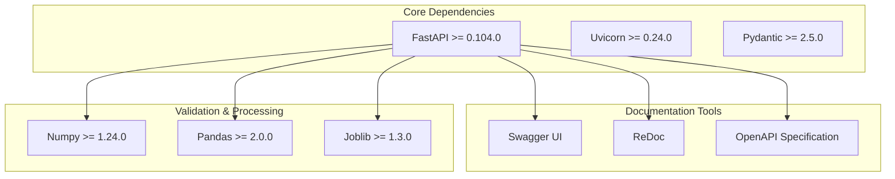

# API Documentation and Tools

<cite>
**Referenced Files in This Document**
- [api/main.py](file://api/main.py)
- [README.md](file://README.md)
- [requirements.txt](file://requirements.txt)
- [Dockerfile](file://Dockerfile)
- [docker-compose.yml](file://docker-compose.yml)
- [api/test_api.py](file://api/test_api.py)
- [docs/architecture.md](file://docs/architecture.md)
</cite>

## Table of Contents
1. [Introduction](#introduction)
2. [Project Structure](#project-structure)
3. [Core Components](#core-components)
4. [Architecture Overview](#architecture-overview)
5. [Detailed Component Analysis](#detailed-component-analysis)
6. [Dependency Analysis](#dependency-analysis)
7. [Performance Considerations](#performance-considerations)
8. [Troubleshooting Guide](#troubleshooting-guide)
9. [Conclusion](#conclusion)

## Introduction

This document provides comprehensive documentation for the automatic API documentation system built with FastAPI, including Swagger UI (/docs) and ReDoc (/redoc) interfaces. The system demonstrates production-ready API documentation capabilities with interactive testing, automatic OpenAPI specification generation, and comprehensive endpoint organization.

The California House Price Prediction API showcases modern API development practices with automatic documentation generation, schema validation, and interactive testing capabilities. The system includes detailed metadata, tagging mechanisms, CORS configuration, and security considerations.

## Project Structure

The API documentation system is organized within a well-structured FastAPI application that provides automatic documentation generation through OpenAPI specifications.

**Diagram sources**
- [api/main.py:201-230](file://api/main.py#L201-L230)
- [api/main.py:237-383](file://api/main.py#L237-L383)

**Section sources**
- [api/main.py:1-403](file://api/main.py#L1-L403)
- [README.md:88-139](file://README.md#L88-L139)

## Core Components

The API documentation system consists of several key components that work together to provide comprehensive automatic documentation:

### FastAPI Application Configuration

The FastAPI application is configured with automatic documentation generation enabled through the `docs_url` and `redoc_url` parameters. This enables both Swagger UI and ReDoc interfaces for interactive API documentation.

### Pydantic Model Validation

Comprehensive Pydantic models define the input and output schemas for all API endpoints. These models automatically generate OpenAPI schemas and provide real-time validation of request data.

### Endpoint Tagging System

Endpoints are organized into logical groups using FastAPI's tag system, creating a structured documentation hierarchy:
- Root: Basic API information and navigation
- Health: System status and monitoring endpoints
- Model: Model metadata and information
- Prediction: Price prediction endpoints

### CORS Configuration

Cross-Origin Resource Sharing is configured to allow requests from any origin, enabling flexible integration with various client applications.

**Section sources**
- [api/main.py:201-230](file://api/main.py#L201-L230)
- [api/main.py:31-120](file://api/main.py#L31-L120)
- [api/main.py:237-383](file://api/main.py#L237-L383)

## Architecture Overview

The API documentation system follows a layered architecture that separates concerns while maintaining automatic documentation generation.

**Diagram sources**
- [api/main.py:201-230](file://api/main.py#L201-L230)
- [api/main.py:31-120](file://api/main.py#L31-L120)
- [api/main.py:290-383](file://api/main.py#L290-L383)

## Detailed Component Analysis

### FastAPI Application Configuration

The FastAPI application is initialized with comprehensive metadata that automatically populates the documentation interfaces.

**Diagram sources**
- [api/main.py:201-230](file://api/main.py#L201-L230)
- [api/main.py:224-230](file://api/main.py#L224-L230)

The application configuration includes:
- **Title**: "California House Price Prediction API"
- **Description**: Comprehensive project overview with features and data source information
- **Version**: "1.0.0"
- **Documentation URLs**: "/docs" (Swagger UI) and "/redoc" (ReDoc)

### Pydantic Model System

The system uses Pydantic models to define input and output schemas that automatically generate OpenAPI documentation.

**Diagram sources**
- [api/main.py:31-101](file://api/main.py#L31-L101)
- [api/main.py:104-120](file://api/main.py#L104-L120)

Key validation features include:
- **Range validation**: Geographic coordinates and demographic ranges
- **Relationship validation**: Bed/bath ratios and household/population constraints
- **Enum validation**: Ocean proximity categories
- **Custom validators**: Business logic enforcement

### Endpoint Organization and Tagging

Endpoints are systematically organized using FastAPI's tag system for logical grouping and documentation structure.

**Diagram sources**
- [api/main.py:237-383](file://api/main.py#L237-L383)

### CORS Configuration and Security

The system includes comprehensive CORS configuration for cross-origin request handling and security middleware setup.

**Diagram sources**
- [api/main.py:224-230](file://api/main.py#L224-L230)
- [api/main.py:186-195](file://api/main.py#L186-L195)

## Dependency Analysis

The API documentation system relies on several key dependencies that enable automatic documentation generation and interactive testing capabilities.

**Diagram sources**
- [requirements.txt:16-20](file://requirements.txt#L16-L20)
- [api/requirements.txt:1-9](file://api/requirements.txt#L1-L9)

**Section sources**
- [requirements.txt:16-20](file://requirements.txt#L16-L20)
- [api/requirements.txt:1-9](file://api/requirements.txt#L1-L9)

## Performance Considerations

The API documentation system is designed with performance and scalability in mind:

### Model Loading and Caching
- **Lazy loading**: Models are loaded during application startup via lifespan context manager
- **Global state management**: Centralized model state prevents redundant loading
- **Graceful degradation**: Health checks indicate model availability status

### Request Processing
- **Efficient validation**: Pydantic models provide fast input validation
- **Batch processing**: Support for multiple predictions in single requests
- **Memory management**: Proper cleanup during application shutdown

### Documentation Performance
- **Static generation**: OpenAPI schemas are generated at runtime but cached
- **Minimal overhead**: Documentation endpoints don't impact prediction performance
- **Caching strategies**: Client-side caching of documentation resources

## Troubleshooting Guide

Common issues and solutions for the API documentation system:

### Documentation Interface Issues
- **Swagger UI not loading**: Verify FastAPI initialization with `docs_url="/docs"`
- **ReDoc rendering problems**: Check `redoc_url="/redoc"` configuration
- **Schema validation errors**: Review Pydantic model definitions and constraints

### CORS Configuration Problems
- **Cross-origin blocked**: Verify `allow_origins=["*"]` setting
- **Credentials issues**: Ensure `allow_credentials=True` for authenticated requests
- **Method restrictions**: Check `allow_methods=["*"]` allows required HTTP methods

### Model Loading Failures
- **File not found errors**: Verify model files exist in `models/` directory
- **Import errors**: Check Python path configuration and dependencies
- **Memory issues**: Monitor model size and available system resources

### Testing and Validation
- **API test failures**: Use the provided test script in `api/test_api.py`
- **Input validation errors**: Review constraint violations in Pydantic models
- **Prediction errors**: Check model state and feature engineering logic

**Section sources**
- [api/main.py:390-397](file://api/main.py#L390-L397)
- [api/test_api.py:13-95](file://api/test_api.py#L13-L95)

## Conclusion

The automatic API documentation system demonstrates best practices in modern API development with comprehensive documentation generation, interactive testing capabilities, and production-ready features. The system successfully integrates FastAPI's automatic OpenAPI specification generation with Swagger UI and ReDoc interfaces, providing developers with powerful tools for API exploration and testing.

Key strengths of the implementation include:
- **Automatic documentation**: Seamless OpenAPI schema generation from Pydantic models
- **Interactive testing**: Built-in Swagger UI and ReDoc interfaces for endpoint testing
- **Structured organization**: Logical endpoint grouping through tagging system
- **Robust validation**: Comprehensive input validation with custom business logic
- **Production readiness**: CORS configuration, error handling, and security considerations

The system serves as an excellent reference implementation for building production-ready APIs with automatic documentation, validation, and testing capabilities. Developers can leverage this foundation to create similar systems with minimal configuration while maintaining professional-grade documentation and user experience.