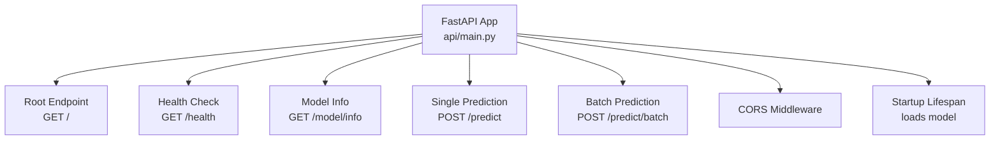
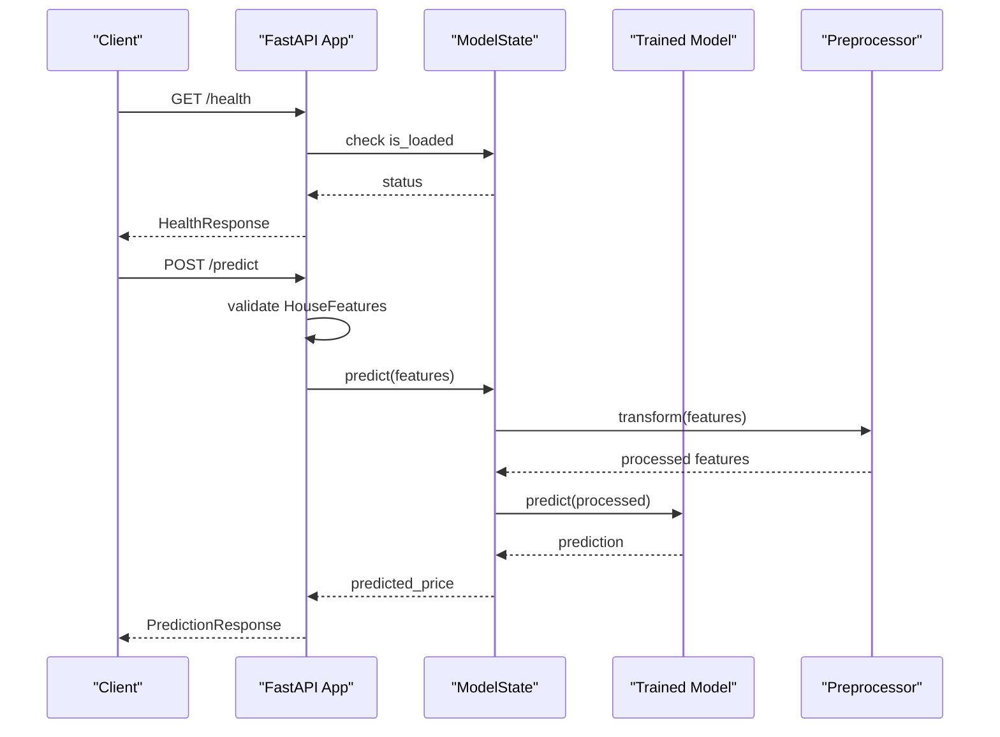
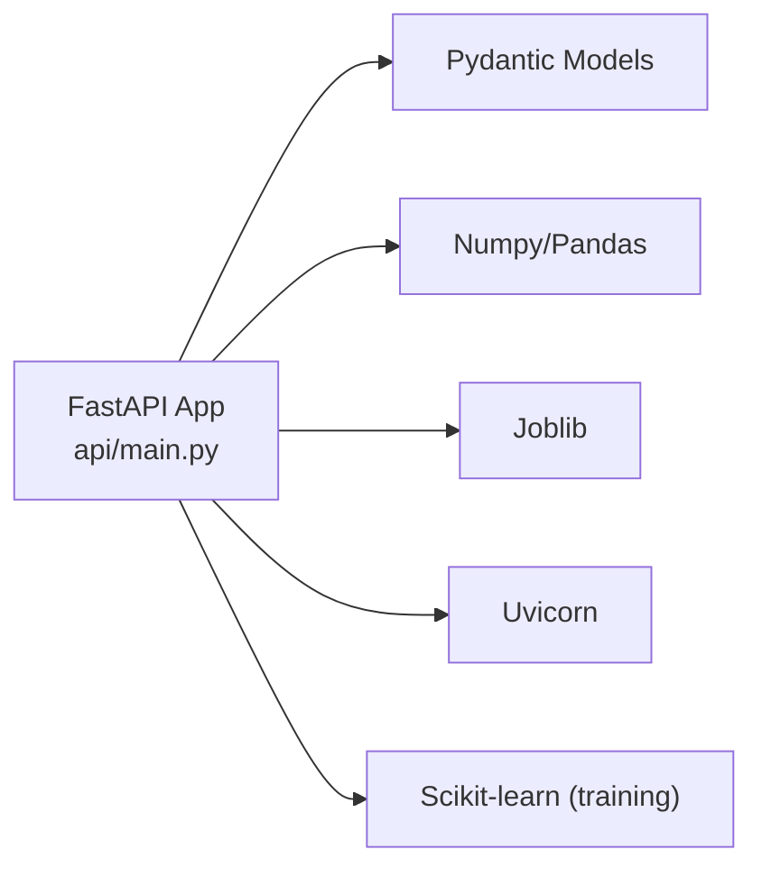

# API Endpoints

<cite>
**Referenced Files in This Document**
- [api/main.py](file://api/main.py)
- [tests/test_api.py](file://tests/test_api.py)
- [README.md](file://README.md)
- [requirements.txt](file://requirements.txt)
</cite>

## Table of Contents
1. [Introduction](#introduction)
2. [Project Structure](#project-structure)
3. [Core Components](#core-components)
4. [Architecture Overview](#architecture-overview)
5. [Detailed Component Analysis](#detailed-component-analysis)
6. [Dependency Analysis](#dependency-analysis)
7. [Performance Considerations](#performance-considerations)
8. [Troubleshooting Guide](#troubleshooting-guide)
9. [Conclusion](#conclusion)

## Introduction
This document provides comprehensive API documentation for the California House Price Prediction API. It covers all REST endpoints, including:
- Root endpoint for service information
- Health check endpoint for status monitoring
- Model info endpoint for metadata
- Single prediction endpoint for individual requests
- Batch prediction endpoint for bulk processing

For each endpoint, you will find HTTP methods, URL patterns, request/response schemas using Pydantic models, parameter validation rules, error responses, status codes, practical curl examples, and code samples. It also documents input validation constraints, geographic boundaries, business logic rules, and performance characteristics.

## Project Structure
The API is implemented as a FastAPI application located under the api/ directory. The primary entry point defines Pydantic models for request/response bodies, loads the trained model at startup, and exposes the endpoints described below.

**Diagram sources**
- [api/main.py:201-231](file://api/main.py#L201-L231)
- [api/main.py:237-384](file://api/main.py#L237-L384)

**Section sources**
- [api/main.py:186-231](file://api/main.py#L186-L231)
- [README.md:88-140](file://README.md#L88-L140)

## Core Components
- Pydantic models define strict request/response schemas and validation rules.
- A global model state loads the trained model and preprocessor at startup and handles inference.
- FastAPI routes expose endpoints with automatic OpenAPI docs and error handling.

Key models:
- HouseFeatures: input schema with bounds and enums
- PredictionResponse: single prediction response
- HealthResponse: health status response
- ModelInfoResponse: model metadata response

**Section sources**
- [api/main.py:31-120](file://api/main.py#L31-L120)
- [api/main.py:126-183](file://api/main.py#L126-L183)

## Architecture Overview
The API follows a production-ready FastAPI architecture with:
- Startup lifecycle to load the model
- CORS enabled for broad compatibility
- Strict input validation via Pydantic
- Centralized exception handling

**Diagram sources**
- [api/main.py:248-347](file://api/main.py#L248-L347)
- [api/main.py:126-183](file://api/main.py#L126-L183)

## Detailed Component Analysis

### Root Endpoint
- Method: GET
- URL: /
- Purpose: Returns basic service information and links to documentation and health endpoints.

Response shape:
- message: string
- version: string
- docs: string (path to Swagger UI)
- health: string (path to health endpoint)

Status codes:
- 200 OK

Example curl:
- curl -X GET http://localhost:8000/

Notes:
- No request body.
- Intended for quick discovery of API capabilities.

**Section sources**
- [api/main.py:237-245](file://api/main.py#L237-L245)

### Health Check Endpoint
- Method: GET
- URL: /health
- Purpose: Reports API health and model availability.

Response model: HealthResponse
- status: string ("healthy" or "unhealthy")
- model_loaded: boolean
- timestamp: string (ISO format)
- version: string

Status codes:
- 200 OK
- 503 Service Unavailable (when model fails to load during startup)

Example curl:
- curl -X GET http://localhost:8000/health

Behavior:
- Uses global ModelState.is_loaded to determine status.
- Timestamp reflects server time.

**Section sources**
- [api/main.py:248-260](file://api/main.py#L248-L260)
- [tests/test_api.py:40-49](file://tests/test_api.py#L40-L49)

### Model Info Endpoint
- Method: GET
- URL: /model/info
- Purpose: Returns metadata about the deployed model.

Response model: ModelInfoResponse
- model_type: string
- version: string
- features: list of strings (feature names)
- description: string

Status codes:
- 200 OK
- 503 Service Unavailable (when model not loaded)

Example curl:
- curl -X GET http://localhost:8000/model/info

Constraints:
- Requires model to be loaded at startup.

**Section sources**
- [api/main.py:263-287](file://api/main.py#L263-L287)
- [tests/test_api.py:169-199](file://tests/test_api.py#L169-L199)

### Single Prediction Endpoint
- Method: POST
- URL: /predict
- Purpose: Predict house price for a single property.

Request model: HouseFeatures
Required fields:
- longitude: float, bounds [-125.0, -114.0]
- latitude: float, bounds [32.0, 43.0]
- housing_median_age: float, bounds [1, 52]
- total_rooms: float, bounds [1, 50000]
- total_bedrooms: float, bounds [1, 10000]
- population: float, bounds [1, 50000]
- households: float, bounds [1, 10000]
- median_income: float, bounds [0.5, 15.0]
- ocean_proximity: enum among ["<1H OCEAN", "INLAND", "ISLAND", "NEAR BAY", "NEAR OCEAN"]

Business logic validations:
- total_bedrooms <= total_rooms
- households <= population

Response model: PredictionResponse
- predicted_price: float (rounded to two decimals)
- currency: string (default "USD")
- timestamp: string (ISO format)
- model_version: string

Status codes:
- 200 OK
- 400 Bad Request (validation errors)
- 422 Unprocessable Entity (Pydantic validation failures)
- 500 Internal Server Error (prediction runtime errors)
- 503 Service Unavailable (model not loaded)

Example curl:
- curl -X POST "http://localhost:8000/predict" \
  -H "Content-Type: application/json" \
  -d '{"longitude":-122.23,"latitude":37.88,"housing_median_age":41,"total_rooms":880,"total_bedrooms":129,"population":322,"households":126,"median_income":8.3252,"ocean_proximity":"NEAR BAY"}'

Code sample (Python requests):
- See [tests/test_api.py:70-88](file://tests/test_api.py#L70-L88)

Validation rules summary:
- Numeric ranges enforced by Field constraints.
- Enum constraint enforced by Field enum.
- Business rules enforced via validators.

**Section sources**
- [api/main.py:31-83](file://api/main.py#L31-L83)
- [api/main.py:290-347](file://api/main.py#L290-L347)
- [tests/test_api.py:52-148](file://tests/test_api.py#L52-L148)
- [README.md:323-358](file://README.md#L323-L358)

### Batch Prediction Endpoint
- Method: POST
- URL: /predict/batch
- Purpose: Predict house prices for multiple properties in a single request.

Request body:
- Array of HouseFeatures objects

Response body:
- predictions: array of objects with:
  - predicted_price: float (rounded to two decimals)
  - currency: string (default "USD")
  - status: string ("success" or "error")
  - error: string (present when status is "error")
- timestamp: string (ISO format)
- model_version: string

Status codes:
- 200 OK
- 500 Internal Server Error (general failure)
- 503 Service Unavailable (model not loaded)

Example curl:
- curl -X POST "http://localhost:8000/predict/batch" \
  -H "Content-Type: application/json" \
  -d '[{"longitude":-122.23,"latitude":37.88,"housing_median_age":41,"total_rooms":880,"total_bedrooms":129,"population":322,"households":126,"median_income":8.3252,"ocean_proximity":"NEAR BAY"},{"longitude":-122.23,"latitude":37.88,"housing_median_age":41,"total_rooms":880,"total_bedrooms":129,"population":322,"households":126,"median_income":8.3252,"ocean_proximity":"NEAR BAY"}]'

Code sample (Python requests):
- See [tests/test_api.py:149-167](file://tests/test_api.py#L149-L167)

Behavior:
- Processes each item individually; partial failures are captured per item.
- Returns aggregated results with timestamps.

**Section sources**
- [api/main.py:350-383](file://api/main.py#L350-L383)
- [tests/test_api.py:149-167](file://tests/test_api.py#L149-L167)

## Dependency Analysis
External dependencies relevant to the API:
- FastAPI: ASGI framework for routing and OpenAPI generation
- Uvicorn: ASGI server for running the API
- Pydantic: Data validation and serialization
- Numpy/Pandas/Joblib: Numerical computing and model persistence
- Scikit-learn: Model training and preprocessing (training-side)

**Diagram sources**
- [requirements.txt:16-21](file://requirements.txt#L16-L21)
- [requirements.txt:2-5](file://requirements.txt#L2-L5)

**Section sources**
- [requirements.txt:16-21](file://requirements.txt#L16-L21)
- [requirements.txt:2-5](file://requirements.txt#L2-L5)

## Performance Considerations
- Model loading: The model and preprocessor are loaded once at startup via lifespan. This avoids repeated IO overhead and ensures predictable latency for subsequent requests.
- Inference pipeline: The model performs feature engineering and transforms input via the preprocessor before prediction. Expect typical single prediction latency suitable for interactive use.
- Batch endpoint: Processes items sequentially. For large batches, consider pagination or streaming responses to reduce memory pressure.
- Concurrency: Uvicorn’s default worker count is recommended for CPU-bound tasks like inference. Adjust workers based on CPU cores and memory capacity.
- Rate limiting: Not implemented in the current API. For production, consider adding rate limiting middleware or external throttling to protect resources.

[No sources needed since this section provides general guidance]

## Troubleshooting Guide
Common issues and resolutions:
- Model not loaded:
  - Symptoms: 503 Service Unavailable on /health, /model/info, or /predict.
  - Cause: Model files missing or failed to load at startup.
  - Resolution: Ensure model files exist at the expected paths and dependencies are installed.

- Validation errors on /predict:
  - Symptoms: 422 Unprocessable Entity.
  - Causes: Out-of-range numeric values, invalid enum, or violating business rules (e.g., total_bedrooms > total_rooms).
  - Resolution: Correct input ranges and relationships according to validation rules.

- Prediction errors:
  - Symptoms: 500 Internal Server Error on /predict.
  - Causes: Unexpected runtime errors during prediction.
  - Resolution: Check server logs and ensure model files are intact.

- Batch processing anomalies:
  - Symptoms: Some items marked as "error" in /predict/batch.
  - Causes: Invalid item in the batch causing per-item failure.
  - Resolution: Validate each item against HouseFeatures schema and business rules.

**Section sources**
- [api/main.py:270-274](file://api/main.py#L270-L274)
- [api/main.py:323-327](file://api/main.py#L323-L327)
- [api/main.py:357-361](file://api/main.py#L357-L361)
- [tests/test_api.py:104-148](file://tests/test_api.py#L104-L148)

## Conclusion
The California House Price Prediction API provides a robust, validated, and documented interface for real-time and batch house price predictions. It enforces strict input validation, exposes health and model metadata endpoints, and integrates seamlessly with FastAPI’s auto-generated documentation. For production deployments, consider adding rate limiting, monitoring, and alerting to complement the existing health checks.