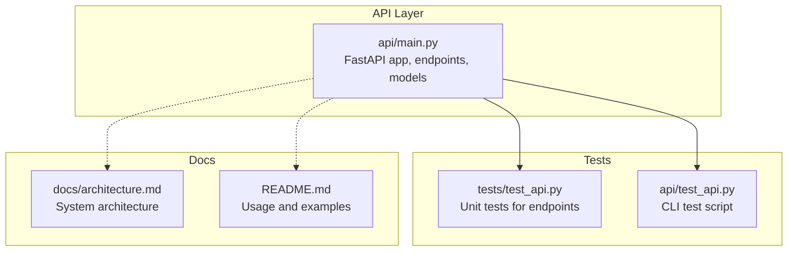
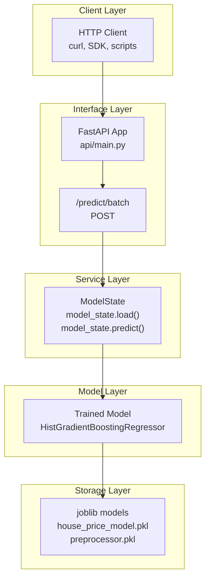
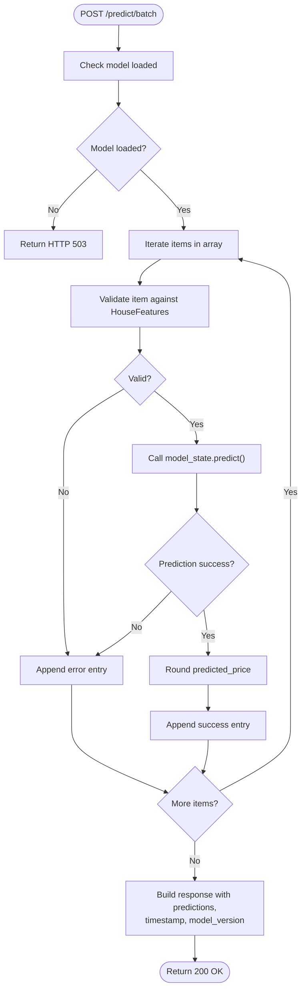
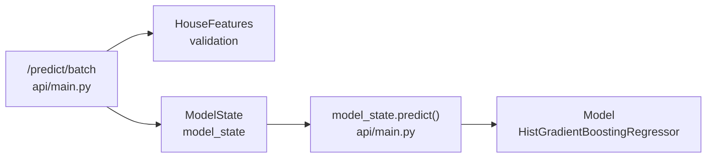

# Batch Prediction Endpoint

<cite>
**Referenced Files in This Document**
- [api/main.py](file://api/main.py)
- [tests/test_api.py](file://tests/test_api.py)
- [api/test_api.py](file://api/test_api.py)
- [README.md](file://README.md)
- [docs/architecture.md](file://docs/architecture.md)
</cite>

## Table of Contents
1. [Introduction](#introduction)
2. [Project Structure](#project-structure)
3. [Core Components](#core-components)
4. [Architecture Overview](#architecture-overview)
5. [Detailed Component Analysis](#detailed-component-analysis)
6. [Dependency Analysis](#dependency-analysis)
7. [Performance Considerations](#performance-considerations)
8. [Troubleshooting Guide](#troubleshooting-guide)
9. [Conclusion](#conclusion)
10. [Appendices](#appendices)

## Introduction
This document provides comprehensive documentation for the batch prediction endpoint (/predict/batch). The endpoint accepts a JSON array of HouseFeatures objects and returns individual predictions for each item. It supports mixed success and error responses within a single request, enabling efficient bulk processing while preserving visibility into per-item outcomes. The documentation covers request/response formats, validation rules, error handling strategies, performance characteristics, rate limiting considerations, and best practices for optimal batch sizes.

## Project Structure
The batch prediction endpoint is implemented in the FastAPI application module alongside other endpoints. The API layer exposes:
- Root and health endpoints
- Single prediction endpoint
- Batch prediction endpoint
- Model information endpoint

**Diagram sources**
- [api/main.py:233-384](file://api/main.py#L233-L384)
- [tests/test_api.py:149-167](file://tests/test_api.py#L149-L167)
- [api/test_api.py:49-78](file://api/test_api.py#L49-L78)
- [docs/architecture.md:18-27](file://docs/architecture.md#L18-L27)
- [README.md:239-246](file://README.md#L239-L246)

**Section sources**
- [api/main.py:233-384](file://api/main.py#L233-L384)
- [docs/architecture.md:18-27](file://docs/architecture.md#L18-L27)
- [README.md:239-246](file://README.md#L239-L246)

## Core Components
- HouseFeatures: Pydantic model defining input validation rules for property features.
- ModelState: Global state managing model and preprocessor loading and prediction execution.
- /predict/batch endpoint: Processes a list of HouseFeatures and returns per-item results.

Key behaviors:
- Validates each item against HouseFeatures rules.
- Executes model inference per item.
- Aggregates results with per-item success or error entries.
- Returns top-level metadata including timestamp and model version.

**Section sources**
- [api/main.py:31-83](file://api/main.py#L31-L83)
- [api/main.py:126-180](file://api/main.py#L126-L180)
- [api/main.py:350-383](file://api/main.py#L350-L383)

## Architecture Overview
The batch prediction endpoint participates in the API layer and interacts with the model service layer.

**Diagram sources**
- [api/main.py:126-180](file://api/main.py#L126-L180)
- [api/main.py:350-383](file://api/main.py#L350-L383)
- [docs/architecture.md:18-49](file://docs/architecture.md#L18-L49)

**Section sources**
- [docs/architecture.md:18-49](file://docs/architecture.md#L18-L49)
- [api/main.py:126-180](file://api/main.py#L126-L180)
- [api/main.py:350-383](file://api/main.py#L350-L383)

## Detailed Component Analysis

### Endpoint Definition and Behavior
- Method: POST
- Path: /predict/batch
- Request body: Array of HouseFeatures objects
- Response: Object containing:
  - predictions: Array of per-item results
  - timestamp: ISO timestamp
  - model_version: String identifier

Per-item result formats:
- Success: { predicted_price, currency, status }
- Error: { status, error }

Validation and error handling:
- If model is not loaded, returns HTTP 503.
- Per-item exceptions are caught and reported as error entries.
- Successful items include rounded predicted_price and metadata.

**Section sources**
- [api/main.py:350-383](file://api/main.py#L350-L383)
- [api/main.py:323-347](file://api/main.py#L323-L347)

### Request and Response Formats

#### Request Body
- Type: Array of HouseFeatures
- Each HouseFeatures includes:
  - longitude, latitude, housing_median_age, total_rooms, total_bedrooms, population, households, median_income, ocean_proximity

Validation rules enforced per item:
- total_bedrooms ≤ total_rooms
- households ≤ population
- ocean_proximity must be one of: "<1H OCEAN", "INLAND", "ISLAND", "NEAR BAY", "NEAR OCEAN"

#### Response Body
- predictions: Array of per-item results
  - Success item: { predicted_price, currency, status }
  - Error item: { status, error }
- timestamp: ISO timestamp
- model_version: String

**Section sources**
- [api/main.py:31-83](file://api/main.py#L31-L83)
- [api/main.py:350-383](file://api/main.py#L350-L383)

### Processing Logic Flow

**Diagram sources**
- [api/main.py:350-383](file://api/main.py#L350-L383)
- [api/main.py:155-179](file://api/main.py#L155-L179)

**Section sources**
- [api/main.py:350-383](file://api/main.py#L350-L383)

### Example Usage and Curl Commands
- Single prediction example is documented in the project README.
- Batch prediction example is demonstrated in the API test script.

Curl example for batch prediction (JSON array format):
- Use Content-Type: application/json
- Send an array of HouseFeatures objects
- The test script demonstrates the expected payload structure

**Section sources**
- [README.md:248-263](file://README.md#L248-L263)
- [api/test_api.py:49-78](file://api/test_api.py#L49-L78)

### Error Handling Strategies
- Model not loaded: HTTP 503 Service Unavailable
- Item-level validation failures: item appended as error entry
- Runtime errors during prediction: item appended as error entry
- General unhandled exceptions: handled by global exception handler returning structured error

Partial failure behavior:
- Successful items are processed independently of failing items
- Each item receives its own success or error entry
- Overall HTTP status is 200; consumers should inspect the predictions array

**Section sources**
- [api/main.py:323-347](file://api/main.py#L323-L347)
- [api/main.py:350-383](file://api/main.py#L350-L383)
- [api/main.py:390-397](file://api/main.py#L390-L397)

## Dependency Analysis
The batch endpoint depends on:
- HouseFeatures validation rules
- ModelState for model loading and prediction
- Global model_state instance

**Diagram sources**
- [api/main.py:31-83](file://api/main.py#L31-L83)
- [api/main.py:126-180](file://api/main.py#L126-L180)
- [api/main.py:350-383](file://api/main.py#L350-L383)

**Section sources**
- [api/main.py:31-83](file://api/main.py#L31-L83)
- [api/main.py:126-180](file://api/main.py#L126-L180)
- [api/main.py:350-383](file://api/main.py#L350-L383)

## Performance Considerations
- Throughput: The endpoint iterates over the input array sequentially. For large arrays, consider:
  - Client-side batching to limit request size
  - Parallelism at the client level when invoking the endpoint
- Latency: Each item triggers model inference; latency scales approximately linearly with array length
- Memory: Each item is processed individually; memory footprint is proportional to the number of items
- Rate limiting: No built-in rate limiting is implemented in the endpoint. Deployments should apply external rate limiting or queueing mechanisms as needed

[No sources needed since this section provides general guidance]

## Troubleshooting Guide
Common issues and resolutions:
- Model not loaded: Ensure the model files exist and are loadable; health check endpoint can confirm model status
- Validation errors: Verify each item conforms to HouseFeatures rules (e.g., total_bedrooms ≤ total_rooms)
- Mixed success/error responses: Inspect the predictions array; successful items include predicted_price and status, failed items include status and error
- Connection failures: Confirm the API server is running and reachable

Verification via tests:
- Unit tests exercise the batch endpoint and validate response structure
- CLI test script demonstrates expected payload and response format

**Section sources**
- [tests/test_api.py:149-167](file://tests/test_api.py#L149-L167)
- [api/test_api.py:49-78](file://api/test_api.py#L49-L78)
- [api/main.py:248-260](file://api/main.py#L248-L260)

## Conclusion
The /predict/batch endpoint enables efficient bulk processing of property predictions while preserving per-item visibility through mixed success/error responses. It integrates tightly with the validation and model execution layers, returning structured results with timestamps and model versioning. For production deployments, apply external rate limiting, monitor throughput and latency, and use client-side batching to optimize performance.

[No sources needed since this section summarizes without analyzing specific files]

## Appendices

### API Reference Summary
- Endpoint: POST /predict/batch
- Request body: Array of HouseFeatures
- Response: { predictions[], timestamp, model_version }
- Per-item success: { predicted_price, currency, status }
- Per-item error: { status, error }
- Status codes: 200 OK (overall), 503 Service Unavailable when model not loaded

**Section sources**
- [api/main.py:350-383](file://api/main.py#L350-L383)
- [api/main.py:323-347](file://api/main.py#L323-L347)