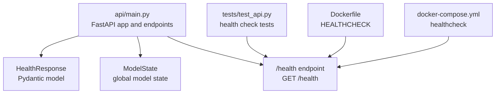
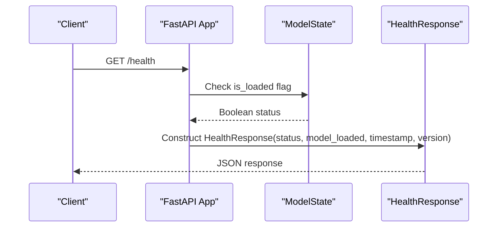
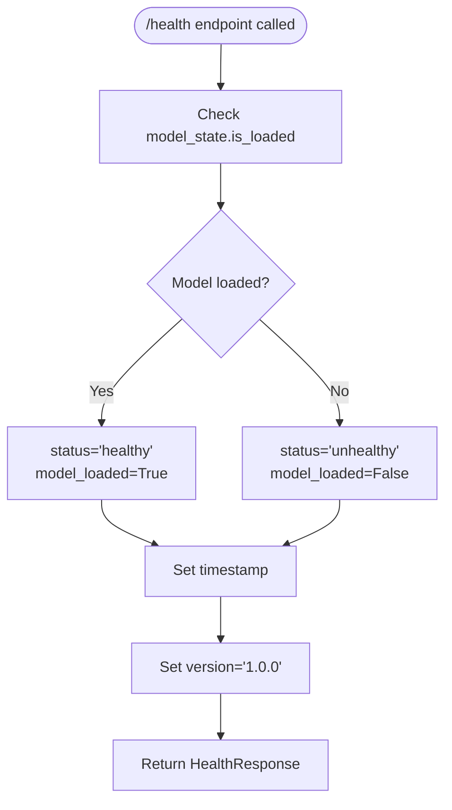
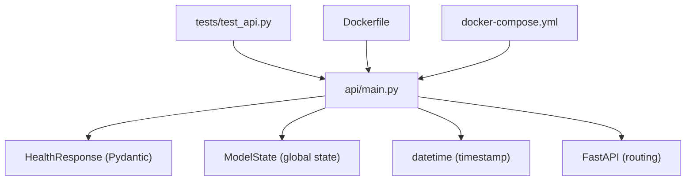

# Health Check Endpoint

<cite>
**Referenced Files in This Document**
- [api/main.py](file://api/main.py)
- [tests/test_api.py](file://tests/test_api.py)
- [Dockerfile](file://Dockerfile)
- [docker-compose.yml](file://docker-compose.yml)
- [README.md](file://README.md)
</cite>

## Table of Contents
1. [Introduction](#introduction)
2. [Project Structure](#project-structure)
3. [Core Components](#core-components)
4. [Architecture Overview](#architecture-overview)
5. [Detailed Component Analysis](#detailed-component-analysis)
6. [Dependency Analysis](#dependency-analysis)
7. [Performance Considerations](#performance-considerations)
8. [Troubleshooting Guide](#troubleshooting-guide)
9. [Conclusion](#conclusion)

## Introduction
This document provides comprehensive documentation for the health check endpoint (/health) that monitors the API and model status. It explains the GET method response structure, how the health check determines model loading status, and what constitutes a healthy API state. It also includes curl examples for health monitoring and integration with load balancers or monitoring systems, documents the HealthResponse Pydantic model fields and validation rules, and addresses common health check scenarios and troubleshooting tips for model loading failures.

## Project Structure
The health check endpoint is part of the FastAPI application located in the api module. The endpoint is defined alongside other API endpoints and uses a dedicated Pydantic model for the response.



**Diagram sources**
- [api/main.py:247-260](file://api/main.py#L247-L260)
- [api/main.py:104-111](file://api/main.py#L104-L111)
- [api/main.py:126-183](file://api/main.py#L126-L183)
- [tests/test_api.py:40-49](file://tests/test_api.py#L40-L49)
- [Dockerfile:80-82](file://Dockerfile#L80-L82)
- [docker-compose.yml:26-31](file://docker-compose.yml#L26-L31)

**Section sources**
- [api/main.py:247-260](file://api/main.py#L247-L260)
- [api/main.py:104-111](file://api/main.py#L104-L111)
- [api/main.py:126-183](file://api/main.py#L126-L183)
- [tests/test_api.py:40-49](file://tests/test_api.py#L40-L49)
- [Dockerfile:80-82](file://Dockerfile#L80-L82)
- [docker-compose.yml:26-31](file://docker-compose.yml#L26-L31)

## Core Components
- HealthResponse Pydantic model: Defines the structure of the health check response.
- ModelState: Manages global model state and loading lifecycle.
- /health endpoint: Returns the current health status and model availability.

Key implementation references:
- HealthResponse model definition: [api/main.py:104-111](file://api/main.py#L104-L111)
- ModelState class and load mechanism: [api/main.py:126-154](file://api/main.py#L126-L154)
- Health endpoint implementation: [api/main.py:247-260](file://api/main.py#L247-L260)

**Section sources**
- [api/main.py:104-111](file://api/main.py#L104-L111)
- [api/main.py:126-154](file://api/main.py#L126-L154)
- [api/main.py:247-260](file://api/main.py#L247-L260)

## Architecture Overview
The health check integrates with the application lifecycle and deployment orchestration:



**Diagram sources**
- [api/main.py:247-260](file://api/main.py#L247-L260)
- [api/main.py:126-154](file://api/main.py#L126-L154)
- [api/main.py:104-111](file://api/main.py#L104-L111)

## Detailed Component Analysis

### HealthResponse Pydantic Model
The HealthResponse model defines the health check response structure with four fields:
- status: String indicating API health ("healthy" or "unhealthy")
- model_loaded: Boolean indicating whether the model is loaded
- timestamp: ISO format timestamp of the health check
- version: API version string

Field definitions and behavior:
- status: Determined by model_state.is_loaded; returns "healthy" when True, "unhealthy" otherwise
- model_loaded: Mirrors model_state.is_loaded
- timestamp: Generated using datetime.now().isoformat()
- version: Fixed string "1.0.0"

Validation rules:
- All fields are required (no defaults)
- status accepts any string value; convention is "healthy"/"unhealthy"
- model_loaded is a boolean flag
- timestamp is a string in ISO format
- version is a string literal "1.0.0"

**Section sources**
- [api/main.py:104-111](file://api/main.py#L104-L111)
- [api/main.py:247-260](file://api/main.py#L247-L260)

### ModelState and Model Loading
The ModelState class manages the global model state and loading lifecycle:
- Tracks model and preprocessor objects
- Maintains feature names and is_loaded flag
- Provides load() method that attempts to load serialized model and preprocessor
- Provides predict() method that requires is_loaded to be True

Model loading behavior:
- Attempts to load model from models/house_price_model.pkl
- Attempts to load preprocessor from models/preprocessor.pkl
- Sets is_loaded to True on successful load, False on failure
- Prints success/failure messages to console

**Section sources**
- [api/main.py:126-154](file://api/main.py#L126-L154)

### Health Endpoint Implementation
The /health endpoint:
- Uses the HealthResponse model as the response model
- Returns a 200 OK status code
- Constructs the response using current model_state.is_loaded
- Includes current timestamp and fixed version string

Integration points:
- Called by Docker HEALTHCHECK
- Monitored by docker-compose healthcheck
- Used by external monitoring systems

**Section sources**
- [api/main.py:247-260](file://api/main.py#L247-L260)

### Health Check Determination Logic
The health check determines API health based on model loading status:



**Diagram sources**
- [api/main.py:247-260](file://api/main.py#L247-L260)
- [api/main.py:126-154](file://api/main.py#L126-L154)

## Dependency Analysis
The health check endpoint has minimal dependencies and integrates with the broader system:



**Diagram sources**
- [api/main.py:104-111](file://api/main.py#L104-L111)
- [api/main.py:126-154](file://api/main.py#L126-L154)
- [api/main.py:247-260](file://api/main.py#L247-L260)
- [tests/test_api.py:40-49](file://tests/test_api.py#L40-L49)
- [Dockerfile:80-82](file://Dockerfile#L80-L82)
- [docker-compose.yml:26-31](file://docker-compose.yml#L26-L31)

**Section sources**
- [api/main.py:104-111](file://api/main.py#L104-L111)
- [api/main.py:126-154](file://api/main.py#L126-L154)
- [api/main.py:247-260](file://api/main.py#L247-L260)
- [tests/test_api.py:40-49](file://tests/test_api.py#L40-L49)
- [Dockerfile:80-82](file://Dockerfile#L80-L82)
- [docker-compose.yml:26-31](file://docker-compose.yml#L26-L31)

## Performance Considerations
- Health check is lightweight: it only reads the is_loaded flag and generates a timestamp
- No model inference is performed during health checks
- Response size is minimal (4 fields)
- Ideal for frequent monitoring without impacting performance

## Troubleshooting Guide

### Common Health Check Scenarios

#### Scenario 1: API returns unhealthy status
- Symptoms: status="unhealthy", model_loaded=false
- Likely causes:
  - Model files not found in models/ directory
  - Model files corrupted or incompatible
  - Application failed to load models during startup
- Resolution steps:
  1. Verify model files exist: models/house_price_model.pkl and models/preprocessor.pkl
  2. Check file permissions and ownership
  3. Review application logs for load errors
  4. Re-train and save models using the notebook

#### Scenario 2: Docker container fails health checks
- Symptoms: Docker HEALTHCHECK fails, container restarts
- Likely causes:
  - API not listening on port 8000
  - Model loading failure in container
  - Incorrect model paths in container
- Resolution steps:
  1. Check Docker logs for the API container
  2. Verify volume mounts for models directory
  3. Confirm model files are present in the container
  4. Test health endpoint inside container

#### Scenario 3: Load balancer marks service as unhealthy
- Symptoms: Load balancer health probes fail
- Likely causes:
  - Network connectivity issues
  - Port misconfiguration
  - Model loading timing issues
- Resolution steps:
  1. Verify container exposes port 8000
  2. Check load balancer health check configuration
  3. Adjust health check intervals and timeouts
  4. Ensure model loading completes before health checks

### Model Loading Failure Investigation
Steps to diagnose model loading issues:

1. **Verify model files exist**:
   - Check models/ directory contains both .pkl files
   - Confirm file sizes are reasonable (> 0 bytes)

2. **Test model loading locally**:
   ```bash
   python -c "
   import joblib
   model = joblib.load('models/house_price_model.pkl')
   preprocessor = joblib.load('models/preprocessor.pkl')
   print('Model loaded successfully')
   ```

3. **Check application logs**:
   - Look for "Model loaded successfully" message
   - Check for "Error loading model" messages
   - Review stack traces for specific exceptions

4. **Validate model compatibility**:
   - Ensure Python version matches training environment
   - Check scikit-learn and joblib versions
   - Verify numpy/pandas compatibility

5. **Environment-specific issues**:
   - Docker container filesystem permissions
   - Volume mount correctness
   - Working directory path resolution

**Section sources**
- [api/main.py:135-154](file://api/main.py#L135-L154)
- [Dockerfile:80-82](file://Dockerfile#L80-L82)
- [docker-compose.yml:26-31](file://docker-compose.yml#L26-L31)

## Conclusion
The health check endpoint provides a reliable mechanism for monitoring the API and model status. Its simple design ensures minimal overhead while providing critical operational visibility. The endpoint integrates seamlessly with Docker orchestration and can be easily consumed by monitoring systems and load balancers. Proper model management and deployment practices are essential for maintaining healthy API status.