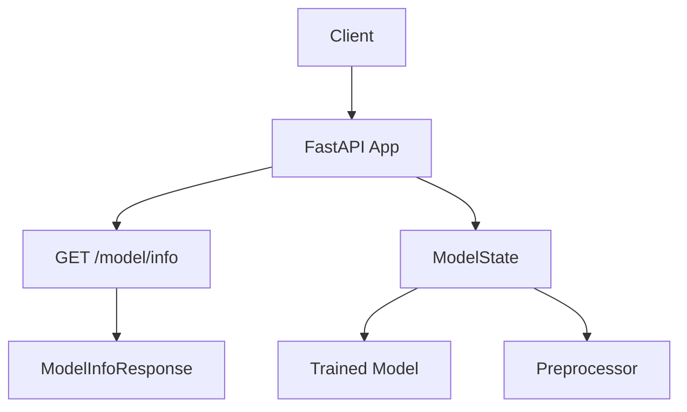
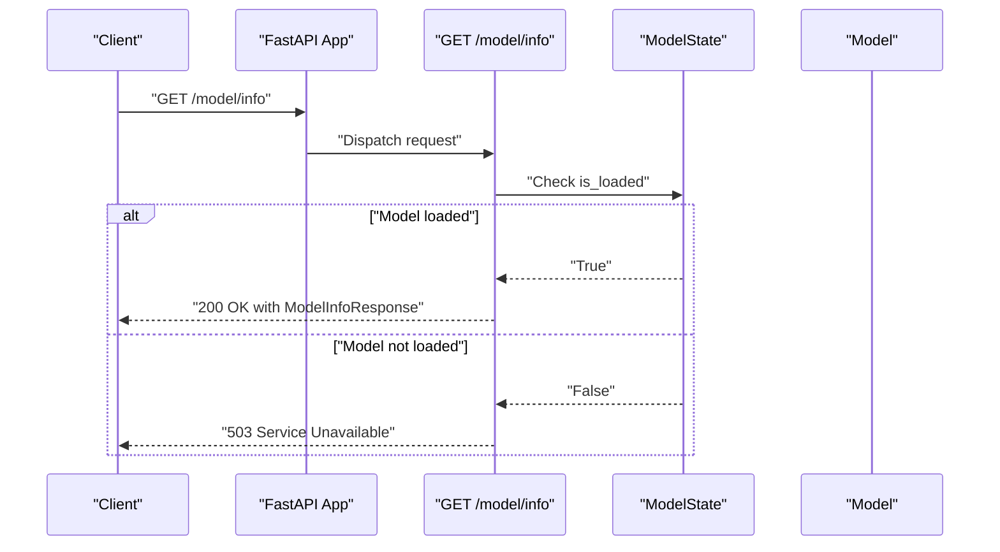
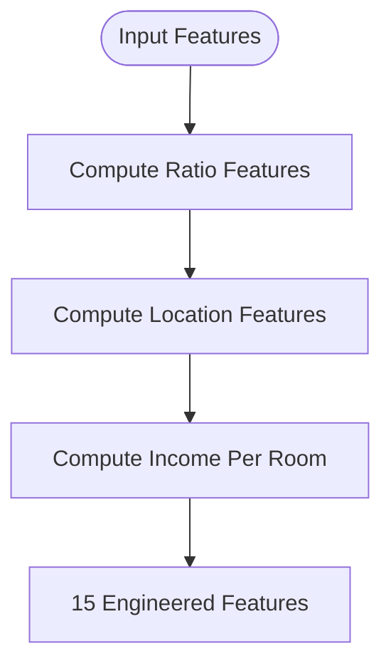
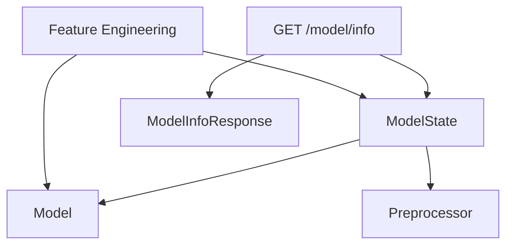

# Model Information Endpoint

<cite>
**Referenced Files in This Document**
- [api/main.py](file://api/main.py)
- [src/data_processing.py](file://src/data_processing.py)
- [src/models.py](file://src/models.py)
- [train_model_for_web.py](file://train_model_for_web.py)
- [tests/test_api.py](file://tests/test_api.py)
- [README.md](file://README.md)
- [docs/model_data.json](file://docs/model_data.json)
- [docs/web_model.json](file://docs/web_model.json)
</cite>

## Table of Contents
1. [Introduction](#introduction)
2. [Project Structure](#project-structure)
3. [Core Components](#core-components)
4. [Architecture Overview](#architecture-overview)
5. [Detailed Component Analysis](#detailed-component-analysis)
6. [Dependency Analysis](#dependency-analysis)
7. [Performance Considerations](#performance-considerations)
8. [Troubleshooting Guide](#troubleshooting-guide)
9. [Conclusion](#conclusion)

## Introduction
This document provides comprehensive documentation for the model information endpoint (/model/info). It explains the GET method response structure, the deployed model metadata, the feature engineering process that generates additional features, the Pydantic model used for validation, and the error handling behavior when the model is not loaded. It also includes curl examples and feature significance in the prediction model.

## Project Structure
The model information endpoint is part of a FastAPI application that serves a machine learning model for California housing price prediction. The endpoint returns metadata about the deployed model, including the model type, version, feature names, and a description.

**Diagram sources**
- [api/main.py:263-287](file://api/main.py#L263-L287)
- [api/main.py:126-183](file://api/main.py#L126-L183)

**Section sources**
- [api/main.py:263-287](file://api/main.py#L263-L287)
- [README.md:239-246](file://README.md#L239-L246)

## Core Components
- ModelInfoResponse Pydantic model defines the response structure for the /model/info endpoint.
- ModelState manages global model and preprocessor state, including loading and prediction logic.
- Feature engineering adds derived features used by the model.

Key responsibilities:
- Validate model availability before serving metadata.
- Return structured metadata including model_type, version, features, and description.
- Provide feature engineering details for transparency.

**Section sources**
- [api/main.py:113-120](file://api/main.py#L113-L120)
- [api/main.py:126-183](file://api/main.py#L126-L183)
- [api/main.py:263-287](file://api/main.py#L263-L287)

## Architecture Overview
The /model/info endpoint integrates with the FastAPI application lifecycle and the global ModelState. It checks model readiness and returns a standardized response.

**Diagram sources**
- [api/main.py:263-287](file://api/main.py#L263-L287)
- [api/main.py:126-183](file://api/main.py#L126-L183)

## Detailed Component Analysis

### Model Information Endpoint
- Endpoint: GET /model/info
- Response model: ModelInfoResponse
- Behavior:
  - If the model is loaded, returns model_type, version, features, and description.
  - If the model is not loaded, raises HTTP 503 Service Unavailable.

Response structure:
- model_type: String indicating the model class used for predictions.
- version: String representing the model version.
- features: Array of strings listing all features used by the model.
- description: String describing the model and dataset.

Error handling:
- HTTP 503 Service Unavailable when model_state.is_loaded is False.

**Section sources**
- [api/main.py:263-287](file://api/main.py#L263-L287)
- [tests/test_api.py:169-199](file://tests/test_api.py#L169-L199)

### ModelInfoResponse Pydantic Model
The response model enforces the shape of the /model/info response.

Fields:
- model_type: str
- version: str
- features: list
- description: str

Validation:
- No explicit validators are defined; the model relies on FastAPI’s automatic validation and serialization.

**Section sources**
- [api/main.py:113-120](file://api/main.py#L113-L120)

### Feature Engineering Process
The model uses 15 engineered features derived from the original 8 inputs. The feature engineering process includes:
- Ratio features:
  - rooms_per_household
  - bedrooms_per_room
  - population_per_household
- Location features:
  - distance_to_sf (distance to San Francisco)
  - distance_to_la (distance to Los Angeles)
- Derived income feature:
  - income_per_room

These features are computed during prediction and preprocessing. The training script and data processing module demonstrate how these features are constructed and used.

**Diagram sources**
- [api/main.py:160-173](file://api/main.py#L160-L173)
- [train_model_for_web.py:39-53](file://train_model_for_web.py#L39-L53)
- [src/data_processing.py:202-255](file://src/data_processing.py#L202-L255)

**Section sources**
- [api/main.py:160-173](file://api/main.py#L160-L173)
- [train_model_for_web.py:39-53](file://train_model_for_web.py#L39-L53)
- [src/data_processing.py:202-255](file://src/data_processing.py#L202-L255)

### Feature Significance in the Prediction Model
The model emphasizes several key features:
- Median Income: Strongest predictor with high correlation.
- Ocean Proximity: Significant impact on pricing.
- Location Features: Distance to major cities add predictive value.
- Ratio Features: Capture dwelling characteristics and density.

These insights are reflected in both the training pipeline and the exported model data.

**Section sources**
- [README.md:290-320](file://README.md#L290-L320)
- [docs/model_data.json:114-129](file://docs/model_data.json#L114-L129)

### Curl Examples
Use curl to retrieve model metadata:
- Basic request:
  - curl -X GET http://localhost:8000/model/info
- With verbose output:
  - curl -v -X GET http://localhost:8000/model/info

Expected responses:
- 200 OK with JSON body containing model_type, version, features, and description.
- 503 Service Unavailable when the model is not loaded.

**Section sources**
- [README.md:248-263](file://README.md#L248-L263)
- [tests/test_api.py:169-199](file://tests/test_api.py#L169-L199)

## Dependency Analysis
The /model/info endpoint depends on the global ModelState to determine readiness. The feature engineering logic is shared between prediction and training contexts.

**Diagram sources**
- [api/main.py:263-287](file://api/main.py#L263-L287)
- [api/main.py:126-183](file://api/main.py#L126-L183)
- [api/main.py:160-173](file://api/main.py#L160-L173)

**Section sources**
- [api/main.py:263-287](file://api/main.py#L263-L287)
- [api/main.py:126-183](file://api/main.py#L126-L183)

## Performance Considerations
- The endpoint is lightweight and does not compute predictions; it only reads metadata from memory.
- Model readiness is checked via a simple boolean flag, minimizing overhead.
- Feature engineering for this endpoint is minimal compared to prediction time.

## Troubleshooting Guide
Common issues and resolutions:
- HTTP 503 Service Unavailable:
  - Cause: The model is not loaded at startup.
  - Resolution: Ensure the model files exist and are loadable. Check the startup logs for loading messages.
- Unexpected feature lists:
  - Cause: Mismatch between training and runtime feature engineering.
  - Resolution: Verify that the feature engineering steps match between training and inference.

Verification via tests:
- The test suite validates both successful metadata retrieval and error handling when the model is not loaded.

**Section sources**
- [tests/test_api.py:169-199](file://tests/test_api.py#L169-L199)
- [api/main.py:135-154](file://api/main.py#L135-L154)

## Conclusion
The /model/info endpoint provides essential metadata about the deployed model, including the model type, version, and the complete list of features used. It enforces readiness checks and returns a standardized response. The feature engineering process enhances the model’s predictive power by deriving meaningful features from the original inputs. Proper error handling ensures clients receive clear feedback when the model is unavailable.