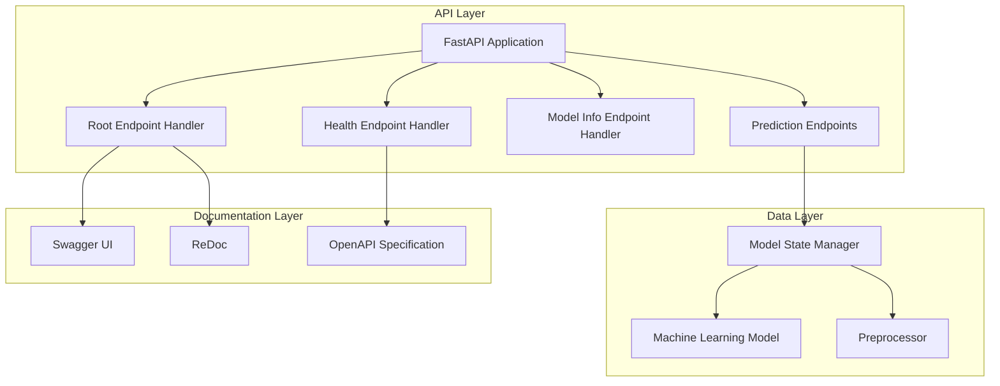
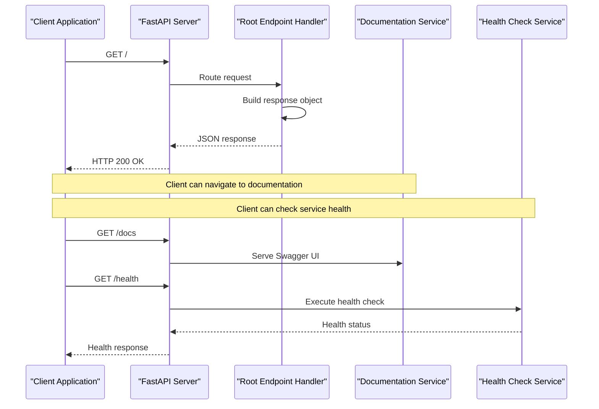
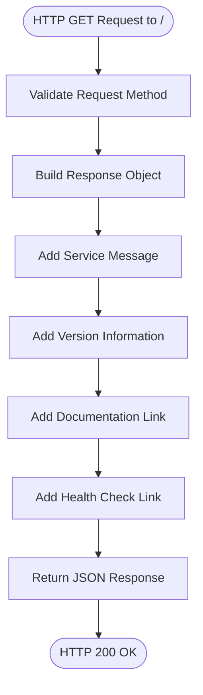
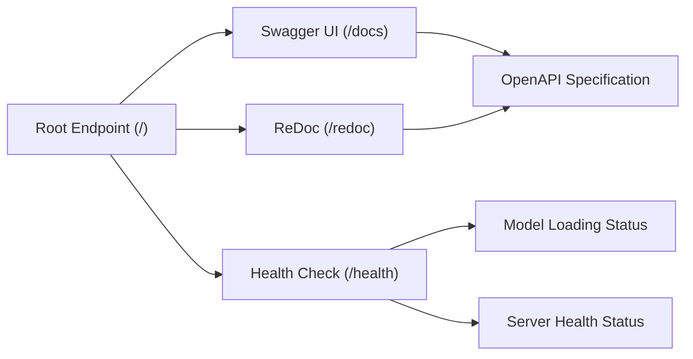
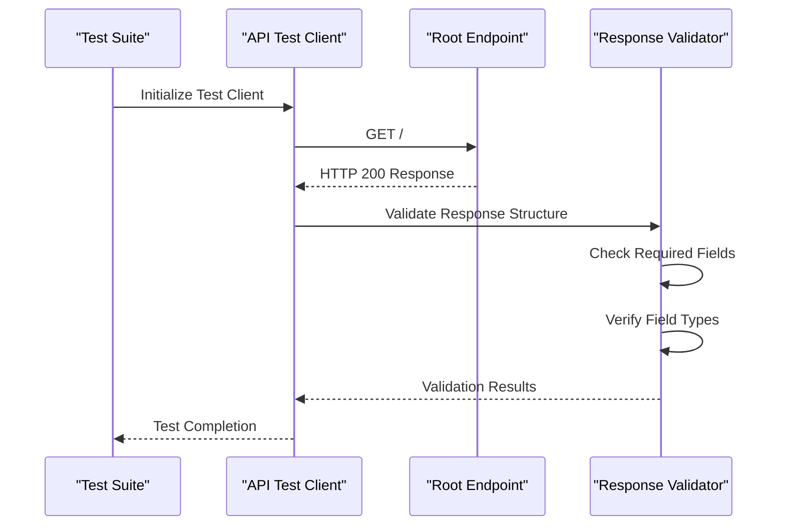
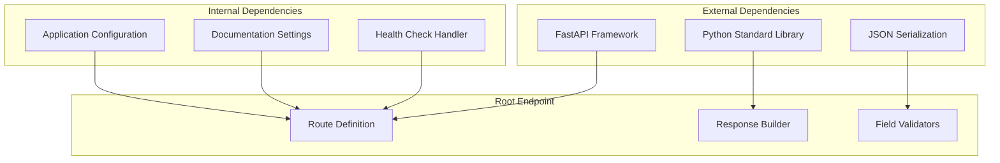
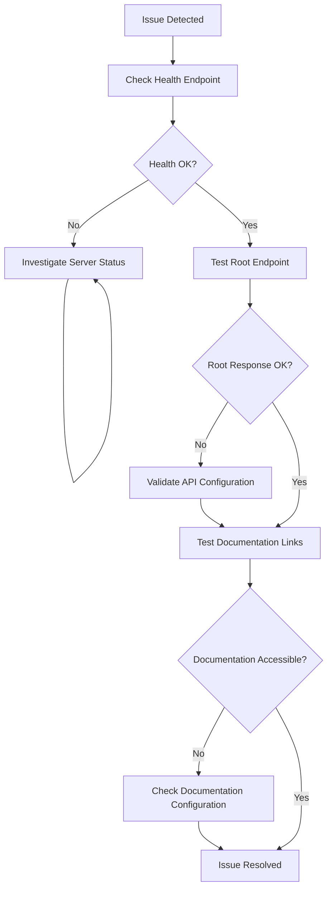

# Root Endpoint

<cite>
**Referenced Files in This Document**
- [api/main.py](file://api/main.py)
- [tests/test_api.py](file://tests/test_api.py)
- [README.md](file://README.md)
- [Dockerfile](file://Dockerfile)
- [docker-compose.yml](file://docker-compose.yml)
</cite>

## Table of Contents
1. [Introduction](#introduction)
2. [Project Structure](#project-structure)
3. [Core Components](#core-components)
4. [Architecture Overview](#architecture-overview)
5. [Detailed Component Analysis](#detailed-component-analysis)
6. [Dependency Analysis](#dependency-analysis)
7. [Performance Considerations](#performance-considerations)
8. [Troubleshooting Guide](#troubleshooting-guide)
9. [Conclusion](#conclusion)

## Introduction
This document provides comprehensive documentation for the root endpoint (/) of the California House Price Prediction API. The root endpoint serves as the primary entry point for API discovery and documentation access. It returns essential service information including a greeting message, version details, and navigation links to the interactive API documentation and health check endpoints.

The root endpoint follows RESTful conventions by responding to GET requests with a structured JSON payload that enables clients to quickly understand the API's capabilities and locate additional resources. This design promotes discoverability and reduces the cognitive load on developers integrating with the system.

## Project Structure
The root endpoint is implemented within the FastAPI application structure. The API is organized into distinct modules with clear separation of concerns:

**Diagram sources**
- [api/main.py:237-245](file://api/main.py#L237-L245)
- [api/main.py:248-260](file://api/main.py#L248-L260)

**Section sources**
- [api/main.py:201-221](file://api/main.py#L201-L221)
- [api/main.py:237-245](file://api/main.py#L237-L245)

## Core Components
The root endpoint implementation consists of several key components that work together to provide comprehensive API discovery:

### Root Endpoint Handler
The root endpoint handler is defined as a FastAPI route decorator that responds to GET requests at the root path. It returns a structured JSON object containing essential service metadata and navigation links.

### Response Structure
The endpoint produces a standardized response format that includes:
- Service identification message
- Version information
- Documentation endpoint reference
- Health check endpoint reference

### API Configuration
The FastAPI application is configured with specific documentation URLs that integrate seamlessly with the root endpoint's navigation structure.

**Section sources**
- [api/main.py:237-245](file://api/main.py#L237-L245)
- [api/main.py:201-221](file://api/main.py#L201-L221)

## Architecture Overview
The root endpoint operates within a layered architecture that separates concerns between presentation, business logic, and data persistence:

**Diagram sources**
- [api/main.py:237-245](file://api/main.py#L237-L245)
- [api/main.py:248-260](file://api/main.py#L248-L260)

The architecture ensures that the root endpoint remains lightweight while providing comprehensive navigation capabilities. The endpoint delegates to specialized handlers for documentation and health checking, maintaining separation of concerns and enabling independent scaling of different API components.

**Section sources**
- [api/main.py:237-245](file://api/main.py#L237-L245)
- [api/main.py:248-260](file://api/main.py#L248-L260)

## Detailed Component Analysis

### Root Endpoint Implementation
The root endpoint is implemented as a simple yet powerful route handler that provides immediate value to API consumers:

**Diagram sources**
- [api/main.py:237-245](file://api/main.py#L237-L245)

The implementation follows these design principles:
- **Minimal Complexity**: Single-purpose endpoint focused solely on discovery
- **Consistent Structure**: Standardized response format across all API versions
- **Clear Navigation**: Direct links to related endpoints and documentation
- **Future-Proof Design**: Easy extensibility for additional metadata fields

### Response Schema Analysis
The root endpoint response follows a well-defined schema that enables predictable client consumption:

| Field Name | Type | Description | Example |
|------------|------|-------------|---------|
| message | string | Human-readable service identifier | "California House Price Prediction API" |
| version | string | API version identifier | "1.0.0" |
| docs | string | Relative path to interactive documentation | "/docs" |
| health | string | Relative path to health check endpoint | "/health" |

### Integration with Documentation System
The root endpoint integrates seamlessly with the FastAPI documentation system:

**Diagram sources**
- [api/main.py:218-219](file://api/main.py#L218-L219)
- [api/main.py:237-245](file://api/main.py#L237-L245)

**Section sources**
- [api/main.py:237-245](file://api/main.py#L237-L245)
- [api/main.py:218-219](file://api/main.py#L218-L219)

### Testing and Validation
The root endpoint undergoes comprehensive testing to ensure reliability and correctness:

**Diagram sources**
- [tests/test_api.py:30-39](file://tests/test_api.py#L30-L39)

The testing approach ensures that:
- Response structure remains consistent across deployments
- Field presence and types are validated automatically
- Integration with the broader API ecosystem is maintained

**Section sources**
- [tests/test_api.py:30-39](file://tests/test_api.py#L30-L39)

## Dependency Analysis
The root endpoint has minimal dependencies, contributing to its stability and performance characteristics:

**Diagram sources**
- [api/main.py:18-21](file://api/main.py#L18-L21)
- [api/main.py:201-221](file://api/main.py#L201-L221)

The dependency structure reveals several important characteristics:
- **Low Coupling**: Minimal external dependencies reduce maintenance overhead
- **High Cohesion**: All functionality required for the endpoint is contained within the main module
- **Stable Interface**: The endpoint interface is unlikely to change frequently

**Section sources**
- [api/main.py:18-21](file://api/main.py#L18-L21)
- [api/main.py:201-221](file://api/main.py#L201-L221)

## Performance Considerations
The root endpoint is designed for optimal performance characteristics:

### Response Size and Complexity
- **Minimal Payload**: Contains only essential metadata (4 fields)
- **Simple Data Types**: String values with no nested structures
- **Static Content**: No database queries or external API calls required

### Caching Strategy
The endpoint benefits from automatic HTTP caching mechanisms:
- **Browser Caching**: Clients can cache the response for improved performance
- **Reverse Proxy Caching**: CDN and proxy servers can cache static discovery information
- **Application-Level Caching**: FastAPI's internal caching reduces repeated computation

### Scalability Characteristics
- **Memory Efficiency**: Constant memory usage regardless of concurrent requests
- **CPU Efficiency**: Minimal computational overhead for response construction
- **Network Efficiency**: Small response size reduces bandwidth consumption

## Troubleshooting Guide

### Common Issues and Solutions

#### Endpoint Not Accessible
**Symptoms**: HTTP 404 or 500 errors when accessing the root endpoint
**Causes**: 
- API server not running
- Incorrect base URL configuration
- Network connectivity issues

**Solutions**:
- Verify API server status using the health endpoint
- Check network connectivity to the API host
- Confirm correct base URL in client configuration

#### Unexpected Response Format
**Symptoms**: Missing fields or incorrect data types in response
**Causes**:
- API version mismatch
- Client-side parsing errors
- Network corruption during transmission

**Solutions**:
- Verify API version compatibility
- Implement proper JSON parsing in client applications
- Retry requests with network monitoring

#### Documentation Links Inaccessible
**Symptoms**: 404 errors when navigating to documentation endpoints
**Causes**:
- Documentation service not enabled
- Incorrect documentation URL configuration
- Authentication requirements for documentation

**Solutions**:
- Check FastAPI documentation configuration
- Verify documentation service availability
- Review authentication requirements for protected endpoints

### Debugging Workflow

**Diagram sources**
- [api/main.py:248-260](file://api/main.py#L248-L260)
- [api/main.py:237-245](file://api/main.py#L237-L245)

**Section sources**
- [api/main.py:248-260](file://api/main.py#L248-L260)
- [tests/test_api.py:30-39](file://tests/test_api.py#L30-L39)

## Conclusion
The root endpoint (/) serves as a critical component of the California House Price Prediction API's discoverability infrastructure. Its implementation demonstrates best practices in API design by providing immediate, actionable information to clients while maintaining simplicity and performance.

The endpoint's design prioritizes developer experience through clear navigation, consistent response formatting, and seamless integration with the broader API ecosystem. The comprehensive testing approach ensures reliability across different deployment scenarios, while the minimal dependency footprint contributes to long-term maintainability.

Key strengths of the implementation include:
- **Discoverability**: Clear navigation to related endpoints and documentation
- **Reliability**: Consistent response structure validated through automated tests
- **Performance**: Lightweight implementation with minimal resource consumption
- **Maintainability**: Simple codebase with clear separation of concerns

Future enhancements could include optional metadata fields for environment-specific information or integration with service discovery mechanisms, but the current implementation provides an excellent foundation for API consumption and integration.