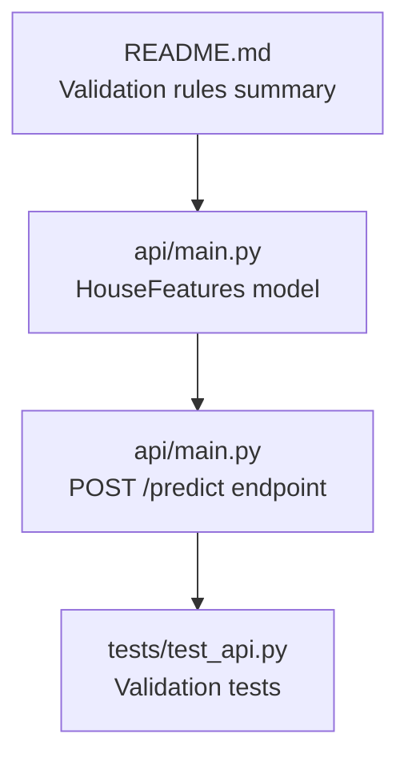
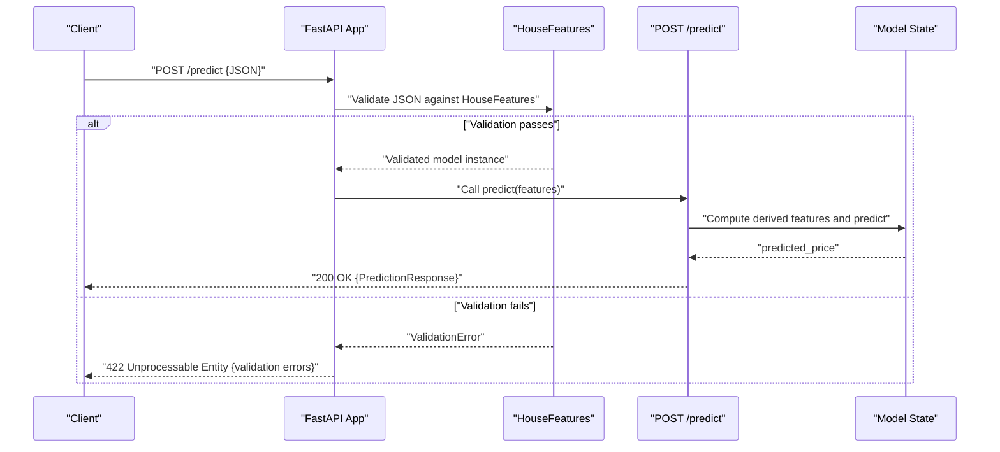
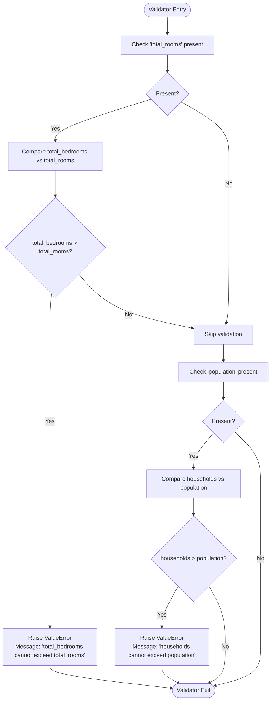
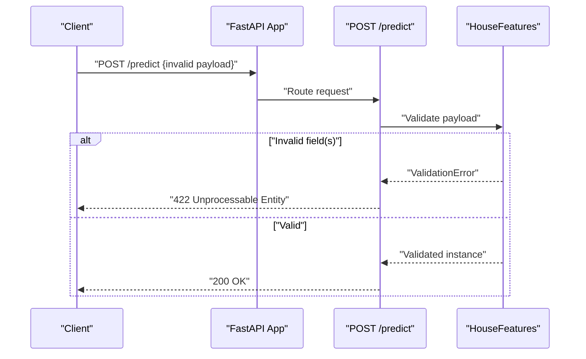
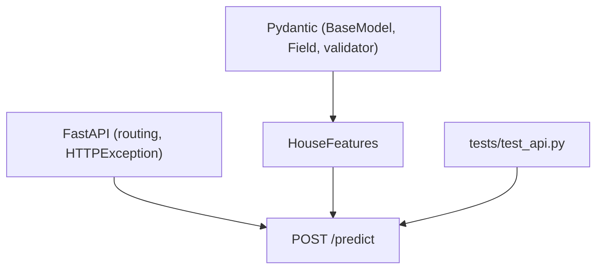

# Input Validation Rules

<cite>
**Referenced Files in This Document**
- [api/main.py](file://api/main.py)
- [tests/test_api.py](file://tests/test_api.py)
- [README.md](file://README.md)
</cite>

## Table of Contents
1. [Introduction](#introduction)
2. [Project Structure](#project-structure)
3. [Core Components](#core-components)
4. [Architecture Overview](#architecture-overview)
5. [Detailed Component Analysis](#detailed-component-analysis)
6. [Dependency Analysis](#dependency-analysis)
7. [Performance Considerations](#performance-considerations)
8. [Troubleshooting Guide](#troubleshooting-guide)
9. [Conclusion](#conclusion)

## Introduction
This document explains the input validation rules defined in the HouseFeatures Pydantic model used by the California House Price Prediction API. It covers all nine input fields, their data types, validation ranges, and constraints. It also documents the custom validators that enforce business logic constraints and describes how validation errors are surfaced to clients.

## Project Structure
The validation logic resides in the API module’s Pydantic model and is exercised by the API endpoints and tests.

**Diagram sources**
- [api/main.py:31-83](file://api/main.py#L31-L83)
- [api/main.py:290-348](file://api/main.py#L290-L348)
- [tests/test_api.py:104-148](file://tests/test_api.py#L104-L148)
- [README.md:352-357](file://README.md#L352-L357)

**Section sources**
- [api/main.py:31-83](file://api/main.py#L31-L83)
- [api/main.py:290-348](file://api/main.py#L290-L348)
- [tests/test_api.py:104-148](file://tests/test_api.py#L104-L148)
- [README.md:352-357](file://README.md#L352-L357)

## Core Components
The HouseFeatures model defines nine input fields with explicit constraints and two custom validators to enforce business rules.

- longitude: float, range [-125.0, -114.0]
- latitude: float, range [32.0, 43.0]
- housing_median_age: float, range [1, 52]
- total_rooms: float, range [1, 50000]
- total_bedrooms: float, range [1, 10000]
- population: float, range [1, 50000]
- households: float, range [1, 10000]
- median_income: float, range [0.5, 15.0]
- ocean_proximity: enum with allowed values: "<1H OCEAN", "INLAND", "ISLAND", "NEAR BAY", "NEAR OCEAN"

Custom validators:
- total_bedrooms must be less than or equal to total_rooms
- households must be less than or equal to population

These validators are implemented using Pydantic’s validator decorator and are evaluated during model construction.

**Section sources**
- [api/main.py:31-83](file://api/main.py#L31-L83)

## Architecture Overview
The validation occurs when clients send requests to the /predict endpoint. The FastAPI runtime validates the incoming JSON against the HouseFeatures model. If validation passes, the request proceeds to prediction logic; otherwise, FastAPI returns a 422 Unprocessable Entity response with validation details.

**Diagram sources**
- [api/main.py:31-83](file://api/main.py#L31-L83)
- [api/main.py:290-348](file://api/main.py#L290-L348)

## Detailed Component Analysis

### HouseFeatures Model Fields and Constraints
Each field is defined with:
- A type annotation (float)
- A Pydantic Field with constraints (ge, le) for numeric bounds
- An enum constraint for ocean_proximity
- A description for documentation

Field definitions and constraints:
- longitude: ge=-125.0, le=-114.0
- latitude: ge=32.0, le=43.0
- housing_median_age: ge=1, le=52
- total_rooms: ge=1, le=50000
- total_bedrooms: ge=1, le=10000
- population: ge=1, le=50000
- households: ge=1, le=10000
- median_income: ge=0.5, le=15.0
- ocean_proximity: enum with allowed values

**Section sources**
- [api/main.py:34-70](file://api/main.py#L34-L70)

### Custom Validators: Business Logic Enforcement
Two custom validators ensure realistic relationships among fields:

1) total_bedrooms vs total_rooms
- Condition: total_bedrooms <= total_rooms
- Violation triggers a ValueError with message: "total_bedrooms cannot exceed total_rooms"

2) households vs population
- Condition: households <= population
- Violation triggers a ValueError with message: "households cannot exceed population"

These validators are implemented using Pydantic’s validator decorator and receive the current field value and the values dictionary of the model instance.

**Diagram sources**
- [api/main.py:72-82](file://api/main.py#L72-L82)

**Section sources**
- [api/main.py:72-82](file://api/main.py#L72-L82)

### Validation Behavior in API Endpoints
- The /predict endpoint accepts a HouseFeatures model parameter.
- If validation fails, FastAPI returns a 422 Unprocessable Entity response with validation errors.
- The tests demonstrate that invalid longitude, latitude, median_income, ocean_proximity, missing fields, and out-of-range values produce 422 responses.

**Diagram sources**
- [api/main.py:290-348](file://api/main.py#L290-L348)
- [tests/test_api.py:104-148](file://tests/test_api.py#L104-L148)

**Section sources**
- [api/main.py:290-348](file://api/main.py#L290-L348)
- [tests/test_api.py:104-148](file://tests/test_api.py#L104-L148)

### Example Inputs and Expected Outcomes
Below are examples of valid and invalid inputs, along with expected outcomes. These examples illustrate the constraints documented in the model and tests.

- Valid examples
  - longitude within [-125.0, -114.0]
  - latitude within [32.0, 43.0]
  - total_bedrooms ≤ total_rooms
  - households ≤ population
  - median_income within [0.5, 15.0]
  - ocean_proximity one of the allowed enum values

- Invalid examples
  - longitude outside [-125.0, -114.0]
  - latitude outside [32.0, 43.0]
  - median_income below 0.5
  - ocean_proximity not in allowed set
  - total_bedrooms > total_rooms
  - households > population
  - missing required fields

Behavior:
- Invalid values cause a 422 Unprocessable Entity response.
- The tests confirm that invalid longitude, latitude, income, ocean_proximity, and missing fields trigger 422 responses.

**Section sources**
- [tests/test_api.py:104-148](file://tests/test_api.py#L104-L148)
- [README.md:352-357](file://README.md#L352-L357)

## Dependency Analysis
The validation logic depends on:
- Pydantic BaseModel and Field for schema definition and built-in constraints
- Pydantic validator decorator for custom validation
- FastAPI for request routing and error response formatting

**Diagram sources**
- [api/main.py:20-21](file://api/main.py#L20-L21)
- [api/main.py:31-83](file://api/main.py#L31-L83)
- [api/main.py:290-348](file://api/main.py#L290-L348)
- [tests/test_api.py:18](file://tests/test_api.py#L18-L18)

**Section sources**
- [api/main.py:20-21](file://api/main.py#L20-L21)
- [api/main.py:31-83](file://api/main.py#L31-L83)
- [api/main.py:290-348](file://api/main.py#L290-L348)
- [tests/test_api.py:18](file://tests/test_api.py#L18-L18)

## Performance Considerations
- Validation is performed synchronously during request handling; it is lightweight and should not impact latency significantly.
- The custom validators access other fields via the values dictionary, which is efficient for small models.

## Troubleshooting Guide
Common validation issues and how to resolve them:

- 422 Unprocessable Entity with field-specific errors
  - Cause: One or more fields violate constraints (range, enum, or custom validator).
  - Resolution: Adjust values to meet constraints and re-submit.

- Custom validator errors
  - total_bedrooms cannot exceed total_rooms
    - Ensure total_bedrooms ≤ total_rooms.
  - households cannot exceed population
    - Ensure households ≤ population.

- Missing required fields
  - Cause: JSON payload lacks a required field.
  - Resolution: Include all nine fields with valid values.

- Model not loaded
  - Cause: /predict invoked when model_state.is_loaded is False.
  - Resolution: Ensure model is loaded before invoking prediction endpoints.

- Error response format
  - FastAPI returns standardized error responses for validation failures. Clients should parse the response body for details.

**Section sources**
- [api/main.py:389-398](file://api/main.py#L389-L398)
- [tests/test_api.py:89-103](file://tests/test_api.py#L89-L103)
- [tests/test_api.py:104-148](file://tests/test_api.py#L104-L148)

## Conclusion
The HouseFeatures model enforces strict input validation for the California House Price Prediction API. It ensures geographic coordinates fall within California, numeric fields remain within realistic ranges, categorical values are valid, and business rules (total_bedrooms ≤ total_rooms and households ≤ population) are satisfied. Validation errors are surfaced as 422 responses, enabling clients to quickly identify and correct invalid inputs.