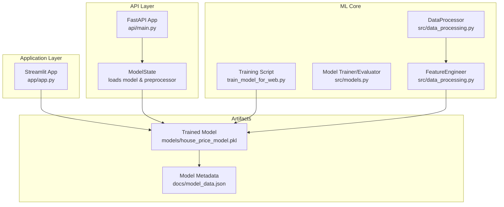
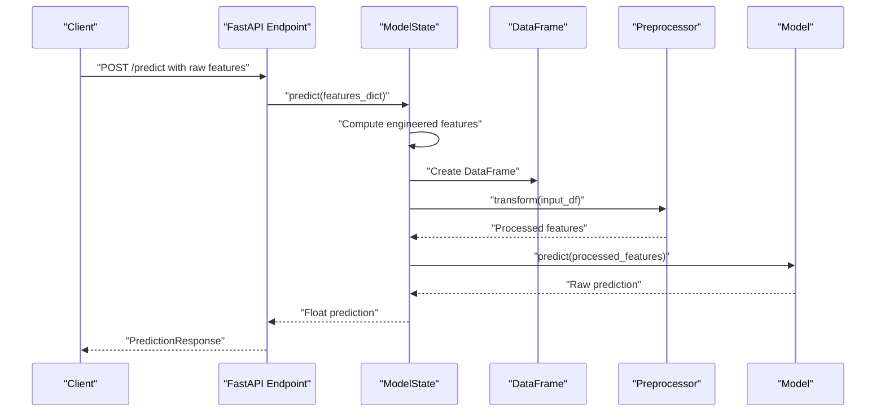
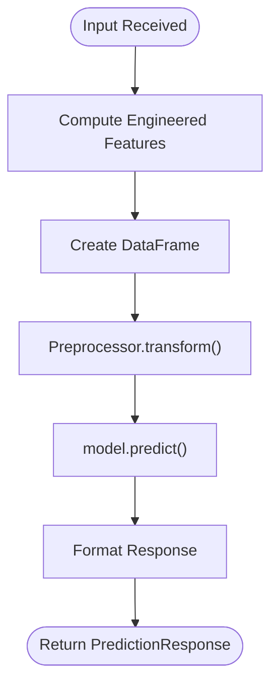
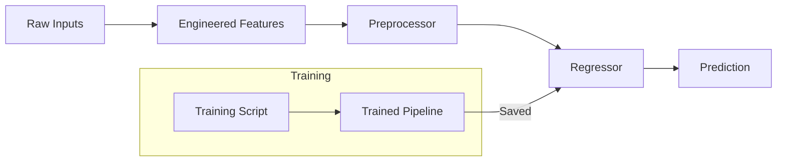

# Prediction Processing Logic

<cite>
**Referenced Files in This Document**
- [api/main.py](file://api/main.py)
- [app/app.py](file://app/app.py)
- [src/data_processing.py](file://src/data_processing.py)
- [src/models.py](file://src/models.py)
- [train_model_for_web.py](file://train_model_for_web.py)
- [docs/model_data.json](file://docs/model_data.json)
- [README.md](file://README.md)
</cite>

## Table of Contents
1. [Introduction](#introduction)
2. [Project Structure](#project-structure)
3. [Core Components](#core-components)
4. [Architecture Overview](#architecture-overview)
5. [Detailed Component Analysis](#detailed-component-analysis)
6. [Dependency Analysis](#dependency-analysis)
7. [Performance Considerations](#performance-considerations)
8. [Troubleshooting Guide](#troubleshooting-guide)
9. [Conclusion](#conclusion)

## Introduction
This document explains the prediction processing pipeline that transforms raw input features into model predictions. It focuses on the feature engineering calculations performed in the ModelState.predict() method and the end-to-end flow from raw inputs to a final price prediction. The documented features include:
- rooms_per_household (total_rooms/households)
- bedrooms_per_room (total_bedrooms/total_rooms)
- population_per_household (population/households)
- distance_to_sf (Euclidean distance from San Francisco coordinates)
- distance_to_la (Euclidean distance from Los Angeles coordinates)
- income_per_room (median_income/rooms_per_household)

It also covers the model loading mechanism, preprocessor transformation, and how the processed features are passed to the trained model.

## Project Structure
The prediction pipeline spans multiple components:
- API service (FastAPI) that exposes prediction endpoints and loads the model at startup
- Streamlit application that mirrors the same prediction logic locally
- Data processing module that defines preprocessing pipelines and feature engineering
- Training script that builds and saves the model and supporting artifacts
- Documentation assets that describe the model’s feature set and statistics

**Diagram sources**
- [api/main.py:126-180](file://api/main.py#L126-L180)
- [app/app.py:72-82](file://app/app.py#L72-L82)
- [src/data_processing.py:22-341](file://src/data_processing.py#L22-L341)
- [src/models.py:30-366](file://src/models.py#L30-L366)
- [train_model_for_web.py:23-196](file://train_model_for_web.py#L23-L196)
- [docs/model_data.json:1-171](file://docs/model_data.json#L1-L171)

**Section sources**
- [README.md:88-139](file://README.md#L88-L139)

## Core Components
This section highlights the key components involved in prediction processing and their roles.

- ModelState (API): Loads the trained model and preprocessor from disk, computes engineered features, transforms inputs, and executes predictions.
- FeatureEngineer (data processing): Defines preprocessing pipelines and feature engineering transformations used during training and inference.
- Model persistence: The training script saves the full pipeline (including preprocessing) and supporting metadata for web usage.
- Streamlit app: Mirrors the same feature engineering and prediction flow locally for interactive use.

Key responsibilities:
- Feature engineering: Ratio features, distance metrics, and derived income metrics
- Preprocessing: Imputation, scaling, and one-hot encoding
- Prediction: Transform input features and call the trained regressor

**Section sources**
- [api/main.py:126-180](file://api/main.py#L126-L180)
- [src/data_processing.py:189-341](file://src/data_processing.py#L189-L341)
- [train_model_for_web.py:108-196](file://train_model_for_web.py#L108-L196)
- [app/app.py:72-82](file://app/app.py#L72-L82)

## Architecture Overview
The prediction pipeline follows a consistent flow across the API and local applications.

**Diagram sources**
- [api/main.py:290-347](file://api/main.py#L290-L347)
- [api/main.py:155-179](file://api/main.py#L155-L179)

## Detailed Component Analysis

### Feature Engineering Calculations
The ModelState.predict() method computes six engineered features from raw inputs. These calculations mirror the training-time feature engineering to ensure consistency between training and inference.

- rooms_per_household = total_rooms / max(households, 1)
- bedrooms_per_room = total_bedrooms / max(total_rooms, 1)
- population_per_household = population / max(households, 1)
- distance_to_sf = sqrt((latitude - 37.7749)^2 + (longitude - (-122.4194))^2)
- distance_to_la = sqrt((latitude - 34.0522)^2 + (longitude - (-118.2437))^2)
- income_per_room = median_income / max(rooms_per_household, 0.1)

Notes:
- Zero-safe divisions use small thresholds to avoid infinities
- Euclidean distances use approximate city coordinates for San Francisco and Los Angeles

These features are appended to the input dictionary and transformed using the fitted preprocessor before prediction.

**Section sources**
- [api/main.py:160-172](file://api/main.py#L160-L172)

### Model Loading Mechanism
The API loads the model and preprocessor at startup using a global ModelState instance. The loader:
- Locates model and preprocessor files in the models/ directory
- Uses joblib to deserialize both artifacts
- Sets an internal flag indicating readiness

If either file is missing, the API reports unhealthy status and prevents predictions until the model is available.

**Section sources**
- [api/main.py:135-154](file://api/main.py#L135-L154)

### Preprocessor Transformation
The preprocessor is a ColumnTransformer that:
- Numerical pipeline: median imputation followed by standard scaling
- Categorical pipeline: most-frequent imputation followed by one-hot encoding
- Drops non-specified columns

During inference, the preprocessor transforms the DataFrame of features into a numeric matrix compatible with the trained regressor.

**Section sources**
- [src/data_processing.py:257-305](file://src/data_processing.py#L257-L305)
- [api/main.py:175-176](file://api/main.py#L175-L176)

### Prediction Execution Flow
After computing engineered features and transforming inputs, the API calls the regressor’s predict method and returns a formatted response.

**Diagram sources**
- [api/main.py:155-179](file://api/main.py#L155-L179)

**Section sources**
- [api/main.py:290-347](file://api/main.py#L290-L347)

### Feature Names and Model Metadata
The trained model and supporting metadata define the complete feature set used for predictions. The model metadata includes:
- Numerical features (including engineered features)
- Categorical features
- Normalization statistics
- Correlations and category mappings

This metadata ensures consistent preprocessing and interpretation of predictions.

**Section sources**
- [docs/model_data.json:1-171](file://docs/model_data.json#L1-L171)
- [api/main.py:276-287](file://api/main.py#L276-L287)

### Training-Time Consistency
The training script adds the same engineered features to the training data and defines the same preprocessing steps. This guarantees that the model expects the same feature set during inference.

Key training-time steps:
- Compute rooms_per_household, bedrooms_per_room, population_per_household
- Compute distance_to_sf and distance_to_la
- Compute income_per_room
- Define numerical and categorical feature lists
- Build preprocessing pipelines and train the model
- Persist the full pipeline and export metadata

**Section sources**
- [train_model_for_web.py:38-56](file://train_model_for_web.py#L38-L56)
- [train_model_for_web.py:58-79](file://train_model_for_web.py#L58-L79)
- [train_model_for_web.py:82-93](file://train_model_for_web.py#L82-L93)
- [train_model_for_web.py:108-111](file://train_model_for_web.py#L108-L111)

### Local Application Behavior
The Streamlit application mirrors the API’s feature engineering and prediction logic. It loads the saved model and preprocessor, computes the same engineered features, transforms inputs, and predicts prices for interactive use.

**Section sources**
- [app/app.py:72-82](file://app/app.py#L72-L82)
- [app/app.py:170-194](file://app/app.py#L170-L194)
- [app/app.py:197-202](file://app/app.py#L197-L202)

## Dependency Analysis
The prediction pipeline depends on consistent feature engineering and preprocessing across training and inference.

**Diagram sources**
- [train_model_for_web.py:38-56](file://train_model_for_web.py#L38-L56)
- [src/data_processing.py:257-305](file://src/data_processing.py#L257-L305)
- [api/main.py:155-179](file://api/main.py#L155-L179)

**Section sources**
- [src/data_processing.py:189-341](file://src/data_processing.py#L189-L341)
- [train_model_for_web.py:108-196](file://train_model_for_web.py#L108-L196)

## Performance Considerations
- Avoid unnecessary recomputation: compute engineered features once per request
- Use vectorized operations: leverage pandas and numpy for efficient transformations
- Minimize memory overhead: transform inputs to a dense matrix once before prediction
- Ensure zero-safe thresholds: protect against division by zero during feature engineering

## Troubleshooting Guide
Common issues and resolutions:
- Model not loaded: Verify that models/house_price_model.pkl exists and is readable
- Missing preprocessor: Ensure preprocessor.pkl is present alongside the model
- Unexpected NaNs or infs: Confirm that input values are within expected ranges and non-zero denominators are handled
- Shape mismatch: Ensure all expected features (including engineered ones) are provided

Operational checks:
- Health endpoint: Use GET /health to confirm model readiness
- Model info: Use GET /model/info to inspect the expected feature set

**Section sources**
- [api/main.py:248-260](file://api/main.py#L248-L260)
- [api/main.py:263-287](file://api/main.py#L263-L287)
- [api/main.py:135-154](file://api/main.py#L135-L154)

## Conclusion
The prediction processing pipeline consistently applies feature engineering and preprocessing to raw inputs, ensuring that the trained model receives the exact feature set it was trained on. The API and local application share the same logic, enabling reliable and reproducible predictions across environments. By maintaining strict parity between training and inference feature sets and leveraging the persisted preprocessor, the system delivers accurate and maintainable price predictions.