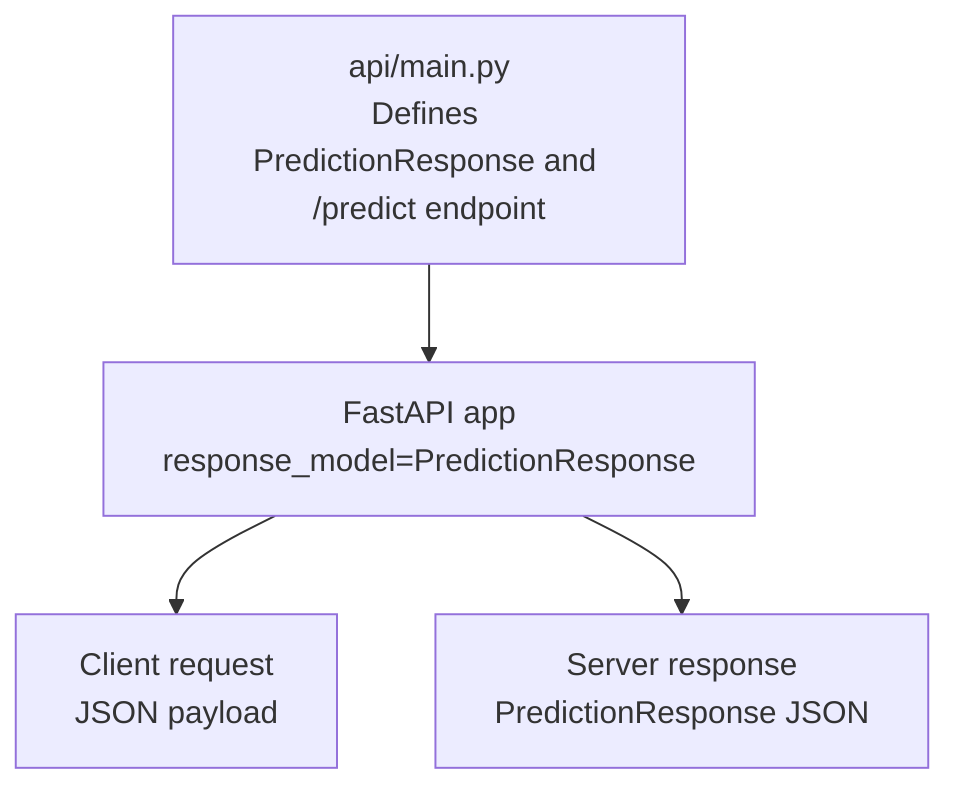
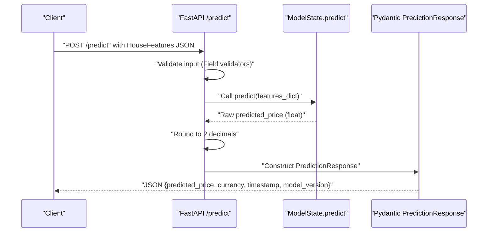
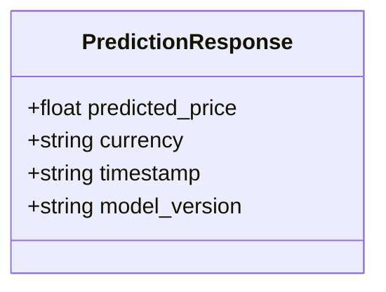
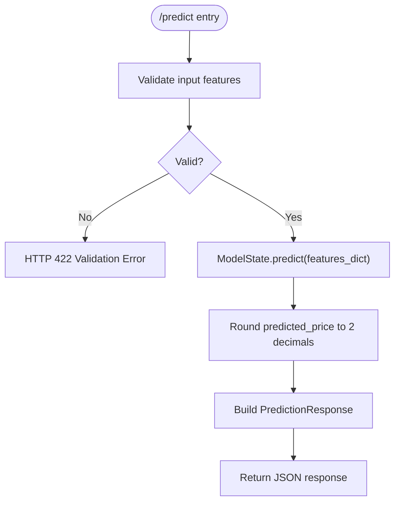
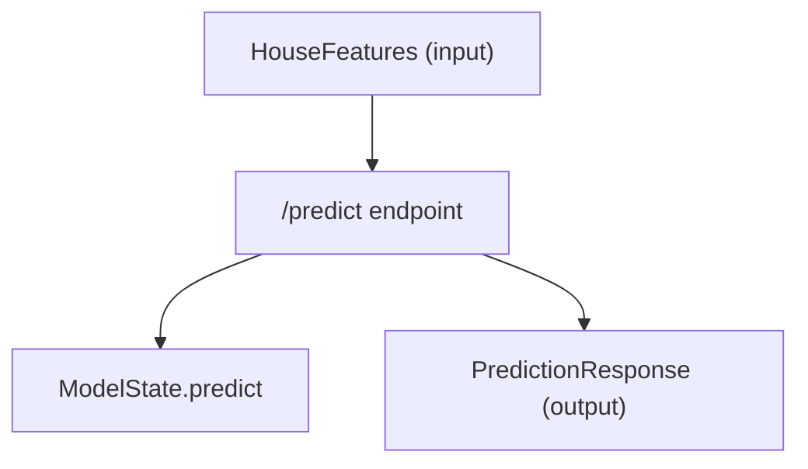

# Response Formatting

<cite>
**Referenced Files in This Document**
- [api/main.py](file://api/main.py)
- [README.md](file://README.md)
- [tests/test_api.py](file://tests/test_api.py)
</cite>

## Table of Contents
1. [Introduction](#introduction)
2. [Project Structure](#project-structure)
3. [Core Components](#core-components)
4. [Architecture Overview](#architecture-overview)
5. [Detailed Component Analysis](#detailed-component-analysis)
6. [Dependency Analysis](#dependency-analysis)
7. [Performance Considerations](#performance-considerations)
8. [Troubleshooting Guide](#troubleshooting-guide)
9. [Conclusion](#conclusion)

## Introduction
This document focuses on the PredictionResponse model and how the API formats predictions for clients. It explains the four response fields, the Pydantic model structure, default values, JSON schema examples, and how the API ensures consistent formatting and validation. It also covers rounding behavior and currency specification, and provides curl examples for complete request/response cycles.

## Project Structure
The PredictionResponse model and its usage live in the API module. The API endpoint constructs the response using a Pydantic model and applies explicit formatting rules (rounding, currency, timestamp, and model version).

**Diagram sources**
- [api/main.py:290-347](file://api/main.py#L290-L347)

**Section sources**
- [api/main.py:290-347](file://api/main.py#L290-L347)

## Core Components
The PredictionResponse Pydantic model defines the shape of the prediction response. It includes:
- predicted_price: float, rounded to two decimal places by the endpoint
- currency: string, always "USD"
- timestamp: string, ISO format
- model_version: string identifier

Default values and constraints:
- predicted_price is required and validated by the endpoint logic
- currency defaults to "USD" via the Pydantic Field default
- timestamp is required and formatted as an ISO string
- model_version is required and currently set to a fixed string

JSON schema example:
- The model’s Config includes a json_schema_extra example showing the expected response structure.

**Section sources**
- [api/main.py:85-101](file://api/main.py#L85-L101)
- [api/main.py:336-341](file://api/main.py#L336-L341)

## Architecture Overview
The prediction flow from request to response follows a clear sequence: the client sends a request payload, the endpoint validates it, computes a prediction, and returns a structured response using PredictionResponse.

**Diagram sources**
- [api/main.py:290-347](file://api/main.py#L290-L347)
- [api/main.py:155-179](file://api/main.py#L155-L179)

## Detailed Component Analysis

### PredictionResponse Pydantic Model
The model enforces the response structure and includes a JSON schema example for documentation.

Key attributes:
- predicted_price: float, required
- currency: str, default "USD"
- timestamp: str, required (ISO format)
- model_version: str, required

JSON schema example:
- The example shows a typical response with values for all fields.

**Diagram sources**
- [api/main.py:85-101](file://api/main.py#L85-L101)

**Section sources**
- [api/main.py:85-101](file://api/main.py#L85-L101)

### Endpoint Implementation and Response Formatting
The /predict endpoint:
- Validates the incoming request using HouseFeatures
- Calls the model to compute a raw predicted price
- Rounds the predicted price to two decimal places
- Constructs a PredictionResponse with:
  - predicted_price rounded to two decimals
  - currency set to "USD"
  - timestamp set to ISO format string
  - model_version set to a fixed string

**Diagram sources**
- [api/main.py:290-347](file://api/main.py#L290-L347)

**Section sources**
- [api/main.py:330-341](file://api/main.py#L330-L341)

### Response Validation and Behavior
- Currency is enforced to "USD" by the endpoint logic.
- Timestamp is generated as an ISO format string at response time.
- model_version is set to a fixed string by the endpoint.
- predicted_price is rounded to two decimal places before inclusion in the response.

These behaviors are verified by tests that assert the presence and values of the response fields.

**Section sources**
- [tests/test_api.py:70-88](file://tests/test_api.py#L70-L88)
- [api/main.py:336-341](file://api/main.py#L336-L341)

### Curl Examples and Request/Response Cycles
The README provides a complete curl example for the /predict endpoint. The example payload matches the HouseFeatures schema, and the expected response matches the PredictionResponse schema.

- Example request payload: [README.md:248-263](file://README.md#L248-L263)
- Expected response structure: [README.md:341-350](file://README.md#L341-L350)

To run the example locally:
- Start the API server: [README.md:232-235](file://README.md#L232-L235)
- Use the curl command shown in the README to send a request and receive a PredictionResponse

**Section sources**
- [README.md:248-263](file://README.md#L248-L263)
- [README.md:341-350](file://README.md#L341-L350)

## Dependency Analysis
The PredictionResponse model is consumed by the /predict endpoint. The endpoint depends on:
- HouseFeatures for input validation
- ModelState.predict for inference
- Pydantic for response serialization

**Diagram sources**
- [api/main.py:31-83](file://api/main.py#L31-L83)
- [api/main.py:290-347](file://api/main.py#L290-L347)
- [api/main.py:85-101](file://api/main.py#L85-L101)

**Section sources**
- [api/main.py:31-83](file://api/main.py#L31-L83)
- [api/main.py:290-347](file://api/main.py#L290-L347)
- [api/main.py:85-101](file://api/main.py#L85-L101)

## Performance Considerations
- Rounding to two decimals occurs in the endpoint and is a lightweight operation.
- Using Pydantic models ensures efficient serialization and schema enforcement.
- The response construction is deterministic and does not introduce significant overhead.

## Troubleshooting Guide
Common issues and resolutions:
- Missing fields in response: Ensure the endpoint is invoked and model is loaded. The tests verify the presence of predicted_price, currency, timestamp, and model_version.
- Unexpected currency: The endpoint sets currency to "USD"; confirm the endpoint logic is executed.
- Incorrect timestamp format: The endpoint uses ISO format; verify the client is not altering the response.
- model_version mismatch: The endpoint sets a fixed string; confirm the endpoint is used rather than a custom handler.

Validation and tests:
- The test suite verifies the response structure and values, including currency enforcement and field presence.

**Section sources**
- [tests/test_api.py:70-88](file://tests/test_api.py#L70-L88)

## Conclusion
The PredictionResponse model and the /predict endpoint together define a consistent, validated, and predictable response format. The endpoint enforces rounding to two decimals, fixes currency to "USD", timestamps responses in ISO format, and includes a model version string. The README and tests provide practical examples and verification of these behaviors.