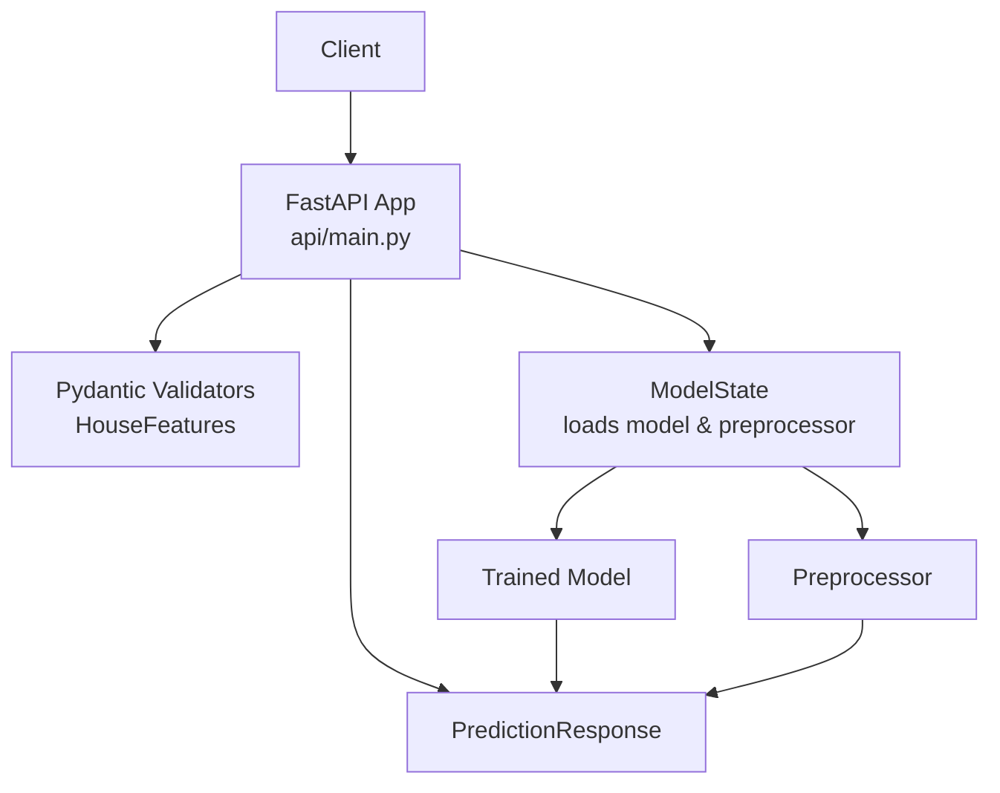
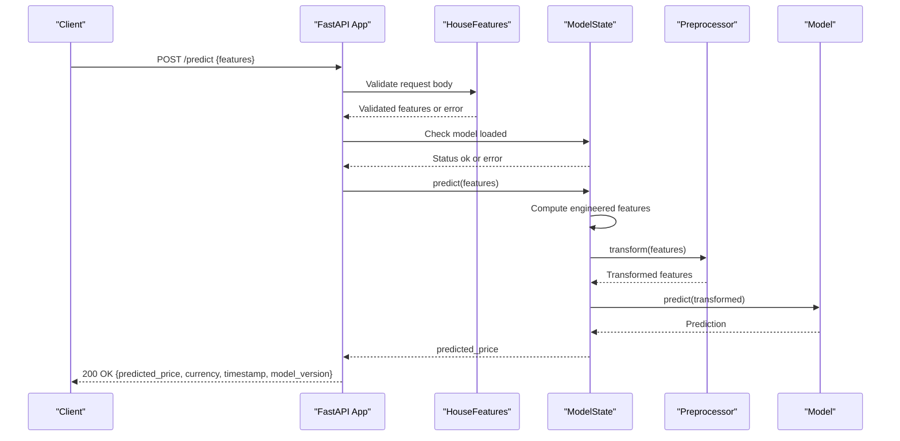
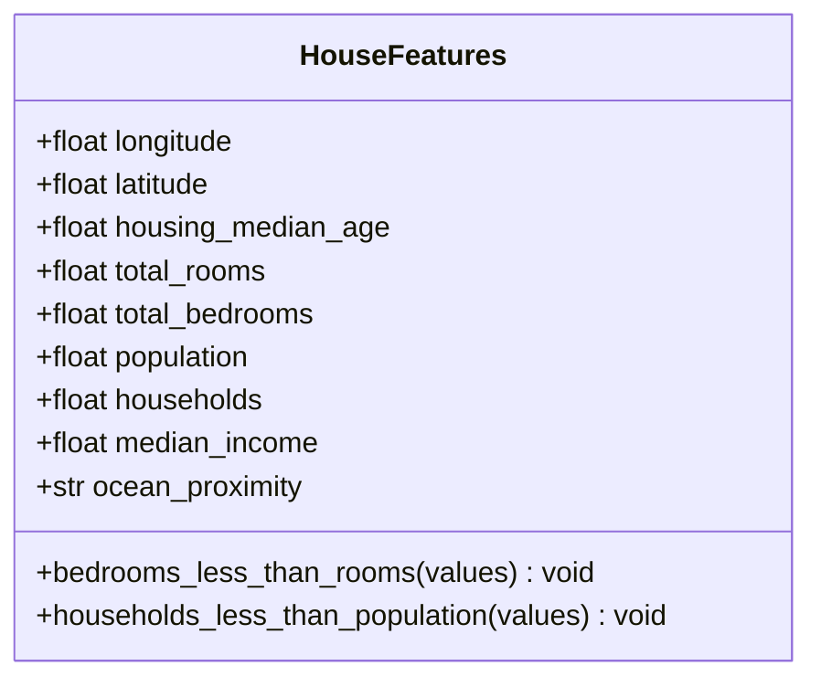
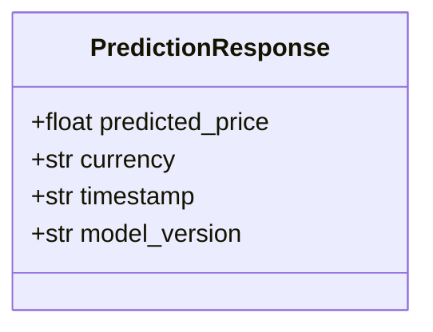
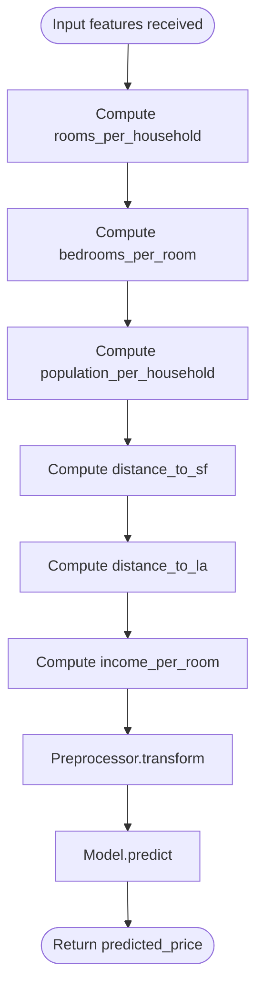
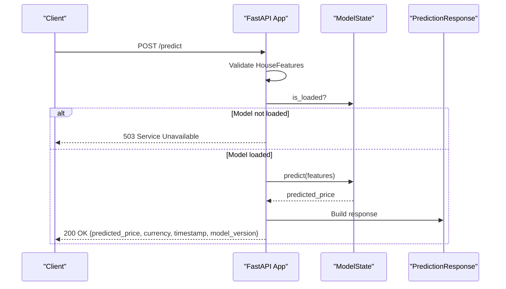
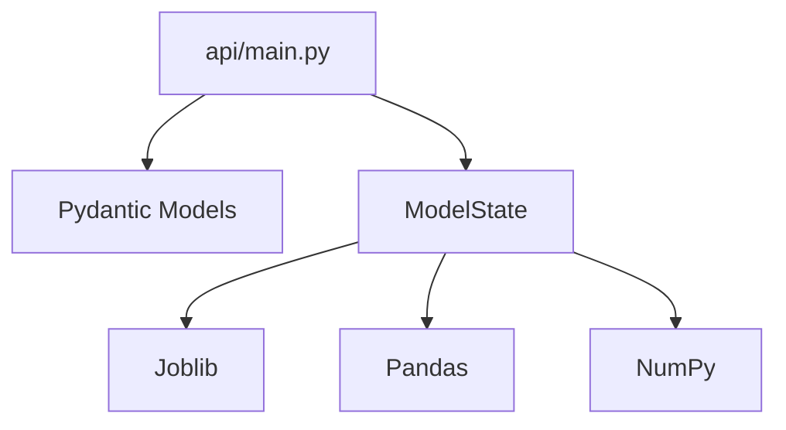

# Single Prediction Endpoint

<cite>
**Referenced Files in This Document**
- [api/main.py](file://api/main.py)
- [README.md](file://README.md)
- [tests/test_api.py](file://tests/test_api.py)
- [train_model_for_web.py](file://train_model_for_web.py)
</cite>

## Table of Contents
1. [Introduction](#introduction)
2. [Project Structure](#project-structure)
3. [Core Components](#core-components)
4. [Architecture Overview](#architecture-overview)
5. [Detailed Component Analysis](#detailed-component-analysis)
6. [Dependency Analysis](#dependency-analysis)
7. [Performance Considerations](#performance-considerations)
8. [Troubleshooting Guide](#troubleshooting-guide)
9. [Conclusion](#conclusion)
10. [Appendices](#appendices)

## Introduction
This document provides comprehensive documentation for the single prediction endpoint (/predict) that serves individual property price predictions. It covers the POST method, request/response models, input validation rules, geographic boundaries, business logic constraints, feature engineering calculations, error handling, and practical usage examples.

## Project Structure
The single prediction endpoint is implemented in the FastAPI application located under the api/ directory. The endpoint integrates with a global model state that loads the trained model and preprocessor at startup. The endpoint validates inputs, applies feature engineering, transforms features via the preprocessor, and returns a structured prediction response.

**Diagram sources**
- [api/main.py:290-347](file://api/main.py#L290-L347)
- [api/main.py:126-183](file://api/main.py#L126-L183)

**Section sources**
- [api/main.py:201-230](file://api/main.py#L201-L230)
- [README.md:239-246](file://README.md#L239-L246)

## Core Components
- HouseFeatures: Defines the request body schema with 8 numeric fields and 1 categorical field, plus validation constraints.
- PredictionResponse: Defines the response body with predicted_price, currency, timestamp, and model_version.
- ModelState: Manages model and preprocessor lifecycle, including loading and prediction execution.
- /predict endpoint: Validates inputs, triggers prediction, and returns a standardized response.

Key validation rules:
- Geographic bounds: longitude [-125.0, -114.0], latitude [32.0, 43.0].
- Numeric ranges: housing_median_age [1, 52], total_rooms [1, 50000], total_bedrooms [1, 10000], population [1, 50000], households [1, 10000], median_income [0.5, 15.0].
- Categorical enum: ocean_proximity must be one of "<1H OCEAN", "INLAND", "ISLAND", "NEAR BAY", "NEAR OCEAN".
- Business logic constraints: total_bedrooms ≤ total_rooms and households ≤ population.

**Section sources**
- [api/main.py:31-83](file://api/main.py#L31-L83)
- [api/main.py:85-101](file://api/main.py#L85-L101)
- [api/main.py:126-183](file://api/main.py#L126-L183)
- [api/main.py:290-347](file://api/main.py#L290-L347)

## Architecture Overview
The /predict endpoint follows a clean request-response flow with explicit validation and error handling.

**Diagram sources**
- [api/main.py:290-347](file://api/main.py#L290-L347)
- [api/main.py:155-179](file://api/main.py#L155-L179)

## Detailed Component Analysis

### HouseFeatures Request Model
- Purpose: Enforce strict input validation and constraints for the prediction request.
- Fields:
  - longitude: float, bounded by [-125.0, -114.0]
  - latitude: float, bounded by [32.0, 43.0]
  - housing_median_age: float, [1, 52]
  - total_rooms: float, [1, 50000]
  - total_bedrooms: float, [1, 10000]
  - population: float, [1, 50000]
  - households: float, [1, 10000]
  - median_income: float, [0.5, 15.0]
  - ocean_proximity: str, enum of five categories
- Validation constraints:
  - total_bedrooms ≤ total_rooms
  - households ≤ population

**Diagram sources**
- [api/main.py:31-83](file://api/main.py#L31-L83)

**Section sources**
- [api/main.py:31-83](file://api/main.py#L31-L83)

### PredictionResponse Structure
- predicted_price: float, rounded to two decimals
- currency: str, default "USD"
- timestamp: str, ISO format
- model_version: str, identifies the deployed model version

**Diagram sources**
- [api/main.py:85-101](file://api/main.py#L85-L101)

**Section sources**
- [api/main.py:85-101](file://api/main.py#L85-L101)

### ModelState and Feature Engineering
- Loads model and preprocessor at startup.
- Computes derived features internally before prediction:
  - rooms_per_household = total_rooms / max(households, 1)
  - bedrooms_per_room = total_bedrooms / max(total_rooms, 1)
  - population_per_household = population / max(households, 1)
  - distance_to_sf = sqrt((latitude - 37.7749)^2 + (longitude - (-122.4194))^2)
  - distance_to_la = sqrt((latitude - 34.0522)^2 + (longitude - (-118.2437))^2)
  - income_per_room = median_income / max(rooms_per_household, 0.1)
- Applies preprocessor.transform and model.predict to produce the final prediction.

**Diagram sources**
- [api/main.py:155-179](file://api/main.py#L155-L179)

**Section sources**
- [api/main.py:126-183](file://api/main.py#L126-L183)
- [api/main.py:155-179](file://api/main.py#L155-L179)

### /predict Endpoint Behavior
- Validates request body against HouseFeatures.
- Checks model_state.is_loaded; raises HTTP 503 if not loaded.
- Converts validated model to dict and calls model_state.predict.
- Returns PredictionResponse with rounded predicted_price, current timestamp, and model_version.
- General exceptions are captured and returned as HTTP 500.

**Diagram sources**
- [api/main.py:290-347](file://api/main.py#L290-L347)

**Section sources**
- [api/main.py:290-347](file://api/main.py#L290-L347)

### Input Validation Rules and Constraints
- Geographic boundaries:
  - longitude ∈ [-125.0, -114.0]
  - latitude ∈ [32.0, 43.0]
- Numeric ranges:
  - housing_median_age ∈ [1, 52]
  - total_rooms ∈ [1, 50000]
  - total_bedrooms ∈ [1, 10000]
  - population ∈ [1, 50000]
  - households ∈ [1, 10000]
  - median_income ∈ [0.5, 15.0]
- Categorical constraint:
  - ocean_proximity ∈ {"<1H OCEAN", "INLAND", "ISLAND", "NEAR BAY", "NEAR OCEAN"}
- Business logic constraints:
  - total_bedrooms ≤ total_rooms
  - households ≤ population

These rules are enforced by Pydantic validators and enums.

**Section sources**
- [api/main.py:34-65](file://api/main.py#L34-L65)
- [api/main.py:72-82](file://api/main.py#L72-L82)

### Feature Engineering Calculations
The endpoint computes the following derived features internally before prediction:
- rooms_per_household
- bedrooms_per_room
- population_per_household
- distance_to_sf (distance to San Francisco)
- distance_to_la (distance to Los Angeles)
- income_per_room

These features are included in the model’s feature set and are computed using safe denominators to avoid division by zero.

**Section sources**
- [api/main.py:160-172](file://api/main.py#L160-L172)
- [train_model_for_web.py:38-53](file://train_model_for_web.py#L38-L53)

### Error Handling Scenarios
- HTTP 400/422: Validation errors for invalid input values or missing fields.
- HTTP 503: Model not loaded when attempting to predict.
- HTTP 500: Internal server error during prediction.

Behavior verified by tests:
- Missing required fields cause 422.
- Out-of-range numeric values cause 422.
- Invalid enum values cause 422.
- Predicting without a loaded model returns 503.
- Successful prediction returns 200 with PredictionResponse.

**Section sources**
- [tests/test_api.py:104-148](file://tests/test_api.py#L104-L148)
- [tests/test_api.py:89-103](file://tests/test_api.py#L89-L103)
- [api/main.py:323-347](file://api/main.py#L323-L347)

### Response Interpretation
- predicted_price: Predicted median house value in USD.
- currency: Always "USD".
- timestamp: ISO-format timestamp of the prediction.
- model_version: Identifies the deployed model version.

**Section sources**
- [api/main.py:85-101](file://api/main.py#L85-L101)
- [api/main.py:336-341](file://api/main.py#L336-L341)

### Usage Examples
- Example request body and response are documented in the project README.
- Example curl invocation is provided in the README.

Practical guidance:
- Ensure all 8 numeric fields and the ocean_proximity category are provided.
- Respect geographic and numeric bounds.
- Observe business logic constraints (bedrooms ≤ rooms, households ≤ population).
- Handle HTTP 400/422 for invalid input, HTTP 503 for model not loaded, and HTTP 500 for internal errors.

**Section sources**
- [README.md:248-263](file://README.md#L248-L263)
- [README.md:327-350](file://README.md#L327-L350)

## Dependency Analysis
The /predict endpoint depends on:
- Pydantic models for validation and serialization.
- ModelState for model and preprocessor lifecycle.
- Pandas and NumPy for feature engineering and transformations.
- Joblib for model persistence and loading.

**Diagram sources**
- [api/main.py:15-21](file://api/main.py#L15-L21)
- [api/main.py:126-183](file://api/main.py#L126-L183)

**Section sources**
- [api/main.py:15-21](file://api/main.py#L15-L21)
- [api/main.py:126-183](file://api/main.py#L126-L183)

## Performance Considerations
- Feature engineering uses vectorized operations with safe denominators to prevent runtime errors.
- Preprocessing and prediction are executed in-memory; batch processing is available via /predict/batch for throughput improvements.
- Model and preprocessor are loaded once at startup to minimize latency for subsequent requests.

[No sources needed since this section provides general guidance]

## Troubleshooting Guide
Common issues and resolutions:
- Model not loaded (503): Ensure the model files exist in models/ and the server started successfully.
- Validation errors (422): Verify all inputs are within specified bounds and satisfy business logic constraints.
- Unexpected 500 errors: Check server logs for exceptions during prediction.

Verification via tests:
- Tests cover missing fields, out-of-range values, invalid enums, and model-not-loaded scenarios.

**Section sources**
- [tests/test_api.py:89-148](file://tests/test_api.py#L89-L148)
- [api/main.py:323-347](file://api/main.py#L323-L347)

## Conclusion
The /predict endpoint provides a robust, validated, and feature-engineered single-property prediction service. It enforces strict input constraints, manages model lifecycle, and returns a standardized response. Following the documented validation rules and constraints ensures reliable predictions and smooth operation.

[No sources needed since this section summarizes without analyzing specific files]

## Appendices

### API Definition Summary
- Method: POST
- Path: /predict
- Request Body: HouseFeatures
- Response Body: PredictionResponse
- Success: 200 OK
- Errors: 400/422 for invalid input, 503 for model not loaded, 500 for internal error

**Section sources**
- [api/main.py:290-347](file://api/main.py#L290-L347)
- [README.md:239-246](file://README.md#L239-L246)