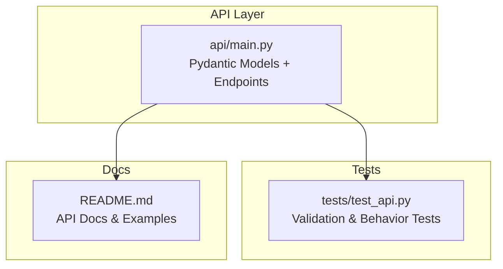
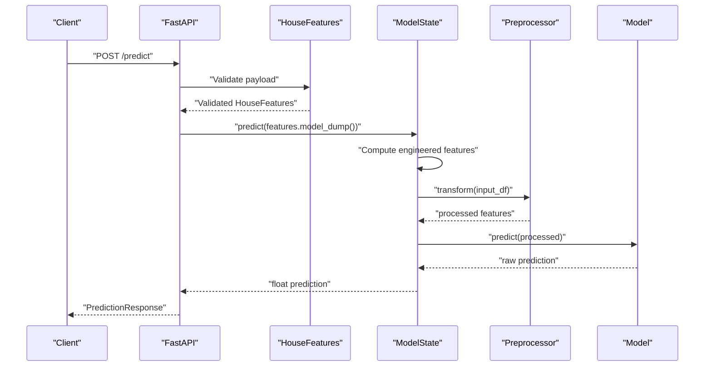
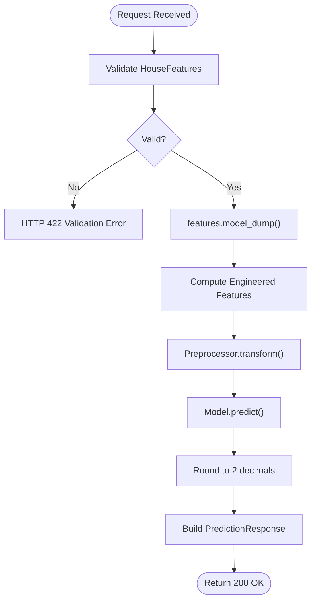
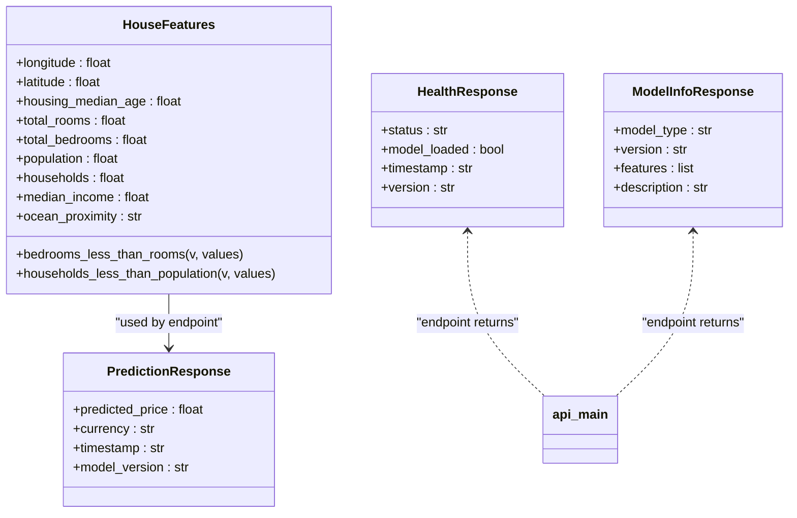

# Data Models and Validation

<cite>
**Referenced Files in This Document**
- [api/main.py](file://api/main.py)
- [tests/test_api.py](file://tests/test_api.py)
- [README.md](file://README.md)
</cite>

## Table of Contents
1. [Introduction](#introduction)
2. [Project Structure](#project-structure)
3. [Core Components](#core-components)
4. [Architecture Overview](#architecture-overview)
5. [Detailed Component Analysis](#detailed-component-analysis)
6. [Dependency Analysis](#dependency-analysis)
7. [Performance Considerations](#performance-considerations)
8. [Troubleshooting Guide](#troubleshooting-guide)
9. [Conclusion](#conclusion)

## Introduction
This document explains the Pydantic data models used by the API for validating input features and shaping response payloads. It focuses on:
- HouseFeatures: input validation rules, acceptable ranges, enums, and custom validators
- PredictionResponse: output shape and metadata
- HealthResponse and ModelInfoResponse: operational and informational responses
- model_dump() usage and data transformation pipeline
- Examples of valid and invalid inputs with expected error behaviors

## Project Structure
The API module defines the Pydantic models and FastAPI endpoints that handle prediction requests and responses.

**Diagram sources**
- [api/main.py:1-403](file://api/main.py#L1-L403)
- [tests/test_api.py:1-199](file://tests/test_api.py#L1-L199)
- [README.md:323-358](file://README.md#L323-L358)

**Section sources**
- [api/main.py:1-403](file://api/main.py#L1-L403)
- [tests/test_api.py:1-199](file://tests/test_api.py#L1-L199)
- [README.md:323-358](file://README.md#L323-L358)

## Core Components
- HouseFeatures: validates and constrains all input fields for prediction requests
- PredictionResponse: standardizes prediction outputs with metadata
- HealthResponse: operational health status
- ModelInfoResponse: model metadata and feature list

**Section sources**
- [api/main.py:31-120](file://api/main.py#L31-L120)

## Architecture Overview
The API validates incoming requests using Pydantic models, then transforms validated data into a dictionary via model_dump() before passing it to the model inference pipeline.

**Diagram sources**
- [api/main.py:290-347](file://api/main.py#L290-L347)
- [api/main.py:155-179](file://api/main.py#L155-L179)

## Detailed Component Analysis

### HouseFeatures Model
Purpose: Define and validate all input fields for prediction requests.

Field specifications and constraints:
- longitude: numeric, range [-125.0, -114.0]
- latitude: numeric, range [32.0, 43.0]
- housing_median_age: numeric, range [1, 52]
- total_rooms: numeric, range [1, 50000]
- total_bedrooms: numeric, range [1, 10000], constrained by custom validator
- population: numeric, range [1, 50000]
- households: numeric, range [1, 10000], constrained by custom validator
- median_income: numeric, range [0.5, 15.0]
- ocean_proximity: enum with allowed values

Custom validators:
- total_bedrooms must be less than or equal to total_rooms
- households must be less than or equal to population

Validation behavior:
- Range checks are enforced automatically by Field with ge/le
- Enum constraint is enforced by Field with enum
- Custom validators are applied during model construction/validation

Transformation:
- model_dump() converts the validated Pydantic model into a dictionary suitable for downstream processing

Examples:
- Valid input: all fields within allowed ranges, ocean_proximity one of the enum values, bedrooms ≤ rooms, households ≤ population
- Invalid inputs:
  - total_bedrooms > total_rooms
  - households > population
  - longitude outside [-125.0, -114.0]
  - latitude outside [32.0, 43.0]
  - median_income < 0.5
  - ocean_proximity not in enum list

Error outcomes:
- Invalid ranges or missing fields produce HTTP 422 Unprocessable Entity
- Custom validator failures produce HTTP 422 with a validation error message
- Missing required fields produce HTTP 422 with a validation error message

**Section sources**
- [api/main.py:31-83](file://api/main.py#L31-L83)
- [api/main.py:330-331](file://api/main.py#L330-L331)
- [tests/test_api.py:104-148](file://tests/test_api.py#L104-L148)
- [README.md:352-357](file://README.md#L352-L357)

### PredictionResponse Model
Purpose: Standardize prediction responses with metadata.

Fields:
- predicted_price: float, predicted median house value in USD
- currency: string, default "USD"
- timestamp: string, ISO timestamp of prediction
- model_version: string, version identifier

Example response structure:
- Keys: predicted_price, currency, timestamp, model_version
- Example values are provided in the model’s JSON schema extra

Usage:
- Returned by the /predict endpoint after successful validation and inference
- model_dump() can be used to convert to dict for serialization

**Section sources**
- [api/main.py:85-101](file://api/main.py#L85-L101)
- [api/main.py:336-341](file://api/main.py#L336-L341)

### HealthResponse Model
Purpose: Provide health status of the API and model availability.

Fields:
- status: string, e.g., "healthy"/"unhealthy"
- model_loaded: boolean, indicates model readiness
- timestamp: string, ISO timestamp
- version: string, API version

Usage:
- Returned by the /health endpoint

**Section sources**
- [api/main.py:104-111](file://api/main.py#L104-L111)
- [api/main.py:248-260](file://api/main.py#L248-L260)

### ModelInfoResponse Model
Purpose: Provide metadata about the deployed model.

Fields:
- model_type: string, e.g., "HistGradientBoostingRegressor"
- version: string, model version
- features: list, feature names used by the model (including engineered features)
- description: string, brief description

Usage:
- Returned by the /model/info endpoint when the model is loaded

**Section sources**
- [api/main.py:113-119](file://api/main.py#L113-L119)
- [api/main.py:263-287](file://api/main.py#L263-L287)

### Data Transformation and model_dump() Usage
- After validation, the API calls features.model_dump() to convert the Pydantic model to a dictionary
- The dictionary is passed to ModelState.predict(), which:
  - Computes engineered features (e.g., rooms_per_household, bedrooms_per_room, population_per_household, distances to major cities, income_per_room)
  - Transforms the input via the preprocessor
  - Runs the model prediction
- The resulting float prediction is rounded and returned inside PredictionResponse

**Diagram sources**
- [api/main.py:290-347](file://api/main.py#L290-L347)
- [api/main.py:155-179](file://api/main.py#L155-L179)

**Section sources**
- [api/main.py:330-331](file://api/main.py#L330-L331)
- [api/main.py:155-179](file://api/main.py#L155-L179)

## Dependency Analysis
- HouseFeatures depends on Pydantic Field and validator decorators for validation
- PredictionResponse depends on Pydantic BaseModel for response shaping
- HealthResponse and ModelInfoResponse depend on Pydantic BaseModel for structured responses
- The API endpoint depends on model_dump() to transform validated inputs into dicts for processing

**Diagram sources**
- [api/main.py:31-120](file://api/main.py#L31-L120)

**Section sources**
- [api/main.py:31-120](file://api/main.py#L31-L120)

## Performance Considerations
- Validation occurs at the API boundary; keep payloads minimal and avoid unnecessary conversions
- model_dump() is efficient for small to medium-sized dictionaries; ensure downstream transformations reuse the same dictionary to minimize copies
- Custom validators run during model construction; keep them lightweight and avoid heavy computations

## Troubleshooting Guide
Common validation failures and remedies:
- total_bedrooms exceeds total_rooms:
  - Cause: Bedroom count greater than room count
  - Fix: Reduce total_bedrooms or increase total_rooms
- households exceeds population:
  - Cause: More households than people
  - Fix: Increase population or reduce households
- Out-of-range longitude/latitude:
  - Cause: Coordinates outside allowed bounds
  - Fix: Adjust longitude to [-125.0, -114.0] and latitude to [32.0, 43.0]
- Negative median_income:
  - Cause: Income below allowed minimum
  - Fix: Set median_income ≥ 0.5
- Invalid ocean_proximity:
  - Cause: Not one of the allowed enum values
  - Fix: Use one of "<1H OCEAN", "INLAND", "ISLAND", "NEAR BAY", "NEAR OCEAN"

Behavior verified by tests:
- Validation errors return HTTP 422
- Missing fields return HTTP 422
- Model not loaded returns HTTP 503 for prediction endpoints

**Section sources**
- [tests/test_api.py:104-148](file://tests/test_api.py#L104-L148)
- [README.md:352-357](file://README.md#L352-L357)

## Conclusion
The API’s Pydantic models enforce strict input validation and provide a consistent response format. HouseFeatures ensures realistic and internally consistent property features, while PredictionResponse, HealthResponse, and ModelInfoResponse standardize outputs. The model_dump() method enables seamless conversion from validated models to processed dictionaries for inference.