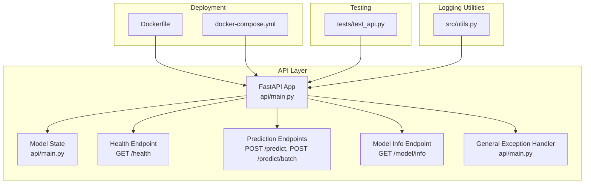
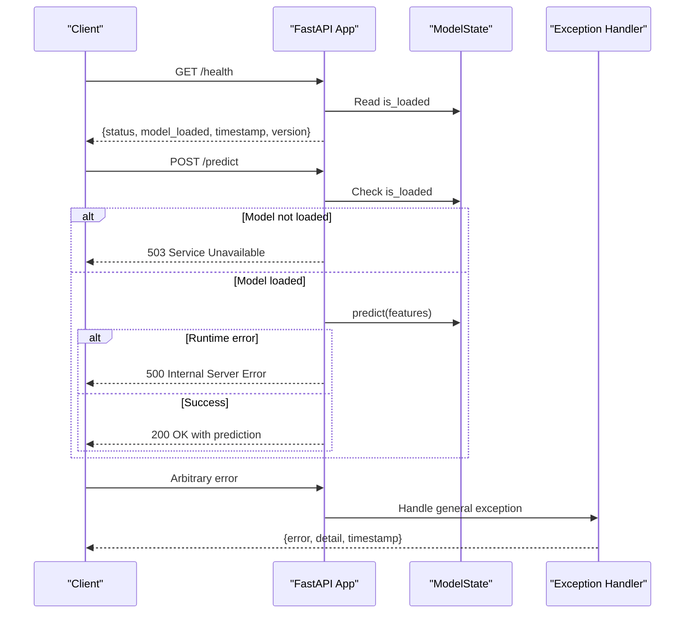
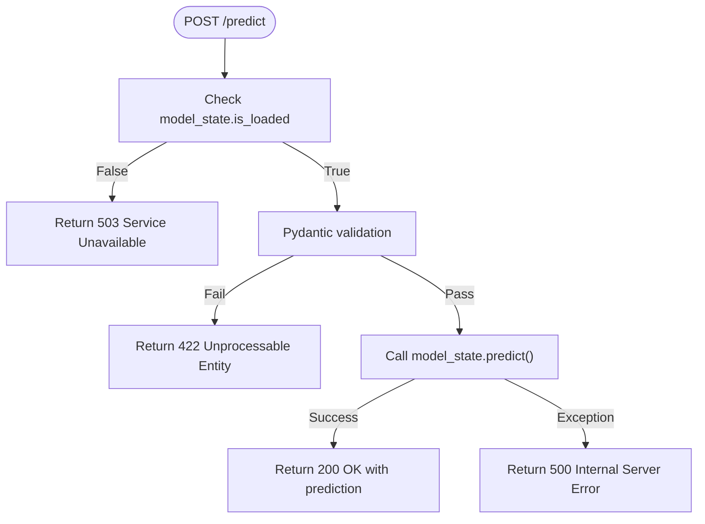
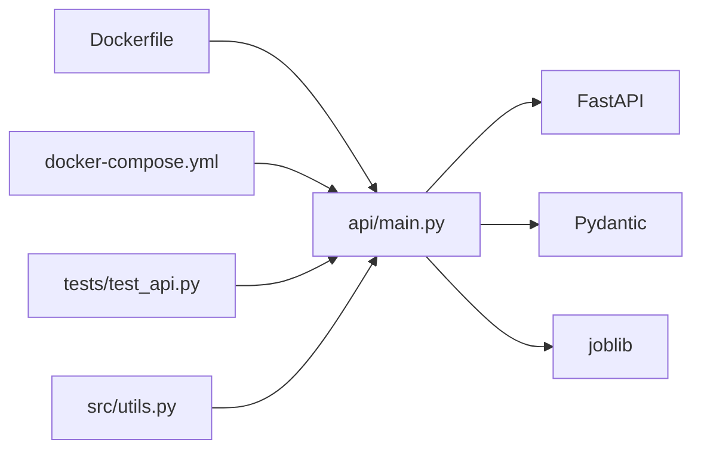

# Error Handling and Monitoring

<cite>
**Referenced Files in This Document**
- [api/main.py](file://api/main.py)
- [tests/test_api.py](file://tests/test_api.py)
- [src/utils.py](file://src/utils.py)
- [Dockerfile](file://Dockerfile)
- [docker-compose.yml](file://docker-compose.yml)
- [README.md](file://README.md)
</cite>

## Table of Contents
1. [Introduction](#introduction)
2. [Project Structure](#project-structure)
3. [Core Components](#core-components)
4. [Architecture Overview](#architecture-overview)
5. [Detailed Component Analysis](#detailed-component-analysis)
6. [Dependency Analysis](#dependency-analysis)
7. [Performance Considerations](#performance-considerations)
8. [Troubleshooting Guide](#troubleshooting-guide)
9. [Conclusion](#conclusion)
10. [Appendices](#appendices)

## Introduction
This document focuses on the API’s error handling and monitoring systems. It covers:
- General exception handling and custom error responses
- HTTP status codes for different error scenarios (400 for validation errors, 500 for internal server errors, 503 for service unavailable)
- Health check endpoint and model loading status tracking
- Logging strategies, error categorization, and debugging approaches
- Monitoring recommendations, alerting thresholds, and operational best practices
- Graceful degradation strategies when the model fails to load and fallback mechanisms for critical operations

## Project Structure
The API is implemented as a FastAPI application with a global model state, health checks, and centralized exception handling. The project also includes Docker-based deployment with health checks and a test suite validating error handling behavior.

**Diagram sources**
- [api/main.py:201-230](file://api/main.py#L201-L230)
- [api/main.py:248-260](file://api/main.py#L248-L260)
- [api/main.py:290-347](file://api/main.py#L290-L347)
- [api/main.py:350-383](file://api/main.py#L350-L383)
- [api/main.py:386-397](file://api/main.py#L386-L397)
- [Dockerfile:80-85](file://Dockerfile#L80-L85)
- [docker-compose.yml:26-31](file://docker-compose.yml#L26-L31)
- [tests/test_api.py:27-199](file://tests/test_api.py#L27-L199)
- [src/utils.py:16-55](file://src/utils.py#L16-L55)

**Section sources**
- [README.md:88-139](file://README.md#L88-L139)
- [api/main.py:201-230](file://api/main.py#L201-L230)
- [Dockerfile:80-85](file://Dockerfile#L80-L85)
- [docker-compose.yml:26-31](file://docker-compose.yml#L26-L31)

## Core Components
- Global model state with load/unload lifecycle and runtime checks
- Health endpoint returning model availability and operational metadata
- Prediction endpoints with validation and model availability guards
- Centralized exception handler for unhandled errors
- Logging utilities for structured console and file logging

Key implementation references:
- Model state and lifecycle: [api/main.py:126-183](file://api/main.py#L126-L183)
- Health endpoint: [api/main.py:248-260](file://api/main.py#L248-L260)
- Prediction endpoints and status codes: [api/main.py:290-347](file://api/main.py#L290-L347), [api/main.py:350-383](file://api/main.py#L350-L383)
- Exception handler: [api/main.py:386-397](file://api/main.py#L386-L397)
- Logging utilities: [src/utils.py:16-55](file://src/utils.py#L16-L55)

**Section sources**
- [api/main.py:126-183](file://api/main.py#L126-L183)
- [api/main.py:248-260](file://api/main.py#L248-L260)
- [api/main.py:290-347](file://api/main.py#L290-L347)
- [api/main.py:350-383](file://api/main.py#L350-L383)
- [api/main.py:386-397](file://api/main.py#L386-L397)
- [src/utils.py:16-55](file://src/utils.py#L16-L55)

## Architecture Overview
The API exposes health and prediction endpoints. The model state is initialized during application startup. Endpoints guard against model unavailability and delegate to a centralized exception handler for unexpected errors.

**Diagram sources**
- [api/main.py:248-260](file://api/main.py#L248-L260)
- [api/main.py:290-347](file://api/main.py#L290-L347)
- [api/main.py:386-397](file://api/main.py#L386-L397)

## Detailed Component Analysis

### Health Check Endpoint
- Purpose: Report API health and model loading status
- Response shape: Status string, model availability flag, timestamp, version
- Behavior: Uses global model state to determine health

Operational indicators:
- status reflects model readiness
- model_loaded indicates whether model artifacts were successfully loaded
- timestamp and version provide context for diagnostics

References:
- Health endpoint definition: [api/main.py:248-260](file://api/main.py#L248-L260)
- Model state initialization and loading: [api/main.py:126-154](file://api/main.py#L126-L154)
- Docker health check integration: [Dockerfile:80-85](file://Dockerfile#L80-L85), [docker-compose.yml:26-31](file://docker-compose.yml#L26-L31)

**Section sources**
- [api/main.py:248-260](file://api/main.py#L248-L260)
- [api/main.py:126-154](file://api/main.py#L126-L154)
- [Dockerfile:80-85](file://Dockerfile#L80-L85)
- [docker-compose.yml:26-31](file://docker-compose.yml#L26-L31)

### Prediction Endpoints and Error Scenarios
- POST /predict: Single prediction with validation and model availability checks
- POST /predict/batch: Batch predictions with per-item error reporting
- Status codes:
  - 200 OK for successful predictions
  - 400 for validation errors (Pydantic validation failures)
  - 503 Service Unavailable when model is not loaded
  - 500 Internal Server Error for runtime exceptions

Validation rules enforced by Pydantic models:
- Bounds on numeric fields
- Enum constraint for categorical field
- Derived-field constraints (e.g., bedrooms <= rooms, households <= population)

References:
- Prediction endpoint and status codes: [api/main.py:290-347](file://api/main.py#L290-L347)
- Batch prediction endpoint: [api/main.py:350-383](file://api/main.py#L350-L383)
- Validation constraints: [api/main.py:31-82](file://api/main.py#L31-L82)
- Test coverage for error scenarios: [tests/test_api.py:52-199](file://tests/test_api.py#L52-L199)

**Diagram sources**
- [api/main.py:290-347](file://api/main.py#L290-L347)
- [api/main.py:31-82](file://api/main.py#L31-L82)

**Section sources**
- [api/main.py:290-347](file://api/main.py#L290-L347)
- [api/main.py:350-383](file://api/main.py#L350-L383)
- [api/main.py:31-82](file://api/main.py#L31-L82)
- [tests/test_api.py:52-199](file://tests/test_api.py#L52-L199)

### Model Info Endpoint
- GET /model/info: Returns model metadata when available
- Returns 503 Service Unavailable when model is not loaded

References:
- Model info endpoint: [api/main.py:263-287](file://api/main.py#L263-L287)
- Test coverage: [tests/test_api.py:169-199](file://tests/test_api.py#L169-L199)

**Section sources**
- [api/main.py:263-287](file://api/main.py#L263-L287)
- [tests/test_api.py:169-199](file://tests/test_api.py#L169-L199)

### General Exception Handler
- Centralized handler for uncaught exceptions
- Returns a standardized error response with error type, detail, and timestamp

References:
- Exception handler: [api/main.py:386-397](file://api/main.py#L386-L397)

**Section sources**
- [api/main.py:386-397](file://api/main.py#L386-L397)

### Logging Strategies and Debugging
- Structured logging with console and optional file handlers
- Timestamped entries with module, level, and message
- Integration points for debugging and observability

References:
- Logging setup: [src/utils.py:16-55](file://src/utils.py#L16-L55)

**Section sources**
- [src/utils.py:16-55](file://src/utils.py#L16-L55)

## Dependency Analysis
The API depends on FastAPI, Pydantic, and joblib for model persistence. Deployment configurations define health checks and environment variables.

**Diagram sources**
- [api/main.py:18-21](file://api/main.py#L18-L21)
- [Dockerfile:80-85](file://Dockerfile#L80-L85)
- [docker-compose.yml:26-31](file://docker-compose.yml#L26-L31)
- [tests/test_api.py:16-18](file://tests/test_api.py#L16-L18)
- [src/utils.py:16-55](file://src/utils.py#L16-L55)

**Section sources**
- [api/main.py:18-21](file://api/main.py#L18-L21)
- [Dockerfile:80-85](file://Dockerfile#L80-L85)
- [docker-compose.yml:26-31](file://docker-compose.yml#L26-L31)
- [tests/test_api.py:16-18](file://tests/test_api.py#L16-L18)
- [src/utils.py:16-55](file://src/utils.py#L16-L55)

## Performance Considerations
- Model loading occurs once at startup; keep model artifacts small and efficient
- Prefer batch endpoints for throughput-sensitive clients
- Use health checks to gate traffic until model readiness is confirmed
- Avoid excessive logging in hot paths; leverage structured logging for diagnostics

[No sources needed since this section provides general guidance]

## Troubleshooting Guide
Common issues and resolutions:
- Model not loaded
  - Symptom: 503 Service Unavailable on prediction or model info endpoints
  - Cause: Model files missing or failed to load during startup
  - Resolution: Verify model artifacts exist and are readable; check logs for load errors
  - References: [api/main.py:135-154](file://api/main.py#L135-L154), [api/main.py:263-287](file://api/main.py#L263-L287), [api/main.py:290-347](file://api/main.py#L290-L347)

- Validation errors
  - Symptom: 422 Unprocessable Entity on prediction
  - Causes: Out-of-range values, invalid enum, derived-field violations
  - Resolution: Adjust input according to validation rules
  - References: [api/main.py:31-82](file://api/main.py#L31-L82), [tests/test_api.py:104-147](file://tests/test_api.py#L104-L147)

- Internal server errors
  - Symptom: 500 Internal Server Error
  - Causes: Unexpected runtime exceptions during prediction
  - Resolution: Inspect logs for stack traces; validate input and environment
  - References: [api/main.py:343-347](file://api/main.py#L343-L347), [api/main.py:386-397](file://api/main.py#L386-L397)

- Health check failures
  - Symptom: Container restarts or orchestration alerts
  - Causes: Unhealthy model state or startup failures
  - Resolution: Confirm health endpoint returns healthy status; review Docker health check configuration
  - References: [api/main.py:248-260](file://api/main.py#L248-L260), [Dockerfile:80-85](file://Dockerfile#L80-L85), [docker-compose.yml:26-31](file://docker-compose.yml#L26-L31)

**Section sources**
- [api/main.py:135-154](file://api/main.py#L135-L154)
- [api/main.py:248-260](file://api/main.py#L248-L260)
- [api/main.py:263-287](file://api/main.py#L263-L287)
- [api/main.py:290-347](file://api/main.py#L290-L347)
- [api/main.py:343-347](file://api/main.py#L343-L347)
- [api/main.py:386-397](file://api/main.py#L386-L397)
- [Dockerfile:80-85](file://Dockerfile#L80-L85)
- [docker-compose.yml:26-31](file://docker-compose.yml#L26-L31)
- [tests/test_api.py:104-147](file://tests/test_api.py#L104-L147)

## Conclusion
The API implements a clear error handling strategy with explicit HTTP status codes, a health endpoint reflecting model readiness, and a centralized exception handler. Combined with Docker-based health checks and structured logging, this provides a robust foundation for monitoring and operational reliability. Extending the system with metrics collection, alerting thresholds, and graceful degradation strategies will further strengthen resilience.

[No sources needed since this section summarizes without analyzing specific files]

## Appendices

### HTTP Status Codes Reference
- 200 OK: Successful prediction or batch operation
- 400: Validation errors (Pydantic validation failures)
- 500 Internal Server Error: Unexpected runtime exceptions
- 503 Service Unavailable: Model not loaded for prediction or model info endpoints

References:
- Prediction endpoint status codes: [api/main.py:295-299](file://api/main.py#L295-L299)
- Model info endpoint behavior: [api/main.py:270-274](file://api/main.py#L270-L274)
- Prediction endpoint behavior: [api/main.py:323-327](file://api/main.py#L323-L327), [api/main.py:357-361](file://api/main.py#L357-L361)

**Section sources**
- [api/main.py:295-299](file://api/main.py#L295-L299)
- [api/main.py:270-274](file://api/main.py#L270-L274)
- [api/main.py:323-327](file://api/main.py#L323-L327)
- [api/main.py:357-361](file://api/main.py#L357-L361)

### Monitoring Recommendations
- Metrics: Track request latency, error rates, and model load success rate
- Alerts: Thresholds at 5xx error rate > 5% over 5 minutes, elevated latency p95, and health check failure count > threshold
- Retries: Implement client-side retries with exponential backoff for transient 503/500 responses
- Degradation: Return cached predictions or simplified responses when model artifacts are unavailable

[No sources needed since this section provides general guidance]

### Graceful Degradation and Fallback Mechanisms
- Model unavailability: Return 503 with guidance to retry later or check health endpoint
- Partial failures in batch: Continue processing remaining items and report per-item status
- Logging: Capture detailed context for debugging while keeping responses minimal

References:
- Model availability checks: [api/main.py:323-327](file://api/main.py#L323-L327), [api/main.py:357-361](file://api/main.py#L357-L361), [api/main.py:270-274](file://api/main.py#L270-L274)
- Batch error handling: [api/main.py:363-377](file://api/main.py#L363-L377)

**Section sources**
- [api/main.py:323-327](file://api/main.py#L323-L327)
- [api/main.py:357-361](file://api/main.py#L357-L361)
- [api/main.py:270-274](file://api/main.py#L270-L274)
- [api/main.py:363-377](file://api/main.py#L363-L377)