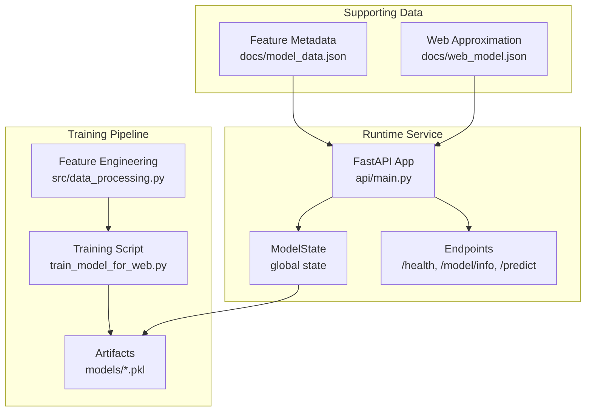
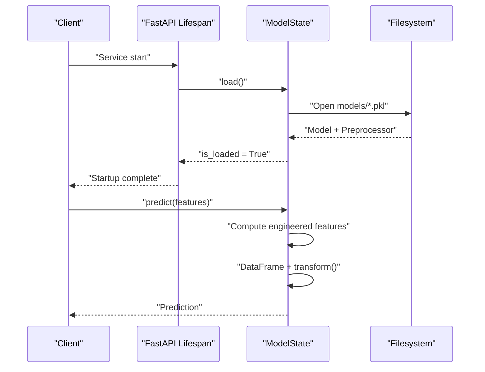
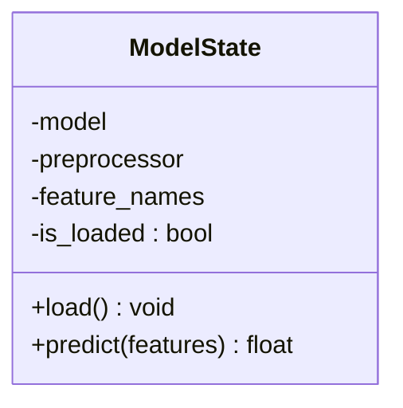
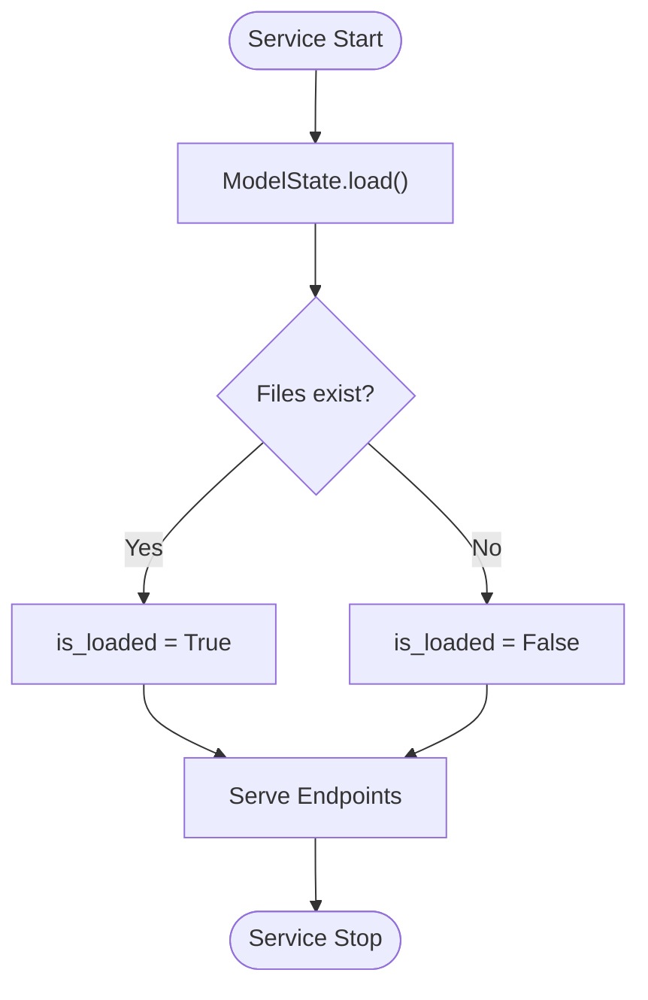
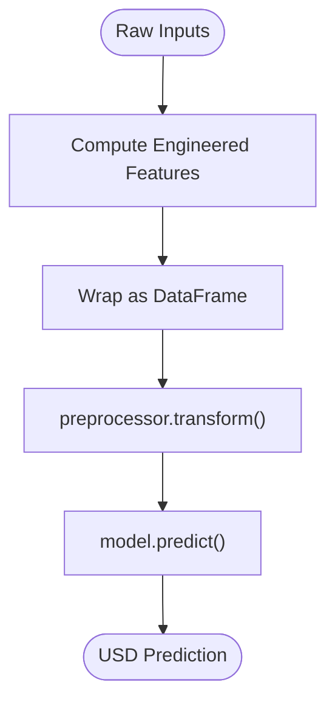
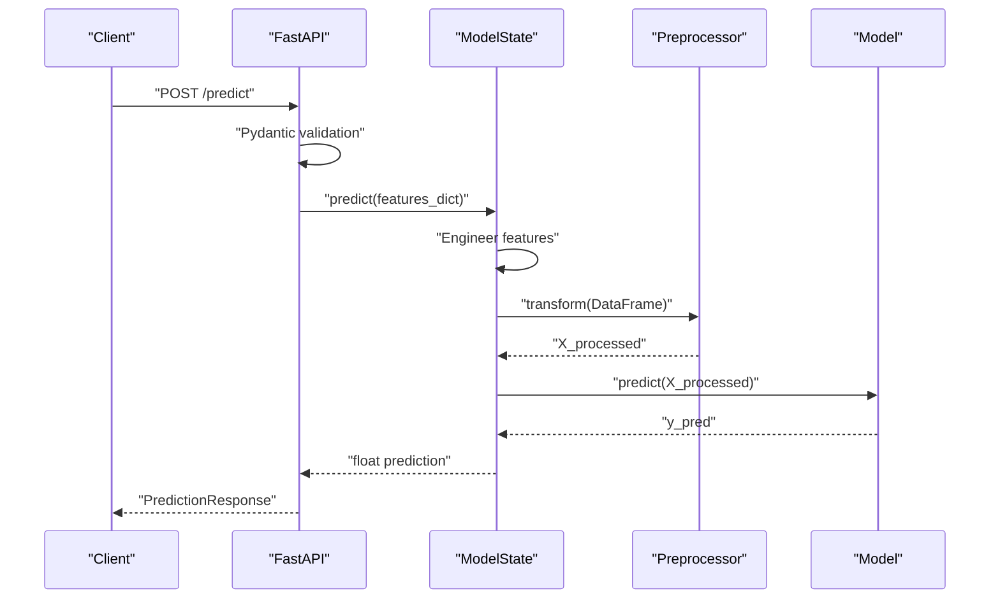
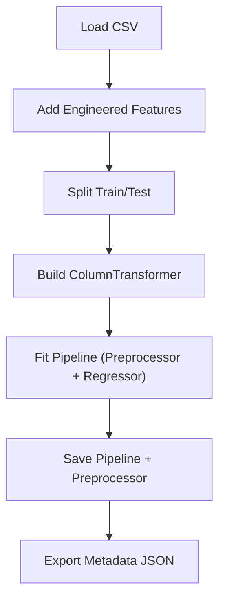
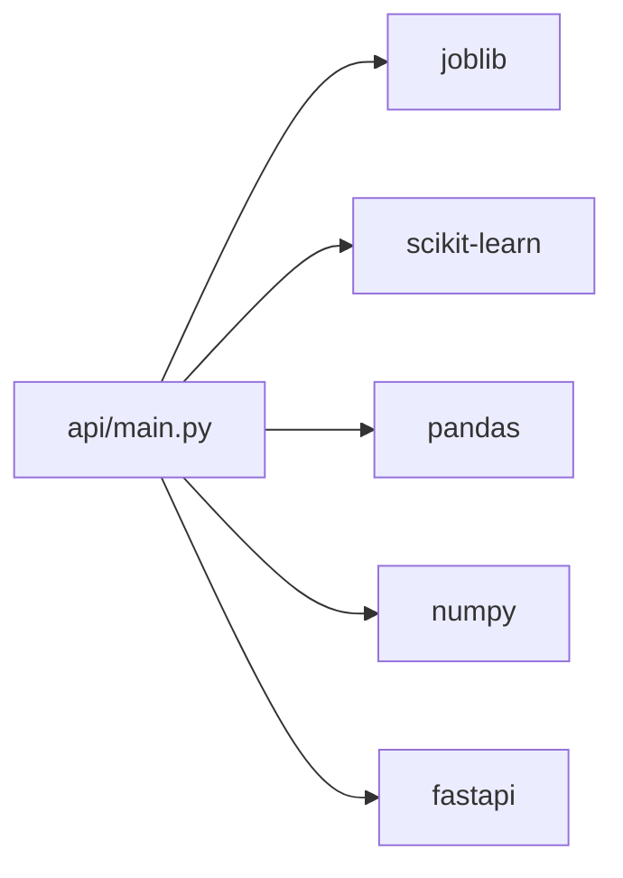

# Model Loading and State Management

<cite>
**Referenced Files in This Document**
- [api/main.py](file://api/main.py)
- [src/data_processing.py](file://src/data_processing.py)
- [src/utils.py](file://src/utils.py)
- [train_model_for_web.py](file://train_model_for_web.py)
- [Dockerfile](file://Dockerfile)
- [docker-compose.yml](file://docker-compose.yml)
- [docs/model_data.json](file://docs/model_data.json)
- [docs/web_model.json](file://docs/web_model.json)
</cite>

## Table of Contents
1. [Introduction](#introduction)
2. [Project Structure](#project-structure)
3. [Core Components](#core-components)
4. [Architecture Overview](#architecture-overview)
5. [Detailed Component Analysis](#detailed-component-analysis)
6. [Dependency Analysis](#dependency-analysis)
7. [Performance Considerations](#performance-considerations)
8. [Troubleshooting Guide](#troubleshooting-guide)
9. [Conclusion](#conclusion)

## Introduction
This document explains the model loading and global state management system for the California Housing Price Prediction project. It focuses on the ModelState class architecture, singleton-like global state, FastAPI lifespan lifecycle management, model loading from joblib artifacts, error handling for missing or corrupted models, and the feature engineering pipeline used during inference. It also documents the prediction pipeline from raw input to processed features to model output, and provides troubleshooting and performance optimization guidance.

## Project Structure
The system centers around a FastAPI service that loads a trained model and preprocessor at startup and serves predictions via REST endpoints. Supporting modules handle data processing, feature engineering, and utilities for persistence and logging. The training pipeline produces artifacts consumed by the runtime service.

**Diagram sources**
- [api/main.py:126-183](file://api/main.py#L126-L183)
- [src/data_processing.py:189-341](file://src/data_processing.py#L189-L341)
- [train_model_for_web.py:38-120](file://train_model_for_web.py#L38-L120)
- [docs/model_data.json:1-61](file://docs/model_data.json#L1-L61)
- [docs/web_model.json:178-189](file://docs/web_model.json#L178-L189)

**Section sources**
- [api/main.py:126-183](file://api/main.py#L126-L183)
- [src/data_processing.py:189-341](file://src/data_processing.py#L189-L341)
- [train_model_for_web.py:38-120](file://train_model_for_web.py#L38-L120)
- [docs/model_data.json:1-61](file://docs/model_data.json#L1-L61)
- [docs/web_model.json:178-189](file://docs/web_model.json#L178-L189)

## Core Components
- ModelState: Encapsulates the loaded model and preprocessor, manages loading, validation, and prediction with engineered features.
- FastAPI lifespan: Initializes ModelState at startup and ensures graceful shutdown.
- Feature Engineering: Computes derived features and applies preprocessing during inference.
- Persistence Utilities: Save/load model artifacts and metadata.

Key responsibilities:
- Load model and preprocessor from joblib artifacts at service startup.
- Validate state before serving predictions.
- Compute engineered features on-the-fly for each request.
- Apply the fitted preprocessor to transform features prior to model inference.
- Provide health and model info endpoints.

**Section sources**
- [api/main.py:126-183](file://api/main.py#L126-L183)
- [api/main.py:186-195](file://api/main.py#L186-L195)
- [src/data_processing.py:189-341](file://src/data_processing.py#L189-L341)
- [src/utils.py:58-98](file://src/utils.py#L58-L98)

## Architecture Overview
The runtime architecture integrates FastAPI with a global ModelState singleton. The lifespan event triggers model loading, and endpoints delegate prediction to the stateful object.

**Diagram sources**
- [api/main.py:186-195](file://api/main.py#L186-L195)
- [api/main.py:135-179](file://api/main.py#L135-L179)

**Section sources**
- [api/main.py:126-183](file://api/main.py#L126-L183)
- [api/main.py:186-195](file://api/main.py#L186-L195)

## Detailed Component Analysis

### ModelState Class Architecture
The ModelState class acts as a global state container for the model and preprocessor. It exposes:
- load(): Loads model and preprocessor from disk, validates existence, and updates state.
- predict(): Validates state, computes engineered features, transforms via preprocessor, and runs model prediction.

**Diagram sources**
- [api/main.py:126-183](file://api/main.py#L126-L183)

**Section sources**
- [api/main.py:126-183](file://api/main.py#L126-L183)

### Singleton Pattern Implementation
While not enforced by a metaclass, the design uses a module-level global instance to emulate a singleton:
- A single ModelState instance is created globally.
- All endpoints reference this shared instance for state and prediction.

Benefits:
- Centralized resource management.
- Consistent model and preprocessor across requests.

Considerations:
- Thread safety is not explicitly handled; ensure model/pipeline is thread-safe.
- Prefer immutable preprocessor state and avoid mutating model after load.

**Section sources**
- [api/main.py:182-183](file://api/main.py#L182-L183)

### Lifecycle Management via FastAPI Lifespan Events
The lifespan context manager coordinates startup and shutdown:
- Startup: Calls ModelState.load() to initialize model and preprocessor.
- Shutdown: Prints a message; no explicit cleanup performed.

**Diagram sources**
- [api/main.py:186-195](file://api/main.py#L186-L195)
- [api/main.py:135-154](file://api/main.py#L135-L154)

**Section sources**
- [api/main.py:186-195](file://api/main.py#L186-L195)

### Model Loading from Joblib Files
- Paths resolved relative to the API module’s parent directory under models/.
- Two artifacts are expected:
  - house_price_model.pkl (contains a fitted Pipeline with preprocessor and regressor).
  - preprocessor.pkl (contains a fitted ColumnTransformer).
- Error handling:
  - Missing files raise FileNotFoundError.
  - Other exceptions set is_loaded to False and print an error.

Validation:
- After load(), is_loaded indicates readiness.
- Endpoints check is_loaded and return appropriate HTTP statuses.

**Section sources**
- [api/main.py:135-154](file://api/main.py#L135-L154)
- [api/main.py:248-260](file://api/main.py#L248-L260)
- [api/main.py:290-347](file://api/main.py#L290-L347)

### Feature Engineering During Prediction
The predict method computes engineered features from raw inputs:
- rooms_per_household = total_rooms / max(households, 1)
- bedrooms_per_room = total_bedrooms / max(total_rooms, 1)
- population_per_household = population / max(households, 1)
- distance_to_sf = sqrt((lat - 37.7749)^2 + (lon - (-122.4194))^2)
- distance_to_la = sqrt((lat - 34.0522)^2 + (lon - (-118.2437))^2)
- income_per_room = median_income / max(rooms_per_household, 0.1)

These features are transformed using the fitted preprocessor and passed to the model for prediction.

**Diagram sources**
- [api/main.py:160-179](file://api/main.py#L160-L179)

**Section sources**
- [api/main.py:160-179](file://api/main.py#L160-L179)

### Prediction Pipeline: From Raw Input to Output
End-to-end flow:
1. Validate request payload against Pydantic models.
2. Convert to dict and pass to ModelState.predict().
3. Compute engineered features.
4. Transform via fitted preprocessor.
5. Predict using the model.
6. Return structured response with metadata.

**Diagram sources**
- [api/main.py:290-347](file://api/main.py#L290-L347)
- [api/main.py:155-179](file://api/main.py#L155-L179)

**Section sources**
- [api/main.py:290-347](file://api/main.py#L290-L347)
- [api/main.py:155-179](file://api/main.py#L155-L179)

### Training Pipeline and Artifacts
The training script demonstrates the feature engineering and preprocessing steps used at training time:
- Adds engineered features to training/test sets.
- Builds a ColumnTransformer with imputation and scaling/encoding.
- Fits a HistGradientBoostingRegressor inside a Pipeline.
- Saves the full pipeline and exports metadata for web usage.

**Diagram sources**
- [train_model_for_web.py:38-120](file://train_model_for_web.py#L38-L120)

**Section sources**
- [train_model_for_web.py:38-120](file://train_model_for_web.py#L38-L120)

### Data Processing and Preprocessing Pipelines
The data processing module defines:
- Ratio features: rooms_per_household, bedrooms_per_room, population_per_household.
- Location features: distance_to_sf, distance_to_la.
- Preprocessing pipeline: imputation, scaling, and one-hot encoding.

These align with runtime feature engineering and ensure consistent transformations.

**Section sources**
- [src/data_processing.py:202-255](file://src/data_processing.py#L202-L255)
- [src/data_processing.py:257-305](file://src/data_processing.py#L257-L305)

### Persistence Utilities
Utilities support saving/loading models with metadata:
- save_model(): Stores a model plus optional metadata and timestamp.
- load_model(): Loads model and metadata.

These utilities complement the joblib-based artifact loading in the runtime.

**Section sources**
- [src/utils.py:58-98](file://src/utils.py#L58-L98)

## Dependency Analysis
The runtime service depends on:
- FastAPI for routing and lifespan.
- joblib for model serialization/deserialization.
- scikit-learn for preprocessing and modeling.
- Pandas/Numpy for data manipulation.

**Diagram sources**
- [api/main.py:17-21](file://api/main.py#L17-L21)
- [requirements.txt:16-20](file://requirements.txt#L16-L20)

**Section sources**
- [api/main.py:17-21](file://api/main.py#L17-L21)
- [requirements.txt:16-20](file://requirements.txt#L16-L20)

## Performance Considerations
- Keep model and preprocessor in memory: The global state avoids repeated deserialization overhead.
- Minimize recomputation: Engineered features are computed per-request; keep numeric operations vectorized.
- Preprocessor reuse: Ensure the preprocessor is fitted once and reused across requests.
- Concurrency: If scaling horizontally, ensure model/pipeline supports concurrent inference.
- Artifact size: joblib artifacts are efficient; avoid unnecessary re-saving.
- Containerization: The Dockerfile and docker-compose optimize runtime performance and observability.

[No sources needed since this section provides general guidance]

## Troubleshooting Guide

Common loading issues:
- Missing model files
  - Symptom: Health endpoint reports unhealthy; prediction endpoints fail.
  - Cause: house_price_model.pkl or preprocessor.pkl not found.
  - Fix: Ensure both artifacts exist in models/ and are readable by the service user.

- Permission errors
  - Symptom: Load fails with permission denied.
  - Fix: Grant read permissions to the models/ directory for the service user.

- Model corruption or incompatible versions
  - Symptom: Load raises an exception; service fails to start.
  - Fix: Re-run training to regenerate artifacts; verify scikit-learn and joblib versions match training environment.

State validation failures:
- Prediction endpoint returns 503 when model is not loaded.
- Always call /health to confirm is_loaded before sending predictions.

Feature engineering edge cases:
- Zero or near-zero denominators are guarded by minima in computed features.
- Ensure input bounds are respected (validated by Pydantic models).

Deployment and orchestration:
- Docker: Confirm models volume is mounted read-only and accessible.
- docker-compose: Verify health checks pass and containers start successfully.

**Section sources**
- [api/main.py:135-154](file://api/main.py#L135-L154)
- [api/main.py:248-260](file://api/main.py#L248-L260)
- [api/main.py:290-347](file://api/main.py#L290-L347)
- [Dockerfile:60-72](file://Dockerfile#L60-L72)
- [docker-compose.yml:21-24](file://docker-compose.yml#L21-L24)

## Conclusion
The system employs a clean separation between training and runtime concerns. The ModelState class centralizes model and preprocessor lifecycle, while FastAPI lifespan ensures reliable startup. Feature engineering is consistently applied at inference time to mirror training-time transformations. Robust error handling and health checks provide operational reliability, and containerization simplifies deployment. Following the troubleshooting and performance recommendations will help maintain a stable, high-performance prediction service.