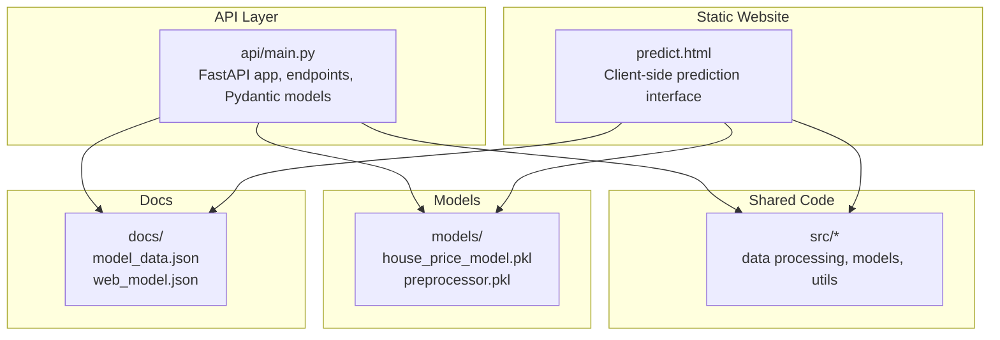
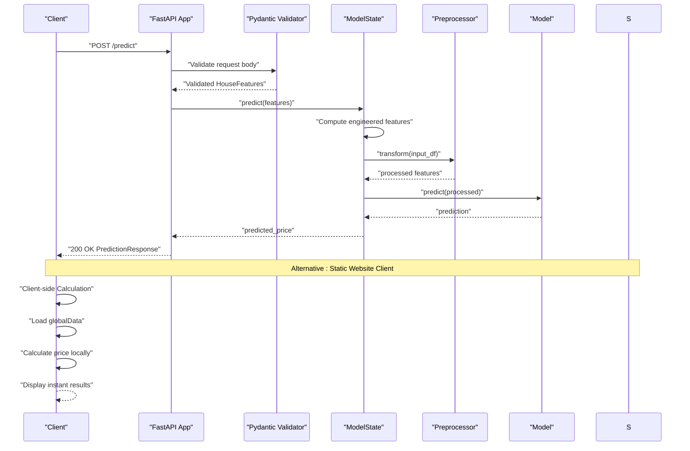
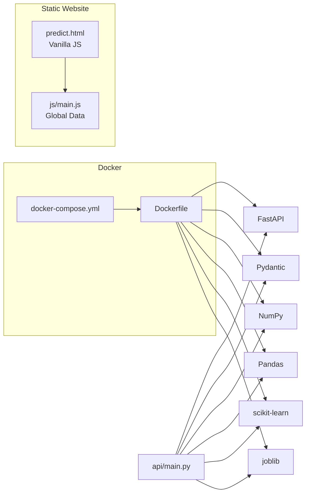

# REST API Service

<cite>
**Referenced Files in This Document**
- [api/main.py](file://api/main.py)
- [api/test_api.py](file://api/test_api.py)
- [tests/test_api.py](file://tests/test_api.py)
- [README.md](file://README.md)
- [requirements.txt](file://requirements.txt)
- [api/requirements.txt](file://api/requirements.txt)
- [docker-compose.yml](file://docker-compose.yml)
- [Dockerfile](file://Dockerfile)
- [docs/architecture.md](file://docs/architecture.md)
- [docs/model_data.json](file://docs/model_data.json)
- [docs/web_model.json](file://docs/web_model.json)
- [setup.py](file://setup.py)
</cite>

## Update Summary
**Changes Made**
- Updated to reflect the current state where the FastAPI service still exists alongside the static website
- Added clarification about the dual architecture approach
- Updated architecture diagrams to show both API and static website components
- Modified troubleshooting guidance to address both deployment scenarios

## Table of Contents
1. [Introduction](#introduction)
2. [Project Structure](#project-structure)
3. [Core Components](#core-components)
4. [Architecture Overview](#architecture-overview)
5. [Detailed Component Analysis](#detailed-component-analysis)
6. [Dependency Analysis](#dependency-analysis)
7. [Performance Considerations](#performance-considerations)
8. [Troubleshooting Guide](#troubleshooting-guide)
9. [Conclusion](#conclusion)
10. [Appendices](#appendices)

## Introduction
This document describes the production-ready REST API service built with FastAPI and the accompanying static website architecture. The system provides both traditional API-based predictions and client-side processing through a modern static website. The API exposes endpoints for service information, health checks, model metadata, single predictions, and batch predictions, while the static website delivers instant price estimates through client-side calculations.

**Updated** The system now operates with a dual architecture: a FastAPI service for programmatic access and a static website for client-side processing. Both approaches serve the same prediction functionality but through different implementation patterns.

## Project Structure
The system includes both the FastAPI service in the api/ directory and a static website implementation. The API integrates with shared source code in src/, trained models in models/, and supporting documentation in docs/.

**Diagram sources**
- [api/main.py:1-403](file://api/main.py#L1-L403)
- [predict.html:1-126](file://predict.html#L1-L126)
- [src/__init__.py](file://src/__init__.py)

**Section sources**
- [README.md:88-139](file://README.md#L88-L139)
- [api/main.py:186-231](file://api/main.py#L186-L231)

## Core Components
- FastAPI application with lifespan for model loading and graceful shutdown.
- Pydantic models for input validation and response schemas.
- Middleware for CORS.
- Endpoint handlers for root, health, model info, single prediction, and batch prediction.
- Global model state encapsulated in a class to manage model and preprocessor lifecycle.
- Auto-generated docs at /docs (Swagger UI) and /redoc (ReDoc).
- Static website with client-side prediction logic and global data management.

Key implementation references:
- Application creation and docs URLs: [api/main.py:201-221](file://api/main.py#L201-L221)
- CORS middleware: [api/main.py:224-230](file://api/main.py#L224-L230)
- Lifespan handler: [api/main.py:186-195](file://api/main.py#L186-L195)
- Pydantic models: [api/main.py:31-120](file://api/main.py#L31-L120)
- Endpoints: [api/main.py:237-383](file://api/main.py#L237-L383)
- Static website prediction logic: [predict.html:46-113](file://predict.html#L46-L113)

**Section sources**
- [api/main.py:201-231](file://api/main.py#L201-L231)
- [api/main.py:31-120](file://api/main.py#L31-L120)
- [api/main.py:237-383](file://api/main.py#L237-L383)
- [predict.html:46-113](file://predict.html#L46-L113)

## Architecture Overview
The system operates with two distinct deployment patterns: traditional API-based predictions and client-side static website processing. The API initializes at startup, loads the model and preprocessor, and exposes endpoints. The static website loads global data locally and performs client-side calculations for instant price estimates.

**Diagram sources**
- [api/main.py:290-347](file://api/main.py#L290-L347)
- [api/main.py:155-179](file://api/main.py#L155-L179)
- [predict.html:46-113](file://predict.html#L46-L113)

**Section sources**
- [api/main.py:290-347](file://api/main.py#L290-L347)
- [api/main.py:155-179](file://api/main.py#L155-L179)
- [predict.html:46-113](file://predict.html#L46-L113)

## Detailed Component Analysis

### Root Endpoint
- Path: GET /
- Purpose: Returns basic service information and links to documentation and health.
- Response: Plain JSON with message, version, docs, and health endpoints.

References:
- [api/main.py:237-245](file://api/main.py#L237-L245)

**Section sources**
- [api/main.py:237-245](file://api/main.py#L237-L245)

### Health Check
- Path: GET /health
- Response model: HealthResponse
- Behavior: Reports status, model_loaded flag, timestamp, and version.

References:
- [api/main.py:248-260](file://api/main.py#L248-L260)
- [api/main.py:104-111](file://api/main.py#L104-L111)

**Section sources**
- [api/main.py:248-260](file://api/main.py#L248-L260)
- [api/main.py:104-111](file://api/main.py#L104-L111)

### Model Metadata
- Path: GET /model/info
- Response model: ModelInfoResponse
- Behavior: Returns model type, version, feature list, and description. Raises 503 if model not loaded.

References:
- [api/main.py:263-287](file://api/main.py#L263-L287)
- [api/main.py:113-120](file://api/main.py#L113-L120)

**Section sources**
- [api/main.py:263-287](file://api/main.py#L263-L287)
- [api/main.py:113-120](file://api/main.py#L113-L120)

### Single Prediction
- Path: POST /predict
- Request model: HouseFeatures (validated)
- Response model: PredictionResponse
- Validation rules:
  - Longitude in [-125.0, -114.0], Latitude in [32.0, 43.0]
  - Housing median age, total_rooms, total_bedrooms, population, households >= 1
  - median_income >= 0.5
  - ocean_proximity enum: "<1H OCEAN", "INLAND", "ISLAND", "NEAR BAY", "NEAR OCEAN"
  - total_bedrooms <= total_rooms
  - households <= population
- Error handling:
  - 503 if model not loaded
  - 500 on prediction errors
  - 422 on validation failures

References:
- [api/main.py:31-83](file://api/main.py#L31-L83)
- [api/main.py:290-347](file://api/main.py#L290-L347)

**Section sources**
- [api/main.py:31-83](file://api/main.py#L31-L83)
- [api/main.py:290-347](file://api/main.py#L290-L347)

### Batch Prediction
- Path: POST /predict/batch
- Request: List of HouseFeatures
- Response: JSON with predictions array and metadata
- Behavior:
  - Processes each item individually
  - Returns per-item status ("success" or "error") and error details when applicable
  - Returns 503 if model not loaded

References:
- [api/main.py:350-383](file://api/main.py#L350-L383)

**Section sources**
- [api/main.py:350-383](file://api/main.py#L350-L383)

### Pydantic Models and Validation
- HouseFeatures: Strict numeric bounds, enums, and inter-field validators
- PredictionResponse: Predicted price, currency, timestamp, model_version
- HealthResponse: status, model_loaded, timestamp, version
- ModelInfoResponse: model_type, version, features, description

References:
- [api/main.py:31-120](file://api/main.py#L31-L120)

**Section sources**
- [api/main.py:31-120](file://api/main.py#L31-L120)

### Error Handling
- General exception handler returns structured error JSON with timestamp.
- Specific endpoints raise HTTPException with appropriate status codes.

References:
- [api/main.py:390-397](file://api/main.py#L390-L397)
- [api/main.py:323-347](file://api/main.py#L323-L347)
- [api/main.py:357-361](file://api/main.py#L357-L361)
- [api/main.py:270-274](file://api/main.py#L270-L274)

**Section sources**
- [api/main.py:390-397](file://api/main.py#L390-L397)
- [api/main.py:323-347](file://api/main.py#L323-L347)
- [api/main.py:357-361](file://api/main.py#L357-L361)
- [api/main.py:270-274](file://api/main.py#L270-L274)

### Authentication and Security
- No explicit authentication middleware is configured in the FastAPI app.
- CORS allows all origins/methods/headers for development convenience.
- Consider adding authentication (e.g., API keys, JWT) and rate limiting in production deployments.

References:
- [api/main.py:224-230](file://api/main.py#L224-L230)
- [api/main.py:201-221](file://api/main.py#L201-L221)

**Section sources**
- [api/main.py:224-230](file://api/main.py#L224-L230)
- [api/main.py:201-221](file://api/main.py#L201-L221)

### Rate Limiting
- Not implemented in the current API. Consider integrating rate limiting middleware or external proxies for production.

### Auto-generated Documentation
- Swagger UI: GET /docs
- ReDoc: GET /redoc
- Both generated automatically from FastAPI annotations and Pydantic models.

References:
- [api/main.py:218-219](file://api/main.py#L218-L219)

**Section sources**
- [api/main.py:218-219](file://api/main.py#L218-L219)

### Static Website Client Implementation
- The static website provides client-side prediction functionality through JavaScript.
- Uses globalData object containing country and city information.
- Performs instant calculations without server requests.
- Provides responsive design and instant feedback.

References:
- [predict.html:46-113](file://predict.html#L46-L113)
- [js/main.js:20-133](file://js/main.js#L20-L133)

**Section sources**
- [predict.html:46-113](file://predict.html#L46-L113)
- [js/main.js:20-133](file://js/main.js#L20-L133)

### Practical Usage Examples

- curl examples for FastAPI service are documented in the project README under the Usage section for the FastAPI service.
- Static website provides instant client-side predictions through form submission.

References:
- [README.md:239-263](file://README.md#L239-L263)

**Section sources**
- [README.md:239-263](file://README.md#L239-L263)

### Client Implementation Guidelines
- Use the Pydantic models as reference for constructing requests and parsing responses for API clients.
- Validate inputs client-side to reduce server errors.
- Implement retry/backoff for transient failures (503/500).
- For batch requests, handle per-item statuses and aggregate results.
- Static website users benefit from instant client-side calculations with no server dependency.

References:
- [api/main.py:31-120](file://api/main.py#L31-L120)
- [api/main.py:350-383](file://api/main.py#L350-L383)
- [predict.html:46-113](file://predict.html#L46-L113)

**Section sources**
- [api/main.py:31-120](file://api/main.py#L31-L120)
- [api/main.py:350-383](file://api/main.py#L350-L383)
- [predict.html:46-113](file://predict.html#L46-L113)

### Monitoring and Observability
- Health endpoint: GET /health for liveness/readiness checks.
- Docker healthcheck configured to probe /health.
- Consider adding logging, metrics, and tracing libraries for production.
- Static website provides client-side analytics through browser tools.

References:
- [api/main.py:26-27](file://api/main.py#L26-L27)
- [docker-compose.yml:26-31](file://docker-compose.yml#L26-L31)
- [Dockerfile:80-82](file://Dockerfile#L80-L82)

**Section sources**
- [docker-compose.yml:26-31](file://docker-compose.yml#L26-L31)
- [Dockerfile:80-82](file://Dockerfile#L80-L82)

## Dependency Analysis
External dependencies for the API include FastAPI, Uvicorn, Pydantic, NumPy, Pandas, scikit-learn, and joblib. The Docker image is multi-stage, building dependencies in a builder stage and running in a slim production stage. The static website relies on vanilla JavaScript with no external dependencies.

**Diagram sources**
- [api/main.py:18-21](file://api/main.py#L18-L21)
- [requirements.txt:16-21](file://requirements.txt#L16-L21)
- [Dockerfile:7-37](file://Dockerfile#L7-L37)
- [docker-compose.yml:10-34](file://docker-compose.yml#L10-L34)
- [predict.html:122-123](file://predict.html#L122-L123)
- [js/main.js:1-210](file://js/main.js#L1-L210)

**Section sources**
- [requirements.txt:16-21](file://requirements.txt#L16-L21)
- [api/requirements.txt:1-9](file://api/requirements.txt#L1-L9)
- [Dockerfile:7-37](file://Dockerfile#L7-L37)
- [docker-compose.yml:10-34](file://docker-compose.yml#L10-L34)

## Performance Considerations
- Model loading occurs once at startup via lifespan for API service.
- Preprocessing and prediction are performed per request; consider caching or batching strategies for high throughput.
- Docker healthchecks and readiness probes help orchestration-level scaling.
- Static website provides instant client-side calculations with zero server overhead.
- For production, consider adding rate limiting, connection pooling, and asynchronous workers for API service.

## Troubleshooting Guide
Common issues and resolutions:
- Model not loaded:
  - Symptoms: 503 responses from /predict and /predict/batch, and /model/info.
  - Cause: Model files missing or failed to load during startup.
  - Resolution: Ensure models/ directory contains house_price_model.pkl and preprocessor.pkl; check logs.
- Validation errors:
  - Symptoms: 422 responses with validation details.
  - Causes: Out-of-range values, invalid enum, or missing required fields.
  - Resolution: Adjust inputs to match bounds and enums; ensure all required fields are present.
- Prediction errors:
  - Symptoms: 500 responses from /predict.
  - Causes: Unexpected runtime errors during prediction.
  - Resolution: Inspect logs and input data; verify model compatibility.
- Static website issues:
  - Symptoms: Client-side calculations not working.
  - Causes: JavaScript errors or missing globalData.
  - Resolution: Check browser console for errors; ensure all JavaScript files are loaded.

References:
- [api/main.py:323-347](file://api/main.py#L323-L347)
- [api/main.py:357-361](file://api/main.py#L357-L361)
- [api/main.py:270-274](file://api/main.py#L270-L274)
- [tests/test_api.py:89-102](file://tests/test_api.py#L89-L102)
- [tests/test_api.py:104-147](file://tests/test_api.py#L104-L147)
- [predict.html:46-113](file://predict.html#L46-L113)

**Section sources**
- [api/main.py:323-347](file://api/main.py#L323-L347)
- [api/main.py:357-361](file://api/main.py#L357-L361)
- [api/main.py:270-274](file://api/main.py#L270-L274)
- [tests/test_api.py:89-102](file://tests/test_api.py#L89-L102)
- [tests/test_api.py:104-147](file://tests/test_api.py#L104-L147)
- [predict.html:46-113](file://predict.html#L46-L113)

## Conclusion
The system provides a flexible dual-architecture approach for house price predictions. The FastAPI service offers robust programmatic access with strict input validation, clear responses, and auto-generated documentation. The static website delivers instant client-side predictions with zero server dependency. For production, add authentication, rate limiting, and observability to the API service; ensure reliable model persistence and health monitoring for both components.

## Appendices

### API Endpoints Summary
- GET /: Service information
- GET /health: Health status
- GET /model/info: Model metadata
- POST /predict: Single prediction
- POST /predict/batch: Batch predictions
- GET /docs: Swagger UI
- GET /redoc: ReDoc

References:
- [README.md:239-246](file://README.md#L239-L246)
- [api/main.py:237-245](file://api/main.py#L237-L245)
- [api/main.py:248-260](file://api/main.py#L248-L260)
- [api/main.py:263-287](file://api/main.py#L263-L287)
- [api/main.py:290-347](file://api/main.py#L290-L347)
- [api/main.py:350-383](file://api/main.py#L350-L383)

**Section sources**
- [README.md:239-246](file://README.md#L239-L246)
- [api/main.py:237-245](file://api/main.py#L237-L245)
- [api/main.py:248-260](file://api/main.py#L248-L260)
- [api/main.py:263-287](file://api/main.py#L263-L287)
- [api/main.py:290-347](file://api/main.py#L290-L347)
- [api/main.py:350-383](file://api/main.py#L350-L383)

### Request/Response Schemas
- HouseFeatures: Input validation rules and enums
- PredictionResponse: Predicted price, currency, timestamp, model_version
- HealthResponse: Status, model_loaded, timestamp, version
- ModelInfoResponse: Model type, version, features, description

References:
- [api/main.py:31-120](file://api/main.py#L31-L120)

**Section sources**
- [api/main.py:31-120](file://api/main.py#L31-L120)

### Testing Strategies
- Unit tests with pytest and TestClient
- Coverage with pytest-cov
- Example test scripts for manual verification
- Static website testing through browser automation

References:
- [tests/test_api.py:1-199](file://tests/test_api.py#L1-L199)
- [api/test_api.py:1-95](file://api/test_api.py#L1-L95)
- [README.md:360-371](file://README.md#L360-L371)

**Section sources**
- [tests/test_api.py:1-199](file://tests/test_api.py#L1-L199)
- [api/test_api.py:1-95](file://api/test_api.py#L1-L95)
- [README.md:360-371](file://README.md#L360-L371)

### Model Information
- Feature engineering details and statistics are available in docs/model_data.json and docs/web_model.json.

References:
- [docs/model_data.json:1-171](file://docs/model_data.json#L1-L171)
- [docs/web_model.json:1-129](file://docs/web_model.json#L1-L129)

**Section sources**
- [docs/model_data.json:1-171](file://docs/model_data.json#L1-L171)
- [docs/web_model.json:1-129](file://docs/web_model.json#L1-L129)

### Versioning and Backward Compatibility
- API version is set in the FastAPI app configuration.
- Model version is included in responses.
- Maintain backward compatibility by avoiding breaking changes to request/response schemas; introduce new endpoints for major changes.

References:
- [api/main.py:217](file://api/main.py#L217)
- [api/main.py:91](file://api/main.py#L91)
- [api/main.py:277-278](file://api/main.py#L277-L278)

**Section sources**
- [api/main.py:217](file://api/main.py#L217)
- [api/main.py:91](file://api/main.py#L91)
- [api/main.py:277-278](file://api/main.py#L277-L278)

### Deployment and Packaging
- Docker multi-stage build for optimized images.
- docker-compose orchestrates API, Streamlit, and optional services.
- Setup configuration defines package metadata and extras.
- Static website deployment requires no server infrastructure.

References:
- [Dockerfile:1-86](file://Dockerfile#L1-L86)
- [docker-compose.yml:1-109](file://docker-compose.yml#L1-L109)
- [setup.py:1-73](file://setup.py#L1-L73)

**Section sources**
- [Dockerfile:1-86](file://Dockerfile#L1-L86)
- [docker-compose.yml:1-109](file://docker-compose.yml#L1-L109)
- [setup.py:1-73](file://setup.py#L1-L73)

### Static Website Architecture
- Client-side prediction engine with global data management
- Responsive design with instant feedback
- No server dependency for basic functionality
- Enhanced user experience through immediate results

References:
- [predict.html:1-126](file://predict.html#L1-L126)
- [js/main.js:1-210](file://js/main.js#L1-L210)

**Section sources**
- [predict.html:1-126](file://predict.html#L1-L126)
- [js/main.js:1-210](file://js/main.js#L1-L210)