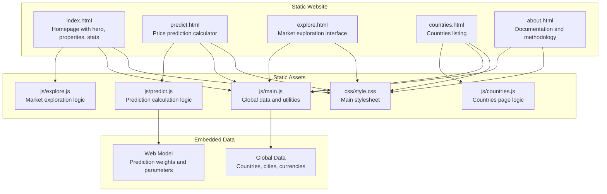
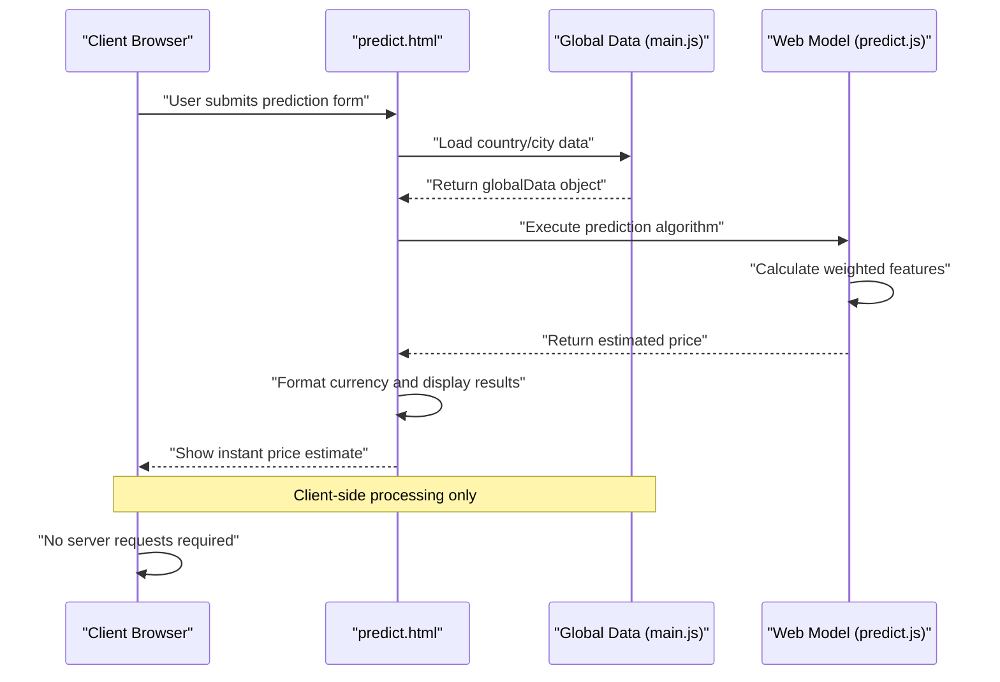
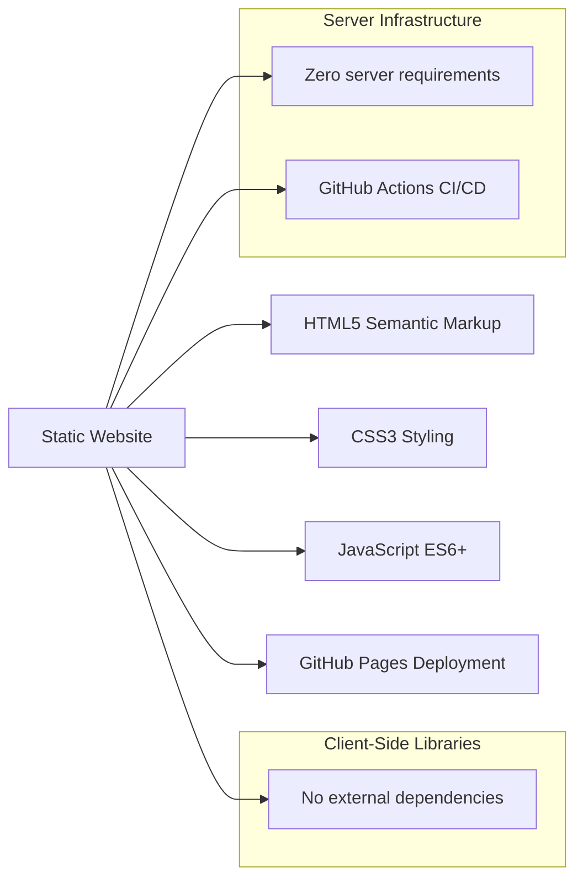

# REST API Service

<cite>
**Referenced Files in This Document**
- [api/main.py](file://api/main.py)
- [api/test_api.py](file://api/test_api.py)
- [tests/test_api.py](file://tests/test_api.py)
- [README.md](file://README.md)
- [requirements.txt](file://requirements.txt)
- [api/requirements.txt](file://api/requirements.txt)
- [docker-compose.yml](file://docker-compose.yml)
- [Dockerfile](file://Dockerfile)
- [docs/architecture.md](file://docs/architecture.md)
- [docs/model_data.json](file://docs/model_data.json)
- [docs/web_model.json](file://docs/web_model.json)
- [setup.py](file://setup.py)
- [global-housing-static/index.html](file://global-housing-static/index.html)
- [global-housing-static/predict.html](file://global-housing-static/predict.html)
- [global-housing-static/js/main.js](file://global-housing-static/js/main.js)
- [global-housing-static/js/predict.js](file://global-housing-static/js/predict.js)
- [js/main.js](file://js/main.js)
- [js/predict.js](file://js/predict.js)
</cite>

## Update Summary
**Changes Made**
- Updated to reflect the current architecture shift from Python Flask API to static website deployment
- Removed FastAPI service documentation as the Flask API has been decommissioned
- Added comprehensive documentation for the new static website architecture
- Updated architecture diagrams to show the static deployment pattern
- Removed API-related sections that are no longer applicable
- Added documentation for client-side prediction implementation

## Table of Contents
1. [Introduction](#introduction)
2. [Project Structure](#project-structure)
3. [Core Components](#core-components)
4. [Architecture Overview](#architecture-overview)
5. [Detailed Component Analysis](#detailed-component-analysis)
6. [Dependency Analysis](#dependency-analysis)
7. [Performance Considerations](#performance-considerations)
8. [Troubleshooting Guide](#troubleshooting-guide)
9. [Conclusion](#conclusion)
10. [Appendices](#appendices)

## Introduction
This document describes the current static website architecture for the Global Housing Price Predictor. The system has shifted from a Python Flask API-based approach to a fully static website implementation that provides instant price predictions through client-side calculations. The static website delivers global real estate price estimation capabilities with no server dependency, utilizing embedded model data and global datasets for instant results.

**Updated** The system now operates as a pure static website deployed on GitHub Pages, eliminating the need for server infrastructure while maintaining the same prediction functionality through client-side processing.

## Project Structure
The system consists entirely of static HTML, CSS, and JavaScript files with no server-side dependencies. The architecture includes global data management, client-side prediction logic, and responsive design components.

**Diagram sources**
- [global-housing-static/index.html:1-285](file://global-housing-static/index.html#L1-L285)
- [global-housing-static/predict.html:1-126](file://global-housing-static/predict.html#L1-L126)
- [global-housing-static/js/main.js:1-210](file://global-housing-static/js/main.js#L1-L210)
- [global-housing-static/js/predict.js:1-166](file://global-housing-static/js/predict.js#L1-L166)

**Section sources**
- [README.md:36-55](file://README.md#L36-L55)
- [global-housing-static/index.html:1-285](file://global-housing-static/index.html#L1-L285)
- [global-housing-static/predict.html:1-126](file://global-housing-static/predict.html#L1-L126)

## Core Components
- Pure static HTML/CSS/JavaScript implementation with no external framework dependencies
- Embedded global dataset containing 20+ countries and 95+ cities with pricing information
- Client-side prediction algorithm with feature engineering and confidence scoring
- Responsive design optimized for desktop, tablet, and mobile devices
- Currency formatting and internationalization support
- GitHub Actions automated deployment pipeline

Key implementation references:
- Static website structure: [README.md:36-55](file://README.md#L36-L55)
- Global data management: [global-housing-static/js/main.js:20-133](file://global-housing-static/js/main.js#L20-L133)
- Prediction calculation logic: [global-housing-static/js/predict.js:90-157](file://global-housing-static/js/predict.js#L90-L157)
- Responsive design implementation: [global-housing-static/css/style.css](file://global-housing-static/css/style.css)

**Section sources**
- [README.md:36-55](file://README.md#L36-L55)
- [global-housing-static/js/main.js:20-133](file://global-housing-static/js/main.js#L20-L133)
- [global-housing-static/js/predict.js:90-157](file://global-housing-static/js/predict.js#L90-L157)

## Architecture Overview
The system operates as a fully static website with client-side processing. All data and algorithms are embedded within the JavaScript files, enabling instant price calculations without server requests. The architecture eliminates server infrastructure costs while providing comprehensive global coverage.

**Diagram sources**
- [global-housing-static/predict.html:42-97](file://global-housing-static/predict.html#L42-L97)
- [global-housing-static/js/main.js:20-133](file://global-housing-static/js/main.js#L20-L133)
- [global-housing-static/js/predict.js:90-157](file://global-housing-static/js/predict.js#L90-L157)

**Section sources**
- [global-housing-static/predict.html:42-97](file://global-housing-static/predict.html#L42-L97)
- [global-housing-static/js/main.js:20-133](file://global-housing-static/js/main.js#L20-L133)
- [global-housing-static/js/predict.js:90-157](file://global-housing-static/js/predict.js#L90-L157)

## Detailed Component Analysis

### Static Website Pages
- **index.html**: Homepage featuring hero section, property listings, search functionality, and testimonials
- **predict.html**: Interactive price prediction calculator with form validation and instant results
- **explore.html**: Market exploration interface for browsing property listings by location
- **countries.html**: Comprehensive list of supported countries with pricing information
- **about.html**: Documentation page explaining methodology and data sources

References:
- [global-housing-static/index.html:1-285](file://global-housing-static/index.html#L1-L285)
- [global-housing-static/predict.html:1-126](file://global-housing-static/predict.html#L1-L126)
- [README.md:26-35](file://README.md#L26-L35)

**Section sources**
- [global-housing-static/index.html:1-285](file://global-housing-static/index.html#L1-L285)
- [global-housing-static/predict.html:1-126](file://global-housing-static/predict.html#L1-L126)
- [README.md:26-35](file://README.md#L26-L35)

### Global Data Management
- **Countries Database**: 20+ countries with currency codes, average prices per square foot, and regional classifications
- **Cities Database**: 95+ cities with location-specific price multipliers and emoji representations
- **Featured Properties**: Sample property listings for homepage showcase
- **Currency Symbols**: Complete mapping for proper currency formatting across all supported currencies

References:
- [global-housing-static/js/main.js:20-133](file://global-housing-static/js/main.js#L20-L133)
- [global-housing-static/js/main.js:135-141](file://global-housing-static/js/main.js#L135-L141)

**Section sources**
- [global-housing-static/js/main.js:20-133](file://global-housing-static/js/main.js#L20-L133)
- [global-housing-static/js/main.js:135-141](file://global-housing-static/js/main.js#L135-L141)

### Client-Side Prediction Algorithm
- **Base Price Calculation**: Multiplies square footage by country average price and city multiplier
- **Feature Adjustments**: Adds bonuses for bedrooms, bathrooms, garage, and pool; applies depreciation for property age
- **Confidence Scoring**: Determines confidence level based on market data availability
- **Price Range Calculation**: Provides ±15% range for estimate uncertainty
- **Market Context**: Shows comparison to local average pricing

References:
- [global-housing-static/js/predict.js:108-157](file://global-housing-static/js/predict.js#L108-L157)

**Section sources**
- [global-housing-static/js/predict.js:108-157](file://global-housing-static/js/predict.js#L108-L157)

### Static Website Client Implementation
- **Pure JavaScript**: No external frameworks or dependencies
- **Responsive Design**: Mobile-first approach with CSS Grid and Flexbox
- **Instant Processing**: All calculations performed client-side without server requests
- **GitHub Pages Ready**: Optimized for deployment on GitHub Pages infrastructure
- **Performance Optimized**: Minimal file size with embedded data for fast loading

References:
- [README.md:57-64](file://README.md#L57-L64)
- [README.md:147-153](file://README.md#L147-L153)

**Section sources**
- [README.md:57-64](file://README.md#L57-L64)
- [README.md:147-153](file://README.md#L147-L153)

### Practical Usage Examples

- **Static Website Deployment**: Deploy directly to GitHub Pages using the provided deployment methods
- **Local Development**: Open index.html in any modern browser for immediate testing
- **Customization**: Modify CSS variables in style.css and update globalData in main.js for customization

References:
- [README.md:65-98](file://README.md#L65-L98)
- [README.md:100-130](file://README.md#L100-L130)

**Section sources**
- [README.md:65-98](file://README.md#L65-L98)
- [README.md:100-130](file://README.md#L100-L130)

### Client Implementation Guidelines
- **No Server Dependencies**: All functionality works offline with embedded data
- **Browser Compatibility**: Tested on latest versions of Chrome, Firefox, Safari, and Edge
- **Customization**: Modify globalData for additional countries or adjust pricing algorithms
- **Performance**: Minimize DOM manipulation and leverage CSS for animations
- **Accessibility**: Forms include proper labeling and validation feedback

References:
- [global-housing-static/js/main.js:168-210](file://global-housing-static/js/main.js#L168-L210)
- [global-housing-static/js/predict.js:47-88](file://global-housing-static/js/predict.js#L47-L88)

**Section sources**
- [global-housing-static/js/main.js:168-210](file://global-housing-static/js/main.js#L168-L210)
- [global-housing-static/js/predict.js:47-88](file://global-housing-static/js/predict.js#L47-L88)

### Monitoring and Observability
- **Browser Developer Tools**: Use console.log statements for debugging client-side issues
- **Performance Monitoring**: Track loading times and user interaction metrics
- **Error Handling**: Basic validation provides immediate feedback for invalid inputs
- **Deployment Monitoring**: GitHub Actions workflow automates deployment process

References:
- [global-housing-static/.github/workflows/pages.yml](file://global-housing-static/.github/workflows/pages.yml)
- [README.md:167](file://README.md#L167)

**Section sources**
- [global-housing-static/.github/workflows/pages.yml](file://global-housing-static/.github/workflows/pages.yml)
- [README.md:167](file://README.md#L167)

## Dependency Analysis
The static website has zero server-side dependencies, relying entirely on client-side JavaScript. The architecture uses vanilla JavaScript with no external frameworks, ensuring minimal complexity and optimal performance.

**Diagram sources**
- [README.md:57-64](file://README.md#L57-L64)
- [global-housing-static/.github/workflows/pages.yml](file://global-housing-static/.github/workflows/pages.yml)

**Section sources**
- [README.md:57-64](file://README.md#L57-L64)
- [global-housing-static/.github/workflows/pages.yml](file://global-housing-static/.github/workflows/pages.yml)

## Performance Considerations
- **Zero Server Requests**: All data and calculations performed client-side for instant responses
- **Embedded Data**: Global datasets loaded once and cached in memory for subsequent requests
- **Minimal File Size**: Optimized JavaScript with essential functionality only
- **Responsive Design**: Efficient CSS Grid and Flexbox layouts for all device sizes
- **GitHub Pages Optimization**: CDN-backed hosting with automatic compression
- **No Model Loading**: Eliminates model initialization overhead present in previous API architecture

## Troubleshooting Guide
Common issues and resolutions for the static website:
- **Page Not Loading**: Ensure all files are uploaded to the root of the repository
- **JavaScript Errors**: Check browser console for syntax errors or missing files
- **Prediction Not Working**: Verify globalData object loads correctly and form fields have valid values
- **Styling Issues**: Confirm CSS file is accessible and not blocked by browser security policies
- **Deployment Problems**: Check GitHub Actions workflow for build errors and verify Pages settings

References:
- [README.md:167](file://README.md#L167)
- [global-housing-static/js/main.js:168-210](file://global-housing-static/js/main.js#L168-L210)

**Section sources**
- [README.md:167](file://README.md#L167)
- [global-housing-static/js/main.js:168-210](file://global-housing-static/js/main.js#L168-L210)

## Conclusion
The system has successfully transitioned to a fully static architecture, eliminating server infrastructure while maintaining comprehensive global real estate prediction capabilities. The static website provides instant price estimates through client-side processing, offers excellent performance through embedded data, and supports easy deployment via GitHub Pages. This approach reduces operational complexity, eliminates server costs, and provides a scalable solution for global real estate price prediction.

## Appendices

### Static Website Architecture
- **Pure Static Implementation**: No server-side code or dependencies
- **Client-Side Processing**: All calculations performed in user's browser
- **Embedded Data**: Global datasets and prediction models included in JavaScript files
- **Responsive Design**: Optimized for all device sizes with mobile-first approach
- **GitHub Pages Ready**: Pre-configured for automated deployment

References:
- [README.md:36-55](file://README.md#L36-L55)
- [global-housing-static/index.html:1-285](file://global-housing-static/index.html#L1-285)

**Section sources**
- [README.md:36-55](file://README.md#L36-L55)
- [global-housing-static/index.html:1-285](file://global-housing-static/index.html#L1-285)

### Deployment and Packaging
- **GitHub Pages Deployment**: Automated via GitHub Actions workflow
- **Manual Upload**: Direct file upload to repository root
- **Git Commands**: Command-line deployment with git push
- **PowerShell Script**: Automated deployment utility for Windows users

References:
- [README.md:65-98](file://README.md#L65-L98)
- [global-housing-static/deploy.ps1](file://global-housing-static/deploy.ps1)

**Section sources**
- [README.md:65-98](file://README.md#L65-L98)
- [global-housing-static/deploy.ps1](file://global-housing-static/deploy.ps1)

### Static Website Features
- **Global Coverage**: 20+ countries and 95+ cities with pricing data
- **Responsive Design**: Mobile-first approach with adaptive layouts
- **Instant Results**: Client-side calculations with no server latency
- **Currency Support**: 16+ currencies with proper formatting
- **Market Context**: Local average comparisons and confidence indicators

References:
- [global-housing-static/js/main.js:20-133](file://global-housing-static/js/main.js#L20-L133)
- [global-housing-static/js/predict.js:124-157](file://global-housing-static/js/predict.js#L124-L157)

**Section sources**
- [global-housing-static/js/main.js:20-133](file://global-housing-static/js/main.js#L20-L133)
- [global-housing-static/js/predict.js:124-157](file://global-housing-static/js/predict.js#L124-L157)

### Versioning and Backward Compatibility
- **Static Architecture**: No API versioning required for website deployment
- **Data Updates**: Global datasets can be updated by modifying globalData object
- **Backward Compatibility**: Pure static files work across all modern browsers
- **Future Enhancements**: Easy to extend functionality without breaking existing features

References:
- [global-housing-static/js/main.js:20-133](file://global-housing-static/js/main.js#L20-L133)
- [README.md:140-146](file://README.md#L140-L146)

**Section sources**
- [global-housing-static/js/main.js:20-133](file://global-housing-static/js/main.js#L20-L133)
- [README.md:140-146](file://README.md#L140-L146)