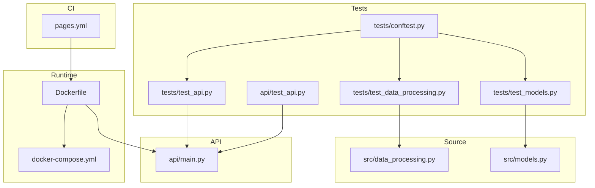
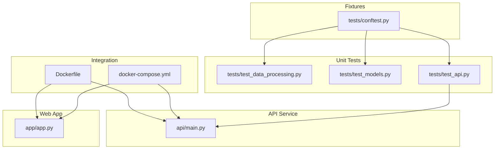
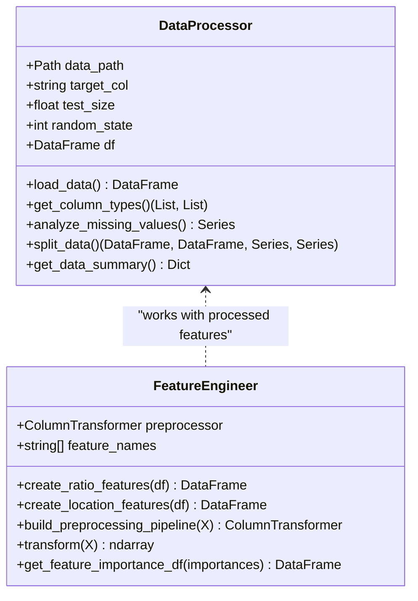
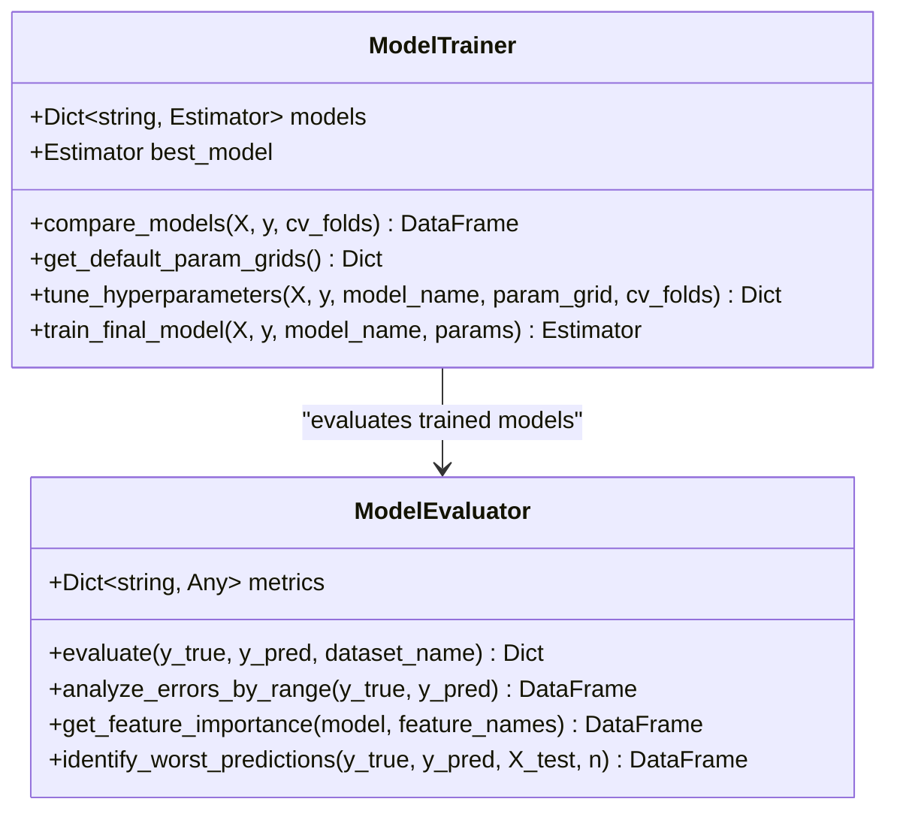
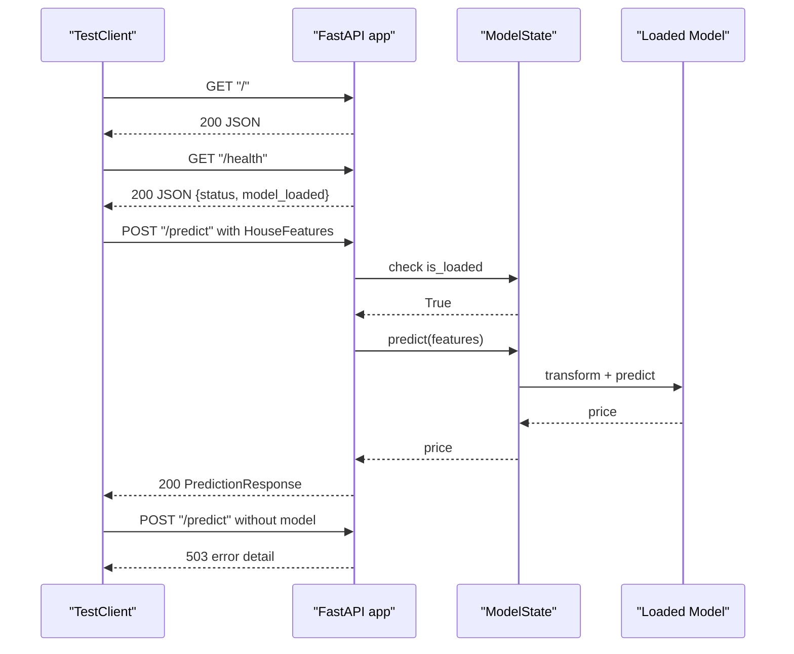
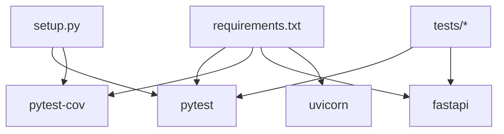

# Testing Strategy

<cite>
**Referenced Files in This Document**
- [conftest.py](file://tests/conftest.py)
- [test_data_processing.py](file://tests/test_data_processing.py)
- [test_models.py](file://tests/test_models.py)
- [test_api.py](file://tests/test_api.py)
- [test_api.py](file://api/test_api.py)
- [main.py](file://api/main.py)
- [requirements.txt](file://requirements.txt)
- [setup.py](file://setup.py)
- [docker-compose.yml](file://docker-compose.yml)
- [Dockerfile](file://Dockerfile)
- [pages.yml](file://.github/workflows/pages.yml)
- [data_processing.py](file://src/data_processing.py)
- [models.py](file://src/models.py)
</cite>

## Table of Contents
1. [Introduction](#introduction)
2. [Project Structure](#project-structure)
3. [Core Components](#core-components)
4. [Architecture Overview](#architecture-overview)
5. [Detailed Component Analysis](#detailed-component-analysis)
6. [Dependency Analysis](#dependency-analysis)
7. [Performance Considerations](#performance-considerations)
8. [Troubleshooting Guide](#troubleshooting-guide)
9. [Conclusion](#conclusion)
10. [Appendices](#appendices)

## Introduction
This document defines the complete testing strategy for the housing price prediction project. It covers unit testing with pytest, fixture usage, parameterized testing, test coverage, continuous integration, and automated workflows. It also documents testing of data processing functions, model training and evaluation, API endpoints, and web application logic. Guidance is included for edge cases, error conditions, performance scenarios, integration testing, API contract testing, end-to-end testing, test data management, mock data generation, and test environment setup.

## Project Structure
The repository organizes tests under a dedicated tests directory with pytest fixtures and test modules grouped by functional area. The API and web application are separate services with their own test suites and entry points. Containerization via Docker supports repeatable environments for local and CI testing.

**Diagram sources**
- [conftest.py](file://tests/conftest.py)
- [test_data_processing.py](file://tests/test_data_processing.py)
- [test_models.py](file://tests/test_models.py)
- [test_api.py](file://tests/test_api.py)
- [test_api.py](file://api/test_api.py)
- [main.py](file://api/main.py)
- [Dockerfile](file://Dockerfile)
- [docker-compose.yml](file://docker-compose.yml)
- [.github/workflows/pages.yml](file://.github/workflows/pages.yml)

**Section sources**
- [conftest.py](file://tests/conftest.py)
- [test_data_processing.py](file://tests/test_data_processing.py)
- [test_models.py](file://tests/test_models.py)
- [test_api.py](file://tests/test_api.py)
- [test_api.py](file://api/test_api.py)
- [main.py](file://api/main.py)
- [Dockerfile](file://Dockerfile)
- [docker-compose.yml](file://docker-compose.yml)
- [pages.yml](file://.github/workflows/pages.yml)

## Core Components
- Unit testing framework: pytest with fixtures and parametrization.
- Coverage: pytest-cov integrated for coverage reporting.
- API testing: FastAPI TestClient for endpoint-level tests.
- Web app testing: Standalone script for manual verification of endpoints.
- Data processing and modeling: Dedicated test modules for classes and functions.
- Environment: Docker-based containers for consistent local and CI execution.

Key capabilities:
- Shared fixtures for synthetic datasets and model mocks.
- Parameterized tests via pytest.mark.parametrize and generated data.
- Contract tests validating request/response schemas and error codes.
- Integration tests using Docker Compose to run API and web app together.

**Section sources**
- [requirements.txt](file://requirements.txt)
- [setup.py](file://setup.py)
- [conftest.py](file://tests/conftest.py)
- [test_api.py](file://tests/test_api.py)
- [test_api.py](file://api/test_api.py)

## Architecture Overview
The testing architecture spans unit, integration, and end-to-end layers. Unit tests exercise individual modules and classes. Integration tests validate service interactions using Docker Compose. End-to-end tests combine API contract checks with web app navigation.

**Diagram sources**
- [test_data_processing.py](file://tests/test_data_processing.py)
- [test_models.py](file://tests/test_models.py)
- [test_api.py](file://tests/test_api.py)
- [conftest.py](file://tests/conftest.py)
- [main.py](file://api/main.py)
- [Dockerfile](file://Dockerfile)
- [docker-compose.yml](file://docker-compose.yml)

## Detailed Component Analysis

### Data Processing Tests
These tests validate data loading, column type detection, missing value analysis, train-test split, and feature engineering. They use a session-scoped fixture for synthetic data and temporary files to isolate IO.

- Test classes:
  - TestDataProcessor: initialization, file-not-found, column types, missing values, train-test split, and summary.
  - TestFeatureEngineer: ratio features, location features, preprocessing pipeline construction, transform behavior, and feature importance DataFrame creation.

- Assertions focus on shape correctness, presence of engineered features, and preconditions (e.g., raising errors when pipeline is not built).

- Edge cases covered:
  - Invalid data path raises appropriate error.
  - Transform before fitting raises a clear ValueError.
  - Target variable excluded from features post-split.

**Diagram sources**
- [data_processing.py](file://src/data_processing.py)

**Section sources**
- [test_data_processing.py](file://tests/test_data_processing.py)
- [data_processing.py](file://src/data_processing.py)

### Model Training and Evaluation Tests
These tests cover model comparison with cross-validation, hyperparameter grids, evaluation metrics, residual analysis, feature importance extraction, and persistence (save/load).

- Test classes:
  - TestModelTrainer: initialization, model comparison with CV, default parameter grids.
  - TestModelEvaluator: evaluation metrics, error analysis by range, feature importance extraction for tree and linear models, unsupported model handling, and worst predictions identification.
  - TestModelPersistence: save and load model with assertions on prediction equivalence.

- Assertions emphasize metric presence, monotonic ordering, and DataFrame schema correctness.

**Diagram sources**
- [models.py](file://src/models.py)

**Section sources**
- [test_models.py](file://tests/test_models.py)
- [models.py](file://src/models.py)

### API Endpoint Tests
These tests validate FastAPI endpoints, input validation, error handling, and model state gating. They use TestClient and monkeypatch to simulate model availability and responses.

- Test classes:
  - TestRootEndpoints: root and health endpoints.
  - TestPredictionEndpoints: single and batch prediction endpoints, validation failures, and model-not-loaded scenarios.
  - TestModelInfoEndpoint: model info endpoint with and without model loaded.

- Assertions cover HTTP status codes, JSON schema compliance, and error messages.

**Diagram sources**
- [test_api.py](file://tests/test_api.py)
- [main.py](file://api/main.py)

**Section sources**
- [test_api.py](file://tests/test_api.py)
- [main.py](file://api/main.py)

### Web Application Logic Tests
A simple script validates web app endpoints manually. It prints responses and handles connection errors, serving as a lightweight smoke test during development.

- Endpoints tested: health, model info, single prediction, and batch prediction.
- Behavior: prints structured JSON responses and connection error messages.

**Section sources**
- [test_api.py](file://api/test_api.py)

## Dependency Analysis
Testing dependencies are declared in requirements and setup. The project leverages pytest, pytest-cov, httpx/TestClient, and FastAPI for API testing. Docker and docker-compose support integration and end-to-end testing.

**Diagram sources**
- [requirements.txt](file://requirements.txt)
- [setup.py](file://setup.py)

**Section sources**
- [requirements.txt](file://requirements.txt)
- [setup.py](file://setup.py)

## Performance Considerations
- Prefer small synthetic datasets via fixtures for speed; use larger datasets only when necessary.
- Limit cross-validation folds in tests to reduce runtime while maintaining statistical validity.
- Use tmp_path fixtures to avoid IO overhead and ensure isolation.
- Mock external model calls in API tests to eliminate latency and network dependencies.
- Containerized tests reduce flakiness caused by environment differences.

## Troubleshooting Guide
Common issues and resolutions:
- API returns 503 when model is not loaded: ensure model files exist and ModelState loads successfully.
- Validation errors (422) on prediction: confirm input ranges and enums match Pydantic constraints.
- Missing model files: verify mounted volumes in Docker Compose and file paths in the API.
- Connection errors in manual script: ensure the API service is running and listening on the expected port.

Operational tips:
- Use docker-compose healthchecks to verify service readiness.
- Leverage pytest markers to run subsets of tests quickly during development.
- Capture logs from containers to diagnose runtime errors.

**Section sources**
- [test_api.py](file://tests/test_api.py)
- [main.py](file://api/main.py)
- [docker-compose.yml](file://docker-compose.yml)

## Conclusion
The testing strategy combines robust unit tests, API contract validation, and containerized integration/end-to-end testing. Shared fixtures and deterministic data generation ensure repeatability. The approach balances thoroughness with performance, enabling rapid feedback loops and reliable releases.

## Appendices

### Test Organization and Execution
- Directory layout: tests grouped by module and feature.
- Fixtures: centralized in conftest.py for reuse across test modules.
- Execution: run pytest with coverage enabled; use markers to select test groups.

**Section sources**
- [conftest.py](file://tests/conftest.py)
- [requirements.txt](file://requirements.txt)

### Continuous Integration and Workflows
- Current CI: GitHub Pages workflow for static site deployment.
- Recommendation: add a dedicated testing workflow using the existing Docker setup to run pytest, coverage, and integration tests.

**Section sources**
- [pages.yml](file://.github/workflows/pages.yml)
- [Dockerfile](file://Dockerfile)
- [docker-compose.yml](file://docker-compose.yml)

### Test Data Management and Mocking
- Synthetic data: generated via fixtures to emulate realistic distributions.
- Temporary files: used for isolated IO in data processing tests.
- Mocking: monkeypatch for model state and predict behavior in API tests.

**Section sources**
- [conftest.py](file://tests/conftest.py)
- [test_data_processing.py](file://tests/test_data_processing.py)
- [test_api.py](file://tests/test_api.py)

### API Contract Testing
- Pydantic models define strict input and output schemas.
- Tests assert status codes and response fields for each endpoint.
- Validation errors are verified for malformed inputs.

**Section sources**
- [main.py](file://api/main.py)
- [test_api.py](file://tests/test_api.py)

### End-to-End Testing Approach
- Docker Compose brings up API, web app, and optional MLflow services.
- Manual script validates endpoints; automated tests use TestClient against running services.

**Section sources**
- [docker-compose.yml](file://docker-compose.yml)
- [test_api.py](file://api/test_api.py)