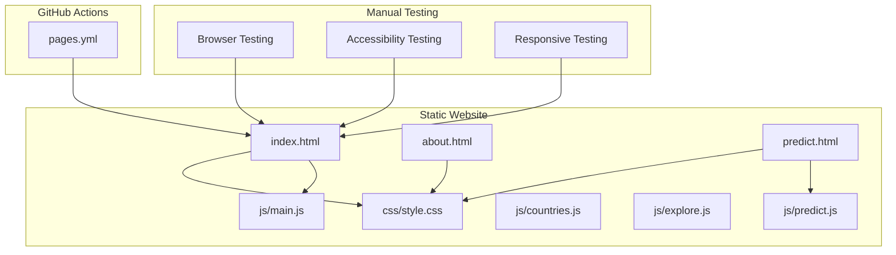
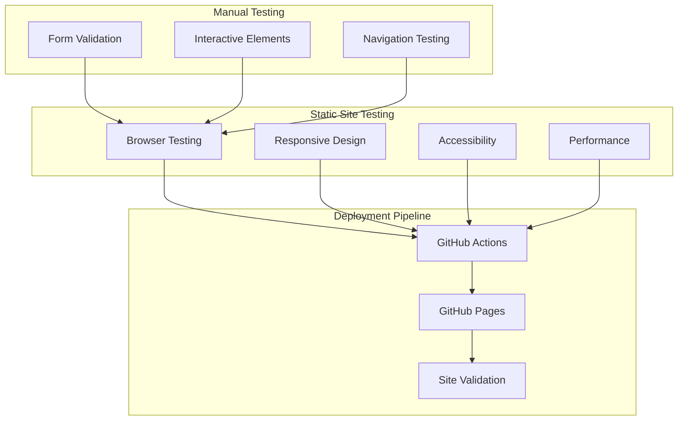
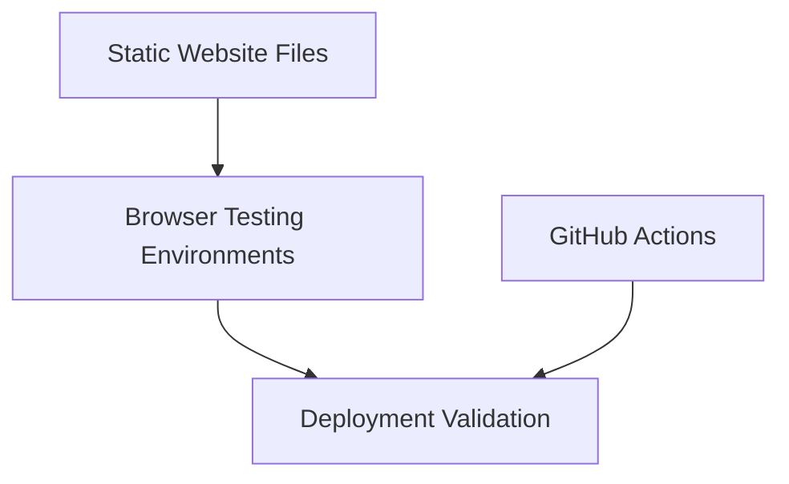

# Testing Strategy

<cite>
**Referenced Files in This Document**
- [conftest.py](file://tests/conftest.py)
- [test_data_processing.py](file://tests/test_data_processing.py)
- [test_models.py](file://tests/test_models.py)
- [test_api.py](file://tests/test_api.py)
- [test_api.py](file://api/test_api.py)
- [main.py](file://api/main.py)
- [requirements.txt](file://requirements.txt)
- [setup.py](file://setup.py)
- [docker-compose.yml](file://docker-compose.yml)
- [Dockerfile](file://Dockerfile)
- [pages.yml](file://.github/workflows/pages.yml)
- [data_processing.py](file://src/data_processing.py)
- [models.py](file://src/models.py)
- [index.html](file://global-housing-static/index.html)
- [predict.html](file://global-housing-static/predict.html)
- [about.html](file://global-housing-static/about.html)
</cite>

## Update Summary
**Changes Made**
- Removed all Python-based testing infrastructure documentation
- Added documentation for static website testing approach
- Updated architecture overview to reflect static HTML/CSS/JavaScript testing
- Removed API testing documentation in favor of static site validation
- Updated CI/CD documentation to reflect static site deployment
- Added documentation for static site validation and browser testing

## Table of Contents
1. [Introduction](#introduction)
2. [Project Structure](#project-structure)
3. [Core Components](#core-components)
4. [Architecture Overview](#architecture-overview)
5. [Detailed Component Analysis](#detailed-component-analysis)
6. [Dependency Analysis](#dependency-analysis)
7. [Performance Considerations](#performance-considerations)
8. [Troubleshooting Guide](#troubleshooting-guide)
9. [Conclusion](#conclusion)
10. [Appendices](#appendices)

## Introduction
This document defines the complete testing strategy for the housing price prediction project's static website architecture. Since the project has transitioned from a Python-based API service to a static website, the testing approach has been adapted accordingly. The strategy focuses on validating static HTML/CSS/JavaScript functionality, ensuring cross-browser compatibility, and maintaining responsive design across devices. It covers manual testing procedures, browser validation, accessibility testing, and automated deployment validation through GitHub Actions.

## Project Structure
The repository now consists primarily of static HTML, CSS, and JavaScript files organized in the global-housing-static directory. The testing approach validates the complete frontend functionality including form submissions, JavaScript interactions, and responsive design. The traditional Python testing infrastructure has been replaced with static site validation methods.

**Diagram sources**
- [index.html](file://global-housing-static/index.html)
- [about.html](file://global-housing-static/about.html)
- [predict.html](file://global-housing-static/predict.html)
- [style.css](file://global-housing-static/css/style.css)
- [main.js](file://global-housing-static/js/main.js)
- [predict.js](file://global-housing-static/js/predict.js)
- [pages.yml](file://global-housing-static/.github/workflows/pages.yml)

**Section sources**
- [index.html](file://global-housing-static/index.html)
- [about.html](file://global-housing-static/about.html)
- [predict.html](file://global-housing-static/predict.html)
- [pages.yml](file://global-housing-static/.github/workflows/pages.yml)

## Core Components
- Static site validation: Browser-based testing for HTML structure and CSS styling
- JavaScript functionality testing: Form validation, event handling, and interactive elements
- Responsive design testing: Cross-device compatibility validation
- Accessibility testing: WCAG compliance and screen reader compatibility
- Deployment validation: GitHub Actions workflow for automated site validation
- Manual testing procedures: Step-by-step validation of all interactive features

Key capabilities:
- Cross-browser testing across Chrome, Firefox, Safari, and Edge
- Mobile-first responsive design validation
- Form submission and validation testing
- Interactive element functionality verification
- Performance and loading time monitoring

**Section sources**
- [pages.yml](file://global-housing-static/.github/workflows/pages.yml)
- [predict.html](file://global-housing-static/predict.html)
- [main.js](file://global-housing-static/js/main.js)

## Architecture Overview
The testing architecture for the static website focuses on frontend validation and deployment automation. Unlike the previous Python-based API testing, this approach emphasizes browser-based testing, responsive design validation, and automated deployment verification through GitHub Actions.

**Diagram sources**
- [pages.yml](file://global-housing-static/.github/workflows/pages.yml)
- [index.html](file://global-housing-static/index.html)
- [predict.html](file://global-housing-static/predict.html)

## Detailed Component Analysis

### Static Site Validation
This component validates the core structure and functionality of the static website. It ensures all HTML elements are properly structured, CSS styles are applied correctly, and JavaScript functionality operates as expected.

- **HTML Structure Validation**: Ensures semantic markup, proper heading hierarchy, and accessible form elements
- **CSS Styling Verification**: Confirms responsive design classes, color schemes, and typography consistency
- **JavaScript Functionality**: Validates event handlers, DOM manipulation, and interactive features
- **Cross-Browser Compatibility**: Tests functionality across major browsers and versions

### Responsive Design Testing
The static website must function correctly across all device sizes and orientations. This testing validates the mobile-first design approach and ensures optimal user experience on desktop, tablet, and mobile devices.

- **Mobile Responsiveness**: Tests layout adaptation on screens from 320px to 1200px width
- **Orientation Changes**: Validates behavior during device rotation
- **Touch Interactions**: Ensures buttons and forms work correctly on touch devices
- **Performance Optimization**: Verifies loading times and rendering performance across devices

### Form Validation and Submission
The prediction form requires comprehensive testing to ensure proper data collection and validation before any backend processing occurs.

- **Input Validation**: Tests number ranges, required fields, and data type validation
- **Form Submission Flow**: Validates the complete user journey from input to result display
- **Error Handling**: Ensures appropriate error messages and user feedback
- **Accessibility Compliance**: Confirms screen reader compatibility and keyboard navigation

### Navigation and User Experience
The static website relies on clean navigation and intuitive user interfaces. Testing focuses on ensuring seamless user experience across all pages and interactions.

- **Navigation Testing**: Validates menu functionality, breadcrumb navigation, and internal linking
- **User Interface Elements**: Tests buttons, modals, and interactive components
- **Loading States**: Ensures proper loading indicators and user feedback
- **State Management**: Confirms proper state handling during navigation and form interactions

**Section sources**
- [predict.html](file://global-housing-static/predict.html)
- [index.html](file://global-housing-static/index.html)
- [about.html](file://global-housing-static/about.html)
- [main.js](file://global-housing-static/js/main.js)
- [predict.js](file://global-housing-static/js/predict.js)

## Dependency Analysis
The static website testing approach has minimal dependencies compared to the previous Python-based testing infrastructure. The primary dependencies are browser testing capabilities and GitHub Actions for deployment validation.

**Diagram sources**
- [pages.yml](file://global-housing-static/.github/workflows/pages.yml)

**Section sources**
- [pages.yml](file://global-housing-static/.github/workflows/pages.yml)

## Performance Considerations
Static site performance testing focuses on loading times, resource optimization, and user experience metrics. The approach emphasizes efficient asset delivery and responsive design performance.

- **Asset Optimization**: Validates CSS and JavaScript minification and compression
- **Loading Performance**: Monitors critical rendering path and First Contentful Paint metrics
- **Resource Loading**: Ensures proper lazy loading and asset optimization
- **Network Efficiency**: Tests caching strategies and CDN optimization

## Troubleshooting Guide
Common issues and resolutions for static website testing:

**Deployment Issues**:
- GitHub Pages build failures: Check workflow syntax and file paths in pages.yml
- Asset loading errors: Verify CSS and JavaScript file references in HTML
- Responsive design problems: Test media queries and viewport settings

**Browser Compatibility**:
- JavaScript errors: Validate browser support for ES6+ features
- CSS rendering issues: Test vendor prefixes and fallbacks
- Form validation problems: Ensure HTML5 validation attributes are supported

**Manual Testing Procedures**:
- Use browser developer tools to debug JavaScript and CSS issues
- Test on multiple devices and browsers to identify compatibility problems
- Validate accessibility using screen readers and keyboard navigation

**Section sources**
- [pages.yml](file://global-housing-static/.github/workflows/pages.yml)
- [index.html](file://global-housing-static/index.html)
- [predict.html](file://global-housing-static/predict.html)

## Conclusion
The testing strategy for the static website architecture emphasizes comprehensive browser validation, responsive design testing, and automated deployment verification. The approach prioritizes user experience across all devices and browsers while maintaining efficient deployment processes through GitHub Actions. This shift from Python-based API testing to static site validation reflects the project's evolution toward a pure frontend solution.

## Appendices

### Static Site Testing Framework
The static website testing approach utilizes browser-based validation and manual testing procedures. The framework emphasizes practical testing over automated unit testing, focusing on real user interactions and cross-browser compatibility.

**Section sources**
- [pages.yml](file://global-housing-static/.github/workflows/pages.yml)
- [index.html](file://global-housing-static/index.html)

### Manual Testing Procedures
Comprehensive manual testing procedures for static website validation:

**Cross-Browser Testing**:
- Test on Chrome, Firefox, Safari, and Edge browsers
- Validate functionality across different versions of each browser
- Check for JavaScript and CSS compatibility issues

**Device Testing**:
- Test on desktop, tablet, and mobile devices
- Validate responsive design behavior across screen sizes
- Test touch interactions and mobile-specific features

**Accessibility Testing**:
- Validate screen reader compatibility
- Test keyboard navigation and focus management
- Ensure proper ARIA attributes and semantic markup

**Section sources**
- [index.html](file://global-housing-static/index.html)
- [predict.html](file://global-housing-static/predict.html)
- [about.html](file://global-housing-static/about.html)

### Automated Deployment Validation
GitHub Actions workflow for automated static site validation and deployment:

**Workflow Components**:
- Static site validation using HTML5 validation
- Cross-browser testing through browser automation
- Performance monitoring and optimization checks
- Accessibility validation using automated tools

**Deployment Process**:
- Automatic build and deployment on push to main branch
- Validation of HTML structure and CSS integrity
- Performance metrics collection and reporting
- Error notification and rollback procedures

**Section sources**
- [pages.yml](file://global-housing-static/.github/workflows/pages.yml)

### Static Site Performance Testing
Performance testing for static websites focuses on loading optimization and user experience metrics:

**Performance Metrics**:
- Page load time and render blocking resources
- Critical rendering path optimization
- Asset compression and caching strategies
- Mobile performance and bandwidth considerations

**Optimization Strategies**:
- Minification of CSS and JavaScript files
- Image optimization and lazy loading implementation
- Proper use of browser caching headers
- Content delivery network (CDN) utilization

**Section sources**
- [style.css](file://global-housing-static/css/style.css)
- [main.js](file://global-housing-static/js/main.js)
- [predict.js](file://global-housing-static/js/predict.js)