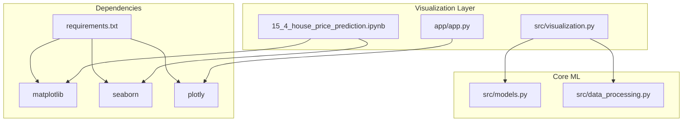
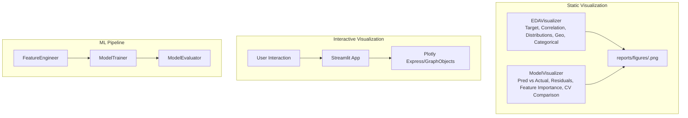
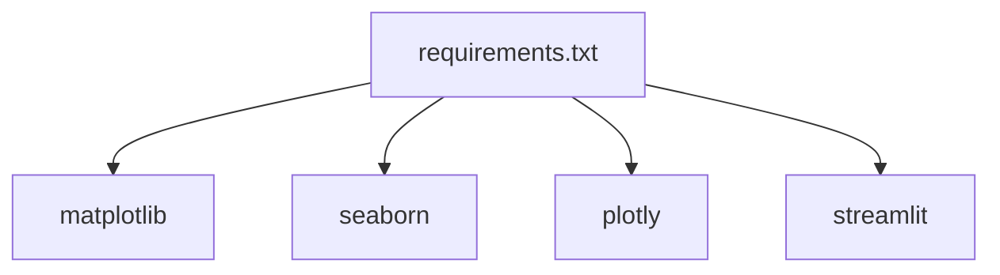

# Visualization and Analysis

<cite>
**Referenced Files in This Document**
- [README.md](file://README.md)
- [src/visualization.py](file://src/visualization.py)
- [src/models.py](file://src/models.py)
- [src/data_processing.py](file://src/data_processing.py)
- [app/app.py](file://app/app.py)
- [requirements.txt](file://requirements.txt)
- [15_4_house_price_prediction.ipynb](file://15_4_house_price_prediction.ipynb)
</cite>

## Table of Contents
1. [Introduction](#introduction)
2. [Project Structure](#project-structure)
3. [Core Components](#core-components)
4. [Architecture Overview](#architecture-overview)
5. [Detailed Component Analysis](#detailed-component-analysis)
6. [Dependency Analysis](#dependency-analysis)
7. [Performance Considerations](#performance-considerations)
8. [Troubleshooting Guide](#troubleshooting-guide)
9. [Conclusion](#conclusion)
10. [Appendices](#appendices)

## Introduction
This document focuses on the visualization and analysis capabilities of the project, covering exploratory data analysis (EDA) visualizations and model evaluation diagnostics. It explains how static plots are produced with Matplotlib and Seaborn, how interactive visualizations are integrated with Plotly in the Streamlit web app, and how these visuals support model interpretation and feature engineering insights. It also documents the report generation process, figure export capabilities, customization options, and the relationship between visualizations and model understanding.

## Project Structure
The visualization and analysis functionality spans several modules:
- Static plotting for EDA and model evaluation lives in the dedicated visualization module.
- The Streamlit web app integrates interactive Plotly visualizations for user-facing insights.
- The notebook demonstrates EDA workflows and includes static plotting examples.
- Dependencies for visualization libraries are declared in requirements.

**Diagram sources**
- [src/visualization.py](file://src/visualization.py)
- [app/app.py](file://app/app.py)
- [15_4_house_price_prediction.ipynb](file://15_4_house_price_prediction.ipynb)
- [requirements.txt](file://requirements.txt)

**Section sources**
- [README.md](file://README.md)
- [requirements.txt](file://requirements.txt)

## Core Components
This section outlines the primary visualization components and their responsibilities:
- EDAVisualizer: Produces static EDA plots including target distribution, correlation matrix, feature distributions, geographic distribution, and categorical distributions.
- ModelVisualizer: Produces static model evaluation plots including predictions vs actual, residual analysis (residuals vs predicted/actual, distribution, Q-Q), feature importance, and cross-validation comparison charts.
- Streamlit app: Integrates interactive Plotly visualizations for real-time user engagement and insights.
- Notebook: Demonstrates EDA workflows and static plotting examples.

Key capabilities:
- Static plots with Matplotlib and Seaborn, exported at high DPI to a standardized output directory.
- Interactive plots with Plotly embedded in the Streamlit web app.
- Report generation via saved figures and metrics.

**Section sources**
- [src/visualization.py](file://src/visualization.py)
- [app/app.py](file://app/app.py)
- [15_4_house_price_prediction.ipynb](file://15_4_house_price_prediction.ipynb)

## Architecture Overview
The visualization architecture combines static and interactive rendering:
- Static plots are generated by the visualization module and saved to disk for inclusion in reports.
- Interactive plots are embedded in the Streamlit app using Plotly for dynamic user exploration.
- The notebook provides a learning-oriented environment for EDA and static plotting.

**Diagram sources**
- [src/visualization.py](file://src/visualization.py)
- [src/models.py](file://src/models.py)
- [src/data_processing.py](file://src/data_processing.py)
- [app/app.py](file://app/app.py)

## Detailed Component Analysis

### EDA Visualizations with Matplotlib and Seaborn
The EDAVisualizer class centralizes static EDA plotting:
- Target distribution: Histogram and box plot with overlayed mean and median lines.
- Correlation matrix: Triangular masked heatmap with annotated correlations and centered colormap.
- Feature distributions: Faceted histograms for all numerical features with automatic subplot sizing.
- Geographic distribution: Scatter plot colored by target variable with bubble size representing population.
- Categorical distributions: Bar plots for each categorical feature.

Implementation highlights:
- Uses Seaborn for statistical plots and Matplotlib for layout control.
- Saves figures at high DPI with tight bounding boxes to a configurable output directory.
- Applies consistent styling defaults for readability.

Interpretation guidance:
- Target distribution informs skewness and potential transformations.
- Correlation matrix reveals multicollinearity and feature relevance.
- Geographic distribution highlights spatial trends and outliers.
- Categorical distributions expose class imbalance and rare categories.

**Section sources**
- [src/visualization.py](file://src/visualization.py)

### Model Evaluation Visualizations with Matplotlib and Seaborn
The ModelVisualizer class produces diagnostic plots:
- Predictions vs actual: Scatter plot with a perfect prediction reference line and currency formatting.
- Residual analysis: Four-panel layout including residuals vs predicted, residuals vs actual, residual distribution, and Q-Q plot for normality.
- Feature importance: Horizontal bar chart of top N features derived from model coefficients or importances.
- Cross-validation comparison: Side-by-side bar charts for RMSE, MAE, and R² across models.

Interpretation guidance:
- Predictions vs actual assess calibration and scale of errors.
- Residual plots diagnose homoscedasticity, normality, and systematic bias.
- Feature importance supports feature engineering decisions and model interpretability.
- CV comparison charts guide model selection and tuning focus.

**Section sources**
- [src/visualization.py](file://src/visualization.py)

### Interactive Visualizations with Plotly in Streamlit
The Streamlit app integrates Plotly for interactive experiences:
- Property location map: Real-time map centered on user-entered coordinates.
- Model insights: Bar chart of average house values by ocean proximity with color coding.
- Responsive layout: Uses container-width chart rendering for adaptability.

Implementation highlights:
- Plotly Express for quick chart creation and GraphObjects for fine-grained control.
- Streamlit caching for efficient model and preprocessor loading.
- Styling via custom CSS and Plotly layout updates.

Interpretation guidance:
- Interactive maps enable spatial reasoning and scenario exploration.
- Grouped bar charts highlight categorical effects and policy-relevant insights.

**Section sources**
- [app/app.py](file://app/app.py)

### Notebook Demonstrations and Static Plotting
The notebook demonstrates EDA workflows and static plotting:
- Histograms for feature distributions arranged in a grid.
- Correlation heatmap with annotated values and diverging colormap.
- Correlation with target to rank feature relevance.

These examples illustrate best practices for static visualization and serve as templates for custom analyses.

**Section sources**
- [15_4_house_price_prediction.ipynb](file://15_4_house_price_prediction.ipynb)

### Report Generation and Figure Export
The visualization module saves figures to a standardized directory with high resolution and tight bounding boxes. This enables:
- Automated report generation by including saved images.
- Publication-ready assets with consistent DPI and layout.
- Versioning-friendly outputs for documentation and presentations.

Customization options:
- Output directory is configurable in the visualization classes.
- Figure sizes and DPI are set for print-quality exports.
- Color schemes and styles are applied globally via Seaborn and Matplotlib rcParams.

**Section sources**
- [src/visualization.py](file://src/visualization.py)
- [requirements.txt](file://requirements.txt)

### Relationship Between Visualizations and Model Interpretation
Visualizations inform model interpretation and feature engineering:
- EDA plots guide feature selection and preprocessing choices (e.g., transformations, encoding).
- Correlation and geographic plots reveal spatial and relational signals captured by the model.
- Residual plots validate modeling assumptions and highlight problematic regions or categories.
- Feature importance aligns engineering efforts with predictive power.
- Interactive dashboards enable stakeholders to explore scenarios and understand model behavior.

**Section sources**
- [src/models.py](file://src/models.py)
- [src/data_processing.py](file://src/data_processing.py)
- [README.md](file://README.md)

## Dependency Analysis
The visualization stack relies on:
- Matplotlib and Seaborn for static plotting.
- Plotly for interactive visualizations in the web app.
- Streamlit for the web interface hosting interactive charts.

**Diagram sources**
- [requirements.txt](file://requirements.txt)

**Section sources**
- [requirements.txt](file://requirements.txt)

## Performance Considerations
- Static plots are computed once during analysis or reporting; keep figure sizes reasonable to balance clarity and file size.
- Interactive charts in the Streamlit app render client-side; simplify traces and avoid excessive interactivity for responsiveness.
- Use caching for model and preprocessor loads to minimize repeated computation.
- Export at appropriate DPI for the intended output medium (screen vs print).

## Troubleshooting Guide
Common issues and resolutions:
- Missing output directory: Ensure the reports/figures path exists or configure a writable directory.
- Empty or missing data: Validate DataFrame shapes and column names before plotting.
- High-DPI export artifacts: Confirm DPI settings and tight bounding boxes for crisp exports.
- Interactive chart sizing: Use container-width rendering and responsive layout updates in Streamlit.
- Dependency conflicts: Align versions with requirements.txt to avoid rendering or compatibility issues.

**Section sources**
- [src/visualization.py](file://src/visualization.py)
- [app/app.py](file://app/app.py)
- [requirements.txt](file://requirements.txt)

## Conclusion
The project’s visualization toolkit combines robust static EDA and model evaluation plots with interactive dashboards for stakeholder engagement. By leveraging Matplotlib/Seaborn for publication-ready static assets and Plotly within Streamlit for interactive exploration, the system supports both rigorous analysis and accessible communication. Proper use of these visualizations enhances model interpretation, guides feature engineering, and strengthens reporting.

## Appendices

### Example Interpretations for Feature Engineering and Model Understanding
- Target distribution: If skewed, consider log transformation or robust models.
- Correlation matrix: Remove highly collinear features to reduce variance and improve interpretability.
- Geographic distribution: Investigate spatial clustering and consider neighborhood or regional features.
- Residuals vs predicted: Look for funnel shapes indicating heteroscedasticity; consider robust regression or weighted loss.
- Feature importance: Focus engineering on top contributors; validate impact with cross-validation.

[No sources needed since this section provides general guidance]