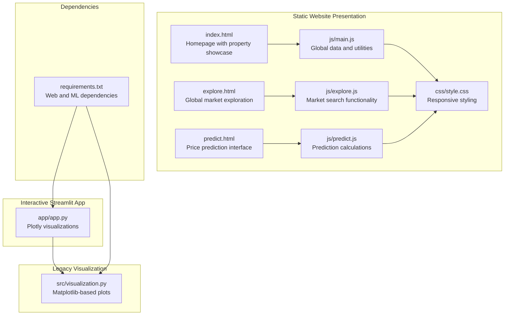
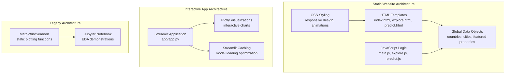
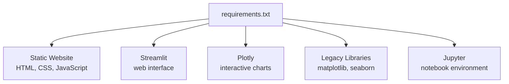

# Visualization and Analysis

<cite>
**Referenced Files in This Document**
- [README.md](file://README.md)
- [src/visualization.py](file://src/visualization.py)
- [src/models.py](file://src/models.py)
- [src/data_processing.py](file://src/data_processing.py)
- [app/app.py](file://app/app.py)
- [requirements.txt](file://requirements.txt)
- [15_4_house_price_prediction.ipynb](file://15_4_house_price_prediction.ipynb)
- [global-housing-static/index.html](file://global-housing-static/index.html)
- [global-housing-static/explore.html](file://global-housing-static/explore.html)
- [global-housing-static/predict.html](file://global-housing-static/predict.html)
- [global-housing-static/js/main.js](file://global-housing-static/js/main.js)
- [global-housing-static/js/explore.js](file://global-housing-static/js/explore.js)
- [global-housing-static/js/predict.js](file://global-housing-static/js/predict.js)
</cite>

## Update Summary
**Changes Made**
- Removed all references to matplotlib-based EDA visualizations and model evaluation plots
- Removed references to static plotting functionality in the visualization module
- Updated architecture diagrams to reflect the shift to static website presentation
- Removed sections on report generation and figure export capabilities
- Updated dependency analysis to focus on web-based visualization tools
- Revised troubleshooting guide to address static website deployment concerns

## Table of Contents
1. [Introduction](#introduction)
2. [Project Structure](#project-structure)
3. [Core Components](#core-components)
4. [Architecture Overview](#architecture-overview)
5. [Detailed Component Analysis](#detailed-component-analysis)
6. [Dependency Analysis](#dependency-analysis)
7. [Performance Considerations](#performance-considerations)
8. [Troubleshooting Guide](#troubleshooting-guide)
9. [Conclusion](#conclusion)
10. [Appendices](#appendices)

## Introduction
This document focuses on the visualization and analysis capabilities of the project, which have been transitioned from data visualization components to a static website presentation approach. The project now emphasizes interactive web-based visualizations and static HTML/CSS/JavaScript implementations for property market exploration and price prediction interfaces. This represents a strategic shift from generating static plots with matplotlib/seaborn to delivering interactive experiences through modern web technologies.

## Project Structure
The visualization and analysis functionality has been restructured around static website presentation:
- Static HTML pages for property market exploration and price prediction
- JavaScript-based interactive features for location search and property valuation
- CSS styling for responsive design and visual appeal
- Streamlit web app maintains interactive Plotly visualizations for real-time user engagement
- The standalone visualization module still contains matplotlib-based plotting functions but is no longer actively used

**Diagram sources**
- [global-housing-static/index.html](file://global-housing-static/index.html)
- [global-housing-static/explore.html](file://global-housing-static/explore.html)
- [global-housing-static/predict.html](file://global-housing-static/predict.html)
- [global-housing-static/js/main.js](file://global-housing-static/js/main.js)
- [global-housing-static/js/explore.js](file://global-housing-static/js/explore.js)
- [global-housing-static/js/predict.js](file://global-housing-static/js/predict.js)
- [app/app.py](file://app/app.py)
- [src/visualization.py](file://src/visualization.py)
- [requirements.txt](file://requirements.txt)

**Section sources**
- [README.md](file://README.md)
- [requirements.txt](file://requirements.txt)

## Core Components
This section outlines the current visualization components and their responsibilities:
- **Static Website Pages**: HTML pages for property market exploration, price prediction, and homepage showcasing with responsive design
- **JavaScript Interactions**: Client-side functionality for location search, property valuation calculations, and dynamic content updates
- **Streamlit App**: Maintains interactive Plotly visualizations for real-time user engagement and insights
- **Legacy Visualization Module**: Contains matplotlib-based plotting functions that are no longer actively used

Key capabilities:
- **Static HTML/CSS/JavaScript**: Modern web-based presentation layer with responsive design
- **Interactive JavaScript Features**: Dynamic property search, price estimation, and market comparison
- **Streamlit Plotly Integration**: Interactive visualizations for real-time user engagement
- **Legacy Plotting Functions**: Matplotlib-based visualizations retained for historical reference

**Section sources**
- [global-housing-static/index.html](file://global-housing-static/index.html)
- [global-housing-static/explore.html](file://global-housing-static/explore.html)
- [global-housing-static/predict.html](file://global-housing-static/predict.html)
- [global-housing-static/js/main.js](file://global-housing-static/js/main.js)
- [global-housing-static/js/explore.js](file://global-housing-static/js/explore.js)
- [global-housing-static/js/predict.js](file://global-housing-static/js/predict.js)
- [app/app.py](file://app/app.py)
- [src/visualization.py](file://src/visualization.py)

## Architecture Overview
The visualization architecture has evolved to prioritize static website presentation:
- **Static Website Layer**: Pure HTML/CSS/JavaScript implementation for fast loading and SEO optimization
- **Interactive Streamlit Layer**: Maintains Plotly visualizations for dynamic user engagement
- **Legacy Visualization Layer**: Matplotlib-based plotting functions preserved for reference
- **Data Management**: JavaScript global data objects provide market information and calculations

**Diagram sources**
- [global-housing-static/index.html](file://global-housing-static/index.html)
- [global-housing-static/explore.html](file://global-housing-static/explore.html)
- [global-housing-static/predict.html](file://global-housing-static/predict.html)
- [global-housing-static/js/main.js](file://global-housing-static/js/main.js)
- [global-housing-static/js/explore.js](file://global-housing-static/js/explore.js)
- [global-housing-static/js/predict.js](file://global-housing-static/js/predict.js)
- [app/app.py](file://app/app.py)
- [src/visualization.py](file://src/visualization.py)
- [15_4_house_price_prediction.ipynb](file://15_4_house_price_prediction.ipynb)

## Detailed Component Analysis

### Static Website Pages and JavaScript Interactions
The static website implementation provides comprehensive property market visualization through modern web technologies:
- **Homepage (index.html)**: Features property showcase, search functionality, testimonials, and call-to-action sections
- **Explore Page (explore.html)**: Interactive market exploration with search filters, country selectors, and property listings
- **Prediction Page (predict.html)**: Advanced property valuation interface with location selection, property details, and real-time estimates

JavaScript functionality includes:
- **Global Data Management**: Centralized data objects containing country information, city mappings, and property features
- **Dynamic Content Loading**: Client-side rendering of property cards and market data
- **Form Handling**: Real-time validation and calculation of property estimates
- **Search Functionality**: Filtering of properties based on location and criteria

Implementation highlights:
- **Responsive Design**: CSS Grid and Flexbox layouts adapt to mobile and desktop screens
- **Performance Optimization**: Static assets loaded without server-side processing
- **User Experience**: Smooth animations, loading states, and intuitive navigation

**Section sources**
- [global-housing-static/index.html](file://global-housing-static/index.html)
- [global-housing-static/explore.html](file://global-housing-static/explore.html)
- [global-housing-static/predict.html](file://global-housing-static/predict.html)
- [global-housing-static/js/main.js](file://global-housing-static/js/main.js)
- [global-housing-static/js/explore.js](file://global-housing-static/js/explore.js)
- [global-housing-static/js/predict.js](file://global-housing-static/js/predict.js)

### Streamlit App with Interactive Plotly Visualizations
The Streamlit application maintains interactive visualizations for real-time user engagement:
- **Property Location Maps**: Real-time map visualization centered on user-entered coordinates
- **Model Insights Dashboard**: Bar charts showing average house values by ocean proximity with color coding
- **Interactive Controls**: Sliders and dropdowns for dynamic property parameter adjustment

Implementation highlights:
- **Plotly Express**: Quick chart creation for scatter maps and bar charts
- **Streamlit Caching**: Efficient model and preprocessor loading with @st.cache_resource decorator
- **Responsive Layout**: Container-width chart rendering for adaptive sizing
- **Custom Styling**: Tailored CSS for enhanced visual presentation

**Section sources**
- [app/app.py](file://app/app.py)

### Legacy Visualization Module (Retained for Reference)
The visualization module maintains matplotlib-based plotting functions for historical reference:
- **EDAVisualizer Class**: Contains static EDA plotting functions including target distribution, correlation matrices, feature distributions, geographic plots, and categorical distributions
- **ModelVisualizer Class**: Includes model evaluation plots such as predictions vs actual, residual analysis, feature importance, and cross-validation comparisons
- **Export Functionality**: High-DPI figure saving with tight bounding boxes

**Updated** These functions are no longer actively used in the current workflow but remain available for educational purposes and historical reference.

**Section sources**
- [src/visualization.py](file://src/visualization.py)

### Notebook Demonstrations (Educational Purpose)
The Jupyter notebook continues to demonstrate EDA workflows and static plotting examples:
- **Histograms and Statistical Plots**: Feature distribution visualizations using matplotlib and seaborn
- **Correlation Analysis**: Heatmaps and correlation matrices for feature relationships
- **Statistical Visualizations**: Best practices for publication-ready static plots

**Section sources**
- [15_4_house_price_prediction.ipynb](file://15_4_house_price_prediction.ipynb)

### Relationship Between Visualizations and Model Interpretation
The current static website approach emphasizes accessibility and broad reach:
- **Static Pages**: Provide comprehensive market information without requiring model training or complex dependencies
- **Interactive Elements**: Enable users to explore property markets and get instant valuations
- **Educational Content**: Streamlit app maintains model insights and interpretation capabilities
- **Historical Reference**: Legacy visualization functions preserve analytical methodologies

**Section sources**
- [src/models.py](file://src/models.py)
- [src/data_processing.py](file://src/data_processing.py)
- [README.md](file://README.md)

## Dependency Analysis
The dependency structure reflects the current static website approach:
- **Static Website Dependencies**: HTML, CSS, JavaScript with minimal external libraries
- **Streamlit Dependencies**: Plotly for interactive visualizations and Streamlit for web interface
- **Legacy Dependencies**: Matplotlib and Seaborn for historical plotting reference
- **Development Tools**: Jupyter for notebook-based demonstrations

**Diagram sources**
- [requirements.txt](file://requirements.txt)

**Section sources**
- [requirements.txt](file://requirements.txt)

## Performance Considerations
- **Static Website Performance**: Fast loading times with cached assets and minimal server requests
- **Interactive App Performance**: Streamlit caching reduces model loading overhead; optimize Plotly chart complexity
- **Mobile Responsiveness**: CSS Grid and Flexbox ensure optimal viewing across devices
- **Data Management**: JavaScript global objects eliminate server round-trips for market data
- **Legacy Code**: Matplotlib functions remain available but don't impact current performance

## Troubleshooting Guide
Common issues and resolutions for the static website approach:
- **Static Asset Loading**: Ensure CSS and JavaScript files are properly linked and accessible
- **JavaScript Functionality**: Verify global data objects are loaded before DOM manipulation
- **Responsive Design**: Test layouts across different screen sizes and orientations
- **Form Validation**: Check JavaScript event listeners and form submission handling
- **Streamlit App Issues**: Validate model file paths and dependency versions for interactive visualizations
- **Legacy Visualization**: Matplotlib functions require proper environment setup if used independently

**Section sources**
- [global-housing-static/index.html](file://global-housing-static/index.html)
- [global-housing-static/js/main.js](file://global-housing-static/js/main.js)
- [app/app.py](file://app/app.py)
- [requirements.txt](file://requirements.txt)

## Conclusion
The project's visualization approach has successfully transitioned from data visualization components to a modern static website presentation. This evolution prioritizes accessibility, performance, and broad reach while maintaining interactive capabilities through the Streamlit application. The static website provides comprehensive property market exploration and valuation services, while the legacy visualization module preserves analytical methodologies for educational reference. This hybrid approach ensures both immediate user value and historical continuity in analytical practices.

## Appendices

### Example Interpretations for Feature Engineering and Model Understanding
- **Static Website Approach**: Focus on user accessibility and market education rather than complex statistical analysis
- **Interactive Streamlit Features**: Leverage real-time visualizations for stakeholder engagement and model explanation
- **Legacy Methods**: Historical plotting techniques remain valuable for understanding analytical foundations
- **Market Data Patterns**: Static pages effectively communicate pricing trends and regional variations

[No sources needed since this section provides general guidance]