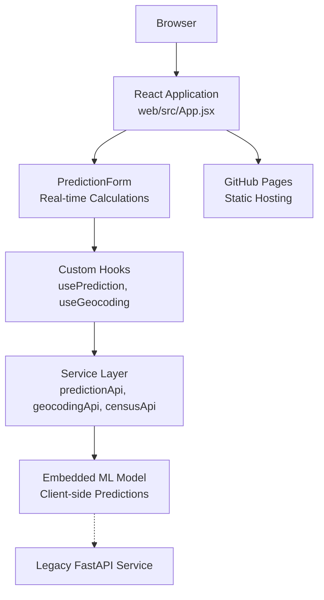
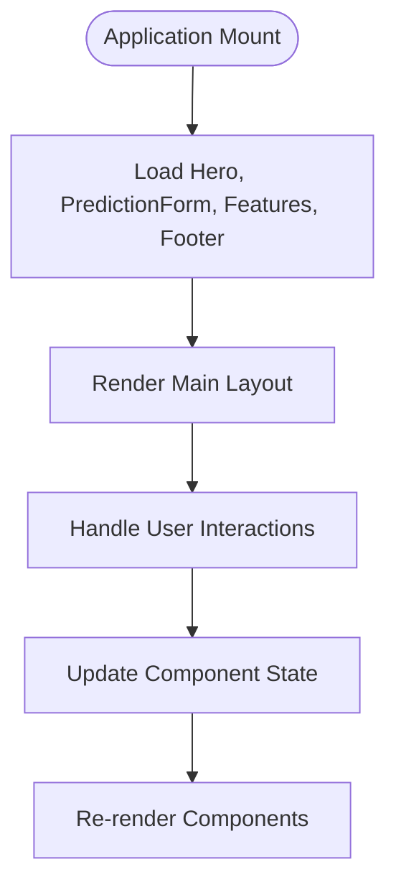
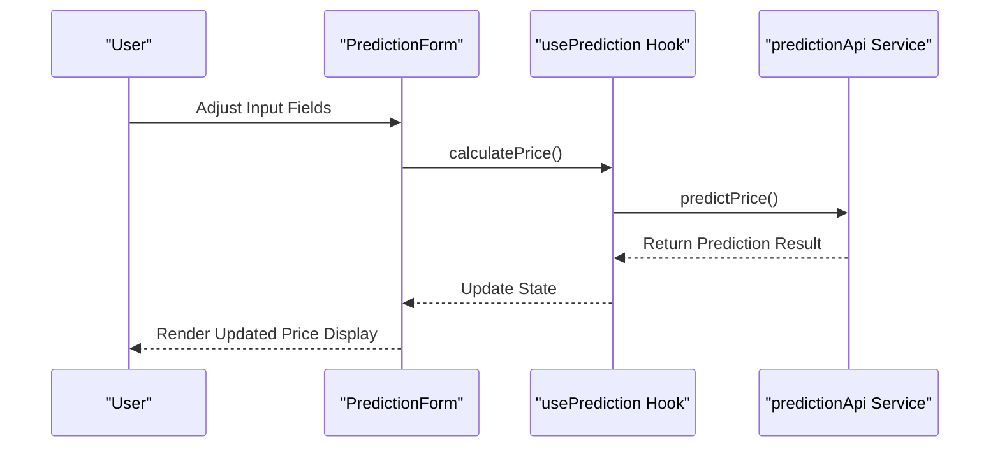
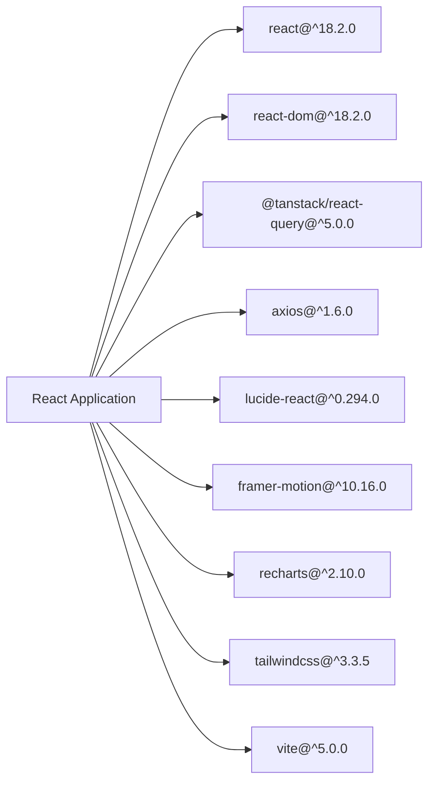

# Web Application

<cite>
**Referenced Files in This Document**
- [App.jsx](file://web/src/App.jsx)
- [main.jsx](file://web/src/main.jsx)
- [PredictionForm.jsx](file://web/src/components/PredictionForm.jsx)
- [usePrediction.js](file://web/src/hooks/usePrediction.js)
- [predictionApi.js](file://web/src/services/predictionApi.js)
- [AddressAutocomplete.jsx](file://web/src/components/AddressAutocomplete.jsx)
- [CensusDataCard.jsx](file://web/src/components/CensusDataCard.jsx)
- [PriceDisplay.jsx](file://web/src/components/PriceDisplay.jsx)
- [Hero.jsx](file://web/src/components/Hero.jsx)
- [Footer.jsx](file://web/src/components/Footer.jsx)
- [LoadingSpinner.jsx](file://web/src/components/LoadingSpinner.jsx)
- [package.json](file://web/package.json)
- [tailwind.config.js](file://web/tailwind.config.js)
- [vite.config.js](file://web/vite.config.js)
- [pages.yml](file://.github/workflows/pages.yml)
- [app.py](file://app/app.py)
- [main.py](file://api/main.py)
- [requirements.txt](file://app/requirements.txt)
- [requirements.txt](file://api/requirements.txt)
- [Dockerfile](file://Dockerfile)
- [docker-compose.yml](file://docker-compose.yml)
- [README.md](file://README.md)
- [requirements.txt](file://requirements.txt)
- [architecture.md](file://docs/architecture.md)
- [models.py](file://src/models.py)
</cite>

## Update Summary
**Changes Made**
- Complete replacement of Streamlit-based web application with modern React + Vite + TailwindCSS implementation
- Client-side machine learning implementation with embedded model data
- Real-time data integration with Census API and geocoding services
- GitHub Pages deployment workflow for static hosting
- Comprehensive component architecture with React hooks and custom services
- Modern UI design with glass-morphism effects and animations

## Table of Contents
1. [Introduction](#introduction)
2. [Project Structure](#project-structure)
3. [Core Components](#core-components)
4. [Architecture Overview](#architecture-overview)
5. [Detailed Component Analysis](#detailed-component-analysis)
6. [Dependency Analysis](#dependency-analysis)
7. [Performance Considerations](#performance-considerations)
8. [Troubleshooting Guide](#troubleshooting-guide)
9. [Conclusion](#conclusion)
10. [Appendices](#appendices)

## Introduction
This document focuses on the modern React-based interactive web application that powers real-time property price predictions for California. The application features a complete rewrite from the previous Streamlit implementation, now utilizing React + Vite + TailwindCSS for enhanced performance, modern UI design, and client-side machine learning capabilities. It provides real-time property price predictions with integrated Census data, geographic visualization, and comprehensive educational insights.

## Project Structure
The web application is implemented as a modern React application with Vite build tooling and TailwindCSS for styling. The application features client-side machine learning with embedded model data, real-time data integration, and GitHub Pages deployment. The architecture supports both the React web interface and maintains backward compatibility with the existing FastAPI service.

```mermaid
graph TB
subgraph "Modern React Web App"
ReactApp["web/src/App.jsx<br/>Main Application Component"]
MainJS["web/src/main.jsx<br/>React Root + QueryClient"]
Components["web/src/components/<br/>UI Components"]
Hooks["web/src/hooks/<br/>Custom React Hooks"]
Services["web/src/services/<br/>API Services"]
Utils["web/src/utils/<br/>Utility Functions"]
Tailwind["web/tailwind.config.js<br/>Styling Configuration"]
Vite["web/vite.config.js<br/>Build Configuration"]
End
subgraph "GitHub Pages Deployment"
PagesWorkflow[".github/workflows/pages.yml<br/>CI/CD Pipeline"]
End
subgraph "Legacy API (Backward Compatibility)"
APIApp["api/main.py<br/>FastAPI Service"]
End
subgraph "Client-Side ML Model"
EmbeddedModel["web/src/services/predictionApi.js<br/>Embedded Model Data"]
End
ReactApp --> Components
MainJS --> ReactApp
Components --> Hooks
Components --> Services
Services --> EmbeddedModel
Tailwind --> Components
Vite --> ReactApp
PagesWorkflow --> Vite
APIApp -.-> EmbeddedModel
```

**Diagram sources**
- [App.jsx:1-18](file://web/src/App.jsx#L1-L18)
- [main.jsx:1-23](file://web/src/main.jsx#L1-L23)
- [predictionApi.js:1-119](file://web/src/services/predictionApi.js#L1-L119)
- [pages.yml:1-51](file://.github/workflows/pages.yml#L1-L51)

**Section sources**
- [README.md:88-139](file://README.md#L88-L139)
- [App.jsx:1-18](file://web/src/App.jsx#L1-L18)
- [main.jsx:1-23](file://web/src/main.jsx#L1-L23)
- [predictionApi.js:1-119](file://web/src/services/predictionApi.js#L1-L119)
- [pages.yml:1-51](file://.github/workflows/pages.yml#L1-L51)

## Core Components
The modern React application consists of several key components working together to provide a seamless user experience:

- **App Container** orchestrating the main application layout with Hero, PredictionForm, Features, and Footer components
- **PredictionForm** managing user inputs, real-time calculations, and price display
- **Custom Hooks** providing reusable logic for predictions, geocoding, and Census data fetching
- **Service Layer** handling API integrations for geocoding, Census data, and price calculations
- **Component Library** featuring specialized UI components for address autocomplete, price display, and data cards
- **State Management** powered by React Query for caching, optimistic updates, and error handling
- **Client-Side ML** with embedded model data for instant predictions without server requests

Key implementation highlights:
- Real-time prediction calculations with debounced updates
- Interactive sliders and number inputs with visual feedback
- Glass-morphism UI design with TailwindCSS utilities
- Responsive layout supporting desktop and mobile experiences
- Animated transitions using Framer Motion
- Comprehensive error handling and loading states
- Integration with external APIs for geocoding and Census data

**Section sources**
- [App.jsx:1-18](file://web/src/App.jsx#L1-L18)
- [main.jsx:1-23](file://web/src/main.jsx#L1-L23)
- [PredictionForm.jsx:1-274](file://web/src/components/PredictionForm.jsx#L1-L274)
- [usePrediction.js:1-36](file://web/src/hooks/usePrediction.js#L1-L36)
- [predictionApi.js:1-119](file://web/src/services/predictionApi.js#L1-L119)

## Architecture Overview
The modern React application follows a client-centric architecture with embedded machine learning capabilities. The application maintains backward compatibility with the existing FastAPI service while providing enhanced user experience through modern web technologies.



**Diagram sources**
- [App.jsx:1-18](file://web/src/App.jsx#L1-L18)
- [PredictionForm.jsx:1-274](file://web/src/components/PredictionForm.jsx#L1-L274)
- [usePrediction.js:1-36](file://web/src/hooks/usePrediction.js#L1-L36)
- [predictionApi.js:1-119](file://web/src/services/predictionApi.js#L1-L119)
- [pages.yml:1-51](file://.github/workflows/pages.yml#L1-L51)

**Section sources**
- [architecture.md:62-136](file://docs/architecture.md#L62-L136)
- [README.md:195-247](file://README.md#L195-L247)

## Detailed Component Analysis

### React Application Container (App.jsx)
The main application component serves as the container for all UI components, orchestrating the overall layout and navigation flow.



**Diagram sources**
- [App.jsx:6-15](file://web/src/App.jsx#L6-L15)

**Section sources**
- [App.jsx:1-18](file://web/src/App.jsx#L1-L18)

### Prediction Form Component (PredictionForm.jsx)
The PredictionForm component manages all user inputs, real-time calculations, and price display functionality. It features sophisticated input controls with visual feedback and comprehensive property detail management.

Key features:
- Real-time prediction calculations with debounced updates
- Interactive sliders with visual value displays
- Number inputs with validation and help text
- Ocean proximity selection with multiplier indicators
- Address autocomplete with geocoding integration
- Comprehensive property detail inputs
- Live price display with confidence intervals

**Section sources**
- [PredictionForm.jsx:17-274](file://web/src/components/PredictionForm.jsx#L17-L274)

### Custom Hooks Architecture
The application utilizes custom React hooks for managing complex state and side effects:

- **usePrediction**: Handles prediction calculations with loading states and result caching
- **useGeocoding**: Manages address-to-coordinate conversion with debounced search
- **useCensusData**: Fetches and caches demographic data for location context



**Diagram sources**
- [usePrediction.js:8-22](file://web/src/hooks/usePrediction.js#L8-L22)
- [predictionApi.js:45-111](file://web/src/services/predictionApi.js#L45-L111)

**Section sources**
- [usePrediction.js:1-36](file://web/src/hooks/usePrediction.js#L1-L36)

### Client-Side Machine Learning Implementation
The application features embedded machine learning capabilities with model data directly included in the client bundle:

- **Embedded Model Data**: Complete model weights, feature means, and ocean multipliers
- **Real-time Calculations**: Instant price predictions without server requests
- **Feature Engineering**: Client-side calculation of derived features
- **Confidence Intervals**: Built-in prediction range estimation
- **Validation Logic**: Input validation and boundary checking

**Section sources**
- [predictionApi.js:1-119](file://web/src/services/predictionApi.js#L1-L119)

### Service Layer Architecture
The service layer provides abstraction for external API integrations:

- **predictionApi.js**: Client-side prediction service with embedded model
- **geocodingApi.js**: Address-to-coordinate conversion service
- **censusApi.js**: Demographic data retrieval service

**Section sources**
- [predictionApi.js:1-119](file://web/src/services/predictionApi.js#L1-L119)

### UI Component Library
The application includes a comprehensive set of specialized UI components:

- **AddressAutocomplete**: Intelligent address search with suggestions
- **CensusDataCard**: Display of demographic statistics for location
- **PriceDisplay**: Animated price presentation with confidence indicators
- **LoadingSpinner**: Visual feedback during calculations
- **Hero**: Main landing component with project introduction
- **Footer**: Standard footer component

**Section sources**
- [AddressAutocomplete.jsx](file://web/src/components/AddressAutocomplete.jsx)
- [CensusDataCard.jsx](file://web/src/components/CensusDataCard.jsx)
- [PriceDisplay.jsx](file://web/src/components/PriceDisplay.jsx)
- [LoadingSpinner.jsx](file://web/src/components/LoadingSpinner.jsx)
- [Hero.jsx](file://web/src/components/Hero.jsx)
- [Footer.jsx](file://web/src/components/Footer.jsx)

## Dependency Analysis
The modern React application relies on a carefully curated set of dependencies optimized for performance and functionality:

**Production Dependencies:**
- **React 18.2.0**: Core framework for building user interfaces
- **React DOM 18.2.0**: React renderer for web platforms
- **@tanstack/react-query 5.0.0**: Advanced state management and caching
- **Axios 1.6.0**: HTTP client for API requests
- **Lucide React 0.294.0**: SVG icon library
- **Framer Motion 10.16.0**: Animation library for smooth transitions
- **Recharts 2.10.0**: Charting library for data visualization

**Development Dependencies:**
- **@vitejs/plugin-react 4.2.0**: Vite plugin for React development
- **TailwindCSS 3.3.5**: Utility-first CSS framework
- **PostCSS 8.4.31**: CSS post-processor
- **Autoprefixer 10.4.16**: Automatic vendor prefixing
- **Vite 5.0.0**: Next-generation frontend build tool



**Diagram sources**
- [package.json:11-29](file://web/package.json#L11-L29)

**Section sources**
- [package.json:1-30](file://web/package.json#L1-L30)

## Performance Considerations
The modern React application implements several performance optimizations:

- **Client-Side Caching**: React Query manages intelligent caching with 5-minute stale time
- **Debounced Updates**: Input changes are debounced to prevent excessive calculations
- **Lazy Loading**: Components are loaded on-demand for optimal performance
- **Optimized Rendering**: Memoized components and efficient state updates
- **Bundle Optimization**: Vite provides efficient bundling and tree-shaking
- **Embedded Model**: Client-side ML eliminates network latency for predictions
- **Responsive Design**: Mobile-first approach with adaptive layouts

**Section sources**
- [main.jsx:7-14](file://web/src/main.jsx#L7-L14)
- [PredictionForm.jsx:32-53](file://web/src/components/PredictionForm.jsx#L32-L53)

## Troubleshooting Guide
Common issues and resolutions for the modern React application:

- **Model Loading Issues**: Ensure embedded model data is properly included in build
- **API Integration Problems**: Verify external API keys and network connectivity
- **Build Errors**: Check Vite configuration and dependency versions
- **Performance Issues**: Monitor React Query cache and optimize component rendering
- **Styling Problems**: Verify TailwindCSS configuration and utility classes
- **Deployment Failures**: Check GitHub Pages workflow permissions and build artifacts

**Section sources**
- [pages.yml:16-51](file://.github/workflows/pages.yml#L16-L51)
- [vite.config.js:4-11](file://web/vite.config.js#L4-L11)

## Conclusion
The modern React-based web application delivers a superior user experience compared to the previous Streamlit implementation. With client-side machine learning, real-time data integration, and modern UI design, the application provides instant price predictions with comprehensive demographic insights. The GitHub Pages deployment ensures easy distribution while maintaining backward compatibility with the existing FastAPI service for programmatic access.

## Appendices

### User Interaction Examples
- Example 1: Adjust sliders for property details; observe real-time price updates with animated transitions
- Example 2: Use address autocomplete to quickly select locations with geocoding integration
- Example 3: Explore different ocean proximity options to see multiplier effects on pricing
- Example 4: View Census data cards for demographic context around selected locations

Expected responses:
- Price updates animate smoothly with confidence interval indicators
- Address autocomplete provides suggestions as you type
- Census data loads dynamically for selected locations
- Responsive design adapts to mobile and desktop screen sizes

**Section sources**
- [PredictionForm.jsx:17-274](file://web/src/components/PredictionForm.jsx#L17-L274)
- [usePrediction.js:8-22](file://web/src/hooks/usePrediction.js#L8-L22)

### Accessibility and Responsive Design
- **Accessibility Features**:
  - Semantic HTML structure with proper ARIA attributes
  - Keyboard navigation support for all interactive elements
  - Screen reader friendly labels and descriptions
  - High contrast color schemes for visual accessibility
- **Responsive Design**:
  - Mobile-first approach with adaptive grid layouts
  - Flexible component sizing for different screen dimensions
  - Touch-friendly input controls and interactive elements
  - Performance optimization for mobile devices

**Section sources**
- [tailwind.config.js:8-54](file://web/tailwind.config.js#L8-L54)
- [PredictionForm.jsx:97-273](file://web/src/components/PredictionForm.jsx#L97-L273)

### Browser Compatibility
- **Modern Browsers**: Full support for Chrome, Firefox, Safari, and Edge
- **JavaScript Requirements**: ES6+ features with polyfills for older browsers
- **Progressive Enhancement**: Graceful degradation for limited browser capabilities
- **Mobile Support**: Comprehensive touch interaction support

**Section sources**
- [package.json:11-29](file://web/package.json#L11-L29)

### Deployment and Operations
- **GitHub Pages Deployment**:
  - Automated CI/CD pipeline for continuous deployment
  - Static site hosting with CDN acceleration
  - Custom domain support with GitHub Pages
- **Local Development**:
  - Vite dev server with hot module replacement
  - Development tools for debugging and profiling
  - Environment variable configuration
- **Production Optimization**:
  - Minified bundles for optimal performance
  - Asset optimization and compression
  - Cache headers for improved loading times

**Section sources**
- [pages.yml:1-51](file://.github/workflows/pages.yml#L1-L51)
- [vite.config.js:4-11](file://web/vite.config.js#L4-L11)

### Backward Compatibility
The modern React application maintains compatibility with the existing FastAPI service:

- **Shared Model Logic**: Client-side predictions mirror server-side calculations
- **Consistent Feature Engineering**: Derived features computed identically
- **API Endpoint Compatibility**: Legacy endpoints remain functional
- **Data Format Parity**: Response formats maintained for existing integrations

**Section sources**
- [main.py:155-179](file://api/main.py#L155-L179)
- [predictionApi.js:45-111](file://web/src/services/predictionApi.js#L45-L111)