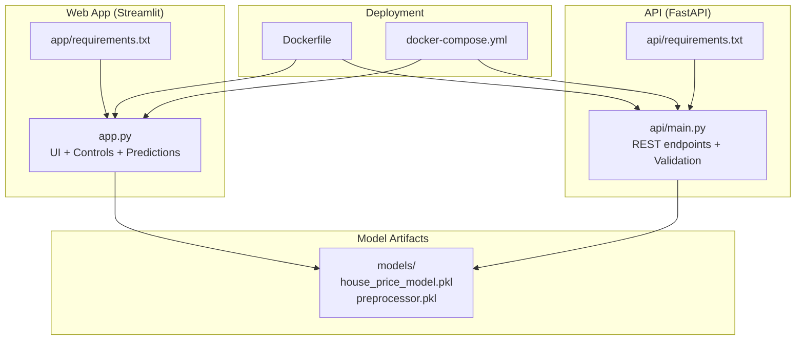
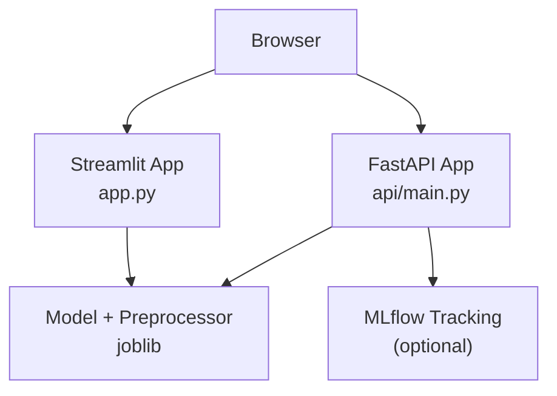
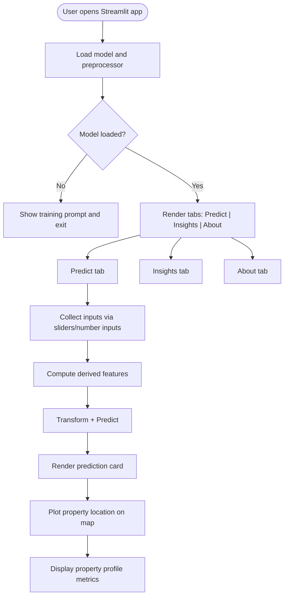
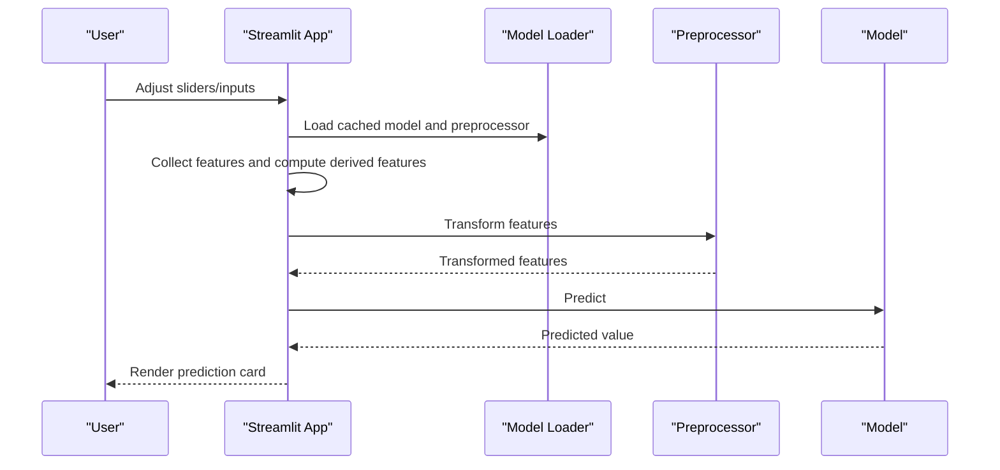
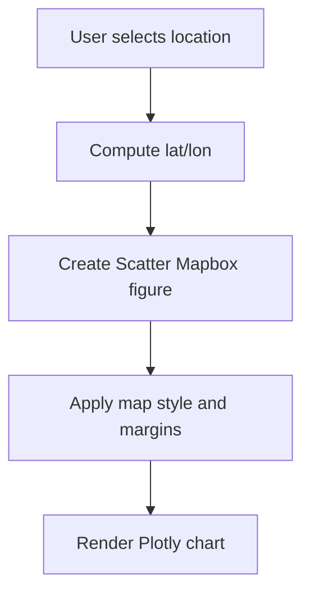
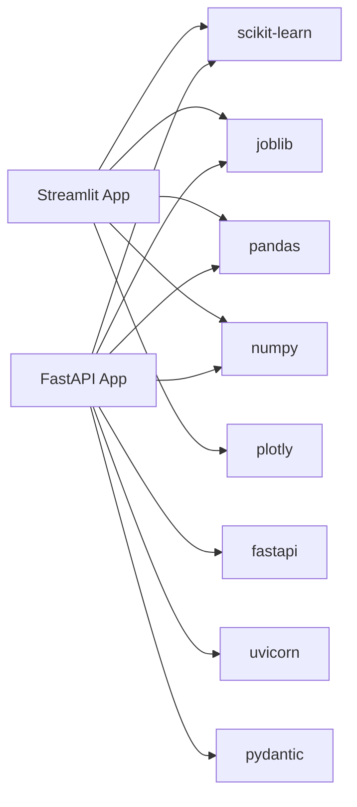

# Web Application

<cite>
**Referenced Files in This Document**
- [app.py](file://app/app.py)
- [requirements.txt](file://app/requirements.txt)
- [main.py](file://api/main.py)
- [requirements.txt](file://api/requirements.txt)
- [Dockerfile](file://Dockerfile)
- [docker-compose.yml](file://docker-compose.yml)
- [README.md](file://README.md)
- [requirements.txt](file://requirements.txt)
- [architecture.md](file://docs/architecture.md)
- [models.py](file://src/models.py)
</cite>

## Table of Contents
1. [Introduction](#introduction)
2. [Project Structure](#project-structure)
3. [Core Components](#core-components)
4. [Architecture Overview](#architecture-overview)
5. [Detailed Component Analysis](#detailed-component-analysis)
6. [Dependency Analysis](#dependency-analysis)
7. [Performance Considerations](#performance-considerations)
8. [Troubleshooting Guide](#troubleshooting-guide)
9. [Conclusion](#conclusion)
10. [Appendices](#appendices)

## Introduction
This document focuses on the Streamlit-based interactive web application that powers real-time property price predictions for California. It explains the application architecture, user interface design, interactive controls, real-time predictions, geographic visualization, and educational insights. It also covers input validation, prediction processing, response formatting, deployment considerations, performance optimization, customization options, accessibility and responsive design, and browser compatibility.

## Project Structure
The web application is implemented as a Streamlit app that loads a trained model and preprocessor, collects user inputs, computes derived features, and renders predictions with contextual visualizations. The app is complemented by a FastAPI service for programmatic access and a Docker-based deployment stack supporting both the API and the Streamlit app.

**Diagram sources**
- [app.py:1-399](file://app/app.py#L1-L399)
- [main.py:1-403](file://api/main.py#L1-L403)
- [Dockerfile:1-86](file://Dockerfile#L1-L86)
- [docker-compose.yml:1-109](file://docker-compose.yml#L1-L109)

**Section sources**
- [README.md:88-139](file://README.md#L88-L139)
- [app.py:1-399](file://app/app.py#L1-L399)
- [main.py:1-403](file://api/main.py#L1-L403)
- [Dockerfile:1-86](file://Dockerfile#L1-L86)
- [docker-compose.yml:1-109](file://docker-compose.yml#L1-L109)

## Core Components
- Streamlit application orchestrating UI, input collection, prediction, and visualization.
- Model loader caching resources for efficient reuse.
- Feature engineering pipeline mirroring notebook-driven transformations.
- Plotly-based map visualization and bar charts for insights.
- Tabbed interface for Predict, Insights, and About sections.

Key implementation highlights:
- Interactive sliders and number inputs for property features.
- Real-time prediction rendering with formatted currency display.
- Geographic map centered on the selected coordinates.
- Property profile metrics cards for derived features.
- Educational insights and tips in the Insights tab.
- About tab with model performance summary and technology stack.

**Section sources**
- [app.py:19-69](file://app/app.py#L19-L69)
- [app.py:72-82](file://app/app.py#L72-L82)
- [app.py:84-194](file://app/app.py#L84-L194)
- [app.py:197-202](file://app/app.py#L197-L202)
- [app.py:205-217](file://app/app.py#L205-L217)
- [app.py:220-394](file://app/app.py#L220-L394)

## Architecture Overview
The Streamlit app and FastAPI service share the same model artifacts and feature engineering logic. The app provides an interactive UI for manual exploration, while the API enables programmatic access and batch processing.

**Diagram sources**
- [app.py:220-232](file://app/app.py#L220-L232)
- [main.py:126-180](file://api/main.py#L126-L180)
- [docker-compose.yml:62-78](file://docker-compose.yml#L62-L78)

**Section sources**
- [architecture.md:62-136](file://docs/architecture.md#L62-L136)
- [README.md:195-247](file://README.md#L195-L247)

## Detailed Component Analysis

### Streamlit Application (app.py)
The Streamlit app defines:
- Page configuration with wide layout and expanded sidebar.
- Custom CSS for header, prediction card, info boxes, and metric cards.
- Resource caching for model and preprocessor loading.
- Input feature creation with:
  - Location: longitude, latitude, ocean proximity.
  - Property details: housing median age, total rooms, total bedrooms.
  - Population: population, households.
  - Income: median income.
- Derived features computed client-side for display and prediction.
- Prediction pipeline transforming features and invoking the model.
- Map visualization using Plotly Express Scatter Mapbox.
- Property profile metrics rendered as Streamlit metrics.
- Tabs for Predict, Insights, and About.

**Diagram sources**
- [app.py:72-82](file://app/app.py#L72-L82)
- [app.py:84-194](file://app/app.py#L84-L194)
- [app.py:197-202](file://app/app.py#L197-L202)
- [app.py:205-217](file://app/app.py#L205-L217)
- [app.py:220-394](file://app/app.py#L220-L394)

**Section sources**
- [app.py:19-69](file://app/app.py#L19-L69)
- [app.py:72-82](file://app/app.py#L72-L82)
- [app.py:84-194](file://app/app.py#L84-L194)
- [app.py:197-202](file://app/app.py#L197-L202)
- [app.py:205-217](file://app/app.py#L205-L217)
- [app.py:220-394](file://app/app.py#L220-L394)

### Interactive Controls and Inputs
- Sliders for continuous features with defined min/max/value/step and help text.
- Number inputs for counts with min/max/value/step and help text.
- Select box for categorical ocean proximity with fixed categories.
- Derived features computed from raw inputs:
  - Rooms per household
  - Bedrooms per room
  - Population per household
  - Distance to San Francisco
  - Distance to Los Angeles
  - Income per room

These controls enable real-time updates and immediate feedback during interaction.

**Section sources**
- [app.py:84-194](file://app/app.py#L84-L194)

### Real-Time Prediction Processing
- Input DataFrame creation from collected features.
- Preprocessor transformation applied to match training pipeline.
- Model prediction invoked and returned as a scalar value.
- Prediction formatted and displayed prominently with contextual descriptor.

**Diagram sources**
- [app.py:72-82](file://app/app.py#L72-L82)
- [app.py:197-202](file://app/app.py#L197-L202)

**Section sources**
- [app.py:72-82](file://app/app.py#L72-L82)
- [app.py:197-202](file://app/app.py#L197-L202)

### Geographic Visualization
- Map visualization centered on the selected latitude/longitude.
- Uses Plotly Express Scatter Mapbox with OpenStreetMap style.
- Responsive chart sizing to fit container width.

**Diagram sources**
- [app.py:205-217](file://app/app.py#L205-L217)

**Section sources**
- [app.py:205-217](file://app/app.py#L205-L217)

### Property Profile Metrics Display
- Four metric cards showing derived features:
  - Rooms per Household
  - Bedroom Ratio
  - Population per Household
  - Income per Room
- Each metric is computed from the input features and displayed with appropriate units/formatting.

**Section sources**
- [app.py:266-277](file://app/app.py#L266-L277)

### Educational Insights and Tips
- Insights tab presents:
  - Key drivers of California house prices.
  - Average price ranges by ocean proximity.
  - Bar chart visualization of typical values.
  - Practical tips for accurate predictions.
- About tab summarizes:
  - Project overview and ML pipeline.
  - Technologies used.
  - Model performance metrics.
  - Important note about 1990 data and inflation adjustments.

**Section sources**
- [app.py:278-341](file://app/app.py#L278-L341)
- [app.py:342-385](file://app/app.py#L342-L385)

### API Integration Considerations
While the Streamlit app loads and uses the model locally, the FastAPI service provides:
- Strict input validation via Pydantic models.
- Health checks and model info endpoints.
- Single and batch prediction endpoints.
- Consistent derived feature computation and response formatting.

This ensures parity between UI and API behavior for derived features and validation rules.

**Section sources**
- [main.py:31-101](file://api/main.py#L31-L101)
- [main.py:126-180](file://api/main.py#L126-L180)
- [main.py:248-287](file://api/main.py#L248-L287)
- [main.py:290-383](file://api/main.py#L290-L383)

## Dependency Analysis
- Streamlit app depends on:
  - Streamlit for UI and interactivity.
  - Plotly for interactive maps and charts.
  - Pandas and NumPy for data handling.
  - Scikit-learn and joblib for model loading and preprocessing.
- FastAPI app depends on:
  - FastAPI and Uvicorn for the REST API.
  - Pydantic for request/response validation.
  - Same ML libraries for model inference.
- Shared model artifacts:
  - house_price_model.pkl
  - preprocessor.pkl

**Diagram sources**
- [app.py:10-17](file://app/app.py#L10-L17)
- [app/requirements.txt:1-7](file://app/requirements.txt#L1-L7)
- [main.py:16-21](file://api/main.py#L16-L21)
- [api/requirements.txt:1-9](file://api/requirements.txt#L1-L9)

**Section sources**
- [app/requirements.txt:1-7](file://app/requirements.txt#L1-L7)
- [api/requirements.txt:1-9](file://api/requirements.txt#L1-L9)
- [requirements.txt:1-36](file://requirements.txt#L1-L36)

## Performance Considerations
- Resource caching:
  - Streamlit’s resource cache prevents reloading models on each interaction.
- Efficient transformations:
  - Preprocessor transforms a single-row DataFrame to avoid overhead.
- Lightweight UI:
  - Minimal DOM and chart rendering for responsiveness.
- Derived features:
  - Client-side computation reduces server load and latency.
- Recommendations:
  - Keep derived feature computations vectorized and minimal.
  - Consider caching transformed inputs when users adjust multiple sliders rapidly.
  - Use pagination or lazy rendering for large datasets if extended to batch views.

**Section sources**
- [app.py:72-82](file://app/app.py#L72-L82)
- [app.py:197-202](file://app/app.py#L197-L202)

## Troubleshooting Guide
Common issues and resolutions:
- Model files missing:
  - Symptom: Warning message indicating model files not found.
  - Resolution: Train the model using the notebook and save artifacts to models/.
- Invalid input ranges:
  - Symptom: Unexpected behavior or errors.
  - Resolution: Ensure inputs fall within defined min/max ranges; use provided step sizes.
- Map rendering issues:
  - Symptom: Blank or misaligned map.
  - Resolution: Verify latitude/longitude ranges and internet connectivity for map tiles.
- API unavailability:
  - Symptom: 503 errors or health check failures.
  - Resolution: Confirm model artifacts exist and API is running; check logs.

**Section sources**
- [app.py:79-81](file://app/app.py#L79-L81)
- [README.md:176-181](file://README.md#L176-L181)
- [main.py:248-260](file://api/main.py#L248-L260)

## Conclusion
The Streamlit web application delivers an intuitive, real-time interface for California housing price predictions. It combines interactive controls, derived feature computation, map visualization, and educational insights to provide a comprehensive user experience. The shared model artifacts and consistent feature engineering ensure reliable predictions across both the UI and the FastAPI service. With Docker-based deployment and clear validation rules, the system is production-ready and easily maintainable.

## Appendices

### User Interaction Examples
- Example 1: Adjust sliders for longitude, latitude, median income, and rooms per household; observe real-time prediction and map movement.
- Example 2: Change ocean proximity to “NEAR OCEAN” and observe the prediction shift upward.
- Example 3: Increase total rooms while keeping bedrooms constant to raise rooms per household and influence the prediction.

Expected responses:
- Prediction card updates immediately after changing any slider.
- Map marker repositions to reflect new coordinates.
- Property profile metrics update to reflect derived feature recalculations.

**Section sources**
- [app.py:84-194](file://app/app.py#L84-L194)
- [app.py:205-217](file://app/app.py#L205-L217)
- [app.py:266-277](file://app/app.py#L266-L277)

### Accessibility and Responsive Design
- Accessibility:
  - Use of semantic HTML and readable typography.
  - Clear labels and help text for controls.
  - Color contrast maintained for prediction cards and info boxes.
- Responsive design:
  - Wide page layout and columnar metric cards adapt to screen size.
  - Plotly charts resize to container width.
  - Tabs organize content for mobile and desktop.

**Section sources**
- [app.py:19-69](file://app/app.py#L19-L69)
- [app.py:266-277](file://app/app.py#L266-L277)

### Browser Compatibility
- Streamlit and Plotly are compatible with modern browsers.
- Ensure JavaScript is enabled for interactive charts and real-time updates.

**Section sources**
- [README.md:212-227](file://README.md#L212-L227)

### Deployment and Operations
- Local:
  - Run Streamlit app and FastAPI server separately or use Docker Compose for orchestrated deployment.
- Docker:
  - Multi-stage build installs all dependencies and exposes ports for API and Streamlit.
  - Health checks monitor API availability.
- Kubernetes:
  - Recommended for scalable production deployments with horizontal pod autoscaling and persistent storage for artifacts.

**Section sources**
- [README.md:182-191](file://README.md#L182-L191)
- [Dockerfile:1-86](file://Dockerfile#L1-L86)
- [docker-compose.yml:1-109](file://docker-compose.yml#L1-L109)
- [architecture.md:138-169](file://docs/architecture.md#L138-L169)

### Model and Feature Engineering Parity
- Both Streamlit and API compute identical derived features:
  - Rooms per household
  - Bedrooms per room
  - Population per household
  - Distance to major cities
  - Income per room
- This ensures consistent predictions across UI and API.

**Section sources**
- [app.py:170-177](file://app/app.py#L170-L177)
- [main.py:160-172](file://api/main.py#L160-L172)
- [models.py:1-366](file://src/models.py#L1-L366)