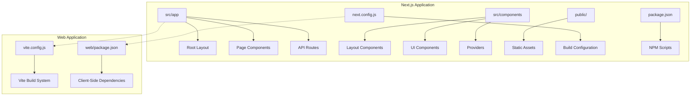
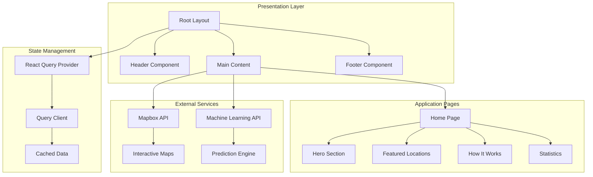
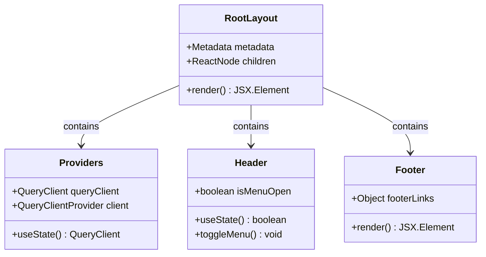
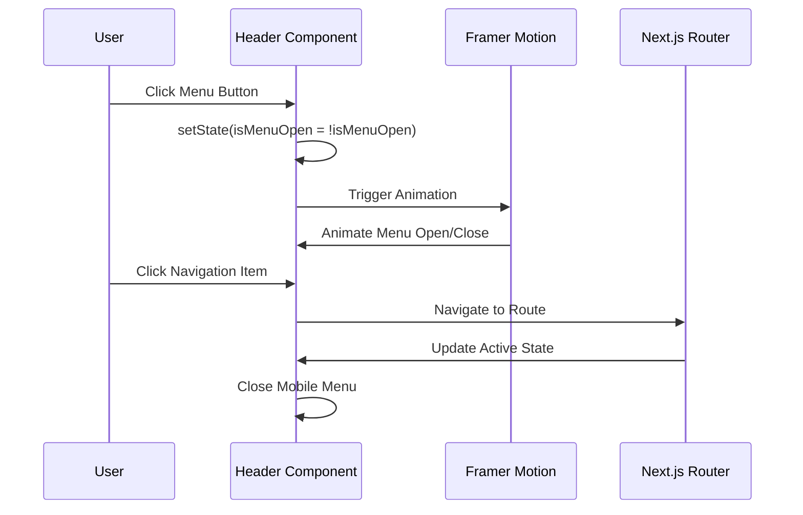

# Next.js Project Structure

<cite>
**Referenced Files in This Document**
- [package.json](file://global-housing-predictor/package.json)
- [next.config.js](file://global-housing-predictor/next.config.js)
- [layout.tsx](file://global-housing-predictor/src/app/layout.tsx)
- [page.tsx](file://global-housing-predictor/src/app/page.tsx)
- [providers.tsx](file://global-housing-predictor/src/components/providers.tsx)
- [Header.tsx](file://global-housing-predictor/src/components/layout/Header.tsx)
- [Footer.tsx](file://global-housing-predictor/src/components/layout/Footer.tsx)
- [package.json](file://web/package.json)
</cite>

## Table of Contents
1. [Introduction](#introduction)
2. [Project Structure](#project-structure)
3. [Core Components](#core-components)
4. [Architecture Overview](#architecture-overview)
5. [Detailed Component Analysis](#detailed-component-analysis)
6. [Dependency Analysis](#dependency-analysis)
7. [Performance Considerations](#performance-considerations)
8. [Troubleshooting Guide](#troubleshooting-guide)
9. [Conclusion](#conclusion)

## Introduction
This document provides a comprehensive analysis of the Next.js project structure for the Global Housing Predictor application. The project follows Next.js App Router conventions with a modern React component architecture, TypeScript support, and integrated state management. The application is designed as a worldwide real estate price prediction platform with interactive mapping capabilities and responsive design.

## Project Structure
The project follows Next.js App Router conventions with a clear separation between server-side and client-side components. The structure emphasizes modularity and maintainability through organized component hierarchies.



**Diagram sources**
- [layout.tsx:1-42](file://global-housing-predictor/src/app/layout.tsx#L1-L42)
- [providers.tsx:1-25](file://global-housing-predictor/src/components/providers.tsx#L1-L25)
- [next.config.js:1-25](file://global-housing-predictor/next.config.js#L1-L25)

**Section sources**
- [layout.tsx:1-42](file://global-housing-predictor/src/app/layout.tsx#L1-L42)
- [page.tsx:1-16](file://global-housing-predictor/src/app/page.tsx#L1-L16)
- [package.json:1-44](file://global-housing-predictor/package.json#L1-L44)

## Core Components
The application's core architecture centers around several key components that work together to provide a seamless user experience.

### Application Layout System
The root layout establishes the foundational structure with metadata configuration and global styling. It integrates the provider system for state management and includes navigation components for site-wide accessibility.

### Provider Architecture
The provider system implements React Query for efficient data fetching and caching, with optimized default configurations for optimal performance in real-time applications.

### Navigation Components
The header component provides responsive navigation with mobile menu support, while the footer offers comprehensive site navigation and branding elements.

**Section sources**
- [layout.tsx:18-21](file://global-housing-predictor/src/app/layout.tsx#L18-L21)
- [providers.tsx:6-17](file://global-housing-predictor/src/components/providers.tsx#L6-L17)
- [Header.tsx:15-16](file://global-housing-predictor/src/components/layout/Header.tsx#L15-L16)
- [Footer.tsx:22-24](file://global-housing-predictor/src/components/layout/Footer.tsx#L22-L24)

## Architecture Overview
The application follows a layered architecture pattern with clear separation of concerns between presentation, data management, and infrastructure layers.



**Diagram sources**
- [layout.tsx:23-40](file://global-housing-predictor/src/app/layout.tsx#L23-L40)
- [providers.tsx:6-24](file://global-housing-predictor/src/components/providers.tsx#L6-L24)
- [page.tsx:6-14](file://global-housing-predictor/src/app/page.tsx#L6-L14)

## Detailed Component Analysis

### Root Layout Component
The root layout serves as the primary container for the entire application, establishing global styles, fonts, and the provider hierarchy. It implements hydration suppression for smooth client-server transitions and manages the overall application structure.



**Diagram sources**
- [layout.tsx:23-40](file://global-housing-predictor/src/app/layout.tsx#L23-L40)
- [providers.tsx:6-24](file://global-housing-predictor/src/components/providers.tsx#L6-L24)
- [Header.tsx:15-16](file://global-housing-predictor/src/components/layout/Header.tsx#L15-L16)
- [Footer.tsx:22-24](file://global-housing-predictor/src/components/layout/Footer.tsx#L22-L24)

### Navigation System
The navigation system provides both desktop and mobile-friendly interfaces with animated transitions and responsive design patterns.



**Diagram sources**
- [Header.tsx:56-65](file://global-housing-predictor/src/components/layout/Header.tsx#L56-L65)
- [Header.tsx:71-94](file://global-housing-predictor/src/components/layout/Header.tsx#L71-L94)

### State Management Architecture
The application implements a centralized state management solution using React Query with optimized caching strategies for real-time data applications.

**Section sources**
- [layout.tsx:28-39](file://global-housing-predictor/src/app/layout.tsx#L28-L39)
- [providers.tsx:6-17](file://global-housing-predictor/src/components/providers.tsx#L6-L17)
- [Header.tsx:15-98](file://global-housing-predictor/src/components/layout/Header.tsx#L15-L98)

## Dependency Analysis
The project utilizes a comprehensive set of dependencies optimized for modern React development with TypeScript support and advanced UI capabilities.

```mermaid
graph LR
subgraph "Core Dependencies"
A[Next.js 14.0.0] --> B[React 18.2.0]
A --> C[TypeScript Support]
end
subgraph "State Management"
D[@tanstack/react-query] --> E[5.0.0]
F[Zustand] --> G[4.4.0]
end
subgraph "UI Libraries"
H[Lucide React] --> I[Icons]
J[Framer Motion] --> K[Animations]
L[Recharts] --> M[Data Visualization]
end
subgraph "Styling"
N[Tailwind CSS] --> O[3.3.0]
P[Radix UI] --> Q[Components]
end
subgraph "Mapping"
R[Mapbox GL] --> S[Interactive Maps]
T[React Map GL] --> U[React Wrapper]
end
```

**Diagram sources**
- [package.json:11-30](file://global-housing-predictor/package.json#L11-L30)
- [package.json:31-42](file://global-housing-predictor/package.json#L31-L42)

**Section sources**
- [package.json:1-44](file://global-housing-predictor/package.json#L1-L44)
- [next.config.js:3-8](file://global-housing-predictor/next.config.js#L3-L8)

## Performance Considerations
The application implements several performance optimization strategies including:

- **Image Optimization**: Configured Mapbox image domains for efficient asset loading
- **Code Splitting**: Automatic route-based code splitting through Next.js App Router
- **Caching Strategy**: React Query with 60-second stale time for optimal data freshness
- **Font Optimization**: Variable font loading with Google Fonts for improved rendering
- **Bundle Optimization**: Tree-shaking and dead code elimination through modern build pipeline

## Troubleshooting Guide
Common issues and their solutions:

### Build Configuration Issues
- Verify Next.js configuration in next.config.js matches current version requirements
- Ensure TypeScript compilation settings are properly configured
- Check Tailwind CSS configuration for custom font variables

### Runtime Errors
- Confirm React Query provider is properly wrapping the application
- Verify Mapbox API keys and domain configurations
- Check browser console for hydration-related warnings

### Performance Issues
- Monitor React Query cache effectiveness
- Review component rendering performance
- Optimize image loading and lazy loading strategies

**Section sources**
- [next.config.js:1-25](file://global-housing-predictor/next.config.js#L1-L25)
- [providers.tsx:6-17](file://global-housing-predictor/src/components/providers.tsx#L6-L17)

## Conclusion
The Global Housing Predictor application demonstrates a well-structured Next.js architecture with modern React patterns and comprehensive state management. The modular component design, combined with optimized performance configurations and responsive UI patterns, creates a robust foundation for a worldwide real estate prediction platform. The integration of mapping technologies, data visualization libraries, and real-time data fetching capabilities positions the application for scalability and future feature expansion.