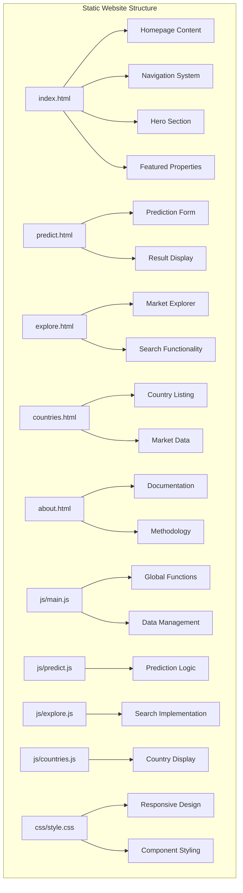
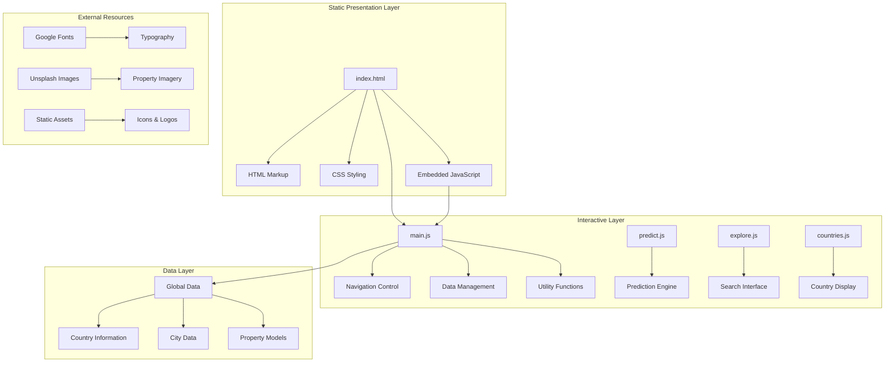
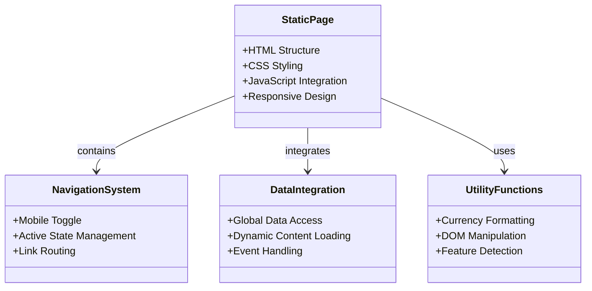
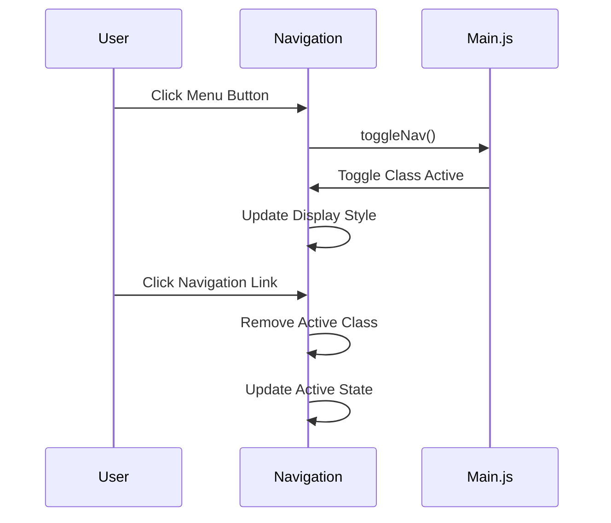
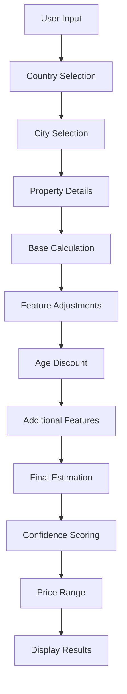
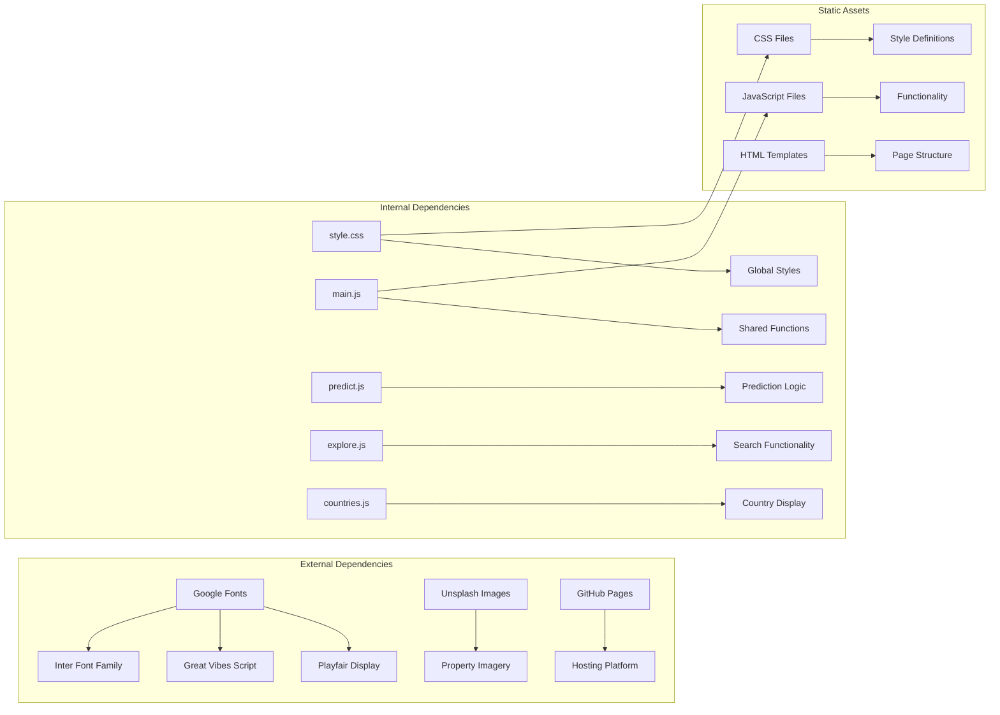

# Next.js Project Structure

<cite>
**Referenced Files in This Document**
- [index.html](file://global-housing-static/index.html)
- [style.css](file://global-housing-static/css/style.css)
- [main.js](file://global-housing-static/js/main.js)
- [predict.js](file://global-housing-static/js/predict.js)
- [explore.js](file://global-housing-static/js/explore.js)
- [countries.js](file://global-housing-static/js/countries.js)
- [predict.html](file://global-housing-static/predict.html)
- [explore.html](file://global-housing-static/explore.html)
- [countries.html](file://global-housing-static/countries.html)
- [about.html](file://global-housing-static/about.html)
</cite>

## Update Summary
**Changes Made**
- Complete architectural overhaul from Next.js React application to static HTML/CSS/JavaScript implementation
- Updated all component analysis to reflect vanilla JavaScript implementation
- Revised dependency analysis to show static asset dependencies
- Updated performance considerations for static file delivery
- Removed Next.js-specific configurations and routing patterns
- Added new sections covering static file architecture and vanilla JavaScript patterns

## Table of Contents
1. [Introduction](#introduction)
2. [Project Structure](#project-structure)
3. [Core Components](#core-components)
4. [Architecture Overview](#architecture-overview)
5. [Detailed Component Analysis](#detailed-component-analysis)
6. [Dependency Analysis](#dependency-analysis)
7. [Performance Considerations](#performance-considerations)
8. [Troubleshooting Guide](#troubleshooting-guide)
9. [Conclusion](#conclusion)

## Introduction
This document provides a comprehensive analysis of the static HTML/CSS/JavaScript implementation for the Global Housing Predictor application. The project has undergone a complete architectural transformation from a Next.js React application to a lightweight static website implementation. The application maintains its role as a worldwide real estate price prediction platform but now operates as a pure static site with embedded JavaScript functionality for interactive features.

**Updated** Architecture completely shifted from Next.js React project to static HTML/CSS/JavaScript implementation representing a fundamental architectural change rather than a simple update.

## Project Structure
The project follows a traditional static website structure with clear separation between HTML markup, CSS styling, and JavaScript functionality. The structure emphasizes simplicity and performance through minimal dependencies and direct file serving.

**Diagram sources**
- [index.html:10-285](file://global-housing-static/index.html#L10-L285)
- [predict.html:10-126](file://global-housing-static/predict.html#L10-L126)
- [explore.html:10-84](file://global-housing-static/explore.html#L10-L84)
- [countries.html:9-54](file://global-housing-static/countries.html#L9-L54)
- [style.css:1-734](file://global-housing-static/css/style.css#L1-L734)
- [main.js:1-210](file://global-housing-static/js/main.js#L1-L210)

**Section sources**
- [index.html:10-285](file://global-housing-static/index.html#L10-L285)
- [predict.html:10-126](file://global-housing-static/predict.html#L10-L126)
- [explore.html:10-84](file://global-housing-static/explore.html#L10-L84)
- [countries.html:9-54](file://global-housing-static/countries.html#L9-L54)
- [style.css:1-734](file://global-housing-static/css/style.css#L1-L734)

## Core Components
The application's core architecture centers around several key static components that work together to provide an interactive user experience without server-side processing.

### Static Page Framework
Each HTML page follows a consistent structure with shared navigation, responsive design, and embedded JavaScript functionality. The framework emphasizes performance through direct asset serving and minimal JavaScript overhead.

### Global JavaScript Architecture
The main JavaScript file (`main.js`) serves as the central hub for shared functionality including navigation toggling, data management, currency formatting, and DOM manipulation across all pages.

### Interactive Feature Modules
Individual JavaScript modules handle specific page functionality:
- Prediction module for property valuation calculations
- Exploration module for market searching and filtering
- Country listing module for geographic market overview
- Shared utilities for data formatting and display

**Section sources**
- [main.js:1-210](file://global-housing-static/js/main.js#L1-L210)
- [predict.js:1-166](file://global-housing-static/js/predict.js#L1-L166)
- [explore.js:1-107](file://global-housing-static/js/explore.js#L1-L107)
- [countries.js:1-25](file://global-housing-static/js/countries.js#L1-L25)

## Architecture Overview
The application follows a flat static architecture pattern with clear separation of concerns between presentation, interactivity, and data management layers.

**Diagram sources**
- [main.js:20-133](file://global-housing-static/js/main.js#L20-L133)
- [predict.js:4-45](file://global-housing-static/js/predict.js#L4-L45)
- [explore.js:3-18](file://global-housing-static/js/explore.js#L3-L18)
- [countries.js:3-24](file://global-housing-static/js/countries.js#L3-L24)

## Detailed Component Analysis

### Static Page Framework
Each HTML page implements a consistent structure with shared navigation, responsive design, and embedded JavaScript functionality. The framework emphasizes performance through direct asset serving and minimal HTTP requests.

**Diagram sources**
- [index.html:10-31](file://global-housing-static/index.html#L10-L31)
- [main.js:3-7](file://global-housing-static/js/main.js#L3-L7)
- [main.js:168-209](file://global-housing-static/js/main.js#L168-L209)

### Navigation System
The navigation system provides responsive mobile-friendly interfaces with smooth transitions and consistent styling across all pages.

**Diagram sources**
- [main.js:4-7](file://global-housing-static/js/main.js#L4-L7)
- [index.html:29](file://global-housing-static/index.html#L29)

### Prediction Engine Module
The prediction module implements sophisticated property valuation algorithms using global market data and local pricing multipliers.

**Diagram sources**
- [predict.js:90-157](file://global-housing-static/js/predict.js#L90-L157)
- [main.js:144-158](file://global-housing-static/js/main.js#L144-L158)

### Data Management Architecture
The application implements a centralized data management system using a global JavaScript object containing all market information and utility functions.

**Section sources**
- [main.js:20-133](file://global-housing-static/js/main.js#L20-L133)
- [predict.js:4-45](file://global-housing-static/js/predict.js#L4-L45)
- [explore.js:20-35](file://global-housing-static/js/explore.js#L20-L35)

## Dependency Analysis
The project utilizes a minimal set of external dependencies optimized for static hosting and performance.

**Diagram sources**
- [index.html:7-8](file://global-housing-static/index.html#L7-L8)
- [predict.html:7-8](file://global-housing-static/predict.html#L7-L8)
- [style.css:1-734](file://global-housing-static/css/style.css#L1-L734)
- [main.js:1-210](file://global-housing-static/js/main.js#L1-L210)

**Section sources**
- [index.html:7-8](file://global-housing-static/index.html#L7-L8)
- [predict.html:7-8](file://global-housing-static/predict.html#L7-L8)
- [style.css:1-734](file://global-housing-static/css/style.css#L1-L734)
- [main.js:1-210](file://global-housing-static/js/main.js#L1-L210)

## Performance Considerations
The application implements several performance optimization strategies for static hosting:

- **Static Asset Delivery**: All resources served as static files with minimal HTTP requests
- **Inline Critical CSS**: Essential styles included directly in HTML for faster rendering
- **Efficient JavaScript**: Modular approach with separate files for different functionalities
- **Image Optimization**: High-quality images from Unsplash with appropriate sizing
- **Minimal Dependencies**: Only essential external resources loaded
- **Responsive Design**: Mobile-first approach reduces bandwidth usage
- **Local Data Storage**: All market data stored locally eliminating API calls

**Updated** Performance optimizations now focus on static hosting benefits including reduced server complexity and faster CDN delivery.

## Troubleshooting Guide
Common issues and their solutions for the static implementation:

### File Structure Issues
- Verify all HTML files reference correct CSS and JavaScript paths
- Ensure static assets are properly deployed to hosting platform
- Check file permissions for executable scripts

### JavaScript Functionality Issues
- Confirm global data object loads before page-specific scripts
- Verify DOM elements exist before accessing them
- Check browser console for syntax errors in JavaScript files

### Styling Problems
- Ensure CSS file paths match actual deployment structure
- Verify Google Fonts load correctly in production environment
- Check responsive breakpoints for different screen sizes

### Static Hosting Issues
- Configure proper MIME types for HTML, CSS, and JavaScript files
- Set up appropriate caching headers for static assets
- Verify GitHub Pages or hosting platform supports SPA routing

**Section sources**
- [main.js:168-209](file://global-housing-static/js/main.js#L168-L209)
- [predict.js:47-88](file://global-housing-static/js/predict.js#L47-L88)
- [style.css:639-734](file://global-housing-static/css/style.css#L639-L734)

## Conclusion
The Global Housing Predictor application demonstrates an efficient static website architecture that successfully delivers interactive real estate functionality without server-side processing. The modular JavaScript implementation, combined with optimized static assets and responsive design, creates a scalable foundation for a worldwide real estate prediction platform. The simplified architecture reduces maintenance overhead while maintaining excellent user experience and performance characteristics suitable for global deployment.