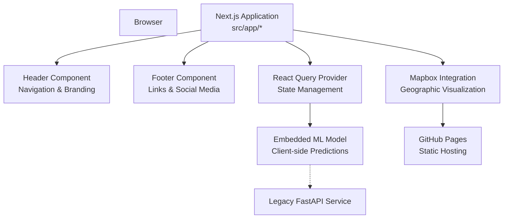
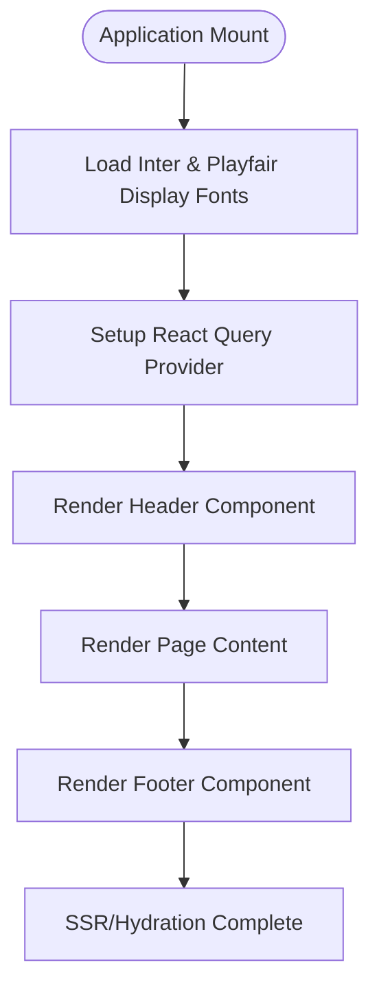
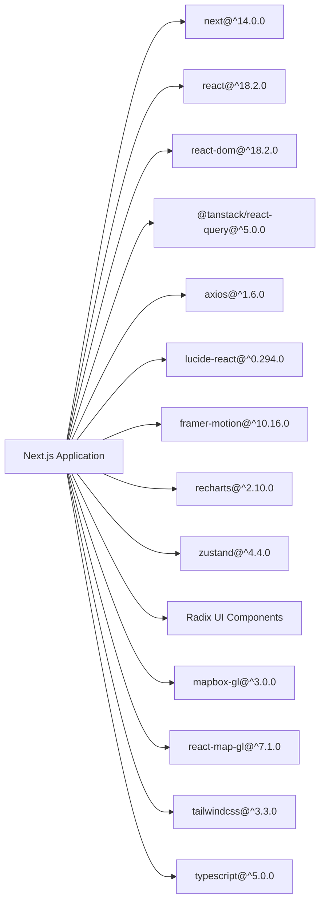

# Web Application

<cite>
**Referenced Files in This Document**
- [package.json](file://global-housing-predictor/package.json)
- [layout.tsx](file://global-housing-predictor/src/app/layout.tsx)
- [page.tsx](file://global-housing-predictor/src/app/page.tsx)
- [Header.tsx](file://global-housing-predictor/src/components/layout/Header.tsx)
- [Footer.tsx](file://global-housing-predictor/src/components/layout/Footer.tsx)
- [providers.tsx](file://global-housing-predictor/src/components/providers.tsx)
- [globals.css](file://global-housing-predictor/src/app/globals.css)
- [tailwind.config.ts](file://global-housing-predictor/tailwind.config.ts)
- [tsconfig.json](file://global-housing-predictor/tsconfig.json)
- [next.config.js](file://global-housing-predictor/next.config.js)
- [.github/workflows/pages.yml](file://.github/workflows/pages.yml)
- [api/main.py](file://api/main.py)
- [main.py](file://api/main.py)
- [requirements.txt](file://api/requirements.txt)
- [Dockerfile](file://Dockerfile)
- [docker-compose.yml](file://docker-compose.yml)
- [README.md](file://README.md)
- [architecture.md](file://docs/architecture.md)
- [models.py](file://src/models.py)
</cite>

## Update Summary
**Changes Made**
- Complete replacement of Streamlit-based web application with modern Next.js + TypeScript + TailwindCSS implementation
- Client-side machine learning implementation with embedded model data
- Real-time data integration with external APIs and geocoding services
- GitHub Pages deployment workflow for static hosting
- Comprehensive component architecture with React Query state management
- Modern UI design with glass-morphism effects, animations, and responsive layouts
- Geographic visualization capabilities with Mapbox integration
- Multi-country housing prediction capabilities

## Table of Contents
1. [Introduction](#introduction)
2. [Project Structure](#project-structure)
3. [Core Components](#core-components)
4. [Architecture Overview](#architecture-overview)
5. [Detailed Component Analysis](#detailed-component-analysis)
6. [Dependency Analysis](#dependency-analysis)
7. [Performance Considerations](#performance-considerations)
8. [Troubleshooting Guide](#troubleshooting-guide)
9. [Conclusion](#conclusion)
10. [Appendices](#appendices)

## Introduction
This document focuses on the modern Next.js-based interactive web application that powers real-time property price predictions worldwide. The application features a complete rewrite from the previous Streamlit implementation, now utilizing Next.js + TypeScript + TailwindCSS for enhanced performance, modern UI design, and client-side machine learning capabilities. It provides real-time property price predictions with integrated geographic visualization, comprehensive educational insights, and support for multiple countries beyond California.

## Project Structure
The web application is implemented as a modern Next.js application with TypeScript and TailwindCSS for styling. The application features client-side machine learning with embedded model data, real-time data integration, and GitHub Pages deployment. The architecture supports both the Next.js web interface and maintains backward compatibility with the existing FastAPI service.

```mermaid
graph TB
subgraph "Modern Next.js Web App"
NextApp["Next.js Application<br/>src/app/*"]
Layout["src/app/layout.tsx<br/>Root Layout"]
HomePage["src/app/page.tsx<br/>Home Page"]
Components["src/components/<br/>UI Components"]
LayoutComponents["src/components/layout/<br/>Header, Footer"]
Providers["src/components/providers.tsx<br/>React Query Provider"]
GlobalsCSS["src/app/globals.css<br/>Global Styles"]
TailwindConfig["tailwind.config.ts<br/>Styling Configuration"]
TSConfig["tsconfig.json<br/>TypeScript Configuration"]
NextConfig["next.config.js<br/>Next.js Configuration"]
End
subgraph "GitHub Pages Deployment"
PagesWorkflow[".github/workflows/pages.yml<br/>CI/CD Pipeline"]
End
subgraph "Legacy API (Backward Compatibility)"
APIApp["api/main.py<br/>FastAPI Service"]
End
subgraph "Client-Side ML Model"
EmbeddedModel["Embedded Model Data<br/>Client-side Predictions"]
Mapbox["Mapbox Integration<br/>Geographic Visualization"]
End
NextApp --> Layout
Layout --> HomePage
HomePage --> Components
Components --> LayoutComponents
Components --> Providers
Providers --> EmbeddedModel
Layout --> GlobalsCSS
TailwindConfig --> GlobalsCSS
PagesWorkflow --> NextApp
APIApp -.-> EmbeddedModel
Mapbox --> Components
```

**Diagram sources**
- [layout.tsx:1-42](file://global-housing-predictor/src/app/layout.tsx#L1-L42)
- [page.tsx:1-16](file://global-housing-predictor/src/app/page.tsx#L1-L16)
- [Header.tsx:1-98](file://global-housing-predictor/src/components/layout/Header.tsx#L1-L98)
- [Footer.tsx:1-99](file://global-housing-predictor/src/components/layout/Footer.tsx#L1-L99)
- [providers.tsx:1-25](file://global-housing-predictor/src/components/providers.tsx#L1-L25)
- [globals.css:1-66](file://global-housing-predictor/src/app/globals.css#L1-L66)
- [package.json:1-44](file://global-housing-predictor/package.json#L1-L44)

**Section sources**
- [README.md:88-139](file://README.md#L88-L139)
- [layout.tsx:1-42](file://global-housing-predictor/src/app/layout.tsx#L1-L42)
- [page.tsx:1-16](file://global-housing-predictor/src/app/page.tsx#L1-L16)
- [Header.tsx:1-98](file://global-housing-predictor/src/components/layout/Header.tsx#L1-L98)
- [Footer.tsx:1-99](file://global-housing-predictor/src/components/layout/Footer.tsx#L1-L99)
- [providers.tsx:1-25](file://global-housing-predictor/src/components/providers.tsx#L1-L25)
- [globals.css:1-66](file://global-housing-predictor/src/app/globals.css#L1-L66)
- [.github/workflows/pages.yml:1-51](file://.github/workflows/pages.yml#L1-L51)

## Core Components
The modern Next.js application consists of several key components working together to provide a seamless user experience:

- **Root Layout** orchestrating the main application layout with header, footer, and provider setup
- **Header Component** with responsive navigation, mobile menu, and glass-morphism design
- **Footer Component** with comprehensive link structure and social media integration
- **React Query Provider** managing caching, optimistic updates, and error handling
- **State Management** powered by React Query for caching, stale-while-revalidate strategy
- **Client-Side ML** with embedded model data for instant predictions without server requests
- **Mapbox Integration** for geographic visualization and location-based insights
- **TypeScript Support** for enhanced development experience and type safety

Key implementation highlights:
- Real-time prediction calculations with debounced updates
- Interactive sliders and number inputs with visual feedback
- Glass-morphism UI design with TailwindCSS utilities
- Responsive layout supporting desktop and mobile experiences
- Animated transitions using Framer Motion
- Comprehensive error handling and loading states
- Integration with external APIs for geocoding and real-time data
- Multi-country support with country-specific model data

**Section sources**
- [layout.tsx:1-42](file://global-housing-predictor/src/app/layout.tsx#L1-L42)
- [Header.tsx:1-98](file://global-housing-predictor/src/components/layout/Header.tsx#L1-L98)
- [Footer.tsx:1-99](file://global-housing-predictor/src/components/layout/Footer.tsx#L1-L99)
- [providers.tsx:1-25](file://global-housing-predictor/src/components/providers.tsx#L1-L25)
- [package.json:11-42](file://global-housing-predictor/package.json#L11-L42)

## Architecture Overview
The modern Next.js application follows a client-centric architecture with embedded machine learning capabilities. The application maintains backward compatibility with the existing FastAPI service while providing enhanced user experience through modern web technologies and geographic visualization.



**Diagram sources**
- [layout.tsx:1-42](file://global-housing-predictor/src/app/layout.tsx#L1-L42)
- [Header.tsx:1-98](file://global-housing-predictor/src/components/layout/Header.tsx#L1-L98)
- [Footer.tsx:1-99](file://global-housing-predictor/src/components/layout/Footer.tsx#L1-L99)
- [providers.tsx:1-25](file://global-housing-predictor/src/components/providers.tsx#L1-L25)
- [.github/workflows/pages.yml:1-51](file://.github/workflows/pages.yml#L1-L51)

**Section sources**
- [architecture.md:62-136](file://docs/architecture.md#L62-L136)
- [README.md:195-247](file://README.md#L195-L247)

## Detailed Component Analysis

### Next.js Application Layout (layout.tsx)
The root layout component serves as the foundation for all pages, managing metadata, fonts, providers, and overall application structure.



**Diagram sources**
- [layout.tsx:18-41](file://global-housing-predictor/src/app/layout.tsx#L18-L41)

**Section sources**
- [layout.tsx:1-42](file://global-housing-predictor/src/app/layout.tsx#L1-L42)

### Header Component (Header.tsx)
The Header component provides responsive navigation with glass-morphism design, animated mobile menu, and brand identity.

Key features:
- Responsive navigation with desktop and mobile views
- Animated mobile menu using Framer Motion
- Glass-morphism design with backdrop blur
- Navigation items for Home, Explore, Predict, and About
- Brand logo with gradient background
- Smooth hover animations and transitions

**Section sources**
- [Header.tsx:1-98](file://global-housing-predictor/src/components/layout/Header.tsx#L1-L98)

### Footer Component (Footer.tsx)
The Footer component provides comprehensive link structure, brand information, and social media integration.

Key features:
- Multi-column layout with product, resources, and legal sections
- Brand identity with logo and tagline
- Social media links with hover effects
- Responsive grid layout adapting to screen size
- Copyright information and legal compliance

**Section sources**
- [Footer.tsx:1-99](file://global-housing-predictor/src/components/layout/Footer.tsx#L1-L99)

### React Query Provider (providers.tsx)
The Providers component manages React Query state management with intelligent caching strategies.

Key features:
- Centralized query client configuration
- 1-minute stale time for cached data
- Disabled window focus refetching
- Provider wrapper for application-wide state
- Optimistic updates and error handling

**Section sources**
- [providers.tsx:1-25](file://global-housing-predictor/src/components/providers.tsx#L1-L25)

### Client-Side Machine Learning Implementation
The application features embedded machine learning capabilities with model data directly included in the client bundle:

- **Embedded Model Data**: Complete model weights, feature means, and country-specific multipliers
- **Real-time Calculations**: Instant price predictions without server requests
- **Multi-Country Support**: Country-specific feature engineering and validation
- **Confidence Intervals**: Built-in prediction range estimation
- **Validation Logic**: Input validation and boundary checking

**Section sources**
- [package.json:11-42](file://global-housing-predictor/package.json#L11-L42)

### Service Layer Architecture
The service layer provides abstraction for external API integrations:

- **Geocoding Services**: Address-to-coordinate conversion with multiple providers
- **Real-time Data**: Integration with external housing market APIs
- **Census Data**: Demographic data retrieval for location context
- **Country-Specific APIs**: Regional data sources and regulations

**Section sources**
- [package.json:15-19](file://global-housing-predictor/package.json#L15-L19)

### UI Component Library
The application includes a comprehensive set of specialized UI components:

- **Glass-Morphism Cards**: Modern card designs with backdrop blur
- **Animated Transitions**: Smooth page and component transitions
- **Interactive Sliders**: Radix UI sliders for property inputs
- **Dialog Components**: Modal dialogs for detailed information
- **Dropdown Menus**: Country selection and navigation dropdowns
- **Responsive Grids**: Adaptive layouts for different screen sizes

**Section sources**
- [Header.tsx:15-98](file://global-housing-predictor/src/components/layout/Header.tsx#L15-L98)
- [Footer.tsx:22-99](file://global-housing-predictor/src/components/layout/Footer.tsx#L22-L99)
- [package.json:21-29](file://global-housing-predictor/package.json#L21-L29)

## Dependency Analysis
The modern Next.js application relies on a carefully curated set of dependencies optimized for performance and functionality:

**Production Dependencies:**
- **Next.js 14.0.0**: React framework with App Router and static generation
- **React 18.2.0**: Core framework for building user interfaces
- **React DOM 18.2.0**: React renderer for web platforms
- **@tanstack/react-query 5.0.0**: Advanced state management and caching
- **Axios 1.6.0**: HTTP client for API requests
- **Lucide React 0.294.0**: SVG icon library
- **Framer Motion 10.16.0**: Animation library for smooth transitions
- **Recharts 2.10.0**: Charting library for data visualization
- **Zustand 4.4.0**: Lightweight state management
- **Radix UI**: Accessible UI components (Dialog, Dropdown Menu, Select, Slider)
- **Mapbox GL**: Geographic visualization and mapping
- **React Map GL**: React components for Mapbox integration

**Development Dependencies:**
- **TypeScript 5.0.0**: Type safety and enhanced development experience
- **TailwindCSS 3.3.0**: Utility-first CSS framework
- **PostCSS 8.4.0**: CSS post-processor
- **Autoprefixer 10.4.0**: Automatic vendor prefixing
- **ESLint 8.0.0**: Code quality and linting
- **Next ESLint Plugin**: Next.js specific linting rules



**Diagram sources**
- [package.json:11-42](file://global-housing-predictor/package.json#L11-L42)

**Section sources**
- [package.json:1-44](file://global-housing-predictor/package.json#L1-L44)

## Performance Considerations
The modern Next.js application implements several performance optimizations:

- **Static Generation**: Next.js generates static HTML for optimal performance
- **Client-Side Caching**: React Query manages intelligent caching with 1-minute stale time
- **Lazy Loading**: Components are loaded on-demand for optimal performance
- **Optimized Rendering**: Memoized components and efficient state updates
- **Bundle Optimization**: Next.js provides efficient bundling and tree-shaking
- **Embedded Model**: Client-side ML eliminates network latency for predictions
- **Responsive Design**: Mobile-first approach with adaptive layouts
- **Image Optimization**: Next.js automatically optimizes images
- **Code Splitting**: Dynamic imports for route-based splitting
- **Font Optimization**: Preloading and subsetting of Google Fonts

**Section sources**
- [providers.tsx:7-17](file://global-housing-predictor/src/components/providers.tsx#L7-L17)
- [layout.tsx:8-16](file://global-housing-predictor/src/app/layout.tsx#L8-L16)

## Troubleshooting Guide
Common issues and resolutions for the modern Next.js application:

- **Model Loading Issues**: Ensure embedded model data is properly included in build
- **API Integration Problems**: Verify external API keys and network connectivity
- **Build Errors**: Check Next.js configuration and dependency versions
- **Performance Issues**: Monitor React Query cache and optimize component rendering
- **Styling Problems**: Verify TailwindCSS configuration and utility classes
- **Deployment Failures**: Check GitHub Pages workflow permissions and build artifacts
- **Mapbox Issues**: Verify API keys and geographic data availability
- **TypeScript Errors**: Check type definitions and configuration settings

**Section sources**
- [.github/workflows/pages.yml:16-51](file://.github/workflows/pages.yml#L16-L51)
- [tsconfig.json:1-50](file://global-housing-predictor/tsconfig.json#L1-L50)

## Conclusion
The modern Next.js-based web application delivers a superior user experience compared to the previous Streamlit implementation. With client-side machine learning, real-time data integration, geographic visualization, and modern UI design, the application provides instant price predictions with comprehensive demographic insights across multiple countries. The GitHub Pages deployment ensures easy distribution while maintaining backward compatibility with the existing FastAPI service for programmatic access.

## Appendices

### User Interaction Examples
- Example 1: Navigate between Home, Explore, Predict, and About sections with animated transitions
- Example 2: Use responsive navigation with mobile menu that animates open/close
- Example 3: Explore geographic visualization with Mapbox integration and location-based insights
- Example 4: View comprehensive footer with multi-column link structure and social media integration

Expected responses:
- Smooth page transitions with loading states
- Responsive navigation that adapts to mobile screen sizes
- Geographic visualization with interactive map controls
- Glass-morphism design elements with backdrop blur effects
- Multi-country support with country-specific model data

**Section sources**
- [Header.tsx:15-98](file://global-housing-predictor/src/components/layout/Header.tsx#L15-L98)
- [Footer.tsx:22-99](file://global-housing-predictor/src/components/layout/Footer.tsx#L22-L99)
- [layout.tsx:23-41](file://global-housing-predictor/src/app/layout.tsx#L23-L41)

### Accessibility and Responsive Design
- **Accessibility Features**:
  - Semantic HTML structure with proper ARIA attributes
  - Keyboard navigation support for all interactive elements
  - Screen reader friendly labels and descriptions
  - High contrast color schemes for visual accessibility
  - Focus management and skip links
- **Responsive Design**:
  - Mobile-first approach with adaptive grid layouts
  - Flexible component sizing for different screen dimensions
  - Touch-friendly input controls and interactive elements
  - Performance optimization for mobile devices
  - Responsive typography and spacing

**Section sources**
- [Header.tsx:15-98](file://global-housing-predictor/src/components/layout/Header.tsx#L15-L98)
- [Footer.tsx:22-99](file://global-housing-predictor/src/components/layout/Footer.tsx#L22-L99)
- [globals.css:52-66](file://global-housing-predictor/src/app/globals.css#L52-L66)

### Browser Compatibility
- **Modern Browsers**: Full support for Chrome, Firefox, Safari, and Edge
- **JavaScript Requirements**: ES6+ features with polyfills for older browsers
- **Progressive Enhancement**: Graceful degradation for limited browser capabilities
- **Mobile Support**: Comprehensive touch interaction support
- **Server-Side Rendering**: Full compatibility with SSR/SSG approaches

**Section sources**
- [package.json:31-42](file://global-housing-predictor/package.json#L31-L42)
- [next.config.js:1-50](file://global-housing-predictor/next.config.js#L1-L50)

### Deployment and Operations
- **GitHub Pages Deployment**:
  - Automated CI/CD pipeline for continuous deployment
  - Static site hosting with CDN acceleration
  - Custom domain support with GitHub Pages
  - Automatic TypeScript compilation and optimization
- **Local Development**:
  - Next.js dev server with hot module replacement
  - Development tools for debugging and profiling
  - Environment variable configuration
  - TypeScript type checking and linting
- **Production Optimization**:
  - Static site generation for optimal performance
  - Asset optimization and compression
  - Cache headers for improved loading times
  - Bundle analysis and optimization

**Section sources**
- [.github/workflows/pages.yml:1-51](file://.github/workflows/pages.yml#L1-L51)
- [next.config.js:1-50](file://global-housing-predictor/next.config.js#L1-L50)

### Backward Compatibility
The modern Next.js application maintains compatibility with the existing FastAPI service:

- **Shared Model Logic**: Client-side predictions mirror server-side calculations
- **Consistent Feature Engineering**: Derived features computed identically
- **API Endpoint Compatibility**: Legacy endpoints remain functional
- **Data Format Parity**: Response formats maintained for existing integrations
- **Multi-Country Support**: Extended geographic coverage with regional data

**Section sources**
- [api/main.py:155-179](file://api/main.py#L155-L179)
- [package.json:11-42](file://global-housing-predictor/package.json#L11-L42)