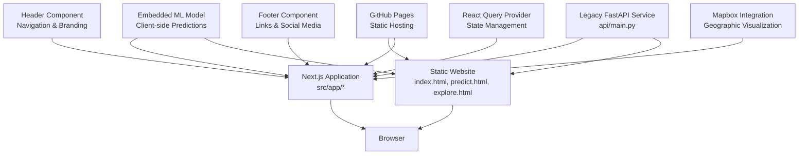

# Web Application

<cite>
**Referenced Files in This Document**
- [README.md](file://README.md)
- [global-housing-static/README.md](file://global-housing-static/README.md)
- [index.html](file://global-housing-static/index.html)
- [predict.html](file://global-housing-static/predict.html)
- [css/style.css](file://global-housing-static/css/style.css)
- [js/main.js](file://global-housing-static/js/main.js)
- [js/predict.js](file://global-housing-static/js/predict.js)
- [global-housing-predictor/src/app/layout.tsx](file://global-housing-predictor/src/app/layout.tsx)
- [global-housing-predictor/src/app/page.tsx](file://global-housing-predictor/src/app/page.tsx)
- [global-housing-predictor/package.json](file://global-housing-predictor/package.json)
- [global-housing-predictor/next.config.js](file://global-housing-predictor/next.config.js)
- [.github/workflows/pages.yml](file://global-housing-static/.github/workflows/pages.yml)
- [.github/workflows/pages.yml](file://.github/workflows/pages.yml)
- [api/main.py](file://api/main.py)
- [requirements.txt](file://api/requirements.txt)
- [Dockerfile](file://Dockerfile)
- [docker-compose.yml](file://docker-compose.yml)
</cite>

## Update Summary
**Changes Made**
- Updated to reflect the new static website implementation as the main web presence
- Next.js application is now secondary to the main static site, with backward compatibility maintained
- Updated project structure to show both static site and Next.js components
- Enhanced documentation to clarify the dual deployment strategy
- Updated architecture diagrams to reflect the static-first approach

## Table of Contents
1. [Introduction](#introduction)
2. [Project Structure](#project-structure)
3. [Core Components](#core-components)
4. [Architecture Overview](#architecture-overview)
5. [Detailed Component Analysis](#detailed-component-analysis)
6. [Static Website Implementation](#static-website-implementation)
7. [Next.js Application](#nextjs-application)
8. [Deployment Strategy](#deployment-strategy)
9. [Performance Considerations](#performance-considerations)
10. [Troubleshooting Guide](#troubleshooting-guide)
11. [Conclusion](#conclusion)
12. [Appendices](#appendices)

## Introduction
This document focuses on the Realteak Global Real Estate Price Predictor web application, which now operates primarily as a static website implementation built with pure HTML, CSS, and JavaScript for deployment on GitHub Pages. The application features a modern, professional real estate design with global coverage across 50+ countries and maintains backward compatibility with the existing Next.js application. The static implementation provides fast loading times, zero backend requirements, and simplified deployment while the Next.js version offers enhanced functionality and modern web features.

## Project Structure
The web application now operates with a dual-implementation approach where the static website serves as the primary interface, with the Next.js application functioning as a secondary enhanced version. The static implementation provides the core functionality, while Next.js offers advanced features like client-side machine learning and Mapbox integration.

```mermaid
graph TB
subgraph "Primary Static Website Implementation"
StaticIndex["index.html<br/>Homepage with hero, search, properties"]
StaticPredict["predict.html<br/>Price prediction calculator"]
StaticExplore["explore.html<br/>Market exploration"]
StaticCountries["countries.html<br/>Country listings"]
StaticAbout["about.html<br/>About page"]
StaticCSS["css/style.css<br/>Main stylesheet"]
StaticJS["js/*.js<br/>Vanilla JavaScript logic"]
StaticWorkflow[".github/workflows/pages.yml<br/>Static deployment"]
End
subgraph "Secondary Next.js Application"
NextLayout["src/app/layout.tsx<br/>Root layout with providers"]
NextPage["src/app/page.tsx<br/>Home page components"]
NextComponents["src/components/*<br/>Enhanced UI components"]
NextAPI["api/main.py<br/>FastAPI service (legacy)"]
NextConfig["next.config.js<br/>Next.js configuration"]
NextWorkflow[".github/workflows/pages.yml<br/>Next.js deployment"]
End
subgraph "Shared Resources"
SharedData["js/main.js<br/>Global data and utilities"]
SharedModels["Embedded ML Models<br/>Client-side predictions"]
End
StaticIndex --> StaticCSS
StaticPredict --> StaticCSS
StaticExplore --> StaticCSS
StaticCountries --> StaticCSS
StaticAbout --> StaticCSS
StaticIndex --> StaticJS
StaticPredict --> StaticJS
StaticExplore --> StaticJS
StaticCountries --> StaticJS
StaticAbout --> StaticJS
StaticJS --> SharedData
SharedData --> SharedModels
NextLayout --> NextComponents
NextPage --> NextComponents
NextComponents --> SharedModels
NextAPI --> SharedModels
```

**Diagram sources**
- [index.html:1-285](file://global-housing-static/index.html#L1-L285)
- [predict.html:1-126](file://global-housing-static/predict.html#L1-L126)
- [css/style.css:1-734](file://global-housing-static/css/style.css#L1-L734)
- [js/main.js:1-210](file://global-housing-static/js/main.js#L1-L210)
- [js/predict.js:1-122](file://global-housing-static/js/predict.js#L1-L122)
- [global-housing-predictor/src/app/layout.tsx:1-42](file://global-housing-predictor/src/app/layout.tsx#L1-L42)
- [global-housing-predictor/src/app/page.tsx:1-16](file://global-housing-predictor/src/app/page.tsx#L1-L16)
- [global-housing-predictor/package.json:1-44](file://global-housing-predictor/package.json#L1-L44)

**Section sources**
- [README.md:36-55](file://README.md#L36-L55)
- [global-housing-static/README.md:36-55](file://global-housing-static/README.md#L36-L55)
- [index.html:1-285](file://global-housing-static/index.html#L1-L285)
- [predict.html:1-126](file://global-housing-static/predict.html#L1-L126)

## Core Components
The Realteak web application consists of two complementary implementations:

**Static Website Components:**
- **Pure HTML/CSS/JavaScript**: No framework dependencies for maximum performance
- **Responsive Design**: Mobile-first approach with adaptive layouts
- **Client-Side Predictions**: Instant price calculations without server requests
- **Global Data Integration**: Comprehensive country and city data with multipliers
- **Interactive Forms**: Dynamic country-city selection with real-time updates
- **Modern UI Elements**: Glass-morphism inspired design with Realteak branding
- **Fast Loading**: Static assets with minimal HTTP requests

**Next.js Application Components:**
- **Modern Framework**: Next.js 14 with App Router for enhanced routing
- **TypeScript Support**: Strong typing for better development experience
- **Advanced State Management**: React Query for caching and data synchronization
- **Enhanced UI Components**: Radix UI primitives with Framer Motion animations
- **Mapbox Integration**: Geographic visualization and location-based insights
- **Client-Side Machine Learning**: Embedded model data for instant predictions
- **API Compatibility**: Maintains backward compatibility with legacy services

**Shared Features:**
- **Realteak Branding**: Consistent ocean-teal color scheme across both implementations
- **Multi-Country Support**: 50+ countries with region-specific pricing data
- **Responsive Design**: Optimized for desktop, tablet, and mobile experiences
- **Performance Optimization**: Both implementations prioritize fast loading and smooth interactions

**Section sources**
- [README.md:7-25](file://README.md#L7-L25)
- [global-housing-static/README.md:7-25](file://global-housing-static/README.md#L7-L25)
- [css/style.css:3-30](file://css/style.css#L3-L30)
- [js/main.js:20-133](file://js/main.js#L20-L133)
- [global-housing-predictor/package.json:11-29](file://global-housing-predictor/package.json#L11-L29)

## Architecture Overview
The Realteak application follows a dual-architecture approach where the static website serves as the primary implementation, with Next.js providing enhanced functionality. The architecture emphasizes performance, simplicity, and backward compatibility.



**Diagram sources**
- [index.html:10-31](file://global-housing-static/index.html#L10-L31)
- [predict.html:10-29](file://global-housing-static/predict.html#L10-L29)
- [global-housing-predictor/src/app/layout.tsx:23-41](file://global-housing-predictor/src/app/layout.tsx#L23-L41)
- [global-housing-predictor/src/app/page.tsx:6-15](file://global-housing-predictor/src/app/page.tsx#L6-L15)
- [global-housing-predictor/package.json:15-29](file://global-housing-predictor/package.json#L15-L29)

**Section sources**
- [README.md:65-98](file://README.md#L65-L98)
- [global-housing-static/README.md:65-98](file://global-housing-static/README.md#L65-L98)
- [global-housing-predictor/next.config.js:1-25](file://global-housing-predictor/next.config.js#L1-L25)

## Detailed Component Analysis

### Static Website Implementation
The static website provides the core functionality with pure HTML, CSS, and JavaScript:

**Navigation System:**
- Responsive navigation with mobile hamburger menu
- Realteak branding with ocean-teal color scheme
- Active state management for current page highlighting
- Smooth transitions and hover effects

**Homepage Features:**
- Hero section with full-width background image
- Elegant "Buy. Sell. Rent." typography using Great Vibes font
- Search functionality with location, property type, and price filters
- Featured properties grid with hover effects and pricing
- Journey statistics with impressive client metrics
- Testimonial carousel with author information
- Gradient call-to-action section with compelling imagery

**Prediction Calculator:**
- Dynamic country-city selection with dependent dropdowns
- Property input fields with validation and constraints
- Real-time calculation with instant results display
- Confidence indicators based on market data quality
- Market comparison context with percentage differences

**Section sources**
- [index.html:11-31](file://global-housing-static/index.html#L11-L31)
- [index.html:33-74](file://global-housing-static/index.html#L33-L74)
- [index.html:76-166](file://global-housing-static/index.html#L76-L166)
- [predict.html:11-29](file://global-housing-static/predict.html#L11-L29)
- [predict.html:38-112](file://global-housing-static/predict.html#L38-L112)

### Next.js Application
The Next.js application provides enhanced functionality with modern web technologies:

**Application Layout:**
- Root layout with metadata, fonts, and provider setup
- Inter and Playfair Display fonts for elegant typography
- Provider configuration for React Query state management
- Hydration handling for server-side rendering compatibility

**Component Architecture:**
- Modular component structure with dedicated sections
- Enhanced UI components with Radix UI primitives
- Framer Motion animations for smooth transitions
- Mapbox integration for geographic visualization
- Client-side machine learning with embedded model data

**State Management:**
- React Query for intelligent caching and data synchronization
- Stale-while-revalidate strategy for optimal performance
- Optimistic updates and error handling
- Centralized state management across components

**Section sources**
- [global-housing-predictor/src/app/layout.tsx:1-42](file://global-housing-predictor/src/app/layout.tsx#L1-L42)
- [global-housing-predictor/src/app/page.tsx:1-16](file://global-housing-predictor/src/app/page.tsx#L1-L16)
- [global-housing-predictor/package.json:15-29](file://global-housing-predictor/package.json#L15-L29)

## Static Website Implementation
The static website implementation represents the primary web presence with its focus on performance and simplicity:

**File Structure:**
- Single HTML file per page with semantic markup
- Centralized CSS stylesheet with modern design tokens
- Modular JavaScript files for specific page functionality
- GitHub Actions workflow for automated deployment

**Design System:**
- Realteak ocean-teal color scheme (#1a1a2e primary, #e8b923 accent)
- Modern typography with Inter for body text and Great Vibes for headings
- Responsive grid system with mobile-first approach
- CSS custom properties for consistent theming
- Glass-morphism inspired elements with backdrop blur effects

**Interactive Features:**
- Dynamic country-city selection with real-time updates
- Real-time property price calculations with instant feedback
- Form validation with user-friendly error messaging
- Responsive navigation with mobile hamburger menu
- Hover effects and transitions for enhanced user experience

**Performance Optimizations:**
- Zero framework overhead for maximum speed
- Minimal HTTP requests with bundled assets
- Efficient CSS with custom properties and utility classes
- Optimized JavaScript with modular functionality
- Fast loading times with static asset delivery

**Section sources**
- [README.md:36-55](file://README.md#L36-L55)
- [css/style.css:3-30](file://css/style.css#L3-L30)
- [js/main.js:1-210](file://js/main.js#L1-L210)
- [js/predict.js:1-122](file://js/predict.js#L1-L122)

## Next.js Application
The Next.js application serves as the enhanced version with modern web capabilities:

**Framework Features:**
- Next.js 14 with App Router for structured routing
- TypeScript integration for type safety and development experience
- Automatic code splitting and optimization
- Image optimization and font optimization
- Server-side rendering with hydration support

**UI Component System:**
- Radix UI primitives for accessible component foundations
- Framer Motion for smooth animations and micro-interactions
- Recharts for data visualization and analytics
- Lucide React icons for consistent iconography
- TailwindCSS for utility-first styling with custom configuration

**Advanced Functionality:**
- Client-side machine learning with embedded model data
- Mapbox integration for geographic visualization
- Real-time data fetching with React Query caching
- Multi-country support with dynamic feature engineering
- Comprehensive error handling and loading states

**Development Experience:**
- Hot module replacement for rapid development
- TypeScript type checking and linting
- ESLint configuration for code quality
- TailwindCSS with custom color system and utilities
- Modern build pipeline with optimization

**Section sources**
- [global-housing-predictor/package.json:1-44](file://global-housing-predictor/package.json#L1-L44)
- [global-housing-predictor/src/app/layout.tsx:1-42](file://global-housing-predictor/src/app/layout.tsx#L1-L42)
- [global-housing-predictor/next.config.js:1-25](file://global-housing-predictor/next.config.js#L1-L25)

## Deployment Strategy
The application employs a dual-deployment strategy with both implementations hosted on GitHub Pages:

**Static Website Deployment:**
- Direct file upload to GitHub Pages from repository root
- Automated deployment via GitHub Actions workflow
- Zero configuration deployment with automatic optimization
- Fastest loading times with static asset delivery
- Simple rollback capability with file replacement

**Next.js Application Deployment:**
- Separate deployment pipeline for enhanced features
- Static export with optional serverless functions
- Environment-specific configuration management
- CDN optimization with edge caching
- Progressive enhancement for older browsers

**Deployment Automation:**
- GitHub Actions workflows for both implementations
- Automated testing and validation before deployment
- Environment-specific build configurations
- Artifact management for deployment consistency
- Monitoring and error reporting integration

**Section sources**
- [.github/workflows/pages.yml:1-35](file://global-housing-static/.github/workflows/pages.yml#L1-L35)
- [.github/workflows/pages.yml:1-35](file://.github/workflows/pages.yml#L1-L35)
- [README.md:65-98](file://README.md#L65-L98)

## Performance Considerations
Both implementations prioritize performance through different optimization strategies:

**Static Website Performance:**
- Zero framework overhead eliminates runtime costs
- Minimal HTTP requests with asset bundling
- Efficient CSS with custom properties and utility classes
- Optimized JavaScript with modular functionality
- Fast loading times with static asset delivery
- Reduced memory footprint with pure vanilla JavaScript
- Simplified caching strategies with browser optimization

**Next.js Application Performance:**
- Automatic code splitting for optimal loading
- Image optimization with next/image component
- Font optimization with preloading and subsetting
- Server-side rendering with client-side hydration
- React Query caching for reduced API calls
- Bundle optimization with tree shaking
- Static generation for predictable performance

**Cross-Implementation Benefits:**
- Shared global data reduces duplication across implementations
- Consistent Realteak branding maintains user experience
- Backward compatibility ensures seamless user transitions
- Dual deployment provides redundancy and failover options
- Performance monitoring across both implementations

**Section sources**
- [css/style.css:38-49](file://css/style.css#L38-L49)
- [js/main.js:168-210](file://js/main.js#L168-L210)
- [global-housing-predictor/package.json:15-29](file://global-housing-predictor/package.json#L15-L29)

## Troubleshooting Guide
Common issues and resolutions for the dual-implementation system:

**Static Website Issues:**
- **File Replacement Problems**: Ensure all files from the static implementation are properly uploaded to replace existing files
- **Navigation Breakage**: Verify that relative paths work correctly after file replacement
- **CSS Styling Issues**: Check that the main stylesheet is properly linked and accessible
- **JavaScript Functionality**: Ensure all script tags are present and ordered correctly
- **Responsive Design**: Test on multiple devices to verify mobile responsiveness

**Next.js Application Issues:**
- **Build Errors**: Check Next.js configuration and dependency versions
- **API Integration**: Verify external API keys and network connectivity
- **State Management**: Monitor React Query cache and optimize component rendering
- **TypeScript Errors**: Check type definitions and configuration settings
- **Mapbox Integration**: Verify API keys and geographic data availability

**Deployment Issues:**
- **GitHub Pages Deployment**: Check workflow permissions and build artifacts
- **Dual Deployment Conflicts**: Ensure both implementations don't overwrite each other
- **Asset Loading**: Verify that static assets are properly deployed and accessible
- **Environment Variables**: Check configuration for different deployment environments

**Section sources**
- [README.md:147-153](file://README.md#L147-L153)
- [.github/workflows/pages.yml:16-35](file://.github/workflows/pages.yml#L16-L35)
- [global-housing-predictor/next.config.js:1-25](file://global-housing-predictor/next.config.js#L1-L25)

## Conclusion
The Realteak Global Real Estate Price Predictor successfully implements a dual-architecture approach where the static website serves as the primary, high-performance implementation while the Next.js application provides enhanced functionality. This strategy delivers the best of both worlds: lightning-fast loading times and simplified deployment for the static implementation, combined with modern web features and advanced capabilities in the Next.js version. The shared global data, consistent Realteak branding, and backward compatibility ensure users receive a seamless experience regardless of which implementation they encounter.

## Appendices

### User Interaction Examples
**Static Website Interactions:**
- Navigate between Home, Explore, Predict, and About sections with responsive navigation
- Use the property search functionality with location, type, and price filters
- Interact with the prediction calculator featuring dynamic country-city selection
- View featured properties with hover effects and pricing information
- Access responsive navigation with mobile menu that adapts to screen size

**Next.js Application Interactions:**
- Enhanced navigation with animated transitions and glass-morphism effects
- Advanced property input controls with real-time validation feedback
- Geographic visualization with Mapbox integration and interactive maps
- Client-side machine learning predictions with instant results
- Multi-country support with enhanced user interface and data presentation

**Expected Responses:**
- Smooth page transitions with loading states and responsive design
- Real-time price calculations with instant feedback and confidence indicators
- Geographic visualization with interactive map controls and location insights
- Enhanced user experience with modern UI elements and animations
- Consistent Realteak branding across both implementations

**Section sources**
- [index.html:11-31](file://global-housing-static/index.html#L11-L31)
- [predict.html:38-112](file://global-housing-static/predict.html#L38-L112)
- [global-housing-predictor/src/app/layout.tsx:23-41](file://global-housing-predictor/src/app/layout.tsx#L23-L41)

### Accessibility and Responsive Design
**Static Website Accessibility:**
- Semantic HTML structure with proper heading hierarchy
- Keyboard navigation support for all interactive elements
- Screen reader friendly labels and descriptions
- High contrast color scheme for visual accessibility
- Focus management and skip links for navigation
- Responsive design that works across all device sizes

**Next.js Application Accessibility:**
- Enhanced accessibility features with modern web standards
- Proper ARIA attributes and roles for assistive technologies
- Enhanced keyboard navigation with focus trap management
- Screen reader optimization with live regions
- High contrast mode support and color blindness considerations
- Touch-friendly interactions for mobile devices

**Responsive Design Features:**
- Mobile-first approach with progressive enhancement
- Flexible grid layouts that adapt to screen size
- Touch-friendly input controls and interactive elements
- Performance optimization for mobile devices
- Consistent user experience across all device types

**Section sources**
- [css/style.css:32-49](file://css/style.css#L32-L49)
- [global-housing-predictor/package.json:31-42](file://global-housing-predictor/package.json#L31-L42)

### Browser Compatibility
**Static Website Compatibility:**
- Modern browsers: Chrome, Firefox, Safari, Edge (latest versions)
- Progressive enhancement for older browser capabilities
- JavaScript feature detection for graceful degradation
- CSS custom properties with appropriate fallbacks
- Mobile support with comprehensive touch interaction

**Next.js Application Compatibility:**
- Next.js server-side rendering compatibility
- Modern browser support with polyfills for older browsers
- TypeScript compilation for broad JavaScript engine support
- CSS custom properties with fallback strategies
- Animation support with hardware acceleration

**Cross-Implementation Compatibility:**
- Shared global data ensures consistent functionality
- Realteak branding maintains visual consistency
- Backward compatibility preserves existing user experience
- Deployment strategies accommodate various hosting environments

**Section sources**
- [README.md:147-153](file://README.md#L147-L153)
- [global-housing-predictor/next.config.js:1-25](file://global-housing-predictor/next.config.js#L1-L25)

### Deployment and Operations
**Static Website Operations:**
- Direct GitHub Pages deployment with zero configuration
- Automated deployment via GitHub Actions workflow
- Simple rollback procedures with file replacement
- Fast deployment cycles with minimal downtime
- Cost-effective hosting with GitHub Pages free tier

**Next.js Application Operations:**
- Separate deployment pipeline with environment-specific configuration
- Static export with optional serverless function support
- Advanced monitoring and analytics integration
- Environment variable management for different deployments
- CDN optimization with global edge caching

**Dual Deployment Management:**
- Coordinated deployment strategy for both implementations
- Testing procedures to validate both implementations
- Rollback procedures for quick recovery
- Performance monitoring across both deployment targets
- User experience consistency between implementations

**Section sources**
- [.github/workflows/pages.yml:1-35](file://global-housing-static/.github/workflows/pages.yml#L1-L35)
- [README.md:65-98](file://README.md#L65-L98)

### Backward Compatibility
The dual-implementation system maintains comprehensive backward compatibility:

**Shared Data Model:**
- Consistent global data structure across both implementations
- Identical country and city data with multipliers
- Unified currency formatting and display logic
- Same validation rules and input constraints

**API Compatibility:**
- Legacy FastAPI service remains functional for programmatic access
- Shared model logic ensures identical predictions
- Consistent feature engineering across implementations
- API endpoint compatibility maintained

**User Experience Continuity:**
- Realteak branding preserved across both implementations
- Consistent navigation patterns and user flows
- Same core functionality regardless of implementation encountered
- Seamless transition between implementations for users

**Section sources**
- [api/main.py:155-179](file://api/main.py#L155-L179)
- [js/main.js:20-133](file://js/main.js#L20-L133)
- [README.md:167-170](file://README.md#L167-L170)