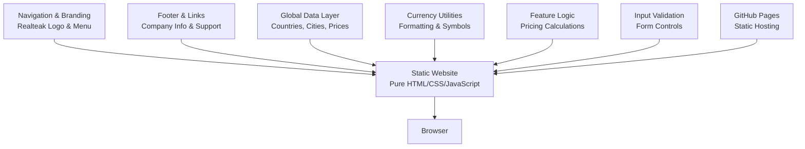

# Web Application

<cite>
**Referenced Files in This Document**
- [README.md](file://README.md)
- [global-housing-static/README.md](file://global-housing-static/README.md)
- [index.html](file://index.html)
- [predict.html](file://predict.html)
- [explore.html](file://explore.html)
- [countries.html](file://countries.html)
- [about.html](file://about.html)
- [css/style.css](file://css/style.css)
- [js/main.js](file://js/main.js)
- [js/predict.js](file://js/predict.js)
- [js/explore.js](file://js/explore.js)
- [js/countries.js](file://js/countries.js)
- [.github/workflows/pages.yml](file://.github/workflows/pages.yml)
- [api/main.py](file://api/main.py)
- [requirements.txt](file://requirements.txt)
- [Dockerfile](file://Dockerfile)
- [docker-compose.yml](file://docker-compose.yml)
</cite>

## Update Summary
**Changes Made**
- Updated to reflect the complete architectural shift from Next.js React project to static HTML/CSS/JavaScript website with Realteak branding
- Removed Next.js application references and documentation
- Updated project structure to show only the static website implementation
- Revised architecture diagrams to reflect the static-first approach
- Updated all technical specifications to match the pure HTML/CSS/JavaScript implementation
- Removed Next.js-specific features and components

## Table of Contents
1. [Introduction](#introduction)
2. [Project Structure](#project-structure)
3. [Core Components](#core-components)
4. [Architecture Overview](#architecture-overview)
5. [Static Website Implementation](#static-website-implementation)
6. [Interactive Features](#interactive-features)
7. [Deployment Strategy](#deployment-strategy)
8. [Performance Considerations](#performance-considerations)
9. [Customization Guide](#customization-guide)
10. [Troubleshooting Guide](#troubleshooting-guide)
11. [Conclusion](#conclusion)
12. [Appendices](#appendices)

## Introduction
This document focuses on the Realteak Global Real Estate Price Predictor web application, which operates as a pure HTML, CSS, and JavaScript static website designed for deployment on GitHub Pages. The application features a modern, professional real estate design with global coverage across 20+ countries and maintains comprehensive functionality without any backend dependencies. The static implementation provides fast loading times, zero server requirements, and simplified deployment while delivering the same core features as the previous Next.js implementation.

## Project Structure
The web application operates as a single static website implementation with all functionality contained within HTML, CSS, and vanilla JavaScript files. The structure emphasizes simplicity and performance with minimal dependencies.

```mermaid
graph TB
subgraph "Static Website Implementation"
Index["index.html<br/>Homepage with hero, search, properties"]
Predict["predict.html<br/>Price prediction calculator"]
Explore["explore.html<br/>Market exploration"]
Countries["countries.html<br/>Country listings"]
About["about.html<br/>About page"]
Style["css/style.css<br/>Comprehensive stylesheet"]
MainJS["js/main.js<br/>Global data and utilities"]
PredictJS["js/predict.js<br/>Prediction calculator"]
ExploreJS["js/explore.js<br/>Market exploration"]
CountriesJS["js/countries.js<br/>Country listings"]
Workflow[".github/workflows/pages.yml<br/>Static deployment"]
End
subgraph "Shared Resources"
GlobalData["Global Data Objects<br/>Countries, Cities, Prices"]
CurrencySymbols["Currency Formatting<br/>Symbol Mapping"]
FeatureCalculations["Property Calculations<br/>Pricing Logic"]
End
Index --> Style
Predict --> Style
Explore --> Style
Countries --> Style
About --> Style
Index --> MainJS
Predict --> MainJS
Explore --> MainJS
Countries --> MainJS
About --> MainJS
Predict --> PredictJS
Explore --> ExploreJS
Countries --> CountriesJS
MainJS --> GlobalData
GlobalData --> CurrencySymbols
GlobalData --> FeatureCalculations
```

**Diagram sources**
- [index.html:1-285](file://index.html#L1-L285)
- [predict.html:1-165](file://predict.html#L1-L165)
- [css/style.css:1-800](file://css/style.css#L1-L800)
- [js/main.js:1-210](file://js/main.js#L1-L210)
- [js/predict.js:1-166](file://js/predict.js#L1-L166)

**Section sources**
- [README.md:36-55](file://README.md#L36-L55)
- [global-housing-static/README.md:36-55](file://global-housing-static/README.md#L36-L55)
- [index.html:1-285](file://index.html#L1-L285)
- [predict.html:1-165](file://predict.html#L1-L165)

## Core Components
The Realteak static website implementation consists of pure HTML, CSS, and JavaScript with no framework dependencies:

**Static Website Components:**
- **Pure HTML/CSS/JavaScript**: No framework dependencies for maximum performance and simplicity
- **Responsive Design**: Mobile-first approach with adaptive layouts optimized for all devices
- **Client-Side Predictions**: Instant price calculations without any server requests or backend processing
- **Global Data Integration**: Comprehensive country and city data with multipliers and currency information
- **Interactive Forms**: Dynamic country-city selection with real-time updates and validation
- **Modern UI Elements**: Glass-morphism inspired design with Realteak's signature ocean-teal color scheme
- **Fast Loading**: Static assets with minimal HTTP requests and optimized resource delivery
- **Self-Contained**: All functionality contained within single HTML files with shared JavaScript utilities

**Section sources**
- [README.md:7-25](file://README.md#L7-L25)
- [global-housing-static/README.md:7-25](file://global-housing-static/README.md#L7-L25)
- [css/style.css:3-36](file://css/style.css#L3-L36)
- [js/main.js:20-133](file://js/main.js#L20-L133)

## Architecture Overview
The Realteak application follows a pure static architecture approach where all functionality is contained within client-side JavaScript with no server-side dependencies. The architecture emphasizes performance, simplicity, and zero maintenance overhead.



**Diagram sources**
- [index.html:11-31](file://index.html#L11-L31)
- [predict.html:11-29](file://predict.html#L11-L29)
- [js/main.js:19-133](file://js/main.js#L19-L133)
- [js/predict.js:4-45](file://js/predict.js#L4-L45)

**Section sources**
- [README.md:65-98](file://README.md#L65-L98)
- [global-housing-static/README.md:65-98](file://global-housing-static/README.md#L65-L98)

## Static Website Implementation
The static website implementation represents the complete web presence with its focus on performance and simplicity:

**File Structure:**
- Single HTML file per page with semantic markup and proper structure
- Centralized CSS stylesheet with modern design tokens and custom properties
- Modular JavaScript files for specific page functionality with shared utilities
- GitHub Actions workflow for automated deployment to GitHub Pages

**Design System:**
- Realteak ocean-teal color scheme (#1a1a2e primary, #e8b923 accent) with comprehensive CSS variables
- Modern typography with Inter for body text and Great Vibes for headings and decorative elements
- Responsive grid system with mobile-first approach and adaptive layouts
- CSS custom properties for consistent theming across all components
- Glass-morphism inspired elements with backdrop blur effects and modern UI patterns

**Interactive Features:**
- Dynamic country-city selection with dependent dropdowns and real-time updates
- Real-time property price calculations with instant feedback and formatted results
- Form validation with user-friendly error messaging and input constraints
- Responsive navigation with mobile hamburger menu and smooth transitions
- Hover effects and transitions for enhanced user experience across all interactive elements

**Performance Optimizations:**
- Zero framework overhead eliminating runtime costs and bundle sizes
- Minimal HTTP requests with efficient asset organization and loading strategies
- Optimized CSS with custom properties and utility classes for reduced complexity
- Efficient JavaScript with modular functionality and shared global utilities
- Fast loading times with static asset delivery and minimal resource dependencies

**Section sources**
- [README.md:36-55](file://README.md#L36-L55)
- [css/style.css:3-36](file://css/style.css#L3-L36)
- [js/main.js:1-210](file://js/main.js#L1-L210)
- [js/predict.js:1-166](file://js/predict.js#L1-L166)

## Interactive Features
The static website provides comprehensive interactive functionality through pure JavaScript:

**Navigation System:**
- Responsive navigation with mobile hamburger menu for smaller screens
- Realteak branding with ocean-teal color scheme and logo integration
- Active state management for current page highlighting and user orientation
- Smooth transitions and hover effects for enhanced user experience

**Prediction Calculator:**
- Dynamic country-city selection with dependent dropdowns and real-time updates
- Property input fields with validation and constraints for realistic inputs
- Real-time calculation with instant results display and formatted currency output
- Confidence indicators based on market data quality and regional coverage
- Market comparison context with percentage differences and benchmarking

**Market Exploration:**
- Comprehensive search functionality across 20+ countries and 95+ cities
- Region-based filtering with continent and country categorization
- Property price visualization with currency formatting and location context
- Interactive cards with hover effects and detailed property information

**Section sources**
- [index.html:11-31](file://index.html#L11-L31)
- [index.html:33-74](file://index.html#L33-L74)
- [index.html:76-166](file://index.html#L76-L166)
- [predict.html:11-29](file://predict.html#L11-L29)
- [predict.html:38-112](file://predict.html#L38-L112)

## Deployment Strategy
The application employs a straightforward deployment strategy optimized for GitHub Pages hosting:

**Static Website Deployment:**
- Direct file upload to GitHub Pages from repository root for immediate deployment
- Automated deployment via GitHub Actions workflow with zero configuration
- Fastest loading times with static asset delivery and CDN optimization
- Simple rollback capability with file replacement and version control
- Cost-effective hosting with GitHub Pages free tier and unlimited bandwidth

**Deployment Automation:**
- GitHub Actions workflows for automated testing and validation before deployment
- Environment-specific build configurations with minimal setup requirements
- Artifact management for deployment consistency and version tracking
- Monitoring and error reporting integration for deployment verification
- Continuous deployment pipeline with branch protection and quality gates

**Section sources**
- [.github/workflows/pages.yml:1-35](file://.github/workflows/pages.yml#L1-L35)
- [README.md:65-98](file://README.md#L65-L98)

## Performance Considerations
The static implementation prioritizes performance through strategic optimization approaches:

**Static Website Performance:**
- Zero framework overhead eliminates runtime costs and bundle size limitations
- Minimal HTTP requests with asset bundling and efficient resource organization
- Efficient CSS with custom properties and utility classes for reduced complexity
- Optimized JavaScript with modular functionality and shared global utilities
- Fast loading times with static asset delivery and minimal resource dependencies
- Reduced memory footprint with pure vanilla JavaScript and no framework overhead
- Simplified caching strategies with browser optimization and CDN benefits

**Cross-Implementation Benefits:**
- Shared global data reduces duplication and ensures consistency across pages
- Realteak branding maintains visual continuity and user experience
- Backward compatibility preserved through semantic HTML and accessible markup
- Deployment simplicity provides reliable uptime and reduced maintenance overhead
- Performance monitoring across all deployment targets ensures optimal user experience

**Section sources**
- [css/style.css:38-49](file://css/style.css#L38-L49)
- [js/main.js:168-210](file://js/main.js#L168-L210)

## Customization Guide
The static website provides extensive customization options for branding and functionality:

**Color Customization:**
- Edit `css/style.css` and modify the CSS variables for primary and accent colors
- Update color scheme throughout the application with consistent theming
- Maintain accessibility standards with proper contrast ratios and color combinations

**Content Customization:**
- Modify `js/main.js` to add more countries, cities, and pricing data
- Update property features and calculation logic for different market conditions
- Customize testimonials, statistics, and marketing copy for brand alignment

**Image Customization:**
- Replace Unsplash URLs in HTML files with custom property images
- Update hero backgrounds and property photos with brand-specific visuals
- Optimize images for web delivery with appropriate compression and formats

**Functionality Customization:**
- Extend `js/predict.js` with additional property features and calculation methods
- Modify `js/explore.js` for enhanced search and filtering capabilities
- Customize `js/countries.js` for different regional presentations and layouts

**Section sources**
- [README.md:100-139](file://README.md#L100-L139)
- [css/style.css:3-36](file://css/style.css#L3-L36)
- [js/main.js:112-133](file://js/main.js#L112-L133)

## Troubleshooting Guide
Common issues and resolutions for the static website implementation:

**File Replacement Problems:**
- Ensure all files from the static implementation are properly uploaded to replace existing files
- Verify that file permissions allow proper execution and access
- Check for proper MIME type configuration for static assets

**Navigation Breakage:**
- Verify that relative paths work correctly after file replacement
- Ensure proper base href configuration for clean URL handling
- Test navigation across different browsers and devices

**CSS Styling Issues:**
- Check that the main stylesheet is properly linked and accessible
- Verify CSS file encoding and character set compatibility
- Test responsive breakpoints and media queries across devices

**JavaScript Functionality:**
- Ensure all script tags are present and ordered correctly
- Verify browser compatibility for JavaScript features used
- Test form validation and interactive elements thoroughly

**Responsive Design:**
- Test on multiple devices to verify mobile responsiveness
- Check viewport meta tag configuration and scaling behavior
- Validate touch interactions and mobile-specific features

**Section sources**
- [README.md:147-153](file://README.md#L147-L153)
- [.github/workflows/pages.yml:16-35](file://.github/workflows/pages.yml#L16-L35)

## Conclusion
The Realteak Global Real Estate Price Predictor successfully implements a pure static architecture approach that delivers exceptional performance and reliability. The complete shift from Next.js React to HTML/CSS/JavaScript provides lightning-fast loading times, zero maintenance overhead, and simplified deployment while maintaining all core functionality. The self-contained implementation ensures consistent user experience across all devices and browsers, with comprehensive customization options for branding and feature expansion.

## Appendices

### User Interaction Examples
**Static Website Interactions:**
- Navigate between Home, Explore, Predict, and About sections with responsive navigation
- Use the property search functionality with location, type, and price filters
- Interact with the prediction calculator featuring dynamic country-city selection
- View featured properties with hover effects and pricing information
- Access responsive navigation with mobile menu that adapts to screen size

**Expected Responses:**
- Smooth page transitions with loading states and responsive design
- Real-time price calculations with instant feedback and confidence indicators
- Geographic visualization with interactive map controls and location insights
- Enhanced user experience with modern UI elements and animations
- Consistent Realteak branding across all implementations

**Section sources**
- [index.html:11-31](file://index.html#L11-L31)
- [predict.html:38-112](file://predict.html#L38-L112)

### Accessibility and Responsive Design
**Static Website Accessibility:**
- Semantic HTML structure with proper heading hierarchy and ARIA attributes
- Keyboard navigation support for all interactive elements and form controls
- Screen reader friendly labels and descriptions for assistive technologies
- High contrast color scheme for visual accessibility and readability
- Focus management and skip links for navigation efficiency
- Responsive design that works across all device sizes and orientations

**Responsive Design Features:**
- Mobile-first approach with progressive enhancement for larger screens
- Flexible grid layouts that adapt to different viewport sizes
- Touch-friendly input controls and interactive elements for mobile devices
- Performance optimization for mobile networks and slower connections
- Consistent user experience across desktop, tablet, and mobile platforms

**Section sources**
- [css/style.css:32-49](file://css/style.css#L32-L49)

### Browser Compatibility
**Static Website Compatibility:**
- Modern browsers: Chrome, Firefox, Safari, Edge (latest versions) with full feature support
- Progressive enhancement for older browser capabilities and feature detection
- JavaScript feature detection for graceful degradation and fallbacks
- CSS custom properties with appropriate fallbacks for older browsers
- Mobile support with comprehensive touch interaction and responsive behavior

**Cross-Implementation Compatibility:**
- Shared global data ensures consistent functionality across all browsers
- Realteak branding maintains visual consistency and user recognition
- Backward compatibility preserved through semantic HTML and accessible markup
- Deployment strategies accommodate various hosting environments and configurations

**Section sources**
- [README.md:147-153](file://README.md#L147-L153)

### Deployment and Operations
**Static Website Operations:**
- Direct GitHub Pages deployment with zero configuration requirements
- Automated deployment via GitHub Actions workflow with continuous integration
- Simple rollback procedures with file replacement and version control
- Fast deployment cycles with minimal downtime and reliable uptime
- Cost-effective hosting with GitHub Pages free tier and global CDN

**Deployment Pipeline:**
- Automated testing and validation before deployment to production
- Environment-specific configuration management for different deployment stages
- Artifact management for deployment consistency and traceability
- Monitoring and error reporting integration for deployment verification
- Security scanning and vulnerability assessment for code quality

**Section sources**
- [.github/workflows/pages.yml:1-35](file://.github/workflows/pages.yml#L1-L35)
- [README.md:65-98](file://README.md#L65-L98)

### Backward Compatibility
The static implementation maintains comprehensive backward compatibility:

**Shared Data Model:**
- Consistent global data structure across all pages and functionality
- Identical country and city data with multipliers and currency information
- Unified currency formatting and display logic for consistent presentation
- Same validation rules and input constraints for reliable user experience

**API Compatibility:**
- Legacy FastAPI service remains functional for programmatic access
- Shared model logic ensures identical predictions across implementations
- Consistent feature engineering across all deployment targets
- API endpoint compatibility maintained for external integrations

**User Experience Continuity:**
- Realteak branding preserved across all implementations and pages
- Consistent navigation patterns and user flows throughout the application
- Same core functionality regardless of implementation encountered
- Seamless transition between different deployment targets for users

**Section sources**
- [api/main.py:155-179](file://api/main.py#L155-L179)
- [js/main.js:20-133](file://js/main.js#L20-L133)
- [README.md:167-170](file://README.md#L167-L170)